Project 2T - Working with Financial Data API
================
Cassio Monti & Smitali Patnaik
10/10/2022

-   <a href="#goal-and-specifications" id="toc-goal-and-specifications">Goal
    and Specifications</a>
-   <a href="#required-packages" id="toc-required-packages">Required
    Packages</a>
-   <a href="#api-querying-functions" id="toc-api-querying-functions">API
    Querying Functions</a>
    -   <a href="#aggregate-endpoint" id="toc-aggregate-endpoint">Aggregate
        EndPoint</a>
    -   <a href="#grouped-daily-endpoint"
        id="toc-grouped-daily-endpoint">Grouped Daily EndPoint</a>
    -   <a href="#technical-indicators-endpoint"
        id="toc-technical-indicators-endpoint">Technical Indicators EndPoint</a>
    -   <a href="#ticker-endpoint" id="toc-ticker-endpoint">Ticker EndPoint</a>
    -   <a href="#wrapper-function" id="toc-wrapper-function">Wrapper
        Function</a>
-   <a href="#eda" id="toc-eda">EDA</a>
    -   <a href="#for-several-tickers" id="toc-for-several-tickers">For several
        tickers</a>
        -   <a href="#plots-for-raw-data" id="toc-plots-for-raw-data">Plots for raw
            data</a>
        -   <a href="#plots-for-modified-data---part-1"
            id="toc-plots-for-modified-data---part-1">Plots for modified Data - part
            1</a>
        -   <a href="#plots-for-modified-data---part-2"
            id="toc-plots-for-modified-data---part-2">Plots for modified Data - part
            2</a>
    -   <a href="#for-time-data" id="toc-for-time-data">For time data</a>

# Goal and Specifications

The main goal of this vignette is to provide a set of functions that may
assist in accessing specific information contained in the [Financial
API](https://polygon.io/docs/stocks). These functions aim to provide
data sets for further exploratory data analysis (EDA).  
The companies selected for this analysis belong to two major groups,
technology and real-state companies of the interest of the authors of
this vignette. The companies related to the technology group are Apple,
Microsoft, and Google. The companies related to real-state group are
Weyerhaeuser and Rayonier, both are timberland investment groups.  
Four functions were created querying data from 4 end points, or
searching keywords, present in the the API. Further, three data sets
were created and the EDA was executed for each of them separately. The
EDA encompassed categorical and quantitative analyses, numerical and
graphical, for each data according to their relevance to the
[objective](#eda) of this analysis.  
In order for this analysis to happen, some initial contact with the API
and an access key are required.

# Required Packages

Some packages are necessary to run the code throughout this vignette.
They are related to reading and parsing the API format, JSON format, to
a more friendly and simplified view scheme, rectangular format, through
the `jsonlite` package. The widely used `tidyverse` for data management,
specifically using `dplyr`, for nice correlation plots, `corrplot`, and
for nice table printing, `knitr`.

-   [jsonlite](https://cran.r-project.org/web/packages/jsonlite/):
    Performs the interaction between R and the API that uses the JSON
    file format.

-   [tidyverse](https://www.tidyverse.org/): This package loads several
    other packages with several useful functions addressing data
    management, reshaping, reading, plotting and some more.

-   [corrplot](https://cran.r-project.org/web/packages/corrplot/vignettes/corrplot-intro.html):
    This package has specific functions to display correlations among
    variables in a data set as intuitive plots.

-   [knitr](https://cran.r-project.org/web/packages/knitr/index.html):
    provides nice table printing formats, mainly for the contingency
    tables used herein.

# API Querying Functions

There are four functions that are responsible for querying specific
information from the mentioned financial API. The first function queries
data from the *Aggregate endpoint*, which collects mainly price metrics
for a single ticker over a pre-defined period of time. The second
function, *Grouped endpoint*, queries prices related metrics for all
tickers in a particular day. The function *Technical Indicator
endpoint*, queries information corresponding to the moving average
convergence/divergence and some other related metrics. The forth, and
last function, *ticker endpoint*, queries the overall information about
the tickers, for instance, official names, country of origin, type of
market, and others.  
As operating specificity, the *ticker* and *grouped* endpoints are
working together to unify overall information about the tickers and
price related metrics in a single data set. Additionally, *ticker* and
*aggregate* endpoints are working together for the same purpose, but, in
this case, returning a timely dependent data set.

The function querying the *Technical Indicator endpoint* extracts
information and??????????????????????

## Aggregate EndPoint

This function takes some modifiers defined in the financial API as the
ticker ID `stocksTicker` (default is “Apple”), the time frame arguments
`from` and `to` (these arguments have default values corresponding to
one year period from July 22nd 2021 to July 22nd 2022), the `multiplier`
(default is 30) is the value associated to the `timespan` (default is
“day”) argument and they both together define the time frame in which
the ticker will be obtained. For instance, if `timespan` is “minute” and
multiplier is 1, then the returned data set will be aggregated every
1-minute interval across the time frame selected in `from` and `to`
arguments. Also, `ky` (to define the key ID for the call) is an
argument.  
This function takes all these arguments and passes them to the text
format through the function `paste0()` associating each element of the
URL required to form the query string that goes to the API. The parts of
this URL are the `base_endpoint` (provides initial piece of the URL with
the endpoint call), `last_code` (provides some other modifiers that are
not going to be considered in this function as arguments), and `key`
(provides the key ID to access the API - since API has a limited free
version, more keys are necessary to run a more complex query analysis),
besides the input arguments which are all required. It is important to
notice that this function, and the ones that use single input for
company names, have the input `stocksTicker` as the full name of the
listed company, for example, “Apple” should be provided instead of
“AAPL”. The same for “Microsoft”, “Google”, “Weyerhaeuser”, and
“Rayonier”. Therefore, it was used the function `tolower()` to return
the lower case of the name of the company to avoid errors due to
matching. Associated to the latter function, the `switch()` function
assigns the specific company name to the ticker symbol.  
The function `fromJSON()` has the URL call as input and returns a
simplified object that can be stored as a data frame. The arguments
`from` and `to` are converted into date format and then, through the
function `as.Date()` and `seq()`, a monthly vector is created and joint
with the “results” and “ticker”, from the `fromJSON()`, using `tibble()`
function. The function is defined below.

``` r
# create the URL for aggregate endpoint:
# This function has some default values.
agg_endpoint = function(stocksTicker="Apple Inc.", from = "2021-07-22", to = "2022-07-22",mltplr=30, timespan="day", ky, ...){

  # converting the full name into the ticker symbol
  stocksTicker = switch(tolower(stocksTicker),
                        "apple" = "AAPL",
                        "google" = "GOOGL",
                        "microsoft" = "MSFT",
                        "weyerhaeuser" = "WY",
                        "rayonier" = "RYN",
                        stop("You are allowed to call only a limited number of companies: Apple, GOOGLE, Microsoft, Weyerhaeuser, Rayonier!"))
  
  # passing the components of the URL for the API:
  # base + endpoint 1
  base_endpoint = "https://api.polygon.io/v2/aggs/"
  
  # last part of the URL defining some defaults
  last_code = "?adjusted=true&sort=asc&limit=5000"
  
  # key for accessing API
  key = paste0("&apiKey=", key_id[ky])
  
  # converting the multiplier to character
  mltplr = as.character(mltplr)
  
  # creating the URL call
  call = paste0(base_endpoint,"ticker/",stocksTicker,"/range/",mltplr,"/",
                timespan,"/",from,"/",to,last_code,key)
  
  # assigning the call to an object
  p = fromJSON(call)

  # getting results from the object
  tb = p$results
  tckr = p$ticker
  
  # working with the dates
  d1 = as.Date(from) # transforms initial date from char to date format
  d2 = as.Date(to) # transforms last date from char to date format
  d = seq(d1,d2, by ="month") # sequence by month
  
  # combining the final object with ticker name, date, and metrics
  out = tibble(tckr,d,tb)
  
  # returning the final tibble object
  return(out)
  
}
```

## Grouped Daily EndPoint

This end point returns price related metrics for all tickers in a
particular date. This end point is important to provide data for
analyzing the frequency of tickers by market type and ticker type
available in the stock market. The function has some inputs: `date` (a
specific day for which the user is interested in knowing the prices),
`otc` (to include OTC securities in the response), the over-the-counter
securities are used in further analysis. Also, `ky` (to define the key
ID for the call) is an argument.

``` r
# creates the URL for group endpoint:
# This function has some default values.
grouped_endpoint = function(date= "2022-07-14", otc = "true", ky, ...){
  
  # this code sets to lower case the arguments otc.
  otc = tolower(otc)
  
  # check if otc is correctly assigned
  if(otc != "true" && otc != "false"){
    stop("Only true or false allowed")
  }

  # base + endpoint 1
  base="https://api.polygon.io/v2/aggs/grouped/locale/us/market/stocks/"
  
  # key for accessing API
  key = paste0("&apiKey=", key_id[ky])
  
  # creating the URL call
  call = paste0(base,date,"?adjusted=true&include_otc=",otc,key)
  
  # assigning the call to an object
  p = fromJSON(call)

  # transforming the data frame into tibble for better printing
  out = tibble(p$results)
  
  return(out)
}
```

## Technical Indicators EndPoint

``` r
macd_endpoint = function(stocksTicker="Apple", date = "2022-07-22", ky, ..) {

    stocksTicker = switch(tolower(stocksTicker),
                        "apple" = "AAPL",
                        "google" = "GOOGL",
                        "microsoft" = "MSFT",
                        "weyerhaeuser" = "WY",
                        "rayonier" = "RYN",
                         stop("You are allowed to call only a limited number of companies: Apple, GOOGLE, Microsoft, Weyerhaeuser, Rayonier!"))

  # base + endpoint 1
  base="https://api.polygon.io/v1/indicators/macd/"
  
  # key for accessing API
  key = paste0("&apiKey=", key_id[ky])
  
  # creating the URL call
  call = paste0(base,stocksTicker,"?timestamp=",date,"&timespan=hour&adjusted=true&short_window=12&long_window=26&signal_window=9&series_type=close&order=desc",key)
  
  
  # assigning the call to an object
  p = fromJSON(call)
  outd = tibble(p$results$values)
  
  return(outd)
}
```

## Ticker EndPoint

This function aims to call tickers from common stock mainly and other
markets as well as crypto currencies for further analysis of both.

``` r
# tickers endpoint= get ticker names
# create the URL for the ticker endpoint - two calls: i) ticker names; and
# ii) otc names
ticker_endpoint = function(type = NULL, market = "stocks", limit = 1000, ticker = NULL, ky, ...){
  

  if(limit > 1000){
    limit = 1000
    message("Warning: the max limit is 1000 for free access!")
  }

  last_code = "&active=true&sort=locale&order=asc&limit="
  
  key = paste0("&apiKey=", key_id[ky])

    
  if(!is.null(ticker)){
    
          ticker = switch(tolower(ticker),
                        "apple" = "AAPL",
                        "google" = "GOOGL",
                        "microsoft" = "MSFT",
                        "weyerhaeuser" = "WY",
                        "rayonier" = "RYN",
                         stop("You are allowed to call only a limited number of companies: Apple, GOOGLE, Microsoft, Weyerhaeuser, Rayonier!"))

    
      base_endpoint = "https://api.polygon.io/v3/reference/tickers?ticker="
      
      call = paste0(base_endpoint,ticker)

  }else{
    
      base_endpoint = "https://api.polygon.io/v3/reference/tickers?market="
      
      market = tolower(market)
      
      call = paste0(base_endpoint,market)

  }
  
  if(!is.null(type)){
    
    type = switch(tolower(type),
               "common stock" = "CS",
               "investment fund" = "FUND",
               "exchanged-traded fund" = "ETF",
               "standard & poors" = "SP",
                stop("This is not one of the allowed options!"))
    
    call = paste0(call, "&type=", tp, last_code, limit, key)
    
  }else{
    
    call = paste0(call, last_code, limit, key)
    
  }

  p = fromJSON(call)
  
  return(p$results)

}
```

## Wrapper Function

This function takes information from the previous two functions and
combine them when it is possible.

``` r
# ticker vector to call the API
# tickers = c("AAPL","GOOGL", "MSFT","WY","RYN")
tickers = c("Apple", "Google", "Microsoft", "Weyerhaeuser", "Rayonier")

# calling the full name of the companies
CompanyName = sapply(tickers, function(x){
  return(ticker_endpoint(ticker = x, ky = 1)$name)
})

# call multiple tickers from agg_endpoint and return sa df
agg_data = lapply(tickers, agg_endpoint, ky = 1)

Combining_calls = function(tickerID, ...){
  
  # grouping quantitative EDA data - time analysis
  time_df = lapply(1:length(agg_data), function(x){
    
    return(cbind(Company_Name = CompanyName[x], agg_data[[x]]))
  })
  
  time_df <- do.call("rbind", time_df)
  
  time_df = as_tibble(time_df)
  
  
  # grouping categorical EDA data
  tout = ticker_endpoint(market = "stocks", limit = 1000, ky=2)

  tout2 = ticker_endpoint(market = "otc", limit = 1000, ky=2)
  
  gout = grouped_endpoint(otc = "true",ky=2)

  df1 = inner_join(tout2, gout, by = c("ticker" = "T"))

  df11= df1 %>%
  select(ticker, name, market, type, composite_figi,share_class_figi, v:n)

  df2 = inner_join(tout, gout, by = c("ticker" = "T"))

  df22 = df2 %>%
    select(ticker, name, market, type,composite_figi,share_class_figi, v:n)

  df = rbind(df11, df22)

  df = df %>% drop_na()
  
  # macd data extracting
  macd_data = lapply(tickers, macd_endpoint, ky = 3)
  macd_df = lapply(1:length(macd_data), function(x){
    return(cbind(Company_Name = CompanyName[x], macd_data[[x]]))
  
    })
  
  macd_df <- do.call("rbind", macd_df)
  macd_df = as_tibble(macd_df)
  return(list(df = df, time_df = time_df,macd_df=macd_df))
  
}

out = Combining_calls(tickerID = tickers)

df = out$df

time_df = out$time_df

macd_df = out$macd_df
```

# EDA

The main objective of the EDA presented herein is to analyze data sets
and extract meaningful information to the user as if the reader of this
vignette was a beginner in investments seeking for a starting point upon
which market and industry type are more interesting in terms of risk and
return. We are to compare companies listed in the stock market with
over-the-counter or off-exchange trading (OTC) securities. These
companies classified as OTC securities are not listed on a major
exchange in the United States and are instead traded via a broker-dealer
network, usually because many are smaller companies and do not meet the
requirements to be listed on a formal exchange. So, the idea behind this
analysis is to compare how many OTCs are present in the market in
relation to stocks. Additionally, technical indicators for moving
average convergence/divergence and timely data were analyzed for trends
and patterns.

## For several tickers

### Plots for raw data

``` r
# for categorical and numerical EDA
df
```

| ticker | name                                                                                                                                     | market | type | composite_figi | share_class_figi |            v |           vw |           o |           c |           h |           l |            t |      n |
|:-------|:-----------------------------------------------------------------------------------------------------------------------------------------|:-------|:-----|:---------------|:-----------------|-------------:|-------------:|------------:|------------:|------------:|------------:|-------------:|-------:|
| FBMCF  | BUFFALO COAL CORP.                                                                                                                       | otc    | OS   | BBG000QMJD58   | BBG001SSCS82     | 1.859000e+03 |    0.0095000 |    0.009500 |    0.009500 |    0.009500 |    0.009500 | 1.657829e+12 |      2 |
| CNTMF  | CANSORTIUM INC                                                                                                                           | otc    | OS   | BBG00NB00924   | BBG00NB00933     | 7.879700e+04 |    0.1949200 |    0.200000 |    0.190000 |    0.205000 |    0.190000 | 1.657829e+12 |     27 |
| BCMRF  | BCM RES CORP                                                                                                                             | otc    | OS   | BBG000PTYV02   | BBG001SRFK88     | 8.025000e+04 |    0.1284500 |    0.122200 |    0.127650 |    0.130000 |    0.122200 | 1.657829e+12 |     13 |
| CRMK   | CERMETEK MICROELECTRONICS                                                                                                                | otc    | CS   | BBG000BGB507   | BBG001S5Q532     | 2.000000e+03 |    0.0200000 |    0.020000 |    0.020000 |    0.020000 |    0.020000 | 1.657829e+12 |      1 |
| HEOFF  | H2O INNOVATION INC                                                                                                                       | otc    | OS   | BBG000N5WFY6   | BBG001SGQYB6     | 4.115000e+03 |    1.5102000 |    1.450000 |    1.540000 |    1.540000 |    1.450000 | 1.657829e+12 |     16 |
| BDWBY  | BUDWEISER BRWNG UNSP/ADR                                                                                                                 | otc    | ADRC | BBG00QYWH6Z4   | BBG00QYWH7Q2     | 7.358000e+03 |   11.3239000 |   11.375000 |   11.212500 |   11.375000 |   11.071000 | 1.657829e+12 |     10 |
| HKMPY  | HIKMA PHARMS PLC S/ADR                                                                                                                   | otc    | ADRC | BBG000W5N809   | BBG001T6D0K5     | 1.578000e+03 |   39.9492000 |   39.370000 |   39.725000 |   40.530000 |   39.370000 | 1.657829e+12 |     15 |
| MKRYF  | MANITOK ENERGY INC ORD                                                                                                                   | otc    | OS   | BBG001MHXT87   | BBG001T5Q6F6     | 5.100000e+02 |    0.0000100 |    0.000010 |    0.000010 |    0.000010 |    0.000010 | 1.657829e+12 |      1 |
| ECAOF  | ECO ATLANTIC OIL&GAS ORD                                                                                                                 | otc    | OS   | BBG000TS5QH5   | BBG001T0GKK1     | 2.700000e+03 |    0.3646300 |    0.361000 |    0.375000 |    0.375000 |    0.361000 | 1.657829e+12 |      2 |
| NHMD   | NATE’S FOOD CO                                                                                                                           | otc    | CS   | BBG000R0M2T9   | BBG001SSXL11     | 1.889247e+07 |    0.0014579 |    0.001600 |    0.001400 |    0.001700 |    0.001250 | 1.657829e+12 |     62 |
| HSNGY  | HANG SENG BANK LTD S/ADR                                                                                                                 | otc    | ADRC | BBG000BCR233   | BBG001S6BYB4     | 5.647100e+04 |   16.4351000 |   16.800000 |   16.460000 |   16.800000 |   16.110000 | 1.657829e+12 |     95 |
| PDER   | PARDEE RESOURCES CO INC                                                                                                                  | otc    | CS   | BBG000BDGHL0   | BBG001S6XND2     | 2.250000e+02 |  242.9352000 |  250.000000 |  244.010000 |  250.000000 |  244.010000 | 1.657829e+12 |      6 |
| YAMHY  | YAMAHA MOTOR CO UNSP/ADR                                                                                                                 | otc    | ADRC | BBG000NVZ9N2   | BBG001T3P109     | 7.737000e+03 |    8.8235000 |    8.670000 |    8.805000 |    8.930000 |    8.660000 | 1.657829e+12 |     16 |
| ABIT   | ATHENA BITCOIN GLOBAL                                                                                                                    | otc    | CS   | BBG000CKBF87   | BBG001S6Y023     | 4.045000e+03 |    0.3029400 |    0.300000 |    0.300000 |    0.340000 |    0.300000 | 1.657829e+12 |      8 |
| EDTXF  | SPECTRAL MEDICAL INC ORD                                                                                                                 | otc    | OS   | BBG000BZX3J6   | BBG001S609G6     | 1.100000e+04 |    0.2951800 |    0.310000 |    0.288200 |    0.310000 |    0.288100 | 1.657829e+12 |      5 |
| LNVGY  | LENOVO GROUP LTD S/ADR                                                                                                                   | otc    | ADRC | BBG000BLWMN1   | BBG001S966T6     | 3.498500e+04 |   18.0954000 |   18.100100 |   18.120000 |   18.400000 |   17.990000 | 1.657829e+12 |    144 |
| CJEWY  | CHOW TAI FOOK JEWELRY ADR                                                                                                                | otc    | ADRC | BBG0038SP112   | BBG0038SP1T2     | 2.210000e+02 |   18.8060000 |   18.805000 |   18.805000 |   18.805000 |   18.805000 | 1.657829e+12 |      4 |
| PTOAF  | PIERIDAE ENERGY LIMITED                                                                                                                  | otc    | OS   | BBG000LHKG28   | BBG001SK0MJ3     | 1.216000e+03 |    0.6120400 |    0.612130 |    0.612130 |    0.612130 |    0.612130 | 1.657829e+12 |      3 |
| IPIX   | INNOVATION PHARMACEUTICAL                                                                                                                | otc    | CS   | BBG000BF2Q94   | BBG001S8STW0     | 3.120020e+05 |    0.0454080 |    0.047000 |    0.046000 |    0.047000 |    0.043000 | 1.657829e+12 |     33 |
| MWSNF  | MAWSON GOLD LTD                                                                                                                          | otc    | OS   | BBG000P1CSJ4   | BBG001SL2CQ3     | 5.434000e+04 |    0.0828040 |    0.080000 |    0.081500 |    0.085000 |    0.080000 | 1.657829e+12 |     33 |
| FSCR   | FEDERAL SCREW WORKS                                                                                                                      | otc    | CS   | BBG000BJX213   | BBG001S5RCQ1     | 1.000000e+02 |    7.1400000 |    7.140000 |    7.140000 |    7.140000 |    7.140000 | 1.657829e+12 |      1 |
| ESALY  | EISAI CO S/ADR                                                                                                                           | otc    | ADRC | BBG000BXH728   | BBG001S98X88     | 2.047400e+04 |   44.8220000 |   45.390000 |   44.900000 |   45.390000 |   44.600000 | 1.657829e+12 |     93 |
| GUYGF  | G2 GOLDFIELDS INC                                                                                                                        | otc    | CS   | BBG001730W02   | BBG001SR4TD5     | 1.000000e+04 |    0.4283300 |    0.439150 |    0.418900 |    0.439150 |    0.418900 | 1.657829e+12 |      6 |
| FDVXF  | FENIXORO GOLD CORP                                                                                                                       | otc    | OS   | BBG00LMYXCG4   | BBG00LMYXDG2     | 5.700000e+03 |    0.1236900 |    0.120000 |    0.130900 |    0.134450 |    0.120000 | 1.657829e+12 |      4 |
| ICNB   | ICONIC BRANDS INC                                                                                                                        | otc    | CS   | BBG000THC4F2   | BBG001T05T15     | 1.073000e+04 |    0.3736700 |    0.370600 |    0.366000 |    0.382400 |    0.366000 | 1.657829e+12 |     11 |
| ICCT   | ICORECONNECT INC                                                                                                                         | otc    | CS   | BBG006TM0XQ5   | BBG006TM0XX7     | 1.010000e+04 |    0.0697000 |    0.069700 |    0.069700 |    0.069700 |    0.069700 | 1.657829e+12 |      2 |
| MNDJF  | MANDALAY RES CORP                                                                                                                        | otc    | OS   | BBG000DBGJQ3   | BBG001SHZ3L1     | 2.200500e+04 |    1.8033000 |    1.910000 |    1.705000 |    1.915000 |    1.690000 | 1.657829e+12 |     30 |
| NUVM   | NUVIM INC                                                                                                                                | otc    | CS   | BBG000BTNJV2   | BBG001SHR3F7     | 5.020000e+04 |    0.0100000 |    0.010000 |    0.010000 |    0.010000 |    0.010000 | 1.657829e+12 |      2 |
| JUVAF  | JUVA LIFE INC                                                                                                                            | otc    | OS   | BBG00XYJ9YF8   | BBG00XYJ9Z83     | 7.532900e+04 |    0.1450800 |    0.147100 |    0.148800 |    0.148800 |    0.140020 | 1.657829e+12 |     10 |
| ATRWF  | ALTIUS RENEWABLE ROYALTIS                                                                                                                | otc    | OS   | BBG00Y0B1HZ3   | BBG00Y0B1J07     | 3.991000e+03 |    6.4506000 |    6.395000 |    6.519000 |    6.519000 |    6.274000 | 1.657829e+12 |     23 |
| MXROF  | MAX RESOURCE CRP                                                                                                                         | otc    | OS   | BBG000BS2XT9   | BBG001S6Z246     | 3.185100e+04 |    0.2832400 |    0.290000 |    0.271750 |    0.295000 |    0.270100 | 1.657829e+12 |     12 |
| ALNPY  | ANA HOLDINGS INC S/ADR                                                                                                                   | otc    | ADRC | BBG000BV8G31   | BBG001S7QNR3     | 1.495800e+04 |    3.4572000 |    3.500000 |    3.460000 |    3.560000 |    3.430000 | 1.657829e+12 |     41 |
| SITKF  | SITKA GOLD CORP                                                                                                                          | otc    | OS   | BBG00GXJ53M0   | BBG00GXJ53N9     | 3.000000e+03 |    0.1040000 |    0.104000 |    0.104000 |    0.104000 |    0.104000 | 1.657829e+12 |      1 |
| QBAN   | TELCO CUBA INC                                                                                                                           | otc    | CS   | BBG000BLZC96   | BBG001SP8TQ1     | 1.130100e+08 |    0.0004084 |    0.000500 |    0.000500 |    0.000500 |    0.000300 | 1.657829e+12 |     91 |
| AIQUY  | L’AIR LIQUIDE SA UNSP/ADR                                                                                                                | otc    | ADRC | BBG000BKTQ12   | BBG001S8R1D3     | 3.530500e+05 |   24.8726000 |   24.760000 |   24.985000 |   25.060000 |   24.555000 | 1.657829e+12 |    703 |
| MGLDF  | MEDGOLD RESOURCES CRP ORD                                                                                                                | otc    | OS   | BBG000BXKM49   | BBG001S5XTV1     | 3.846100e+04 |    0.0130000 |    0.013000 |    0.013000 |    0.013000 |    0.013000 | 1.657829e+12 |      1 |
| PSFT   | POWERSAFE TECH CORP                                                                                                                      | otc    | CS   | BBG000TGJ573   | BBG001T03YY0     | 1.000000e+04 |    0.0010000 |    0.001000 |    0.001000 |    0.001000 |    0.001000 | 1.657829e+12 |      1 |
| GBTC   | GRAYSCALE BITCOIN TRUST                                                                                                                  | otc    | CS   | BBG008748J88   | BBG008748J97     | 3.358071e+06 |   12.8864000 |   12.350000 |   13.130000 |   13.300000 |   12.320000 | 1.657829e+12 |   9972 |
| BERI   | BLUE EARTH RES INC                                                                                                                       | otc    | CS   | BBG000DPD8B5   | BBG001SDWCT5     | 4.844360e+05 |    0.1279200 |    0.191500 |    0.120000 |    0.191500 |    0.119000 | 1.657829e+12 |     45 |
| MSBN   | MESSABEN CORP                                                                                                                            | otc    | CS   | BBG000JKSNW8   | BBG001T3NLH9     | 2.490000e+04 |    0.2909400 |    0.300300 |    0.280000 |    0.303000 |    0.280000 | 1.657829e+12 |      7 |
| JMIH   | JUPITER MARINE INTL HLDGS                                                                                                                | otc    | CS   | BBG000C0MN82   | BBG001SD3M06     | 1.000000e+04 |    0.0010000 |    0.001000 |    0.001000 |    0.001000 |    0.001000 | 1.657829e+12 |      1 |
| WYPH   | WAYPOINT BIOMED HLDGS INC                                                                                                                | otc    | CS   | BBG000P36FP8   | BBG001SL3GQ3     | 1.600000e+04 |    0.0403130 |    0.045000 |    0.038000 |    0.045000 |    0.038000 | 1.657829e+12 |      3 |
| HANNF  | HANNAN METALS LTD ORD                                                                                                                    | otc    | OS   | BBG000BBFJH6   | BBG001S5Y4W4     | 6.928000e+04 |    0.1564800 |    0.175300 |    0.161700 |    0.175300 |    0.144060 | 1.657829e+12 |     19 |
| GLEC   | GLOBAL ECOLOGY CORP                                                                                                                      | otc    | CS   | BBG000BRY3J3   | BBG001S9TFR3     | 6.890000e+04 |    0.0002000 |    0.000200 |    0.000200 |    0.000200 |    0.000200 | 1.657829e+12 |      1 |
| WHGOF  | WHITE GOLD CORP ORD                                                                                                                      | otc    | OS   | BBG000BZ3586   | BBG001SBL687     | 2.861200e+04 |    0.2951200 |    0.298300 |    0.287200 |    0.298300 |    0.280500 | 1.657829e+12 |      7 |
| ADHI   | ARSENAL DIGITAL HLDGS INC                                                                                                                | otc    | CS   | BBG000Q1F5K8   | BBG001SM23F3     | 6.000000e+02 |    0.1380000 |    0.138000 |    0.138000 |    0.138000 |    0.138000 | 1.657829e+12 |      1 |
| OSCI   | OSCEOLA GOLD INC                                                                                                                         | otc    | CS   | BBG000Q09Q58   | BBG001T66TW7     | 1.691350e+05 |    0.0482310 |    0.050000 |    0.050000 |    0.050000 |    0.043100 | 1.657829e+12 |     22 |
| LTMCF  | LITHIUM CHILE INC                                                                                                                        | otc    | OS   | BBG0018NR8Y4   | BBG001TFBJY1     | 5.322500e+04 |    0.3498400 |    0.351480 |    0.360000 |    0.360000 |    0.337215 | 1.657829e+12 |     28 |
| CANOF  | CALIFORNIA NANOTECHS CORP                                                                                                                | otc    | OS   | BBG000QMYCQ0   | BBG001SN7G49     | 3.090000e+04 |    0.0633820 |    0.063960 |    0.065000 |    0.065000 |    0.063000 | 1.657829e+12 |      5 |
| MFON   | MOBIVITY HOLDINGS CORP                                                                                                                   | otc    | CS   | BBG000PZ4V38   | BBG001T657V7     | 1.000000e+02 |    1.1400000 |    1.140000 |    1.140000 |    1.140000 |    1.140000 | 1.657829e+12 |      1 |
| JBAXY  | JULIUS BAER GRP UNSP/ADR                                                                                                                 | otc    | ADRC | BBG000PT2PG3   | BBG001T5ZDQ9     | 1.101040e+05 |    8.6186000 |    8.580000 |    8.640000 |    8.660000 |    8.535000 | 1.657829e+12 |    174 |
| HQGE   | HQ GLOBAL EDUCATION INC                                                                                                                  | otc    | CS   | BBG000BBL491   | BBG001S7R9W7     | 4.802400e+04 |    0.0001000 |    0.000100 |    0.000100 |    0.000100 |    0.000100 | 1.657829e+12 |      4 |
| MRNJ   | METATRON INC                                                                                                                             | otc    | CS   | BBG000BHNQY9   | BBG001SB3X33     | 6.583500e+06 |    0.0002000 |    0.000200 |    0.000100 |    0.000200 |    0.000100 | 1.657829e+12 |     12 |
| MNTR   | MENTOR CAPITAL INC                                                                                                                       | otc    | CS   | BBG000C1KW64   | BBG001SC0BC2     | 4.820000e+02 |    0.0447000 |    0.044800 |    0.044800 |    0.044800 |    0.044800 | 1.657829e+12 |      2 |
| FLOOF  | FLOWER ONE HOLDINGS INC                                                                                                                  | otc    | OS   | BBG000R2WB32   | BBG001ST12P0     | 1.155460e+05 |    0.0266400 |    0.023600 |    0.025000 |    0.027900 |    0.021600 | 1.657829e+12 |      5 |
| HWNI   | HIGH WIRE NETWORKS INC.                                                                                                                  | otc    | CS   | BBG000BFMGM9   | BBG001S99Y12     | 6.820550e+05 |    0.0669420 |    0.056000 |    0.077500 |    0.085000 |    0.056000 | 1.657829e+12 |     44 |
| REPO   | NATIONAL ASSET RECOVERY                                                                                                                  | otc    | CS   | BBG000BDRS43   | BBG001SDB559     | 1.137030e+05 |    0.0659910 |    0.066450 |    0.055000 |    0.075000 |    0.051000 | 1.657829e+12 |     29 |
| DFIFF  | DIAMOND FIELDS RES INC                                                                                                                   | otc    | OS   | BBG000BCJS71   | BBG001S64NZ0     | 3.707000e+03 |    0.1762900 |    0.179400 |    0.170000 |    0.179400 |    0.170000 | 1.657829e+12 |      6 |
| VGLS   | VG LIFE SCIENCES INC                                                                                                                     | otc    | CS   | BBG000CPS8S2   | BBG001SFC5F2     | 1.139334e+09 |    0.0002221 |    0.000300 |    0.000300 |    0.000300 |    0.000100 | 1.657829e+12 |    285 |
| CNNEF  | CANACOL ENERGY ORD                                                                                                                       | otc    | OS   | BBG000C12RY4   | BBG001S65X32     | 4.836700e+04 |    1.7094000 |    1.720000 |    1.710000 |    1.730000 |    1.690000 | 1.657829e+12 |     31 |
| TWMIF  | TIDEWATER MIDSTRM & INFRA                                                                                                                | otc    | OS   | BBG008871P56   | BBG008871P65     | 5.530000e+03 |    0.9349400 |    0.929750 |    0.939040 |    0.939040 |    0.929750 | 1.657829e+12 |      4 |
| CNIKF  | CANADA NICKEL CO INC                                                                                                                     | otc    | OS   | BBG00QGG7B34   | BBG00QGG7B43     | 2.131000e+04 |    1.2410000 |    1.210000 |    1.220000 |    1.280000 |    1.180000 | 1.657829e+12 |     38 |
| IDCBY  | INDUSTRIAL & COM UNSP/ADR                                                                                                                | otc    | ADRC | BBG000RLS431   | BBG001T3SGX7     | 1.424420e+05 |   10.2602000 |   10.480000 |   10.260000 |   10.520000 |    9.840000 | 1.657829e+12 |    140 |
| UNCRY  | UNICREDITO SPA UNSP/ADR                                                                                                                  | otc    | ADRC | BBG00HNL0GJ4   | BBG00HNL0H75     | 5.240560e+05 |    4.1816000 |    4.240000 |    4.200000 |    4.380000 |    4.090000 | 1.657829e+12 |    300 |
| PHBI   | PHARMAGREEN BIOTECH INC                                                                                                                  | otc    | CS   | BBG000H1B586   | BBG001T33Z26     | 3.460500e+04 |    0.0083198 |    0.008500 |    0.008100 |    0.008500 |    0.008100 | 1.657829e+12 |      4 |
| EKTAY  | ELEKTA B SHS UNSP/ADR                                                                                                                    | otc    | ADRC | BBG000KK09J2   | BBG001T0K066     | 6.102500e+04 |    6.4527000 |    6.480000 |    6.470000 |    6.510000 |    6.390000 | 1.657829e+12 |     65 |
| EXCOF  | EXCO TECHS LTD                                                                                                                           | otc    | OS   | BBG000C01N85   | BBG001S60YB6     | 8.980000e+02 |    5.9994000 |    5.997000 |    5.997000 |    5.997000 |    5.997000 | 1.657829e+12 |      5 |
| ITOX   | IIOT-OXYS INC                                                                                                                            | otc    | CS   | BBG000BYF8X2   | BBG001SJR6S2     | 4.760000e+05 |    0.0059315 |    0.006100 |    0.006000 |    0.006100 |    0.006000 | 1.657829e+12 |      6 |
| CGRW   | CANNAGROW HOLDINGS INC                                                                                                                   | otc    | CS   | BBG000CM3V23   | BBG001S82H27     | 1.600000e+03 |    0.0150500 |    0.015400 |    0.015400 |    0.015400 |    0.015000 | 1.657829e+12 |      3 |
| EJPRY  | EAST JAPAN RWY UNSP/ADR                                                                                                                  | otc    | ADRC | BBG000FMZ899   | BBG001T2HYY1     | 9.411300e+04 |    7.9003000 |    7.880000 |    7.890000 |    7.950000 |    7.860000 | 1.657829e+12 |    146 |
| LQWC   | LIFEQUEST WORLD CP                                                                                                                       | otc    | CS   | BBG000BXJH06   | BBG001SCWKB8     | 1.106800e+04 |    0.0333350 |    0.035000 |    0.032000 |    0.038000 |    0.032000 | 1.657829e+12 |      9 |
| BUKS   | BUTLER NATL CORP                                                                                                                         | otc    | CS   | BBG000D96KF8   | BBG001S7R2V3     | 1.400000e+03 |    0.8923800 |    0.904450 |    0.880000 |    0.904450 |    0.880000 | 1.657829e+12 |      3 |
| GRNF   | GRN HOLDING CORPORATION                                                                                                                  | otc    | CS   | BBG001CMFL48   | BBG001TYLPX6     | 2.181300e+04 |    0.0230530 |    0.020000 |    0.022900 |    0.024800 |    0.020000 | 1.657829e+12 |      4 |
| THCBF  | THC BIOMED INTL LTD ORD                                                                                                                  | otc    | OS   | BBG000CG9T98   | BBG001S9F3N9     | 2.010000e+03 |    0.0376540 |    0.043000 |    0.044000 |    0.044000 |    0.031800 | 1.657829e+12 |      5 |
| IDGC   | IDGLOBAL CORP                                                                                                                            | otc    | CS   | BBG000DQ70X3   | BBG001SJBJK9     | 2.576666e+06 |    0.0001500 |    0.000150 |    0.000150 |    0.000150 |    0.000150 | 1.657829e+12 |      1 |
| MARUY  | MARUBENI CORP UNSP/ADR                                                                                                                   | otc    | ADRC | BBG000BWSLZ1   | BBG001S8ZNM6     | 9.610000e+03 |   85.0684000 |   84.140000 |   85.730000 |   85.740000 |   83.680000 | 1.657829e+12 |    130 |
| IKTO   | ITOKK INC                                                                                                                                | otc    | CS   | BBG000PZ4KY8   | BBG001SRKB82     | 1.784634e+06 |    0.0012431 |    0.001400 |    0.001400 |    0.001400 |    0.001200 | 1.657829e+12 |      9 |
| CHGI   | CHINA CARBON GRAPHITE GRP                                                                                                                | otc    | CS   | BBG000PTJZG3   | BBG001SRDV40     | 1.000000e+02 |    0.0450000 |    0.045000 |    0.045000 |    0.045000 |    0.045000 | 1.657829e+12 |      1 |
| IDKOY  | IDEMITSU KOSAN CO LTD ADR                                                                                                                | otc    | ADRC | BBG000HVYGL6   | BBG001SPQJW6     | 4.040000e+02 |   11.0900000 |   11.090000 |   11.090000 |   11.090000 |   11.090000 | 1.657829e+12 |      1 |
| FUJIY  | FUJIFILM HLDGS CORP ADR                                                                                                                  | otc    | ADRC | BBG000BB7D24   | BBG001S5RDY0     | 5.393600e+04 |   52.8700000 |   53.090000 |   52.640000 |   53.090000 |   52.592000 | 1.657829e+12 |    285 |
| VFRM   | VERITAS FARMS INC                                                                                                                        | otc    | CS   | BBG00CGCW1H3   | BBG00CGCW1J1     | 8.190000e+04 |    0.0308960 |    0.031900 |    0.030000 |    0.031900 |    0.026000 | 1.657829e+12 |     15 |
| CNGT   | CANNAGISTICS INC                                                                                                                         | otc    | CS   | BBG000JZ4T49   | BBG001SPMVV4     | 2.012000e+05 |    0.0032030 |    0.003200 |    0.003700 |    0.003700 |    0.003200 | 1.657829e+12 |      3 |
| EQMEF  | EQUITY METALS CORPORATION                                                                                                                | otc    | OS   | BBG000BZR4T0   | BBG001S5ZSH7     | 8.949000e+04 |    0.0440680 |    0.046000 |    0.044000 |    0.046000 |    0.042500 | 1.657829e+12 |     14 |
| SHERF  | SHERRITT INTL CORP                                                                                                                       | otc    | OS   | BBG000GXW4R6   | BBG001S925B1     | 8.750000e+03 |    0.2502900 |    0.260000 |    0.250000 |    0.260000 |    0.250000 | 1.657829e+12 |      4 |
| CPWR   | OCEAN THERMAL ENERGY CORP                                                                                                                | otc    | CS   | BBG000Q7WSQ0   | BBG001SRWJJ0     | 6.941100e+04 |    0.0132800 |    0.014000 |    0.014000 |    0.014000 |    0.013000 | 1.657829e+12 |      6 |
| SNWR   | SANWIRE CORPORATION                                                                                                                      | otc    | CS   | BBG000GNQGW2   | BBG001SKRCV2     | 7.360000e+04 |    0.0070963 |    0.008000 |    0.008000 |    0.008000 |    0.006700 | 1.657829e+12 |      8 |
| OBTX   | OBITX INC                                                                                                                                | otc    | CS   | BBG00J03L8K8   | BBG00J03L980     | 2.799000e+03 |    3.6492000 |    3.900000 |    3.510000 |    3.980000 |    3.300000 | 1.657829e+12 |     20 |
| HXLTF  | HELIOSX LITHIUM & TECH                                                                                                                   | otc    | OS   | BBG000GLTDG8   | BBG001SD33H0     | 1.212000e+04 |    0.4023600 |    0.437780 |    0.400000 |    0.437780 |    0.391480 | 1.657829e+12 |      9 |
| COWI   | CARBONMETA TECHS INC                                                                                                                     | otc    | CS   | BBG000DNX294   | BBG001SJRVH9     | 2.755362e+08 |    0.0006426 |    0.000700 |    0.000700 |    0.000800 |    0.000600 | 1.657829e+12 |    279 |
| VWFB   | VWF BANCORP INC                                                                                                                          | otc    | CS   | BBG0160DXJ08   | BBG0160DXJ17     | 2.419500e+05 |   12.1628000 |   11.600000 |   12.900000 |   13.050000 |   11.250000 | 1.657829e+12 |    154 |
| SOUHY  | SOUTH32 LTD SPNS/ADR                                                                                                                     | otc    | ADRC | BBG008MWGWS9   | BBG008MWGWT8     | 2.438740e+05 |   11.8333000 |   11.610000 |   11.730000 |   11.820000 |   11.580000 | 1.657829e+12 |    528 |
| AIMLF  | AI / ML INNOVATIONS INC                                                                                                                  | otc    | OS   | BBG000CNRFH4   | BBG001S706N2     | 2.357900e+04 |    0.1295600 |    0.131100 |    0.129565 |    0.140300 |    0.110000 | 1.657829e+12 |     11 |
| NCLTY  | NITORI HOLDINGS CO U/ADR                                                                                                                 | otc    | ADRC | BBG00RN65MJ7   | BBG00RN65N87     | 1.094010e+05 |    9.6868000 |    9.370000 |    9.720000 |    9.780000 |    9.370000 | 1.657829e+12 |    229 |
| VWAGY  | VOLKSWAGEN AG UNSP/ADR                                                                                                                   | otc    | ADRC | BBG00LPF36F9   | BBG00LPF3758     | 2.968700e+05 |   17.7099000 |   17.679400 |   17.830000 |   18.010000 |   17.450000 | 1.657829e+12 |   1506 |
| ELRFF  | EASTERN PLATINUM LTD NEW                                                                                                                 | otc    | OS   | BBG000BPPY90   | BBG001SFXK75     | 2.300000e+04 |    0.1294000 |    0.127180 |    0.130000 |    0.130000 |    0.127180 | 1.657829e+12 |      6 |
| AHKSY  | ASAHI KAISEI CRP UNSP/ADR                                                                                                                | otc    | ADRC | BBG000CKGF37   | BBG001SHFMK2     | 1.090220e+05 |   14.8632000 |   15.180000 |   14.860000 |   15.180000 |   14.460000 | 1.657829e+12 |    283 |
| VMHG   | VICTORY MARINE HLDGS CORP                                                                                                                | otc    | CS   | BBG000BDJHH2   | BBG001S6XS32     | 1.000000e+02 |    0.0177000 |    0.017700 |    0.017700 |    0.017700 |    0.017700 | 1.657829e+12 |      1 |
| TRCY   | TRI CITY BANKSHARES CORP                                                                                                                 | otc    | CS   | BBG000BLR6W2   | BBG001S9BS67     | 2.520000e+02 |   18.3859000 |   18.315100 |   18.490000 |   18.490000 |   18.315100 | 1.657829e+12 |      3 |
| CCYY   | CCCB BANCORP INC                                                                                                                         | otc    | CS   | BBG00WLLG859   | BBG00WLLG877     | 1.000000e+02 |    7.8000000 |    7.800000 |    7.800000 |    7.800000 |    7.800000 | 1.657829e+12 |      1 |
| EGTYF  | EGUANA TECHS INC ORD                                                                                                                     | otc    | OS   | BBG000DKK276   | BBG001SDLQH9     | 2.478300e+04 |    0.1683700 |    0.165000 |    0.171480 |    0.172260 |    0.165000 | 1.657829e+12 |      8 |
| APRU   | APPLE RUSH COMP INC                                                                                                                      | otc    | CS   | BBG000TKJLW1   | BBG001T0B360     | 1.743247e+06 |    0.0017881 |    0.001800 |    0.001700 |    0.001900 |    0.001700 | 1.657829e+12 |     26 |
| ENDTF  | CANOE EIT INCOME FD                                                                                                                      | otc    | UNIT | BBG000BSYXJ5   | BBG001SB5N24     | 1.533000e+03 |    9.2982000 |    8.960000 |    9.360000 |    9.400000 |    8.960000 | 1.657829e+12 |      6 |
| LTGHY  | LIFE HLTHCRE GRP USP/ADR                                                                                                                 | otc    | ADRC | BBG004BJ4QL2   | BBG004BJ4RB1     | 5.261000e+03 |    4.3144000 |    4.150100 |    4.345000 |    4.345000 |    4.150100 | 1.657829e+12 |     15 |
| HDII   | HYPERTENSION DIAGNSTCS                                                                                                                   | otc    | CS   | BBG000C4T1L0   | BBG001SBZ8N1     | 1.000000e+03 |    0.0055000 |    0.005500 |    0.005500 |    0.005500 |    0.005500 | 1.657829e+12 |      1 |
| ARRPY  | AEROPORTS DE PARIS SA                                                                                                                    | otc    | ADRC | BBG00K1K3DF1   | BBG00K1K3F48     | 8.712000e+03 |   11.8594000 |   11.850000 |   11.860100 |   11.860100 |   11.850000 | 1.657829e+12 |     13 |
| MURGY  | MUENCHENER RE GP UNSP/ADR                                                                                                                | otc    | ADRC | BBG000GCM2Q8   | BBG001T3P010     | 1.170250e+05 |   21.5579000 |   21.610000 |   21.625000 |   21.670000 |   21.210000 | 1.657829e+12 |    309 |
| KMTUY  | KOMATSU LTD S/ADR                                                                                                                        | otc    | ADRC | BBG000BYKR00   | BBG001S9Z160     | 7.836600e+04 |   20.5878000 |   21.360000 |   20.730000 |   21.360000 |   20.100000 | 1.657829e+12 |    376 |
| GCXXF  | GRANITE CREEK COPPER LTD                                                                                                                 | otc    | OS   | BBG001V59KB5   | BBG001V59KY0     | 3.290000e+04 |    0.0609750 |    0.055300 |    0.061700 |    0.062400 |    0.055300 | 1.657829e+12 |      5 |
| RUPRF  | RUPERT RESOURCES LTD                                                                                                                     | otc    | OS   | BBG000DP83K2   | BBG001S89XP0     | 1.398000e+03 |    3.0655000 |    3.110000 |    3.060000 |    3.110000 |    3.000000 | 1.657829e+12 |      9 |
| OLCLY  | ORIENTAL LAND CO LTD ADR                                                                                                                 | otc    | ADRC | BBG002S9ZGP4   | BBG002S9ZHF3     | 6.309000e+03 |   25.9608000 |   25.540000 |   25.720000 |   26.720000 |   25.540000 | 1.657829e+12 |     31 |
| MTLLF  | METALLUM RES INC                                                                                                                         | otc    | OS   | BBG000P2ZW35   | BBG001SD8W72     | 1.850000e+02 |    0.0200000 |    0.020000 |    0.020000 |    0.020000 |    0.020000 | 1.657829e+12 |      1 |
| CMWAY  | CMNWLTH BK AUSTRLA S/ADR                                                                                                                 | otc    | ADRC | BBG000C70884   | BBG001SFSZT4     | 4.350100e+04 |   62.4700000 |   62.675000 |   62.640000 |   63.810000 |   61.490000 | 1.657829e+12 |    232 |
| ANRGF  | ANAERGIA INC SUB VTG SHS                                                                                                                 | otc    | OS   | BBG002GMD9X9   | BBG002GMD9Y8     | 1.402500e+04 |    4.7415000 |    5.000000 |    4.600000 |    5.000000 |    4.600000 | 1.657829e+12 |     23 |
| MEDT   | MEDIATECHNICS CORP                                                                                                                       | otc    | CS   | BBG000C4JD17   | BBG001S6LVT0     | 2.600000e+02 |    0.0000010 |    0.000001 |    0.000001 |    0.000001 |    0.000001 | 1.657829e+12 |      1 |
| COPRF  | MEDIVOLVE INC                                                                                                                            | otc    | OS   | BBG000Q84K68   | BBG001SRWZJ4     | 5.400000e+04 |    0.0232260 |    0.023200 |    0.023300 |    0.023300 |    0.023200 | 1.657829e+12 |      2 |
| CODYY  | COMPAGNIE ST GBN UNSP/ADR                                                                                                                | otc    | ADRC | BBG000C2K6K3   | BBG001SM7N73     | 2.456210e+05 |    8.1112000 |    8.080000 |    8.160000 |    8.170000 |    8.020000 | 1.657829e+12 |    362 |
| PHPPY  | SIGNIFY NV UNSP/ADR                                                                                                                      | otc    | ADRC | BBG00HLJ8Y04   | BBG00HLJ8YQ6     | 7.120000e+02 |   16.3483000 |   16.250000 |   16.250000 |   16.250000 |   16.250000 | 1.657829e+12 |      2 |
| BKTPF  | CRUZ BATTERY METALS CORP                                                                                                                 | otc    | OS   | BBG000RMF3F2   | BBG001STX5B3     | 1.047400e+05 |    0.0823820 |    0.093000 |    0.094000 |    0.096700 |    0.078000 | 1.657829e+12 |     17 |
| SWYDF  | STORNOWAY DIAMOND CORP                                                                                                                   | otc    | OS   | BBG000K5Y392   | BBG001SCQN56     | 1.110000e+04 |    0.0017901 |    0.001800 |    0.001700 |    0.001800 |    0.001700 | 1.657829e+12 |      3 |
| BRYGF  | BAROYECA GOLD&SILVER INC                                                                                                                 | otc    | OS   | BBG000QPD3K2   | BBG001T88NS9     | 2.750000e+04 |    0.1065900 |    0.105062 |    0.106000 |    0.110000 |    0.105000 | 1.657829e+12 |     24 |
| MAGE   | MAGELLAN GOLD CORP                                                                                                                       | otc    | CS   | BBG001CK2LB8   | BBG001TXNPK0     | 2.000000e+03 |    0.2994700 |    0.299000 |    0.299500 |    0.299500 |    0.299000 | 1.657829e+12 |      2 |
| SDVKY  | SANDVIK AB S/ADR                                                                                                                         | otc    | ADRC | BBG000BN3280   | BBG001SC9KM2     | 1.029050e+05 |   15.8737000 |   15.760100 |   15.976400 |   16.026000 |   15.570000 | 1.657829e+12 |    403 |
| CANSF  | WILLOW BIOSCIENCES INC                                                                                                                   | otc    | OS   | BBG000BXWNR9   | BBG001S5Y4J9     | 1.009400e+05 |    0.1220300 |    0.119740 |    0.117500 |    0.124000 |    0.117500 | 1.657829e+12 |      9 |
| ESKYF  | ESKAY MINING CORP                                                                                                                        | otc    | OS   | BBG000H8C1H9   | BBG001SDQP59     | 4.769700e+04 |    1.4078000 |    1.470000 |    1.370000 |    1.470000 |    1.365000 | 1.657829e+12 |     42 |
| GELEF  | GRAPHANO ENERGY LTD                                                                                                                      | otc    | OS   | BBG0127R5RR3   | BBG0127R5RS2     | 4.270000e+02 |    0.1435300 |    0.144049 |    0.142500 |    0.144049 |    0.142500 | 1.657829e+12 |      3 |
| TISDZ  | TREASURE ISLND RTY TR UTS                                                                                                                | otc    | FUND | BBG000LRL850   | BBG001SK4G66     | 1.000000e+03 |    0.0001000 |    0.000100 |    0.000100 |    0.000100 |    0.000100 | 1.657829e+12 |      1 |
| SVNLY  | SVENSKA HANDELSBK UNS/ADR                                                                                                                | otc    | ADRC | BBG000P2S4W3   | BBG001T3RTK4     | 6.595370e+05 |    4.1162000 |    4.120000 |    4.110000 |    4.160000 |    4.070100 | 1.657829e+12 |    241 |
| CPPMF  | COPPER MTN MNG CORP                                                                                                                      | otc    | OS   | BBG000QQ07K5   | BBG001SSG953     | 1.184080e+05 |    1.0608000 |    1.120000 |    1.060000 |    1.120000 |    1.040000 | 1.657829e+12 |    125 |
| CKHUY  | CK HUTCH HLD LTD UNSP/ADR                                                                                                                | otc    | ADRC | BBG008D4TY21   | BBG008D4TYW8     | 1.182320e+05 |    6.5921000 |    6.610000 |    6.590000 |    6.610000 |    6.570000 | 1.657829e+12 |    175 |
| NBMFF  | NEO BATTERY MATLS LTD                                                                                                                    | otc    | OS   | BBG000GPLSR2   | BBG001SNZTD0     | 3.052800e+04 |    0.1308500 |    0.132160 |    0.130000 |    0.132200 |    0.130000 | 1.657829e+12 |     12 |
| ORKLY  | ORKLA AS A S/ADR                                                                                                                         | otc    | ADRC | BBG000BN2RR5   | BBG001SBVXF9     | 5.810700e+04 |    7.9849000 |    7.870000 |    8.010000 |    8.010000 |    7.850000 | 1.657829e+12 |    108 |
| NXGPY  | NEXT GROUP PLC UNSP/ADR                                                                                                                  | otc    | ADRC | BBG000JT32F1   | BBG001T3NZZ8     | 1.952000e+03 |   36.5867000 |   36.810000 |   36.300000 |   37.050000 |   36.300000 | 1.657829e+12 |      9 |
| TAKOF  | DRONE DELIVRY CDA COM&VAR                                                                                                                | otc    | OS   | BBG001PG5LL9   | BBG001V187W1     | 9.539000e+03 |    0.3964600 |    0.405510 |    0.395000 |    0.480000 |    0.360000 | 1.657829e+12 |     17 |
| SNWV   | SANUWAVE HEALTH INC                                                                                                                      | otc    | CS   | BBG000C33X21   | BBG001SV44J5     | 1.119600e+05 |    0.0587580 |    0.062000 |    0.070000 |    0.070000 |    0.050000 | 1.657829e+12 |     10 |
| TCRI   | TECHCOM INC                                                                                                                              | otc    | CS   | BBG000F08YN4   | BBG001SKKK23     | 4.750570e+05 |    0.1294800 |    0.224000 |    0.140000 |    0.247000 |    0.090000 | 1.657829e+12 |     97 |
| ZNOG   | ZION OIL & GAS INC                                                                                                                       | otc    | CS   | BBG000RFZLM7   | BBG001SSCT99     | 1.063887e+06 |    0.2565500 |    0.259350 |    0.256400 |    0.262500 |    0.252200 | 1.657829e+12 |    212 |
| ASCK   | AUSCRETE CORP                                                                                                                            | otc    | CS   | BBG001QCG512   | BBG001V1FTM6     | 1.000000e+02 |    0.0340000 |    0.034000 |    0.034000 |    0.034000 |    0.034000 | 1.657829e+12 |      1 |
| BRLXF  | BORALEX INC A                                                                                                                            | otc    | OS   | BBG000BXSFH2   | BBG001S5Y1Q7     | 9.100000e+02 |   32.2050000 |   31.700000 |   32.480000 |   32.480000 |   31.700000 | 1.657829e+12 |     10 |
| RIII   | RENAVOTIO INC                                                                                                                            | otc    | CS   | BBG004JLQY47   | BBG004JLQYX5     | 6.990000e+04 |    0.0127000 |    0.012700 |    0.012700 |    0.012700 |    0.012700 | 1.657829e+12 |      2 |
| AKTAF  | AKITA DRILLING LTD A                                                                                                                     | otc    | OS   | BBG000BW5PV1   | BBG001S76HG0     | 1.200000e+03 |    1.2575000 |    1.250000 |    1.340000 |    1.340000 |    1.250000 | 1.657829e+12 |      3 |
| JENGQ  | JUST ENERGY GROUP INC                                                                                                                    | otc    | OS   | BBG000D8RJ97   | BBG001SHTXC2     | 6.265600e+04 |    0.2952700 |    0.300000 |    0.290000 |    0.305000 |    0.280000 | 1.657829e+12 |     20 |
| LEAS   | STRATEGIC ASSET LEASING                                                                                                                  | otc    | CS   | BBG000D1JK07   | BBG001SJQSW0     | 4.145778e+06 |    0.0010856 |    0.001070 |    0.001200 |    0.001200 |    0.001000 | 1.657829e+12 |     30 |
| DSNY   | DESTINY MEDIA TECHS INC                                                                                                                  | otc    | OS   | BBG000BNMTH0   | BBG001SDPPH7     | 3.795000e+04 |    0.6212200 |    0.581200 |    0.580500 |    0.630000 |    0.580500 | 1.657829e+12 |     24 |
| CQRLF  | CONQUEST RESOURCES LTD                                                                                                                   | otc    | OS   | BBG000LMLCR8   | BBG001S5YDG2     | 2.000000e+03 |    0.0200000 |    0.020000 |    0.020000 |    0.020000 |    0.020000 | 1.657829e+12 |      1 |
| VDMCY  | VODACOM GROUP LTD S/ADR                                                                                                                  | otc    | ADRC | BBG004SHX9T6   | BBG004SHXHH1     | 2.172300e+04 |    7.7710000 |    7.690000 |    7.760000 |    7.810000 |    7.590100 | 1.657829e+12 |     33 |
| SRUTF  | SPROUTLY CDA INC                                                                                                                         | otc    | OS   | BBG009S509J8   | BBG009S509K6     | 5.000000e+03 |    0.0116000 |    0.011600 |    0.011600 |    0.011600 |    0.011600 | 1.657829e+12 |      1 |
| TIAIY  | TELECOM ITALIA SVG ADR                                                                                                                   | otc    | ADRC | BBG000C0R1S3   | BBG001SLX1D7     | 1.160000e+03 |    2.2495000 |    2.231800 |    2.260000 |    2.260000 |    2.231800 | 1.657829e+12 |      5 |
| NXTTF  | LIFEIST WELLNESS INC                                                                                                                     | otc    | OS   | BBG000C7ZY25   | BBG001SLP413     | 1.881930e+05 |    0.0308380 |    0.033200 |    0.030500 |    0.035100 |    0.030500 | 1.657829e+12 |     25 |
| TCNB   | TOWN CENTER BANK (IL)                                                                                                                    | otc    | CS   | BBG000DRG301   | BBG001SN4T80     | 1.200000e+03 |    4.0000000 |    4.000000 |    4.000000 |    4.000000 |    4.000000 | 1.657829e+12 |      3 |
| MYCOF  | MYDECINE INNOVATNS GP INC                                                                                                                | otc    | OS   | BBG0069PSQH5   | BBG0069PSQJ3     | 1.064000e+04 |    0.6144000 |    0.601000 |    0.670000 |    0.670000 |    0.544100 | 1.657829e+12 |     42 |
| STHFF  | STELMINE CDA LTD ORD                                                                                                                     | otc    | OS   | BBG000QLLRJ1   | BBG001SSBLS6     | 2.201600e+04 |    0.1277200 |    0.131300 |    0.125800 |    0.131300 |    0.125560 | 1.657829e+12 |      9 |
| USAQ   | QHSLAB, INC                                                                                                                              | otc    | CS   | BBG000F73RG7   | BBG001S9NBG0     | 1.517000e+03 |    0.4000000 |    0.400000 |    0.400000 |    0.400000 |    0.400000 | 1.657829e+12 |      2 |
| ATZAF  | ARITZIA INC ORD                                                                                                                          | otc    | OS   | BBG00DR7R5K3   | BBG00DR7R5L2     | 1.764000e+03 |   26.1999000 |   25.835980 |   26.200600 |   26.500000 |   25.810000 | 1.657829e+12 |     19 |
| VACNY  | VAT GROUP AG UNSP/ADR                                                                                                                    | otc    | ADRC | BBG00K17Z0H1   | BBG00K17Z161     | 1.276000e+03 |   24.2970000 |   23.720000 |   23.830000 |   26.349000 |   23.720000 | 1.657829e+12 |     19 |
| WAYN   | WAYNE SAVINGS BNCSHS INC                                                                                                                 | otc    | CS   | BBG000BHRMK9   | BBG001S7D881     | 1.500000e+02 |   26.0100000 |   26.010000 |   26.010000 |   26.010000 |   26.010000 | 1.657829e+12 |      1 |
| APLIF  | APPILI THERAPEUTICS INC                                                                                                                  | otc    | OS   | BBG00CZT89F7   | BBG00CZT89G6     | 5.420000e+04 |    0.0490210 |    0.045400 |    0.045400 |    0.067920 |    0.045400 | 1.657829e+12 |      7 |
| CMGR   | CLUBHOUSE MEDIA GROUP INC                                                                                                                | otc    | CS   | BBG000TJHBF7   | BBG001T07JD2     | 8.606733e+07 |    0.0028095 |    0.003700 |    0.002800 |    0.003700 |    0.002500 | 1.657829e+12 |    281 |
| ITMZF  | REACT GAMING GROUP INC                                                                                                                   | otc    | OS   | BBG000BBR7G0   | BBG001S65819     | 9.812000e+03 |    0.1720200 |    0.172000 |    0.172000 |    0.172000 |    0.172000 | 1.657829e+12 |     13 |
| PCLB   | PINNACLE BANCSHARES INC                                                                                                                  | otc    | CS   | BBG000DDMV58   | BBG001S7YS93     | 1.000000e+02 |   34.0000000 |   34.000000 |   34.000000 |   34.000000 |   34.000000 | 1.657829e+12 |      1 |
| RAMPF  | POLARIS RENEWABLE ENERGY                                                                                                                 | otc    | OS   | BBG000CC0V00   | BBG001S6SR67     | 1.264000e+03 |   15.9678000 |   15.981000 |   15.990000 |   15.990000 |   15.981000 | 1.657829e+12 |      5 |
| LUDG   | LUDWIG ENTERPRISES                                                                                                                       | otc    | CS   | BBG000R8VRF2   | BBG001STBDG5     | 1.790000e+04 |    0.0239020 |    0.023500 |    0.025000 |    0.025000 |    0.023500 | 1.657829e+12 |      3 |
| VBHI   | VERDE BIO HLDGS INC                                                                                                                      | otc    | CS   | BBG0025YXBD0   | BBG0025YXC48     | 4.630130e+06 |    0.0039171 |    0.003900 |    0.003800 |    0.004300 |    0.003600 | 1.657829e+12 |     47 |
| BDRFY  | BEIERDORF AG UNSP/ADR                                                                                                                    | otc    | ADRC | BBG000PK4PR8   | BBG001T41KY4     | 9.996600e+04 |   19.4747000 |   19.460000 |   19.640000 |   19.650000 |   19.350000 | 1.657829e+12 |    216 |
| SMFKY  | SMURFIT KAPPA GROUP ADR                                                                                                                  | otc    | ADRC | BBG002CHFW52   | BBG002CHFXG8     | 4.656000e+04 |   31.7092000 |   31.720000 |   31.960000 |   32.210000 |   31.310000 | 1.657829e+12 |    253 |
| KELTF  | KELT EXPLORATION LTD                                                                                                                     | otc    | OS   | BBG003NPPZK5   | BBG003NPPZL4     | 6.480000e+03 |    3.8140000 |    3.900000 |    3.850000 |    3.900000 |    3.790000 | 1.657829e+12 |     12 |
| KSRYY  | KOSE CORP UNSP/ADR                                                                                                                       | otc    | ADRC | BBG00CDNB951   | BBG00CDNB9W1     | 1.951400e+04 |   17.2335000 |   16.750100 |   17.382000 |   17.840000 |   16.750100 | 1.657829e+12 |     90 |
| CSCCF  | CAPSTONE COPPER CORP                                                                                                                     | otc    | OS   | BBG00CTTHYR6   | BBG017Z2HGQ8     | 9.161200e+04 |    1.7805000 |    1.830620 |    1.810000 |    1.850000 |    1.725000 | 1.657829e+12 |     46 |
| SAENF  | SOLAR ALLIANCE ENERGY NEW                                                                                                                | otc    | OS   | BBG00JGBJJW9   | BBG00JGBJJX8     | 1.231100e+04 |    0.0496390 |    0.048250 |    0.047900 |    0.050000 |    0.047900 | 1.657829e+12 |      4 |
| ETOLF  | ENTERPRISE GROUP INC                                                                                                                     | otc    | OS   | BBG000CDMFT8   | BBG001SF9H97     | 3.000000e+03 |    0.2800000 |    0.280000 |    0.280000 |    0.280000 |    0.280000 | 1.657829e+12 |      1 |
| ARTM   | AMER NORTEL COMMUN INC                                                                                                                   | otc    | CS   | BBG000D3WZK3   | BBG001S7F9Q7     | 1.100000e+04 |    0.0328180 |    0.033000 |    0.031000 |    0.033000 |    0.031000 | 1.657829e+12 |      2 |
| ELRA   | ELRAY RESOURCES INC                                                                                                                      | otc    | CS   | BBG000DC6181   | BBG001SMJ7S2     | 1.041879e+07 |    0.0008681 |    0.000800 |    0.000800 |    0.000900 |    0.000800 | 1.657829e+12 |     16 |
| FTEG   | FOR THE EARTH CORP                                                                                                                       | otc    | CS   | BBG000HPQBH4   | BBG001S9BL53     | 7.424349e+07 |    0.0000966 |    0.000100 |    0.000001 |    0.000100 |    0.000001 | 1.657829e+12 |     82 |
| SCIE   | SPECTRASCIENCE INC                                                                                                                       | otc    | CS   | BBG000BMK0Q7   | BBG001S9HVW5     | 1.500000e+03 |    0.0000010 |    0.000001 |    0.000001 |    0.000001 |    0.000001 | 1.657829e+12 |      1 |
| BIOF   | BLUE BIOFUELS INC                                                                                                                        | otc    | CS   | BBG0032F1309   | BBG0032F13S9     | 7.378000e+04 |    0.1506100 |    0.147400 |    0.154900 |    0.155000 |    0.147400 | 1.657829e+12 |     15 |
| GBRCF  | GOLD BULL RESOURCES CORP                                                                                                                 | otc    | OS   | BBG000N8RCD6   | BBG001SGXVD2     | 2.000000e+03 |    0.0660000 |    0.066000 |    0.066000 |    0.066000 |    0.066000 | 1.657829e+12 |      1 |
| AMYZF  | RECYCLICO BATTERY MATLS                                                                                                                  | otc    | OS   | BBG000FVBD30   | BBG001SBYCZ0     | 3.174800e+04 |    0.3642300 |    0.368110 |    0.370000 |    0.372000 |    0.359950 | 1.657829e+12 |     33 |
| GLUC   | GLUCOSE HEALTH INC                                                                                                                       | otc    | CS   | BBG000GCNJS8   | BBG001SNWTM3     | 1.152000e+04 |    0.4772800 |    0.555000 |    0.588900 |    0.588900 |    0.470000 | 1.657829e+12 |      9 |
| ECTM   | ECA MARCELLUS TRUST I                                                                                                                    | otc    | UNIT | BBG000QM53N5   | BBG001T7V1Z5     | 2.057300e+04 |    2.0229000 |    2.120000 |    2.000000 |    2.120000 |    1.970000 | 1.657829e+12 |     34 |
| MEDIF  | MEDIPHARM LABS CORP                                                                                                                      | otc    | OS   | BBG00HZZLFW4   | BBG00HZZLFX3     | 2.525500e+04 |    0.0511750 |    0.053100 |    0.050000 |    0.053100 |    0.048800 | 1.657829e+12 |     15 |
| GRCAF  | GOLD SPRNGS RESOURCE CORP                                                                                                                | otc    | OS   | BBG000BPF3M4   | BBG001SFRL43     | 5.500000e+03 |    0.1100000 |    0.110000 |    0.110000 |    0.110000 |    0.110000 | 1.657829e+12 |      3 |
| SLGWF  | SLANG WORLDWIDE INC                                                                                                                      | otc    | OS   | BBG00N5QF0L6   | BBG00N5QF1M3     | 3.596000e+03 |    0.0604520 |    0.048880 |    0.061120 |    0.068600 |    0.048880 | 1.657829e+12 |      7 |
| CYSM   | COMMUTY BANCORP SAN MAR                                                                                                                  | otc    | CS   | BBG00H609N14   | BBG00H609NR6     | 1.100000e+03 |   10.4991000 |   10.490000 |   10.500000 |   10.500000 |   10.490000 | 1.657829e+12 |      2 |
| HMPQ   | HEMPAMERICANA INC                                                                                                                        | otc    | CS   | BBG0069JCST9   | BBG0069JCTK6     | 2.094015e+06 |    0.0007026 |    0.000700 |    0.000700 |    0.000900 |    0.000700 | 1.657829e+12 |     12 |
| ETST   | EARTH SCIENCE TECH INC                                                                                                                   | otc    | CS   | BBG002GP6T11   | BBG002GP6TW7     | 7.428500e+04 |    0.0341920 |    0.032000 |    0.035000 |    0.035000 |    0.032000 | 1.657829e+12 |      8 |
| VLEEY  | VALEO SE S/ADR                                                                                                                           | otc    | ADRC | BBG000BK7549   | BBG001S87289     | 6.322100e+04 |    8.8684000 |    8.780000 |    8.880000 |    8.900000 |    8.709500 | 1.657829e+12 |    172 |
| XISHY  | XINYI SOLAR HLDG UNSP/ADR                                                                                                                | otc    | ADRC | BBG00QXRHG84   | BBG00QXRHH00     | 2.825000e+03 |   30.7842000 |   30.750000 |   30.880000 |   30.880000 |   30.715000 | 1.657829e+12 |     22 |
| ADDYY  | ADIDAS AG S/ADR                                                                                                                          | otc    | ADRC | BBG000PX9P13   | BBG001SNFNL6     | 2.645760e+05 |   77.8928000 |   78.745000 |   78.250000 |   79.010000 |   76.705000 | 1.657829e+12 |   1383 |
| CURR   | CURE PHARMA HLDG CORP                                                                                                                    | otc    | CS   | BBG009CXG2M8   | BBG009CXG2N7     | 1.877400e+05 |    0.3162600 |    0.305000 |    0.301400 |    0.359400 |    0.301400 | 1.657829e+12 |     35 |
| GRPS   | GOLD RIVER PRODS INC                                                                                                                     | otc    | CS   | BBG000J403M9   | BBG001S64K40     | 2.955818e+06 |    0.0025618 |    0.002615 |    0.002200 |    0.002900 |    0.002200 | 1.657829e+12 |     20 |
| SOTGY  | SUNNY OPTICAL TECH ADR                                                                                                                   | otc    | ADRC | BBG0064SSWJ9   | BBG0064SSX89     | 6.470000e+02 |  136.4002000 |  136.110000 |  131.130000 |  139.560000 |  131.130000 | 1.657829e+12 |     20 |
| CBULF  | GRATOMIC INC                                                                                                                             | otc    | OS   | BBG000TQZ9B0   | BBG001T0D135     | 2.825500e+04 |    0.1991300 |    0.201100 |    0.200000 |    0.201100 |    0.194300 | 1.657829e+12 |     15 |
| RMHB   | ROCKY MTN HIGH BRAND INC                                                                                                                 | otc    | CS   | BBG000CM3WP6   | BBG001SGB561     | 7.218900e+04 |    0.0286340 |    0.027000 |    0.028750 |    0.029000 |    0.027000 | 1.657829e+12 |     14 |
| ZAIRF  | ZINC8 ENERGY SOLUTINS INC                                                                                                                | otc    | OS   | BBG00KT8NYW1   | BBG00KT8NYX0     | 7.280700e+04 |    0.1541800 |    0.157300 |    0.152000 |    0.158000 |    0.150000 | 1.657829e+12 |     26 |
| SPTM   | SPDR Portfolio S&P 1500 Composite Stock Market ETF                                                                                       | stocks | ETF  | BBG000CFPXT1   | BBG001SG6843     | 3.776170e+05 |   46.2296000 |   46.050000 |   46.540000 |   46.580000 |   45.700000 | 1.657829e+12 |   2245 |
| WCBR   | WisdomTree Cybersecurity Fund                                                                                                            | stocks | ETF  | BBG00YZ669B5   | BBG00YZ66B57     | 4.605000e+03 |   17.8202000 |   17.830000 |   17.810000 |   17.832000 |   17.731000 | 1.657829e+12 |     59 |
| PALC   | Pacer Lunt Large Cap Multi-Factor Alternator ETF                                                                                         | stocks | ETF  | BBG00VP235V0   | BBG00VP236R3     | 7.179000e+04 |   34.1880000 |   34.010000 |   34.210000 |   34.299900 |   33.870000 | 1.657829e+12 |    172 |
| JBSS   | John B. Sanfilippo & SON                                                                                                                 | stocks | CS   | BBG000CHPMY5   | BBG001S6WMC6     | 4.124100e+04 |   74.0612000 |   73.770000 |   74.460000 |   75.111300 |   73.445000 | 1.657829e+12 |    931 |
| IR     | Ingersoll Rand Inc. Common Stock                                                                                                         | stocks | CS   | BBG002R1CW27   | BBG002R1CW36     | 4.739481e+06 |   39.7507000 |   39.930000 |   39.850000 |   40.110000 |   39.285000 | 1.657829e+12 |  32484 |
| ICVT   | iShares Convertible Bond ETF                                                                                                             | stocks | ETF  | BBG009BKDML7   | BBG009BKDMM6     | 3.161900e+05 |   69.3965000 |   69.500000 |   69.620000 |   69.759800 |   69.260100 | 1.657829e+12 |   1582 |
| SATS   | EchoStar Corporation                                                                                                                     | stocks | CS   | BBG000TGLV00   | BBG001T048Z5     | 2.198120e+05 |   18.3629000 |   18.270000 |   18.500000 |   18.530000 |   18.100000 | 1.657829e+12 |   3680 |
| KPRX   | Kiora Pharmaceuticals, Inc. Common Stock                                                                                                 | stocks | CS   | BBG0083Y1PH9   | BBG0083Y1Q78     | 2.392605e+04 |   12.3708000 |   16.000000 |   10.824000 |   16.020000 |   10.804000 | 1.657829e+12 |   2008 |
| PETV   | PetVivo Holdings, Inc. Common Stock                                                                                                      | stocks | CS   | BBG00363ZK61   | BBG00363ZKY0     | 1.020800e+04 |    1.7274000 |    1.790100 |    1.820000 |    1.820000 |    1.680000 | 1.657829e+12 |     61 |
| IBTJ   | iShares iBonds Dec 2029 Term Treasury ETF                                                                                                | stocks | ETF  | BBG00RYR4QK9   | BBG00RYR4R90     | 1.284000e+03 |   22.7338000 |   22.680000 |   22.740000 |   22.770000 |   22.680000 | 1.657829e+12 |     63 |
| CORP   | PIMCO Investment Grade Corporate Bond Index Exchange-Traded Fund                                                                         | stocks | ETF  | BBG001660LJ0   | BBG001TCGQY7     | 3.435400e+04 |   96.6852000 |   96.350000 |   96.840000 |   96.940000 |   96.130000 | 1.657829e+12 |    493 |
| SFET   | Safe-T Group Ltd. American Depositary Share                                                                                              | stocks | ADRC | BBG00GVM3KM9   | BBG00GVM3LB9     | 1.048440e+05 |    0.5224500 |    0.532200 |    0.521900 |    0.542900 |    0.510000 | 1.657829e+12 |    188 |
| LD     | iPath Bloomberg Lead Subindex Total Return ETN due June 24, 2038                                                                         | stocks | ETN  | BBG000GKPP40   | BBG001T2YDC2     | 9.400000e+02 |   39.3056000 |   38.700000 |   39.845500 |   40.670000 |   38.700000 | 1.657829e+12 |     24 |
| AFL    | Aflac Inc.                                                                                                                               | stocks | CS   | BBG000BBBNC6   | BBG001S5NGJ4     | 2.175812e+06 |   53.4509000 |   53.270000 |   53.450000 |   53.895000 |   53.040000 | 1.657829e+12 |  27207 |
| ASAN   | Asana, Inc. Class A Common Stock                                                                                                         | stocks | CS   | BBG00WYHL732   | BBG00WYHL741     | 3.372661e+06 |   16.7963000 |   17.790000 |   16.800000 |   17.800000 |   16.460000 | 1.657829e+12 |  33055 |
| NRC    | National Research Corporation Common Stock (Delaware)                                                                                    | stocks | CS   | BBG004K1F8W7   | BBG004K1F9R1     | 1.917900e+04 |   35.9269000 |   35.960000 |   36.120000 |   36.170000 |   35.450000 | 1.657829e+12 |    817 |
| VINO   | Gaucho Group Holdings, Inc. Common Stock                                                                                                 | stocks | CS   | BBG000J23D93   | BBG001T3H1B6     | 1.605972e+06 |    0.4526300 |    0.466400 |    0.438900 |    0.479500 |    0.430000 | 1.657829e+12 |   2686 |
| TLIS   | Talis Biomedical Corporation Common Stock                                                                                                | stocks | CS   | BBG00Y9D99K6   | BBG00Y9D99L5     | 4.438500e+04 |    0.8273500 |    0.821500 |    0.844600 |    0.850000 |    0.811000 | 1.657829e+12 |    293 |
| NXP    | NUVEEN SELECT TAX-FREE INC                                                                                                               | stocks | FUND | BBG000CPMYC8   | BBG001S70MD8     | 7.296800e+04 |   14.0979000 |   14.080000 |   14.150000 |   14.269900 |   14.000000 | 1.657829e+12 |    191 |
| HCICU  | Hennessy Capital Investment Corp. V Units                                                                                                | stocks | UNIT | BBG00YN8HR22   | BBG00YN8HS02     | 4.250000e+02 |    9.8700000 |    9.870000 |    9.870000 |    9.870000 |    9.870000 | 1.657829e+12 |      6 |
| LBRDK  | Liberty Broadband Corporation Class C                                                                                                    | stocks | CS   | BBG006GNSZW5   | BBG006GNSZX4     | 5.015700e+05 |  115.8199000 |  115.630000 |  116.200000 |  116.540000 |  114.140000 | 1.657829e+12 |  12637 |
| BCX    | BLACKROCK RESOURCES & COMMODITIES STRATEGY TRUST                                                                                         | stocks | FUND | BBG0019VQB06   | BBG001TG5XN7     | 4.002570e+05 |    8.0845000 |    8.180000 |    8.150000 |    8.180000 |    8.000000 | 1.657829e+12 |   1830 |
| PLAG   | Planet Green Holdings Corp.                                                                                                              | stocks | CS   | BBG000GL6QR2   | BBG001SPJN46     | 2.106000e+03 |    0.8070700 |    0.750000 |    0.830000 |    0.830000 |    0.750000 | 1.657829e+12 |     32 |
| FAS    | Direxion Daily Financial Bull 3x Shares                                                                                                  | stocks | ETF  | BBG000JLJV85   | BBG001T32293     | 2.105822e+06 |   57.6097000 |   58.110000 |   58.270000 |   58.830000 |   56.320000 | 1.657829e+12 |  20529 |
| RM     | REGIONAL MANAGEMENT CORP                                                                                                                 | stocks | CS   | BBG001PJFM76   | BBG001V1C4G1     | 2.024600e+04 |   38.0947000 |   37.470000 |   38.260000 |   38.490000 |   37.470000 | 1.657829e+12 |    597 |
| UGA    | United States Gasoline Fund, LP                                                                                                          | stocks | ETV  | BBG000R22FF3   | BBG001SSZR43     | 1.139540e+05 |   60.6511000 |   60.220000 |   60.888400 |   61.305000 |   59.430000 | 1.657829e+12 |   1056 |
| RCS    | PIMCO STRATEGIC INCOME FUND, INC.                                                                                                        | stocks | FUND | BBG000B9ZPB1   | BBG001S5QG01     | 9.307600e+04 |    5.1227000 |    5.140000 |    5.130000 |    5.190000 |    5.090000 | 1.657829e+12 |    248 |
| FXZ    | First Trust Materials AlphaDEX Fund                                                                                                      | stocks | ETF  | BBG000R6B0D9   | BBG001ST68N4     | 4.629550e+05 |   54.2535000 |   54.530000 |   54.590000 |   54.620000 |   53.760000 | 1.657829e+12 |   2472 |
| TSVT   | 2seventy bio, Inc. Common Stock                                                                                                          | stocks | CS   | BBG00YV1J622   | BBG00YV1J631     | 2.460070e+05 |   14.0230000 |   14.420000 |   13.910000 |   14.420000 |   13.840000 | 1.657829e+12 |   4586 |
| NPCE   | Neuropace, Inc. Common Stock                                                                                                             | stocks | CS   | BBG001KWZD52   | BBG001V0SVB1     | 2.004400e+04 |    5.7265000 |    5.600000 |    5.730000 |    5.915000 |    5.580000 | 1.657829e+12 |    328 |
| NUVB   | Nuvation Bio Inc.                                                                                                                        | stocks | CS   | BBG00VHJ0CC1   | BBG00VHJ0CD0     | 5.586310e+05 |    3.5077000 |    3.500000 |    3.550000 |    3.570000 |    3.430000 | 1.657829e+12 |   4275 |
| ABOS   | Acumen Pharmaceuticals, Inc. Common Stock                                                                                                | stocks | CS   | BBG0058YJ317   | BBG0058YJ326     | 6.074800e+04 |    6.1759000 |    5.850000 |    6.260000 |    6.370000 |    5.850000 | 1.657829e+12 |   1150 |
| LEXX   | Lexaria Bioscience Corp. Common Stock                                                                                                    | stocks | CS   | BBG000JQHT18   | BBG001SBJ1Q1     | 3.328900e+04 |    2.8454000 |    2.860000 |    2.790000 |    2.860000 |    2.750000 | 1.657829e+12 |    192 |
| TRMK   | Trustmark Corp                                                                                                                           | stocks | CS   | BBG000C3SB31   | BBG001S6JGT6     | 1.816210e+05 |   28.9945000 |   29.040000 |   29.070000 |   29.240000 |   28.690000 | 1.657829e+12 |   3631 |
| ILTB   | iShares Core 10+ Year USD Bond ETFof iShares Trust                                                                                       | stocks | ETF  | BBG000PGL182   | BBG001T5MKJ5     | 1.941800e+04 |   55.6892000 |   55.550000 |   55.844900 |   55.910000 |   55.430000 | 1.657829e+12 |    181 |
| ESOA   | Energy Services of America Corporation Common Stock                                                                                      | stocks | CS   | BBG000FSY520   | BBG001SNQ748     | 1.192260e+05 |    1.8717000 |    1.870000 |    1.870000 |    1.940000 |    1.800000 | 1.657829e+12 |    841 |
| FRDM   | Freedom 100 Emerging Markets ETF                                                                                                         | stocks | ETF  | BBG00P7KKM01   | BBG00P7KKMR2     | 7.461300e+04 |   26.2750000 |   26.370000 |   26.258800 |   26.400000 |   25.935000 | 1.657829e+12 |    339 |
| UBT    | ProShares Ultra 20+ Year Treasury                                                                                                        | stocks | ETF  | BBG000Q6X402   | BBG001T6MKQ5     | 3.073300e+04 |   32.9376000 |   32.770000 |   33.000000 |   33.320000 |   32.419200 | 1.657829e+12 |    258 |
| FAZ    | Direxion Daily Financial Bear 3x Shares                                                                                                  | stocks | ETF  | BBG000JLM3X5   | BBG001T3NVH7     | 3.850880e+06 |   31.3497000 |   31.150000 |   31.080000 |   31.980000 |   30.780000 | 1.657829e+12 |  26354 |
| COUR   | Coursera, Inc.                                                                                                                           | stocks | CS   | BBG002WLDMW5   | BBG002WLDMY3     | 6.543960e+05 |   15.1174000 |   15.050000 |   15.260000 |   15.420000 |   14.530000 | 1.657829e+12 |   8120 |
| HESM   | Hess Midstream LP Class A Share representing a limited partner Interest                                                                  | stocks | CS   | BBG00R02H8D5   | BBG00R02H8F3     | 2.815390e+05 |   27.3507000 |   27.250000 |   27.750000 |   27.770000 |   26.810000 | 1.657829e+12 |   4698 |
| NMR    | Nomura Holdings, Inc                                                                                                                     | stocks | ADRC | BBG000BZPXB7   | BBG001S6HZT6     | 9.446290e+05 |    3.6329000 |    3.640000 |    3.660000 |    3.660000 |    3.605000 | 1.657829e+12 |   3186 |
| JPMB   | JPMorgan USD Emerging Markets Sovereign Bond ETF                                                                                         | stocks | ETF  | BBG00JWVJXF5   | BBG00JWVJY45     | 2.700000e+03 |   37.0081000 |   37.070000 |   36.900000 |   37.110600 |   36.900000 | 1.657829e+12 |     17 |
| EVH    | Evolent Health, Inc Class A Common Stock                                                                                                 | stocks | CS   | BBG005CHLM96   | BBG005CHLMB3     | 1.089505e+06 |   31.0496000 |   30.000000 |   31.600000 |   32.085000 |   29.779300 | 1.657829e+12 |  11579 |
| PLTM   | GraniteShares Platinum Shares                                                                                                            | stocks | ETV  | BBG00JRYLN55   | BBG00JRYLNX4     | 4.936900e+04 |    8.2419000 |    8.200000 |    8.300000 |    8.300000 |    8.127900 | 1.657829e+12 |    214 |
| SWTX   | SpringWorks Therapeutics, Inc. Common Stock                                                                                              | stocks | CS   | BBG00Q011TW9   | BBG00Q011TX8     | 4.289850e+05 |   28.9759000 |   28.600000 |   28.930000 |   29.810000 |   28.425000 | 1.657829e+12 |   7265 |
| WSTG   | Wayside Technology Group, Inc.                                                                                                           | stocks | CS   | BBG000BCJVD7   | BBG001S5T4D1     | 6.988000e+03 |   30.8676000 |   30.800000 |   30.550000 |   31.460000 |   30.360000 | 1.657829e+12 |    144 |
| BITF   | Bitfarms Ltd. Common Stock                                                                                                               | stocks | CS   | BBG00PZTS4J3   | BBG00PGMZVM7     | 2.536427e+06 |    1.1500000 |    1.130000 |    1.150000 |    1.190000 |    1.090000 | 1.657829e+12 |   3361 |
| VTWG   | Vanguard Russell 2000 Growth ETF                                                                                                         | stocks | ETF  | BBG0016LDNH1   | BBG001TCH7Y8     | 1.790300e+04 |  150.1600000 |  150.130000 |  151.110000 |  151.160000 |  148.470000 | 1.657829e+12 |    261 |
| CIG.C  | Companhia Energetica De Minas Gerais-CEMIG                                                                                               | stocks | ADRC | BBG000GN0XD4   | BBG001STLY96     | 4.578500e+04 |    3.0171000 |    3.010000 |    3.050000 |    3.060000 |    2.970000 | 1.657829e+12 |    310 |
| NEOG   | Neogen Corp                                                                                                                              | stocks | CS   | BBG000C1BCK2   | BBG001S67B47     | 6.903720e+05 |   21.4921000 |   21.580000 |   21.610000 |   21.840000 |   21.130000 | 1.657829e+12 |  12496 |
| BLBX   | Blackboxstocks Inc. Common Stock                                                                                                         | stocks | CS   | BBG007GGHNQ4   | BBG007GGHNR3     | 2.136100e+04 |    1.3680000 |    1.390000 |    1.400000 |    1.400000 |    1.350000 | 1.657829e+12 |    160 |
| IVRA   | Invesco Real Assets ESG ETF                                                                                                              | stocks | ETF  | BBG00YJV0GW5   | BBG00YJV0HQ0     | 1.770000e+02 |   13.1218000 |   13.313400 |   13.313400 |   13.313400 |   13.313400 | 1.657829e+12 |     13 |
| RFDI   | First Trust RiverFront Dynamic Developed International ETF                                                                               | stocks | ETF  | BBG00CNPNL73   | BBG00CNPNL82     | 9.436000e+03 |   52.2788000 |   52.230000 |   52.550000 |   52.550000 |   51.910000 | 1.657829e+12 |     78 |
| MHD    | Blackrock Muniholdings Fund, Inc.                                                                                                        | stocks | FUND | BBG000BBX3V5   | BBG001S66J14     | 5.319600e+04 |   13.1556000 |   13.130000 |   13.140000 |   13.210000 |   13.080000 | 1.657829e+12 |    179 |
| JBLU   | JetBlue Airways Corp                                                                                                                     | stocks | CS   | BBG000BRQ6L2   | BBG001S9YPC1     | 8.904594e+06 |    7.9661000 |    8.050000 |    7.910000 |    8.175000 |    7.890000 | 1.657829e+12 |  30415 |
| REK    | ProShares Short Real Estate                                                                                                              | stocks | ETF  | BBG000QJ4C08   | BBG001T7CNH8     | 7.334800e+04 |   19.4984000 |   19.670000 |   19.490000 |   19.720000 |   19.390000 | 1.657829e+12 |    477 |
| DIVS   | SmartETFs Dividend Builder ETF                                                                                                           | stocks | ETF  | BBG00ZV186P6   | BBG00ZV187J1     | 1.050000e+02 |   22.9607000 |   22.813200 |   22.813200 |   22.813200 |   22.813200 | 1.657829e+12 |      4 |
| FMN    | Federated Hermes Premier Municipal Income Fund                                                                                           | stocks | FUND | BBG000CTZS48   | BBG001SFSHM1     | 3.344800e+04 |   11.3754000 |   11.390000 |   11.360000 |   11.400000 |   11.300600 | 1.657829e+12 |    145 |
| HYZN   | Hyzon Motors Inc. Class A Common Stock                                                                                                   | stocks | CS   | BBG00Y2JHBG1   | BBG00Y2JHBH0     | 1.112499e+06 |    3.0414000 |    3.000000 |    3.050000 |    3.090000 |    2.990000 | 1.657829e+12 |   6680 |
| NOCT   | Innovator Growth-100 Power Buffer ETF- October                                                                                           | stocks | ETF  | BBG00QFP0615   | BBG00QFP06T5     | 7.030000e+03 |   35.6032000 |   35.436300 |   35.790000 |   35.870000 |   35.436300 | 1.657829e+12 |     51 |
| KLR    | Kaleyra, Inc.                                                                                                                            | stocks | CS   | BBG00J7STCT0   | BBG00J7STCX5     | 8.662750e+05 |    1.9178000 |    2.110000 |    1.880000 |    2.110000 |    1.811100 | 1.657829e+12 |   5127 |
| ES     | Eversource Energy                                                                                                                        | stocks | CS   | BBG000BQ87N0   | BBG001S5TRL1     | 1.172488e+06 |   83.0785000 |   81.570000 |   83.480000 |   83.710000 |   80.666000 | 1.657829e+12 |  17023 |
| ETW    | Eaton Vance Tax-Managed Global Buy-Write Opportunities Fund                                                                              | stocks | FUND | BBG000BQJ0Y1   | BBG001SGGKG2     | 1.858510e+05 |    8.4055000 |    8.430000 |    8.490000 |    8.490000 |    8.330000 | 1.657829e+12 |    602 |
| HNVR   | Hanover Bancorp, Inc. Common Stock                                                                                                       | stocks | CS   | BBG00PZ0QM53   | BBG00PZ0QMG1     | 5.079000e+03 |   19.5159000 |   19.560000 |   19.110000 |   19.560000 |   19.070000 | 1.657829e+12 |     72 |
| IDAT   | iShares Cloud 5G and Tech ETF                                                                                                            | stocks | ETF  | BBG00ZHZJFG5   | BBG00ZHZJG91     | 7.330000e+02 |   20.2744000 |   20.260000 |   20.460000 |   20.460000 |   20.149000 | 1.657829e+12 |     24 |
| EIRL   | iShares MSCI Ireland ETF                                                                                                                 | stocks | ETF  | BBG000QVLXY9   | BBG001S56P85     | 4.482000e+03 |   38.4120000 |   38.640000 |   38.508100 |   38.640000 |   37.980000 | 1.657829e+12 |     74 |
| MFGP   | Micro Focus International plc. American Depositary Shares, each representing One Ordinary Share                                          | stocks | CS   | BBG00HFWVGN0   | BBG00HFWVHC0     | 4.076220e+05 |    3.1202000 |    3.150000 |    3.170000 |    3.170000 |    3.070000 | 1.657829e+12 |   1581 |
| SEA    | U.S. Global Sea to Sky Cargo ETF                                                                                                         | stocks | ETF  | BBG013Y2V4Z9   | BBG013Y2V5W9     | 2.450000e+02 |   17.5119000 |   17.530000 |   17.641700 |   17.641700 |   17.530000 | 1.657829e+12 |      7 |
| BHR    | Braemar Hotels & Resorts Inc. Common Stock                                                                                               | stocks | CS   | BBG004PW84G9   | BBG004PW8567     | 2.678230e+05 |    4.5790000 |    4.570000 |    4.600000 |    4.640000 |    4.530000 | 1.657829e+12 |   2233 |
| PBUG   | Pacer iPath Gold Trendpilot Exchange-Traded Notes                                                                                        | stocks | ETN  | BBG011F5ZCT2   | BBG011F5ZDP4     | 1.020000e+02 |   25.1775000 |   25.190000 |   25.190000 |   25.190000 |   25.190000 | 1.657829e+12 |      3 |
| RVPH   | Reviva Pharmaceuticals Holdings, Inc. Common Stock                                                                                       | stocks | CS   | BBG00LJZ8FW8   | BBG00LJZ8FX7     | 6.043100e+04 |    1.0584000 |    1.060000 |    1.040000 |    1.100000 |    1.040000 | 1.657829e+12 |    239 |
| VICE   | AdvisorShares Vice ETF                                                                                                                   | stocks | ETF  | BBG00JGGJ4N1   | BBG00JGGJ5C0     | 7.670000e+02 |   24.7900000 |   24.805000 |   24.929900 |   24.929900 |   24.710000 | 1.657829e+12 |     24 |
| DRIV   | Global X Autonomous & Electric Vehicles ETF                                                                                              | stocks | ETF  | BBG00KLHY7D7   | BBG00KLHY836     | 1.084870e+05 |   21.2101000 |   21.240000 |   21.470000 |   21.470000 |   20.960000 | 1.657829e+12 |   1501 |
| NTCO   | Natura &Co Holding S.A. American Depositary Shares (each representing two Common Shares)                                                 | stocks | ADRC | BBG00R4ZKPN5   | BBG00R4ZKQD4     | 1.016152e+06 |    5.5425000 |    5.560000 |    5.610000 |    5.625000 |    5.410000 | 1.657829e+12 |   5457 |
| PJP    | Invesco Dynamic Pharmaceuticals ETF                                                                                                      | stocks | ETF  | BBG000DVJ728   | BBG001SN6GP7     | 1.447300e+04 |   75.3256000 |   75.240000 |   75.570000 |   75.770000 |   74.830000 | 1.657829e+12 |    194 |
| MLPX   | Global X MLP & Energy Infrastructure ETF                                                                                                 | stocks | ETF  | BBG004Y67XL7   | BBG004Y67XK8     | 1.428540e+05 |   36.9218000 |   37.060000 |   37.580000 |   37.589100 |   36.310000 | 1.657829e+12 |   1187 |
| ECOR   | electroCore, Inc. Common Stock                                                                                                           | stocks | CS   | BBG006R93N12   | BBG006R93QQ8     | 7.775100e+04 |    0.5958200 |    0.609500 |    0.603800 |    0.612500 |    0.571000 | 1.657829e+12 |    267 |
| SFBC   | Sound Financial Bancorp, Inc.                                                                                                            | stocks | CS   | BBG000BD3F92   | BBG001S7WQB6     | 5.300000e+02 |   38.0603000 |   38.047800 |   37.760000 |   38.047800 |   37.760000 | 1.657829e+12 |      6 |
| BYM    | BLACKROCK MUNICIPAL INCOME QUALITY TRUST                                                                                                 | stocks | FUND | BBG000BLWDZ8   | BBG001S99KD9     | 6.919900e+04 |   12.8959000 |   12.820000 |   13.170000 |   13.170000 |   12.670000 | 1.657829e+12 |    340 |
| JAGX   | Jaguar Health, Inc.                                                                                                                      | stocks | CS   | BBG005Z20406   | BBG005Z205T2     | 1.428126e+06 |    0.3173000 |    0.325000 |    0.318900 |    0.329800 |    0.310500 | 1.657829e+12 |   1998 |
| SLAB   | Silicon Laboratories Inc                                                                                                                 | stocks | CS   | BBG000BB99S3   | BBG001S5W492     | 2.262400e+05 |  126.3448000 |  124.080000 |  127.900000 |  128.530000 |  123.190000 | 1.657829e+12 |   8235 |
| CSM    | ProShares Large Cap Core Plus                                                                                                            | stocks | ETF  | BBG000NDJYJ0   | BBG001T551S6     | 1.019800e+04 |   44.3858000 |   44.340000 |   44.530000 |   44.680000 |   43.951000 | 1.657829e+12 |     62 |
| VYMI   | Vanguard International High Dividend Yield ETF                                                                                           | stocks | ETF  | BBG00C868SC8   | BBG00C868SD7     | 1.089976e+06 |   55.4990000 |   55.570000 |   55.680000 |   55.710000 |   55.015000 | 1.657829e+12 |   4983 |
| FBIO   | Fortress Biotech, Inc.                                                                                                                   | stocks | CS   | BBG001J2MFH6   | BBG001V0GB64     | 2.805500e+05 |    0.8662900 |    0.851000 |    0.877500 |    0.890000 |    0.851000 | 1.657829e+12 |   1361 |
| ALE    | ALLETE, Inc.                                                                                                                             | stocks | CS   | BBG000CYW7N5   | BBG001S77110     | 2.068590e+05 |   57.9062000 |   57.580000 |   58.070000 |   58.140000 |   57.420000 | 1.657829e+12 |   5200 |
| HTH    | HILLTOP HOLDINGS INC.                                                                                                                    | stocks | CS   | BBG000GM73Y2   | BBG001SH9HH4     | 3.961520e+05 |   25.8189000 |   25.930000 |   25.870000 |   26.000000 |   25.550000 | 1.657829e+12 |   5825 |
| ADERU  | 26 Capital Acquisition Corp. Unit                                                                                                        | stocks | UNIT | BBG00YNKD509   | BBG00YNKD5V5     | 1.200000e+03 |    9.9604000 |    9.950000 |    9.950000 |   10.075000 |    9.950000 | 1.657829e+12 |      4 |
| BSCR   | Invesco BulletShares 2027 Corporate Bond ETF                                                                                             | stocks | ETF  | BBG00KJR2KC5   | BBG00KJR2L24     | 6.312600e+04 |   19.3832000 |   19.330000 |   19.370000 |   19.430000 |   19.312100 | 1.657829e+12 |    243 |
| XL     | XL Fleet Corp.                                                                                                                           | stocks | CS   | BBG00PP0KRL1   | BBG00PP0KRM0     | 4.931300e+05 |    1.1997000 |    1.200000 |    1.220000 |    1.230000 |    1.165000 | 1.657829e+12 |   2141 |
| DMO    | Western Asset Mortgage Opportunity Fund Inc.                                                                                             | stocks | FUND | BBG000D912M5   | BBG001T0VQ03     | 3.138000e+04 |   11.8344000 |   11.870000 |   11.800000 |   12.180000 |   11.750000 | 1.657829e+12 |    316 |
| QLGN   | Qualigen Therapeutics, Inc. Common Stock                                                                                                 | stocks | CS   | BBG008D03RS4   | BBG008D03RT3     | 1.566060e+05 |    0.4746000 |    0.475100 |    0.476800 |    0.491500 |    0.461500 | 1.657829e+12 |    589 |
| WAB    | Wabtec Inc.                                                                                                                              | stocks | CS   | BBG000BDD940   | BBG001S5XBT3     | 1.379212e+06 |   80.2363000 |   79.050000 |   80.570000 |   80.880000 |   78.260000 | 1.657829e+12 |  16602 |
| ADIL   | Adial Pharmaceuticals, Inc                                                                                                               | stocks | CS   | BBG00HNGDTR4   | BBG00HNGDTS3     | 1.552619e+06 |    1.7622000 |    1.800000 |    1.740000 |    1.920000 |    1.500000 | 1.657829e+12 |   3297 |
| LXEH   | Lixiang Education Holding Co., Ltd. American Depositary Shares                                                                           | stocks | ADRC | BBG00X7L4LC9   | BBG00X7L4M64     | 2.040000e+02 |    2.1329000 |    2.050000 |    2.210000 |    2.210000 |    2.050000 | 1.657829e+12 |      4 |
| BFAM   | BRIGHT HORIZONS FAMILY SOLUTIONS INC.                                                                                                    | stocks | CS   | BBG003LFWP05   | BBG003LFWPT4     | 6.840510e+05 |   83.0030000 |   83.550000 |   82.840000 |   84.250000 |   82.470000 | 1.657829e+12 |   8673 |
| PTEU   | Pacer TrendpilotTM European Index ETF                                                                                                    | stocks | ETF  | BBG00BLVPY10   | BBG00BLVPY01     | 1.244000e+03 |   22.3583000 |   22.380000 |   22.350000 |   22.380000 |   22.350000 | 1.657829e+12 |     12 |
| ING    | ING Groep N.V. American Depositary Shares                                                                                                | stocks | ADRC | BBG000BM0LB9   | BBG001SB1FR8     | 5.862685e+06 |    8.6674000 |    8.770000 |    8.670000 |    8.770000 |    8.570000 | 1.657829e+12 |  14532 |
| FDTS   | First Trust Developed Markets ex-US Small Cap AlphaDEX Fund                                                                              | stocks | ETF  | BBG002NCPVF1   | BBG002NCPW50     | 1.530000e+03 |   34.3359000 |   34.230000 |   33.440000 |   34.680000 |   33.440000 | 1.657829e+12 |     10 |
| PPI    | AXS Astoria Inflation Sensitive ETF                                                                                                      | stocks | ETF  | BBG0149PN8N7   | BBG0149PN9S0     | 1.970590e+05 |   22.0009000 |   22.090000 |   22.120000 |   22.133000 |   21.830100 | 1.657829e+12 |    196 |
| MXI    | iShares Global Materials ETF                                                                                                             | stocks | ETF  | BBG000G81ZY8   | BBG001SNVXP2     | 9.545900e+04 |   68.7193000 |   69.120000 |   69.170000 |   69.265000 |   68.310000 | 1.657829e+12 |    769 |
| TBLD   | Thornburg Income Builder Opportunities Trust Common Stock                                                                                | stocks | CS   | BBG011K2MTD7   | BBG011K2MTF5     | 7.798000e+04 |   14.2894000 |   14.460000 |   14.400000 |   14.810000 |   14.210000 | 1.657829e+12 |    327 |
| NSPI   | Nationwide S&P 500 Risk Managed Income ETF                                                                                               | stocks | ETF  | BBG0145JDM28   | BBG0145JDMY3     | 3.284000e+03 |   21.7702000 |   21.740000 |   21.765200 |   21.800000 |   21.740000 | 1.657829e+12 |     62 |
| IEV    | iShares Europe ETF                                                                                                                       | stocks | ETF  | BBG000BXV152   | BBG001SFGXD9     | 3.329530e+05 |   40.6126000 |   40.540000 |   40.870000 |   40.920000 |   40.250000 | 1.657829e+12 |   2085 |
| QUOT   | Quotient Technology Inc                                                                                                                  | stocks | CS   | BBG001QYNR63   | BBG001V1S8S2     | 9.029840e+05 |    2.6586000 |    2.610000 |    2.680000 |    2.720000 |    2.575000 | 1.657829e+12 |   7058 |
| SPWR   | SunPower Corporation Common Stock                                                                                                        | stocks | CS   | BBG000FVQ185   | BBG001SN52J6     | 1.901420e+06 |   16.3415000 |   16.220000 |   16.560000 |   16.670000 |   15.729900 | 1.657829e+12 |  21586 |
| FAD    | First Trust Multi Cap Growth AlphaDEX Fund                                                                                               | stocks | ETF  | BBG000R6FJ99   | BBG001ST6952     | 1.550000e+03 |   90.6069000 |   90.350800 |   91.260000 |   91.300000 |   90.350800 | 1.657829e+12 |     29 |
| TRV    | The Travelers Companies, Inc.                                                                                                            | stocks | CS   | BBG000BJ81C1   | BBG001S5R103     | 1.654529e+06 |  156.3906000 |  159.390000 |  155.680000 |  160.025000 |  155.310000 | 1.657829e+12 |  31312 |
| ORC    | Orchid Island Capital, Inc.                                                                                                              | stocks | CS   | BBG001P2KSC8   | BBG001V18CW0     | 3.660434e+05 |   14.1820000 |   14.400000 |   14.150000 |   14.450000 |   14.000000 | 1.657829e+12 |   7432 |
| EWA    | iShares MSCI Australia ETF                                                                                                               | stocks | ETF  | BBG000BDNJ29   | BBG001S6ZW40     | 5.148250e+06 |   20.4955000 |   20.500000 |   20.660000 |   20.690000 |   20.295000 | 1.657829e+12 |  11299 |
| ETX    | EATON VANCE MUNICIPAL INCOME 2028 TERM TRUST                                                                                             | stocks | FUND | BBG003PQCQ52   | BBG003PQCQX1     | 1.153000e+04 |   20.1779000 |   20.220000 |   20.130000 |   20.315000 |   20.050000 | 1.657829e+12 |     92 |
| CNXN   | PC Connection Inc                                                                                                                        | stocks | CS   | BBG000BX74M4   | BBG001S96MG5     | 6.907900e+04 |   43.0159000 |   42.740000 |   43.250000 |   43.340000 |   42.300000 | 1.657829e+12 |   1096 |
| HEDJ   | WisdomTree Europe Hedged Equity Fund                                                                                                     | stocks | ETF  | BBG000Q3NW62   | BBG001T6DPF6     | 2.963230e+05 |   65.1060000 |   65.230000 |   65.560000 |   65.560000 |   64.790000 | 1.657829e+12 |    372 |
| PTNR   | Partner Communications                                                                                                                   | stocks | ADRC | BBG000DGFK99   | BBG001SDF181     | 1.217000e+03 |    7.3665000 |    7.320000 |    7.280000 |    7.535000 |    7.280000 | 1.657829e+12 |     24 |
| SUPV   | Grupo Supervielle S.A.                                                                                                                   | stocks | CS   | BBG00BTHHZ55   | BBG00BTHJ014     | 3.929440e+05 |    1.2593000 |    1.270000 |    1.260000 |    1.290000 |    1.230000 | 1.657829e+12 |   1411 |
| DC     | Dakota Gold Corp.                                                                                                                        | stocks | CS   | BBG0120W17D2   | BBG0120W17F0     | 2.241390e+05 |    3.3955000 |    3.480000 |    3.370000 |    3.510000 |    3.230000 | 1.657829e+12 |   1803 |
| KRMD   | KORU Medical Systems, Inc. Common Stock                                                                                                  | stocks | CS   | BBG000D94144   | BBG001S7QTX3     | 4.024000e+03 |    2.4770000 |    2.430000 |    2.490000 |    2.515000 |    2.430000 | 1.657829e+12 |     49 |
| GDX    | VanEck Gold Miners ETF                                                                                                                   | stocks | ETF  | BBG000PLNQN7   | BBG001SR42Z0     | 4.539437e+07 |   25.5094000 |   25.750000 |   25.710000 |   25.890000 |   24.920000 | 1.657829e+12 | 197639 |
| GIII   | G-Iii Apparel Group Ltd                                                                                                                  | stocks | CS   | BBG000C2YZ60   | BBG001S6F0Z8     | 3.835180e+05 |   19.6726000 |   19.690000 |   19.770000 |   19.840000 |   19.436000 | 1.657829e+12 |   7084 |
| BIOC   | Biocept, Inc.                                                                                                                            | stocks | CS   | BBG000RRRD66   | BBG001T0B985     | 4.103500e+04 |    0.9907400 |    0.975100 |    0.985300 |    1.000000 |    0.975000 | 1.657829e+12 |    168 |
| FRSH   | Freshworks Inc. Class A Common Stock                                                                                                     | stocks | CS   | BBG0029KYGL5   | BBG0029KYGM4     | 3.160215e+06 |   12.0803000 |   12.500000 |   11.990000 |   12.500000 |   11.945000 | 1.657829e+12 |  23524 |
| AAWW   | Atlas Air Worldwide Holdings, Inc.                                                                                                       | stocks | CS   | BBG000Q57YP0   | BBG001SM7BG9     | 1.949690e+05 |   59.4423000 |   59.100000 |   60.120000 |   60.120000 |   58.700000 | 1.657829e+12 |   4575 |
| CRNC   | Cerence Inc. Common Stock                                                                                                                | stocks | CS   | BBG00MMDJG84   | BBG00MMDJG93     | 2.737880e+05 |   24.0132000 |   24.390000 |   23.990000 |   24.670000 |   23.670000 | 1.657829e+12 |   6581 |
| EVLV   | Evolv Technologies Holdings, Inc. Class A Common Stock                                                                                   | stocks | CS   | BBG00W1PPKX4   | BBG00W1PPKY3     | 1.669290e+05 |    2.5010000 |    2.530000 |    2.530000 |    2.540000 |    2.430000 | 1.657829e+12 |   1780 |
| AIRT   | Air T Inc                                                                                                                                | stocks | CS   | BBG000BBH316   | BBG001S5NJZ0     | 2.095000e+03 |   14.4854000 |   14.500000 |   14.390000 |   14.500000 |   14.210000 | 1.657829e+12 |     46 |
| KFYP   | KraneShares CICC China Leaders 100 Index ETF                                                                                             | stocks | ETF  | BBG004VDL3G1   | BBG004VDL3H0     | 1.786000e+03 |   25.5217000 |   25.500000 |   25.542400 |   25.562500 |   25.500000 | 1.657829e+12 |     18 |
| GQRE   | FlexShares Global Quality Real Estate Index Fund                                                                                         | stocks | ETF  | BBG005JYLGR5   | BBG005JYLGS4     | 2.987500e+04 |   55.9814000 |   55.900000 |   56.085000 |   56.249900 |   55.790000 | 1.657829e+12 |    111 |
| SNN    | Smith & Nephew plc                                                                                                                       | stocks | ADRC | BBG000C2W4K5   | BBG001SDCF10     | 7.046160e+05 |   26.7247000 |   26.640000 |   26.820000 |   26.890000 |   26.560000 | 1.657829e+12 |   6256 |
| KGHG   | KraneShares Global Carbon Transformation ETF                                                                                             | stocks | ETF  | BBG015WR9FB7   | BBG015WR9G52     | 8.280000e+02 |   21.3733000 |   21.370000 |   21.331700 |   21.380000 |   21.331700 | 1.657829e+12 |     15 |
| CRSR   | Corsair Gaming, Inc. Common Stock                                                                                                        | stocks | CS   | BBG00HMSHL83   | BBG00HMSHL92     | 6.586170e+05 |   12.4836000 |   12.780000 |   12.430000 |   12.890000 |   12.230000 | 1.657829e+12 |   9280 |
| LARK   | Landmark Bancorp Inc                                                                                                                     | stocks | CS   | BBG000BJYZD6   | BBG001S742Q4     | 1.355000e+03 |   24.6700000 |   24.590000 |   24.600000 |   24.600000 |   24.560000 | 1.657829e+12 |     44 |
| BB     | BlackBerry Limited                                                                                                                       | stocks | CS   | BBG000CR90K4   | BBG001S60618     | 7.137377e+06 |    5.6308000 |    5.670000 |    5.620000 |    5.725000 |    5.550000 | 1.657829e+12 |  15869 |
| ZTEK   | Zentek Ltd. Common Stock                                                                                                                 | stocks | CS   | BBG002V3D8N7   | BBG001TFBYY8     | 9.654000e+03 |    2.2717000 |    2.310000 |    2.320000 |    2.360000 |    2.150000 | 1.657829e+12 |    128 |
| SPUU   | Direxion Daily S&P 500 Bull 2X Shares                                                                                                    | stocks | ETF  | BBG006K8XS17   | BBG006K8XS08     | 4.731900e+04 |   70.1172000 |   70.120000 |   71.660000 |   71.741400 |   69.160000 | 1.657829e+12 |    288 |
| FTAG   | First Trust Exchange-Traded Fund II First Trust Indxx Global Agriculture ETF                                                             | stocks | ETF  | BBG000QH5HZ2   | BBG001T71BT3     | 3.622600e+04 |   25.9534000 |   25.750100 |   25.980000 |   26.030000 |   25.724300 | 1.657829e+12 |    105 |
| HAIN   | Hain Celestial Group Inc                                                                                                                 | stocks | CS   | BBG000BQW085   | BBG001SBCKV0     | 6.941400e+05 |   21.5102000 |   21.770000 |   21.570000 |   21.980000 |   21.195000 | 1.657829e+12 |  10053 |
| EWX    | SPDR S&P Emerging Markets Small Cap ETF                                                                                                  | stocks | ETF  | BBG000FT16M0   | BBG001T2PHC3     | 6.799000e+04 |   46.5447000 |   46.630000 |   46.820000 |   46.870000 |   46.320000 | 1.657829e+12 |    425 |
| MEAR   | BlackRock Short Maturity Municipal Bond ETF                                                                                              | stocks | ETF  | BBG0087DRND2   | BBG0087DRNC3     | 6.139300e+04 |   49.7676000 |   49.800000 |   49.790000 |   49.800000 |   49.730000 | 1.657829e+12 |    183 |
| UEIC   | Universal Electronics Inc                                                                                                                | stocks | CS   | BBG000CZ07G5   | BBG001S77GV4     | 3.767300e+04 |   23.6485000 |   24.230000 |   23.780000 |   24.320000 |   23.290000 | 1.657829e+12 |   1018 |
| INAQ.U | Insight Acquisition Corp. Units, each consisting of one share of Class A common stock and one-half of one redeemable warrant             | stocks | UNIT | BBG0123NSPY7   | BBG0123NSQS2     | 1.000000e+02 |    9.9400000 |    9.940000 |    9.940000 |    9.940000 |    9.940000 | 1.657829e+12 |      1 |
| REMX   | VanEck Rare Earth/Strategic Metals ETF                                                                                                   | stocks | ETF  | BBG0018555F4   | BBG001TCVD33     | 6.303800e+04 |   79.5632000 |   79.380000 |   80.250000 |   80.330000 |   78.450000 | 1.657829e+12 |   1279 |
| ALTL   | Pacer Lunt Large Cap Alternator ETF                                                                                                      | stocks | ETF  | BBG00VP22TF7   | BBG00VP22V71     | 1.928330e+05 |   40.1986000 |   40.060000 |   40.380000 |   40.437500 |   39.980000 | 1.657829e+12 |    539 |
| VBNK   | VersaBank Common Shares                                                                                                                  | stocks | CS   | BBG00FZBRHK4   | BBG00FWZQ4P9     | 2.030000e+04 |    7.0034000 |    7.000000 |    7.000000 |    7.010000 |    6.980000 | 1.657829e+12 |    250 |
| CBZ    | CBIZ, Inc.                                                                                                                               | stocks | CS   | BBG000FQD1Z0   | BBG001S8MB55     | 9.767900e+04 |   39.7627000 |   39.520000 |   39.890000 |   40.020000 |   39.330000 | 1.657829e+12 |   2306 |
| SSB    | SouthState Corporation Common Stock                                                                                                      | stocks | CS   | BBG000BNPYN9   | BBG001S9J7Z3     | 2.489560e+05 |   73.0823000 |   72.700000 |   73.300000 |   73.550000 |   72.255000 | 1.657829e+12 |   6152 |
| PG     | Procter & Gamble Company                                                                                                                 | stocks | CS   | BBG000BR2TH3   | BBG001S5V4L9     | 4.867147e+06 |  144.6735000 |  143.760000 |  145.270000 |  145.530000 |  143.466300 | 1.657829e+12 |  67915 |
| TCOM   | Trip.com Group Limited American Depositary Shares                                                                                        | stocks | ADRC | BBG000CWKYS8   | BBG001S6VL20     | 3.428234e+06 |   25.5329000 |   25.830000 |   25.500000 |   26.120000 |   25.170000 | 1.657829e+12 |  34049 |
| PMCB   | PharmaCyte Biotech, Inc. Common Stock                                                                                                    | stocks | CS   | BBG000BBVY94   | BBG001S69496     | 2.971560e+05 |    2.4145000 |    2.500000 |    2.420000 |    2.500000 |    2.370000 | 1.657829e+12 |   1108 |
| THCX   | The Cannabis ETF                                                                                                                         | stocks | ETF  | BBG00PNSG6L3   | BBG00PNSG7B2     | 6.623200e+04 |    3.6765000 |    3.690000 |    3.740000 |    4.000000 |    3.540100 | 1.657829e+12 |    468 |
| DCT    | Duck Creek Technologies, Inc. Common Stock                                                                                               | stocks | CS   | BBG00PPWYWJ8   | BBG00PPWYWK6     | 5.548940e+05 |   13.9541000 |   14.260000 |   13.940000 |   14.260000 |   13.730000 | 1.657829e+12 |   7111 |
| IMGN   | Immunogen Inc                                                                                                                            | stocks | CS   | BBG000C2JTB5   | BBG001S6CTN1     | 2.460981e+06 |    5.3018000 |    5.300000 |    5.300000 |    5.395000 |    5.210000 | 1.657829e+12 |  16085 |
| HAS    | Hasbro, Inc.                                                                                                                             | stocks | CS   | BBG000BKVJK4   | BBG001S5RSQ6     | 1.117852e+06 |   79.2739000 |   79.950000 |   79.390000 |   80.170000 |   78.670000 | 1.657829e+12 |  17988 |
| SMN    | ProShares UltraShort Basic Materials                                                                                                     | stocks | ETF  | BBG000QXJD09   | BBG001SSTD23     | 3.021800e+04 |   15.6124000 |   15.400000 |   15.480000 |   15.809900 |   15.400000 | 1.657829e+12 |    206 |
| ROCI   | ROC ETF                                                                                                                                  | stocks | ETF  | BBG014JCX337   | BBG014JCX408     | 7.000000e+00 |   21.9774000 |   21.515400 |   21.515400 |   21.515400 |   21.515400 | 1.657829e+12 |      5 |
| MPV    | Barings Participation Investors                                                                                                          | stocks | FUND | BBG000BBNTQ5   | BBG001S63V47     | 2.814000e+03 |   12.2381000 |   12.580000 |   12.480000 |   12.580000 |   12.480000 | 1.657829e+12 |      9 |
| GENE   | Genetic Technologies Ltd.                                                                                                                | stocks | ADRC | BBG000P9PKY3   | BBG001SK4X23     | 3.066950e+05 |    1.4361000 |    1.330000 |    1.420000 |    1.520000 |    1.298100 | 1.657829e+12 |    781 |
| MVRL   | ETRACS Monthly Pay 1.5X Leveraged Mortgage REIT ETN                                                                                      | stocks | ETN  | BBG00V775QQ7   | BBG00V775RH5     | 2.487600e+05 |   27.2103000 |   27.350000 |   27.190000 |   27.510000 |   26.790000 | 1.657829e+12 |    446 |
| IIIN   | Insteel Industries, Inc.                                                                                                                 | stocks | CS   | BBG000KFLDK9   | BBG001SK9GV3     | 5.541700e+04 |   35.5952000 |   35.170000 |   35.890000 |   36.035000 |   34.800000 | 1.657829e+12 |   1378 |
| APPS   | Digital Turbine, Inc.                                                                                                                    | stocks | CS   | BBG000HZ3562   | BBG001SPBG12     | 2.136969e+06 |   16.2493000 |   16.580000 |   16.420000 |   16.770000 |   15.820000 | 1.657829e+12 |  19568 |
| GOOG   | Alphabet Inc. Class C Capital Stock                                                                                                      | stocks | CS   | BBG009S3NB30   | BBG009S3NB21     | 3.236554e+07 |  111.0178000 |  110.826000 |  111.440000 |  111.987500 |  109.325500 | 1.657829e+12 |  78620 |
| EXD    | Eaton Vance TaxManaged Buy-Write Strategy Fund                                                                                           | stocks | FUND | BBG000QYNPP8   | BBG001T8RYH6     | 1.748300e+04 |   10.6403000 |   10.570000 |   10.580000 |   10.650000 |   10.570000 | 1.657829e+12 |     40 |
| GERM   | ETFMG Treatments Testing and Advancements ETF                                                                                            | stocks | ETF  | BBG00VCZBR80   | BBG00VCZBS15     | 5.149000e+03 |   24.2826000 |   24.890000 |   24.362100 |   24.890000 |   24.220000 | 1.657829e+12 |     70 |
| PSA    | Public Storage                                                                                                                           | stocks | CS   | BBG000BPPN67   | BBG001S5TH79     | 4.458950e+05 |  305.5731000 |  299.790000 |  306.430000 |  307.660000 |  299.790000 | 1.657829e+12 |  12904 |
| RAYS   | Global X Solar ETF                                                                                                                       | stocks | ETF  | BBG012DVX111   | BBG012DVX1X6     | 1.163600e+04 |   22.4249000 |   22.310000 |   22.460000 |   22.499900 |   21.999900 | 1.657829e+12 |     72 |
| REMG   | SPDR Bloomberg SASB Emerging Markets ESG Select ETF                                                                                      | stocks | ETF  | BBG014H7H8C7   | BBG014H7H962     | 5.000000e+05 |   23.6490000 |   23.640600 |   23.640600 |   23.640600 |   23.640600 | 1.657829e+12 |      1 |
| PWS    | Pacer WealthShield ETF                                                                                                                   | stocks | ETF  | BBG00JGBRQ18   | BBG00JGBRQR0     | 8.120000e+02 |   30.7214000 |   30.729900 |   30.730000 |   30.730000 |   30.710000 | 1.657829e+12 |     14 |
| ICLK   | iClick Interactive Asia Group Limited                                                                                                    | stocks | ADRC | BBG00J0BKBX0   | BBG00J0BKBY9     | 6.599200e+04 |    0.5918700 |    0.588000 |    0.588000 |    0.621500 |    0.588000 | 1.657829e+12 |    148 |
| KRP    | Kimbell Royalty Partners, LP Common Units representing Limited Partner Interests                                                         | stocks | CS   | BBG00FQH6MJ5   | BBG00FQH6N85     | 2.579650e+05 |   15.2010000 |   15.250000 |   15.610000 |   15.660000 |   14.790000 | 1.657829e+12 |   2067 |
| NHTC   | Natural Health Trends Corp.                                                                                                              | stocks | CS   | BBG000FCF697   | BBG001S8JTM1     | 4.264000e+03 |    5.1220000 |    5.240000 |    5.056500 |    5.240000 |    5.000100 | 1.657829e+12 |    112 |
| NMI    | Nuveen Municipal Income                                                                                                                  | stocks | FUND | BBG000BQ0Q01   | BBG001S5TNH5     | 2.204300e+04 |    9.4137000 |    9.420000 |    9.430000 |    9.480000 |    9.330000 | 1.657829e+12 |     51 |
| CWS    | AdvisorShares Focused Equity ETF                                                                                                         | stocks | ETF  | BBG00DVZRVF5   | BBG00DVZRVH3     | 1.670000e+02 |   42.0178000 |   42.350700 |   42.350700 |   42.350700 |   42.350700 | 1.657829e+12 |     45 |
| IMV    | IMV Inc. Common Shares                                                                                                                   | stocks | CS   | BBG000W29615   | BBG001T08Q81     | 7.519000e+04 |    0.5615700 |    0.583300 |    0.561650 |    0.583300 |    0.555901 | 1.657829e+12 |    166 |
| JSMD   | Janus Detroit Street Trust Janus Henderson Small/Mid Cap Growth Alpha ETF                                                                | stocks | ETF  | BBG00C9Y3BC8   | BBG00C9Y3BD7     | 2.719400e+04 |   51.1766000 |   51.220000 |   51.530000 |   51.640000 |   50.730000 | 1.657829e+12 |    222 |
| LBPH   | Longboard Pharmaceuticals, Inc. Common Stock                                                                                             | stocks | CS   | BBG00Y0BJ9N5   | BBG00Y0BJ9Q2     | 1.143200e+04 |    2.9861000 |    3.090000 |    3.090000 |    3.120000 |    2.870000 | 1.657829e+12 |     94 |
| CONX   | CONX Corp. Class A Common Stock                                                                                                          | stocks | CS   | BBG00XS14F06   | BBG00XS14F15     | 7.912370e+05 |    9.9007000 |    9.910000 |    9.910000 |    9.920000 |    9.900000 | 1.657829e+12 |    114 |
| STK    | Columbia Seligman Premium Technology Growth Fund, Inc.                                                                                   | stocks | FUND | BBG000PNVDY1   | BBG001T5SVR6     | 2.847300e+04 |   26.2088000 |   26.090000 |   26.420000 |   26.790000 |   25.770000 | 1.657829e+12 |    228 |
| MTGP   | WisdomTree Mortgage Plus Bond Fund                                                                                                       | stocks | ETF  | BBG00QTQ1895   | BBG00QTQ1911     | 2.608000e+03 |   45.9264000 |   46.050000 |   46.039300 |   46.050000 |   45.890000 | 1.657829e+12 |     17 |
| WRBY   | Warby Parker Inc.                                                                                                                        | stocks | CS   | BBG005DWN8K8   | BBG005DWN8L7     | 9.739290e+05 |   11.6588000 |   11.540000 |   11.780000 |   11.840000 |   11.380000 | 1.657829e+12 |   9658 |
| BRK.B  | BERKSHIRE HATHAWAY Class B                                                                                                               | stocks | CS   | BBG000DWG505   | BBG001S90346     | 3.889463e+06 |  273.3869000 |  273.000000 |  274.410000 |  275.345000 |  271.200000 | 1.657829e+12 |  74133 |
| GTPA   | Gores Technology Partners, Inc. Class A Common Stock                                                                                     | stocks | CS   | BBG00Z4KS3S6   | BBG00Z4KS4M0     | 1.140800e+04 |    9.7915000 |    9.800000 |    9.790000 |    9.810000 |    9.790000 | 1.657829e+12 |     79 |
| WPP    | WPP PLC                                                                                                                                  | stocks | ADRC | BBG000BBVP39   | BBG001S5XJ89     | 1.668230e+05 |   45.8368000 |   46.220000 |   46.140000 |   46.220000 |   45.400000 | 1.657829e+12 |   2728 |
| ADSK   | Autodesk Inc                                                                                                                             | stocks | CS   | BBG000BM7HL0   | BBG001S5SCD4     | 1.292532e+06 |  169.8127000 |  170.760000 |  170.960000 |  171.900000 |  167.210000 | 1.657829e+12 |  32577 |
| WINC   | Western Asset Short Duration Income ETF                                                                                                  | stocks | ETF  | BBG00N8V1KX0   | BBG00N8V1LN9     | 1.202000e+03 |   23.6328000 |   23.595000 |   23.660000 |   23.675000 |   23.595000 | 1.657829e+12 |     62 |
| HTUS   | Hull Tactical US ETF                                                                                                                     | stocks | ETF  | BBG009H5D6N7   | BBG009H5D6P5     | 2.455000e+03 |   28.1425000 |   28.070000 |   28.327400 |   28.350000 |   28.010000 | 1.657829e+12 |     30 |
| EMGD   | Simplify Emerging Markets Equity PLUS Downside Convexity ETF                                                                             | stocks | ETF  | BBG014FNK4X6   | BBG014FNK5R0     | 1.332000e+03 |   19.1364000 |   19.070000 |   19.124200 |   19.179900 |   19.070000 | 1.657829e+12 |      9 |
| BUFB   | Innovator Laddered Allocation Buffer ETF                                                                                                 | stocks | ETF  | BBG0154NXWC2   | BBG0154NXX67     | 1.259000e+03 |   22.3420000 |   22.320000 |   22.406600 |   22.406600 |   22.320000 | 1.657829e+12 |     14 |
| PYN    | PIMCO New York Municipal Income Fund III                                                                                                 | stocks | FUND | BBG000BM28W3   | BBG001S9C5C9     | 4.751000e+03 |    8.1550000 |    8.090000 |    8.090000 |    8.340000 |    8.060000 | 1.657829e+12 |    109 |
| GOVX   | GeoVax Labs, Inc. New                                                                                                                    | stocks | CS   | BBG000BGGJD8   | BBG001S6ZC26     | 7.301130e+05 |    0.7000600 |    0.730000 |    0.685000 |    0.730100 |    0.670200 | 1.657829e+12 |   1785 |
| DYNT   | Dynatronics Corp                                                                                                                         | stocks | CS   | BBG000BHJCZ4   | BBG001S5QPV7     | 1.907000e+03 |    0.6384200 |    0.630300 |    0.699600 |    0.699600 |    0.630300 | 1.657829e+12 |     26 |
| PTA    | Cohen & Steers Tax-Advantaged Preferred Securities and Income Fund                                                                       | stocks | FUND | BBG00RP7J328   | BBG00RP7J3T9     | 1.622420e+05 |   18.6641000 |   18.750000 |   18.760000 |   19.040000 |   18.500000 | 1.657829e+12 |    857 |
| TLH    | iShares 10-20 Year Treasury Bond ETF                                                                                                     | stocks | ETF  | BBG000QN16D1   | BBG001SSD830     | 4.035980e+05 |  120.9062000 |  120.440000 |  120.860000 |  121.300000 |  119.970000 | 1.657829e+12 |   2382 |
| VIRI   | Virios Therapeutics, Inc. Common Stock                                                                                                   | stocks | CS   | BBG00X0SZKJ2   | BBG00X0SZLB8     | 1.624000e+04 |    5.2097000 |    5.180000 |    5.070000 |    5.285000 |    5.070000 | 1.657829e+12 |    129 |
| NCPL   | Netcapital Inc. Common Stock                                                                                                             | stocks | CS   | BBG000BYGJV9   | BBG001SJRK47     | 3.960990e+05 |    2.6801000 |    2.400000 |    2.849900 |    2.950000 |    2.400000 | 1.657829e+12 |   1819 |
| LMNR   | Limoneira Co                                                                                                                             | stocks | CS   | BBG000BDPC13   | BBG001S775Q4     | 5.560300e+04 |   12.9254000 |   12.970000 |   12.980000 |   13.125000 |   12.830000 | 1.657829e+12 |    823 |
| GLYC   | GlycoMimetics, Inc.                                                                                                                      | stocks | CS   | BBG001J1BQN9   | BBG001V0FSK2     | 9.056500e+04 |    0.6493400 |    0.640000 |    0.641700 |    0.669800 |    0.630800 | 1.657829e+12 |    200 |
| CRKN   | Crown Electrokinetics Corp. Common Stock                                                                                                 | stocks | CS   | BBG00PNBLK15   | BBG00PNBLKC3     | 5.800000e+03 |    1.0164000 |    1.060000 |    1.050000 |    1.100000 |    0.940000 | 1.657829e+12 |     63 |
| JJC    | iPath Series B Bloomberg Copper Subindex Total ReturnSM ETN                                                                              | stocks | ETN  | BBG00JRY3VR3   | BBG00JRY3WH2     | 1.885000e+04 |   16.1037000 |   16.210000 |   16.110000 |   16.370000 |   15.910000 | 1.657829e+12 |    211 |
| BJUN   | Innovator U.S. Equity Buffer ETF - June                                                                                                  | stocks | ETF  | BBG00PBD5ZW5   | BBG00PBD60M2     | 1.458600e+04 |   29.7760000 |   29.650000 |   29.850000 |   29.930000 |   29.620000 | 1.657829e+12 |     92 |
| VTEB   | Vanguard Tax-Exempt Bond Index Fund                                                                                                      | stocks | ETF  | BBG009THVRW2   | BBG009THVRX1     | 6.162956e+06 |   50.3819000 |   50.330000 |   50.420000 |   50.441200 |   50.230000 | 1.657829e+12 |  41553 |
| MODV   | ModivCare Inc. Common Stock                                                                                                              | stocks | CS   | BBG000P1B7C8   | BBG001SL2C10     | 7.388700e+04 |   87.9165000 |   85.050000 |   89.520000 |   89.780000 |   84.490000 | 1.657829e+12 |   2106 |
| DEMZ   | The Advisors’ Inner Circle Fund III Democratic Large Cap Core ETF                                                                        | stocks | ETF  | BBG00Y29K750   | BBG00Y29K803     | 4.076000e+03 |   22.8916000 |   22.990000 |   23.040000 |   23.040000 |   22.855000 | 1.657829e+12 |     48 |
| LOOP   | Loop Industries, Inc. Common Stock                                                                                                       | stocks | CS   | BBG003FMFRS2   | BBG003FMFSJ0     | 2.612500e+04 |    4.6881000 |    4.750000 |    4.800000 |    4.837400 |    4.545300 | 1.657829e+12 |    287 |
| BCE    | BCE, Inc.                                                                                                                                | stocks | CS   | BBG000BCXNS3   | BBG001S5P2C0     | 1.403312e+06 |   48.7233000 |   48.640000 |   48.840000 |   49.100000 |   48.240000 | 1.657829e+12 |  15135 |
| TTMI   | TTM Technologies Inc                                                                                                                     | stocks | CS   | BBG000BYQ0B1   | BBG001SFJKF2     | 3.885350e+05 |   11.7286000 |   11.710000 |   11.820000 |   11.840000 |   11.550000 | 1.657829e+12 |   4734 |
| CHMG   | Chemung Financial Corp                                                                                                                   | stocks | CS   | BBG000BHQ7B3   | BBG001S7RT53     | 2.466000e+03 |   44.6746000 |   44.480600 |   44.400000 |   45.360300 |   44.400000 | 1.657829e+12 |     91 |
| INBK   | First Internet Bancorp                                                                                                                   | stocks | CS   | BBG000LF59X1   | BBG001SJZH45     | 1.229700e+04 |   35.1057000 |   34.810000 |   35.300000 |   35.450000 |   34.620000 | 1.657829e+12 |    464 |
| YYY    | Amplify High Income ETF                                                                                                                  | stocks | ETF  | BBG0033KWW36   | BBG0033KWWV5     | 8.965000e+04 |   12.5098000 |   12.520000 |   12.560000 |   12.560000 |   12.450000 | 1.657829e+12 |    490 |
| RNAZ   | TransCode Therapeutics, Inc. Common Stock                                                                                                | stocks | CS   | BBG00ZGYHV03   | BBG00ZGYHVW8     | 8.240000e+03 |    1.3497000 |    1.330000 |    1.360000 |    1.389900 |    1.330000 | 1.657829e+12 |     77 |
| SYPR   | Sypris Solutions Inc                                                                                                                     | stocks | CS   | BBG000BBQZV2   | BBG001S6BZF7     | 3.168800e+04 |    2.1397000 |    2.150000 |    2.090000 |    2.258900 |    2.090000 | 1.657829e+12 |    181 |
| EVX    | VanEck Environmental Services ETF                                                                                                        | stocks | ETF  | BBG000Q55682   | BBG001SRRWS7     | 1.026000e+03 |  127.4616000 |  127.110000 |  128.501900 |  128.501900 |  127.110000 | 1.657829e+12 |     75 |
| TELL   | Tellurian Inc.                                                                                                                           | stocks | CS   | BBG000CS2ZS4   | BBG001S5TB09     | 1.332944e+07 |    3.0028000 |    3.020000 |    3.070000 |    3.090000 |    2.890000 | 1.657829e+12 |  31709 |
| FCO    | abrdn Global Income Fund, Inc.                                                                                                           | stocks | FUND | BBG000BB41S5   | BBG001S5R2X5     | 5.209100e+04 |    5.2976000 |    5.350000 |    5.330000 |    5.399900 |    5.180000 | 1.657829e+12 |    198 |
| SPXN   | ProShares S&P 500 Ex-Financials ETF                                                                                                      | stocks | ETF  | BBG00B2VZX94   | BBG00B2VZXB1     | 7.950000e+02 |   79.4015000 |   79.010000 |   80.566700 |   80.566700 |   79.010000 | 1.657829e+12 |     10 |
| FTS    | Fortis Inc. Common Shares                                                                                                                | stocks | CS   | BBG000K9SSS5   | BBG001S5YVM5     | 5.500920e+05 |   46.7966000 |   46.470000 |   47.110000 |   47.140000 |   46.340000 | 1.657829e+12 |   7052 |
| GSIG   | Goldman Sachs Access Investment Grade Corporate 1-5 Year Bond ETF                                                                        | stocks | ETF  | BBG00VY18832   | BBG00VY188X9     | 1.555000e+03 |   46.3952000 |   46.375000 |   46.526600 |   46.526600 |   46.375000 | 1.657829e+12 |     22 |
| PKI    | PerkinElmer, Inc.                                                                                                                        | stocks | CS   | BBG000FXW512   | BBG001SBKS35     | 8.966900e+05 |  132.7959000 |  133.500000 |  133.680000 |  135.020000 |  130.650000 | 1.657829e+12 |  17327 |
| IDEX   | Ideanomics, Inc. Common Stock                                                                                                            | stocks | CS   | BBG000BM2S95   | BBG001S9D128     | 2.981433e+06 |    0.6990800 |    0.690000 |    0.702000 |    0.709500 |    0.684700 | 1.657829e+12 |   8576 |
| DHIL   | Diamond Hill Investment Group                                                                                                            | stocks | CS   | BBG000K7DJG8   | BBG001SCH7V2     | 8.261000e+03 |  173.1899000 |  173.889200 |  174.280000 |  174.450000 |  170.980000 | 1.657829e+12 |    464 |
| AAN    | The Aaron’s Company, Inc.                                                                                                                | stocks | CS   | BBG00WCNDCZ6   | BBG00WCNDDH4     | 5.499000e+05 |   14.1067000 |   14.350000 |   14.100000 |   14.500000 |   13.860000 | 1.657829e+12 |   5085 |
| FLAU   | Franklin FTSE Australia ETF                                                                                                              | stocks | ETF  | BBG00J3M8WZ9   | BBG00J3M8XP8     | 1.815000e+03 |   24.1915000 |   24.100000 |   24.392100 |   24.410000 |   24.005000 | 1.657829e+12 |     29 |
| SNDR   | Schneider National, Inc.                                                                                                                 | stocks | CS   | BBG000DR87M7   | BBG001SF1R75     | 3.951540e+05 |   22.4607000 |   22.500000 |   22.550000 |   22.620000 |   22.160000 | 1.657829e+12 |   4922 |
| LNKB   | LINKBANCORP, Inc. Common Stock                                                                                                           | stocks | CS   | BBG00M69LH40   | BBG00M69LH59     | 7.779000e+03 |    9.0334000 |    9.020000 |    9.050000 |    9.100000 |    9.000000 | 1.657829e+12 |     11 |
| CME    | CME Group Inc.                                                                                                                           | stocks | CS   | BBG000BHLYP4   | BBG001S86547     | 1.560025e+06 |  199.4054000 |  200.790000 |  199.530000 |  201.670000 |  198.010000 | 1.657829e+12 |  29048 |
| GIWWU  | GigInternational1, Inc. Units                                                                                                            | stocks | UNIT | BBG0103VWMX6   | BBG0103VWNR1     | 1.252000e+03 |   10.0785000 |   10.080000 |   10.070000 |   10.080000 |   10.070000 | 1.657829e+12 |     13 |
| MIST   | Milestone Pharmaceuticals Inc. Common Shares                                                                                             | stocks | CS   | BBG009DR4MN8   | BBG009DR4MP6     | 8.044000e+03 |    6.1804000 |    6.020000 |    6.170000 |    6.281100 |    6.020000 | 1.657829e+12 |     70 |
| JRS    | Nuveen Real Estate Income Fund                                                                                                           | stocks | FUND | BBG000DQ3HW1   | BBG001SJX6L2     | 4.378800e+04 |    9.1996000 |    9.130000 |    9.200000 |    9.270000 |    9.110000 | 1.657829e+12 |    189 |
| SAA    | ProShares Ulta SmallCap600                                                                                                               | stocks | ETF  | BBG000BB6SX8   | BBG001S5VV75     | 1.031500e+04 |   19.7620000 |   19.610000 |   20.060000 |   20.060000 |   19.580100 | 1.657829e+12 |     97 |
| TCX    | Tucows, Inc                                                                                                                              | stocks | CS   | BBG000L69KL5   | BBG001S978L9     | 1.904200e+04 |   42.3173000 |   43.270000 |   42.210000 |   43.270000 |   41.980000 | 1.657829e+12 |    646 |
| CIA    | Citizens, Inc.                                                                                                                           | stocks | CS   | BBG000DJ3D29   | BBG001S81V90     | 7.168600e+04 |    3.9981000 |    3.950000 |    3.990000 |    4.100000 |    3.900000 | 1.657829e+12 |   1134 |
| WNC    | Wabash National Corp.                                                                                                                    | stocks | CS   | BBG000CGM9H8   | BBG001S6W2K1     | 1.350820e+05 |   14.1449000 |   14.020000 |   14.320000 |   14.330000 |   13.880000 | 1.657829e+12 |   3379 |
| SBFM   | Sunshine Biopharma Inc.                                                                                                                  | stocks | CS   | BBG000RVLVB7   | BBG001SVBT66     | 2.811450e+05 |    1.1061000 |    1.150000 |    1.130000 |    1.150000 |    1.060000 | 1.657829e+12 |    900 |
| AMPH   | Amphastar Pharmaceuticals, Inc.                                                                                                          | stocks | CS   | BBG000BW90S6   | BBG001SCM4W2     | 2.203990e+05 |   35.3172000 |   35.160000 |   35.560000 |   35.680000 |   34.680000 | 1.657829e+12 |   5179 |
| O      | Realty Income Corporation                                                                                                                | stocks | CS   | BBG000DHPN63   | BBG001S884K0     | 3.970001e+06 |   68.2383000 |   67.030000 |   68.450000 |   68.660000 |   66.860000 | 1.657829e+12 |  45688 |
| CGC    | Canopy Growth Corporation Common Shares                                                                                                  | stocks | CS   | BBG0069FB082   | BBG001T6MH82     | 2.382681e+07 |    2.3374000 |    2.200000 |    2.440000 |    2.460000 |    2.130000 | 1.657829e+12 |  44624 |
| TBK    | Triumph Bancorp, Inc.                                                                                                                    | stocks | CS   | BBG000QS6MN9   | BBG001SNKPZ0     | 8.526900e+04 |   62.3533000 |   61.560000 |   62.900000 |   63.160000 |   60.620000 | 1.657829e+12 |   2958 |
| AMWD   | American Woodmark Corp                                                                                                                   | stocks | CS   | BBG000BBX657   | BBG001S5NQ57     | 4.647100e+04 |   45.0394000 |   44.810000 |   45.330000 |   45.420000 |   44.210000 | 1.657829e+12 |   1237 |
| PRVB   | Provention Bio, Inc. Common Stock                                                                                                        | stocks | CS   | BBG00H1L1L88   | BBG00H1L1L97     | 1.630580e+05 |    4.4575000 |    4.480000 |    4.460000 |    4.520000 |    4.380000 | 1.657829e+12 |   2441 |
| VCNX   | Vaccinex, Inc. Common Stock                                                                                                              | stocks | CS   | BBG00469NFK4   | BBG00469NFM2     | 4.299500e+04 |    1.1504000 |    1.190000 |    1.170000 |    1.190000 |    1.120000 | 1.657829e+12 |    231 |
| DFAS   | Dimensional U.S. Small Cap ETF                                                                                                           | stocks | ETF  | BBG011DXXTS9   | BBG011DXXVM0     | 6.018150e+05 |   47.2226000 |   47.310000 |   47.630000 |   47.670000 |   46.899600 | 1.657829e+12 |   1380 |
| FNWD   | Finward Bancorp Common Stock                                                                                                             | stocks | CS   | BBG000BRR418   | BBG001S9SXD0     | 5.110000e+02 |   36.8531000 |   36.610000 |   36.700000 |   36.700000 |   36.610000 | 1.657829e+12 |     29 |
| LETB   | AdvisorShares Let Bob AI Powered Momentum ETF                                                                                            | stocks | ETF  | BBG015780X81   | BBG015780YW2     | 4.000000e+02 |   23.1725000 |   23.210000 |   23.170000 |   23.210000 |   23.160000 | 1.657829e+12 |      4 |
| RRR    | Red Rock Resorts, Inc. Class A Common Stock                                                                                              | stocks | CS   | BBG00B6G8077   | BBG00B6G8068     | 3.615250e+05 |   32.6078000 |   32.450000 |   32.840000 |   33.060000 |   31.890700 | 1.657829e+12 |   6754 |
| LEA    | Lear Corporation                                                                                                                         | stocks | CS   | BBG000PTLGZ1   | BBG001T60092     | 9.464690e+05 |  124.2266000 |  125.090000 |  125.410000 |  126.040000 |  121.300000 | 1.657829e+12 |  16963 |
| QCLN   | First Trust NASDAQ Clean Edge Green Energy Index Fund                                                                                    | stocks | ETF  | BBG000QX2HH0   | BBG001SSSWQ6     | 1.376290e+05 |   51.5595000 |   51.430000 |   52.270000 |   52.345000 |   50.610000 | 1.657829e+12 |   1402 |
| AXSM   | Axsome Therapeutics, Inc                                                                                                                 | stocks | CS   | BBG00B6G7GL7   | BBG00B6G7GM6     | 6.900920e+05 |   43.9563000 |   44.510000 |   44.110000 |   44.540000 |   43.270000 | 1.657829e+12 |  10511 |
| MTD    | Mettler-Toledo International                                                                                                             | stocks | CS   | BBG000BZCKH3   | BBG001SB87G1     | 1.346970e+05 | 1131.2147000 | 1152.770000 | 1138.220000 | 1157.240000 | 1111.000000 | 1.657829e+12 |   8719 |
| KRNY   | Kearny Financial Corporation                                                                                                             | stocks | CS   | BBG008N1HXP6   | BBG008N1HXQ5     | 2.230070e+05 |   10.6546000 |   10.660000 |   10.680000 |   10.710000 |   10.585000 | 1.657829e+12 |   3395 |
| PBI    | Pitney Bowes Inc.                                                                                                                        | stocks | CS   | BBG000BQTMJ9   | BBG001S5V171     | 1.296063e+06 |    3.5243000 |    3.530000 |    3.540000 |    3.565000 |    3.470000 | 1.657829e+12 |   6745 |
| PHI    | PLDT Inc.                                                                                                                                | stocks | ADRC | BBG000BB8KT8   | BBG001S5V5J9     | 9.128000e+04 |   29.4140000 |   29.800000 |   29.450000 |   29.850000 |   29.080000 | 1.657829e+12 |   1104 |
| EDOC   | Global X Telemedicine & Digital Health ETF                                                                                               | stocks | ETF  | BBG00WCNXFP8   | BBG00WCNXGG6     | 2.288900e+04 |   11.7601000 |   11.810000 |   11.860000 |   11.892600 |   11.615000 | 1.657829e+12 |    128 |
| JT     | Jianpu Technology Inc. American Depositary Shares, each representing twenty Class A Ordinary Shares                                      | stocks | ADRC | BBG00J0BKGB3   | BBG00J0BKGC2     | 1.053750e+05 |    1.5562000 |    1.630000 |    1.545000 |    1.630000 |    1.510000 | 1.657829e+12 |    270 |
| XSHQ   | Invesco S&P SmallCap Quality ETF                                                                                                         | stocks | ETF  | BBG00GBGV9L9   | BBG00GBGVB98     | 2.538000e+03 |   30.7402000 |   30.520000 |   30.971400 |   30.971400 |   30.500000 | 1.657829e+12 |     22 |
| GMTX   | Gemini Therapeutics, Inc. Common Stock                                                                                                   | stocks | CS   | BBG00W9MJK79   | BBG00W9MJL04     | 1.772220e+05 |    1.6420000 |    1.720000 |    1.640000 |    1.720000 |    1.600000 | 1.657829e+12 |   1217 |
| RNEM   | First Trust Emerging Markets Equity Select ETF                                                                                           | stocks | ETF  | BBG00GY1HY38   | BBG00GY1HYT0     | 3.700000e+01 |   41.3881000 |   41.634700 |   41.634700 |   41.634700 |   41.634700 | 1.657829e+12 |      3 |
| WFCF   | Where Food Comes From, Inc. Common Stock                                                                                                 | stocks | CS   | BBG000Q889B3   | BBG001SRX4Z4     | 3.215000e+03 |   10.6862000 |   10.380000 |   10.830000 |   10.945000 |   10.101900 | 1.657829e+12 |     85 |
| TRKA   | Troika Media Group, Inc. Common Stock                                                                                                    | stocks | CS   | BBG00LLKH1Z6   | BBG00LLKH202     | 1.831140e+05 |    0.6031700 |    0.630000 |    0.587000 |    0.653950 |    0.559000 | 1.657829e+12 |    413 |
| VRME   | VerifyMe, Inc. Common Stock                                                                                                              | stocks | CS   | BBG000BL5RQ7   | BBG001SD4YY2     | 8.662700e+04 |    1.7664000 |    1.820000 |    1.660000 |    1.960000 |    1.660000 | 1.657829e+12 |    475 |
| BYD    | Boyd Gaming Corporation                                                                                                                  | stocks | CS   | BBG000BHX9P6   | BBG001S7DMW3     | 1.257199e+06 |   49.6377000 |   49.500000 |   49.690000 |   50.280000 |   48.960000 | 1.657829e+12 |  15316 |
| FLMI   | Franklin Dynamic Municipal Bond ETF                                                                                                      | stocks | ETF  | BBG00HLJ4L24   | BBG00HLJ4LS6     | 2.517000e+03 |   23.8966000 |   23.910000 |   23.980000 |   23.980000 |   23.640000 | 1.657829e+12 |     30 |
| NDLS   | Noodles & Company Class A                                                                                                                | stocks | CS   | BBG001CN6Q81   | BBG001TYMSZ7     | 1.457030e+05 |    4.6579000 |    4.600000 |    4.670000 |    4.730000 |    4.560000 | 1.657829e+12 |   1894 |
| NBCT   | Neuberger Berman Carbon Transition & Infrastructure ETF                                                                                  | stocks | ETF  | BBG016KF7SS0   | BBG016KF7TM4     | 1.000000e+00 |   21.4627000 |   21.624600 |   21.624600 |   21.624600 |   21.624600 | 1.657829e+12 |      1 |
| SUSB   | iShares Trust iShares ESG Aware 1-5 Year USD Corporate Bond ETF                                                                          | stocks | ETF  | BBG00H4BFKY5   | BBG00H4BFM35     | 1.122820e+05 |   24.0393000 |   23.980000 |   24.060000 |   24.070000 |   23.976700 | 1.657829e+12 |    330 |
| CVR    | Chicago Rivet & Machine Co.                                                                                                              | stocks | CS   | BBG000BGRMB1   | BBG001S5QBC9     | 1.206000e+03 |   27.7128000 |   27.720000 |   28.179900 |   28.179900 |   27.720000 | 1.657829e+12 |     38 |
| CCU    | Compania Cervecerias Unidas S.A.                                                                                                         | stocks | ADRC | BBG000BBCT50   | BBG001S5VY42     | 4.653770e+05 |   11.0262000 |   11.460000 |   10.990000 |   11.650000 |   10.900000 | 1.657829e+12 |   3854 |
| BOND   | PIMCO Active Bond Exchange-Traded Fund                                                                                                   | stocks | ETF  | BBG002N12B91   | BBG002N12C17     | 1.301000e+05 |   94.9375000 |   94.750000 |   94.920000 |   95.070000 |   94.540000 | 1.657829e+12 |    998 |
| VINC   | Vincerx Pharma, Inc. Common Stock                                                                                                        | stocks | CS   | BBG00RRQXMX2   | BBG00RRQXMY1     | 6.173800e+04 |    1.4909000 |    1.490000 |    1.490000 |    1.530000 |    1.480000 | 1.657829e+12 |    376 |
| DJIA   | Global X Dow 30 Covered Call ETF                                                                                                         | stocks | ETF  | BBG015GTQ3H3   | BBG015GTQ4F3     | 5.723000e+04 |   22.8921000 |   22.800000 |   22.930000 |   22.979900 |   22.793500 | 1.657829e+12 |    338 |
| KMX    | CarMax Inc.                                                                                                                              | stocks | CS   | BBG000BLMZK6   | BBG001SD9561     | 1.252867e+06 |   88.5292000 |   88.720000 |   89.110000 |   89.365000 |   86.600000 | 1.657829e+12 |  21933 |
| VERX   | Vertex, Inc. Class A Common Stock                                                                                                        | stocks | CS   | BBG00VVT2F25   | BBG00VVT2FV3     | 1.362890e+05 |    9.9072000 |   10.120000 |    9.860000 |   10.120000 |    9.715000 | 1.657829e+12 |   1668 |
| IXSE   | WisdomTree India Ex-State-Owned Enterprises Fund                                                                                         | stocks | ETF  | BBG00NSBVNF3   | BBG00NSBVP59     | 5.890000e+02 |   30.2199000 |   30.220000 |   30.299600 |   30.299600 |   30.220000 | 1.657829e+12 |      8 |
| FCFS   | FirstCash Holdings, Inc. Common Stock                                                                                                    | stocks | CS   | BBG0145KL747   | BBG0145KL756     | 2.172260e+05 |   64.3738000 |   65.910000 |   64.240000 |   65.910000 |   63.590000 | 1.657829e+12 |   4777 |
| FRXB   | Forest Road Acquisition Corp. II                                                                                                         | stocks | CS   | BBG0108B3FX2   | BBG0108B3GR7     | 2.580000e+02 |    9.7931000 |    9.780000 |    9.800000 |    9.800000 |    9.780000 | 1.657829e+12 |      5 |
| RISR   | FolioBeyond Rising Rate ETF                                                                                                              | stocks | ETF  | BBG012S2TSG9   | BBG012S2TTB2     | 2.705700e+04 |   32.4515000 |   32.360000 |   32.330000 |   32.649900 |   31.910000 | 1.657829e+12 |    136 |
| GLTO   | Galecto, Inc. Common Stock                                                                                                               | stocks | CS   | BBG00XMLGWC5   | BBG00XMLGWD4     | 3.135900e+04 |    1.7876000 |    1.800000 |    1.790000 |    1.810000 |    1.755000 | 1.657829e+12 |    120 |
| MCK    | McKesson Corporation                                                                                                                     | stocks | CS   | BBG000DYGNW7   | BBG001S8F8P8     | 9.301320e+05 |  322.9173000 |  319.030000 |  326.490000 |  327.320000 |  315.780000 | 1.657829e+12 |  24086 |
| XOM    | Exxon Mobil Corporation                                                                                                                  | stocks | CS   | BBG000GZQ728   | BBG001S69V32     | 2.634303e+07 |   82.0274000 |   81.850000 |   83.140000 |   83.310000 |   80.690000 | 1.657829e+12 | 206255 |
| URE    | ProShares Ultra Real Estate                                                                                                              | stocks | ETF  | BBG000QXLPJ9   | BBG001SSTDC2     | 2.367000e+03 |   69.3897000 |   69.670000 |   69.610000 |   69.670000 |   69.120000 | 1.657829e+12 |     62 |
| BAD    | B.A.D. ETF                                                                                                                               | stocks | ETF  | BBG0147BLY91   | BBG0147BLZ43     | 9.330000e+02 |   11.8279000 |   11.650000 |   11.856000 |   11.870000 |   11.650000 | 1.657829e+12 |     25 |
| GP     | GreenPower Motor Company Inc. Common Shares                                                                                              | stocks | CS   | BBG008366HR2   | BBG001TC2Y20     | 5.812900e+04 |    3.2200000 |    3.370000 |    3.190000 |    3.370000 |    3.160000 | 1.657829e+12 |    411 |
| BERY   | Berry Global Group, Inc.                                                                                                                 | stocks | CS   | BBG000Q1R1Y9   | BBG001T6B4W6     | 5.597060e+05 |   52.3420000 |   51.990000 |   52.670000 |   52.755000 |   51.530100 | 1.657829e+12 |   8996 |
| BSJT   | Invesco BulletShares 2029 High Yield Corporate Bond ETF                                                                                  | stocks | ETF  | BBG012JBJ2Y7   | BBG012JBJ3V8     | 7.751000e+03 |   20.3168000 |   20.270000 |   20.315000 |   20.330000 |   20.105000 | 1.657829e+12 |     13 |
| CIK    | Credit Suisse Asset Management Income Fund Inc.                                                                                          | stocks | FUND | BBG000G894K4   | BBG001SCVJQ6     | 1.867440e+05 |    2.7217000 |    2.720000 |    2.750000 |    2.760000 |    2.700000 | 1.657829e+12 |    697 |
| GOLD   | Barrick Gold Corp.                                                                                                                       | stocks | CS   | BBG000BB07P9   | BBG001S5N9P3     | 3.896080e+07 |   15.6288000 |   15.900000 |   15.770000 |   15.950000 |   15.270000 | 1.657829e+12 | 144791 |
| RFL    | Rafael Holdings, Inc. Class B Common Stock                                                                                               | stocks | CS   | BBG00J3YYS92   | BBG00J3YYSB9     | 8.651800e+04 |    2.0974000 |    2.150000 |    2.130000 |    2.150000 |    2.060000 | 1.657829e+12 |    548 |
| SLV    | iShares Silver Trust                                                                                                                     | stocks | ETV  | BBG000NDCRW7   | BBG001SQLN69     | 3.359595e+07 |   16.9177000 |   16.910000 |   17.000000 |   17.058900 |   16.730000 | 1.657829e+12 |  39374 |
| STRR   | Star Equity Holdings, Inc. Common Stock                                                                                                  | stocks | CS   | BBG000BVZVL8   | BBG001SFBBM2     | 1.373960e+05 |    0.9047400 |    0.910000 |    0.926999 |    0.949899 |    0.854951 | 1.657829e+12 |    182 |
| DNZ    | D and Z Media Acquisition Corp.                                                                                                          | stocks | CS   | BBG00YZ2MYC0   | BBG00YZ2MZ73     | 1.010100e+04 |    9.8100000 |    9.810000 |    9.810000 |    9.810000 |    9.810000 | 1.657829e+12 |     91 |
| WM     | Waste Management, Inc.                                                                                                                   | stocks | CS   | BBG000BWVSR1   | BBG001S5XH47     | 1.286388e+06 |  150.3838000 |  149.020000 |  151.070000 |  151.280000 |  148.710000 | 1.657829e+12 |  26124 |
| IGR    | CBRE Global Real Estate Income Fund                                                                                                      | stocks | FUND | BBG000JSF386   | BBG001SJ9SR5     | 3.259990e+05 |    6.9314000 |    6.900000 |    7.000000 |    7.000000 |    6.850000 | 1.657829e+12 |   1797 |
| HACK   | ETFMG Prime Cyber Security ETF                                                                                                           | stocks | ETF  | BBG007HXLJS8   | BBG007HXLJT7     | 1.300060e+05 |   45.3630000 |   45.610000 |   45.610000 |   45.860000 |   44.900000 | 1.657829e+12 |   1738 |
| METC   | Ramaco Resources, Inc. Common Stock                                                                                                      | stocks | CS   | BBG00BCQJ2X3   | BBG00BCQJ2W4     | 7.744770e+05 |   10.7713000 |   10.850000 |   10.860000 |   11.160000 |   10.560000 | 1.657829e+12 |  10571 |
| NAZ    | Nuveen Arizona Quality Municipal Income Fund                                                                                             | stocks | FUND | BBG000BGNXH5   | BBG001S75CC6     | 1.019400e+04 |   13.0160000 |   12.990000 |   12.940000 |   13.030000 |   12.940000 | 1.657829e+12 |     38 |
| RAVI   | FlexShares Ready Access Variable Income Fund                                                                                             | stocks | ETF  | BBG003GP3VC5   | BBG003GP3W33     | 1.268340e+05 |   74.3193000 |   74.300000 |   74.365000 |   74.380000 |   74.290000 | 1.657829e+12 |     98 |
| PATH   | UiPath, Inc.                                                                                                                             | stocks | CS   | BBG00GKS1G03   | BBG00GKS1G12     | 3.054824e+06 |   18.3893000 |   18.690000 |   18.300000 |   18.900000 |   18.150000 | 1.657829e+12 |  32412 |
| DWM    | WisdomTree International Equity Fund                                                                                                     | stocks | ETF  | BBG000BSYGZ4   | BBG001SHKSW0     | 3.275600e+04 |   43.3319000 |   43.170000 |   43.460000 |   43.520000 |   42.880100 | 1.657829e+12 |    200 |
| FLSW   | Franklin FTSE Switzerland ETF                                                                                                            | stocks | ETF  | BBG00JYXTYC9   | BBG00JYXTZ27     | 3.487000e+03 |   27.9299000 |   27.900000 |   28.073200 |   28.073200 |   27.799600 | 1.657829e+12 |     44 |
| URBN   | Urban Outfitters Inc                                                                                                                     | stocks | CS   | BBG000BL79J3   | BBG001S7H9K1     | 1.564820e+06 |   19.1719000 |   18.960000 |   19.230000 |   19.375000 |   18.880000 | 1.657829e+12 |  17983 |
| JNPR   | Juniper Networks Inc                                                                                                                     | stocks | CS   | BBG000BY33P5   | BBG001SCTT05     | 3.089432e+06 |   27.8273000 |   27.890000 |   28.030000 |   28.185000 |   27.355000 | 1.657829e+12 |  31779 |
| CASI   | CASI Pharmaceuticals, Inc.                                                                                                               | stocks | CS   | BBG000GW8ML1   | BBG001S91RM2     | 1.674400e+04 |    2.7008000 |    2.660000 |    2.710000 |    2.750000 |    2.620000 | 1.657829e+12 |    173 |
| ESHY   | Xtrackers J.P. Morgan ESG USD High Yield Corporate Bond ETF                                                                              | stocks | ETF  | BBG0086BG290   | BBG0086BG2B7     | 3.206000e+03 |   17.8811000 |   17.840000 |   17.929700 |   17.929700 |   17.840000 | 1.657829e+12 |     11 |
| ADBE   | Adobe Inc.                                                                                                                               | stocks | CS   | BBG000BB5006   | BBG001S5NCQ5     | 2.098363e+06 |  369.2325000 |  368.830000 |  372.960000 |  374.194000 |  361.460000 | 1.657829e+12 |  55801 |
| PDLB   | Ponce Financial Group, Inc. Common Stock                                                                                                 | stocks | CS   | BBG014XDMDV8   | BBG014XDMDW7     | 1.498000e+04 |    9.1458000 |    9.160000 |    9.130000 |    9.200000 |    9.130000 | 1.657829e+12 |    184 |
| ICVX   | Icosavax, Inc. Common Stock                                                                                                              | stocks | CS   | BBG00QHK2J87   | BBG00QHK2J96     | 8.174800e+04 |    8.3550000 |    8.440000 |    8.230000 |    9.030000 |    8.190000 | 1.657829e+12 |   1761 |
| PFFD   | Global X U.S. Preferred ETF                                                                                                              | stocks | ETF  | BBG00HPF2L66   | BBG00HPF2LX6     | 4.159400e+05 |   21.3555000 |   21.270000 |   21.410000 |   21.420000 |   21.230000 | 1.657829e+12 |   1853 |
| REVB   | Revelation Biosciences, Inc. Common Stock                                                                                                | stocks | CS   | BBG00WH4GBZ2   | BBG00WH4GC08     | 1.824549e+06 |    1.3579000 |    1.200000 |    1.370000 |    1.440000 |    1.200000 | 1.657829e+12 |   3841 |
| IAG    | IAMGold Corporation                                                                                                                      | stocks | CS   | BBG000LL9LQ5   | BBG001S8SMV6     | 5.742699e+06 |    1.3589000 |    1.410000 |    1.380000 |    1.410000 |    1.310000 | 1.657829e+12 |   9975 |
| XFIN   | ExcelFin Acquisition Corp Class A Common Stock                                                                                           | stocks | CS   | BBG012TVXSN1   | BBG012TVXTM0     | 1.008070e+05 |    9.9500000 |    9.950000 |    9.950000 |    9.965000 |    9.950000 | 1.657829e+12 |      9 |
| TPHS   | Trinity Place Holdings Inc.com                                                                                                           | stocks | CS   | BBG003D482W2   | BBG003D482X1     | 2.722000e+03 |    1.0342000 |    1.045200 |    1.040000 |    1.045200 |    1.020000 | 1.657829e+12 |    126 |
| MED    | Medifast, Inc.                                                                                                                           | stocks | CS   | BBG000BWBW76   | BBG001SD45H4     | 1.209790e+05 |  169.4838000 |  171.730000 |  168.450000 |  171.830000 |  168.020000 | 1.657829e+12 |   5004 |
| DFND   | Siren DIVCON Dividend Defender ETF                                                                                                       | stocks | ETF  | BBG00BT79C75   | BBG00BT79C84     | 3.021000e+03 |   34.0532000 |   34.030000 |   34.235200 |   34.265000 |   34.030000 | 1.657829e+12 |     30 |
| GSY    | Invesco Ultra Short Duration ETF                                                                                                         | stocks | ETF  | BBG00KJR1SL9   | BBG00KJR1T91     | 5.013920e+05 |   49.5303000 |   49.510000 |   49.530000 |   49.540000 |   49.510000 | 1.657829e+12 |   1712 |
| FQAL   | Fidelity Quality Factor ETF                                                                                                              | stocks | ETF  | BBG00DRGLM68   | BBG00DRGLM86     | 3.109900e+04 |   44.3603000 |   44.210000 |   44.620000 |   44.684400 |   43.850000 | 1.657829e+12 |    156 |
| WKLY   | SoFi Weekly Dividend ETF                                                                                                                 | stocks | ETF  | BBG010Z8G059   | BBG010Z8G102     | 1.842000e+03 |   42.5331000 |   42.510000 |   42.776400 |   42.776400 |   42.300000 | 1.657829e+12 |    203 |
| GLIF   | AGFiQ Global Infrastructure ETF                                                                                                          | stocks | ETF  | BBG00P83CJ22   | BBG00P83CJV0     | 2.520000e+02 |   25.9004000 |   25.950000 |   25.950000 |   25.950000 |   25.950000 | 1.657829e+12 |      6 |
| EWRE   | Invesco S&P 500 Equal Weight Real Estate ETF                                                                                             | stocks | ETF  | BBG00KJR2SL8   | BBG00KJR2T90     | 9.024000e+03 |   32.9420000 |   32.770000 |   32.970000 |   33.076800 |   32.613300 | 1.657829e+12 |    163 |
| DOMA   | Doma Holdings, Inc.                                                                                                                      | stocks | CS   | BBG00YVJXDT3   | BBG00YVJXFN4     | 9.850980e+05 |    0.8827600 |    0.905600 |    0.856900 |    0.909900 |    0.850100 | 1.657829e+12 |   3415 |
| EMR    | Emerson Electric Co.                                                                                                                     | stocks | CS   | BBG000BHX7N2   | BBG001S5QVT7     | 2.513200e+06 |   77.0647000 |   76.770000 |   77.670000 |   77.750000 |   76.156800 | 1.657829e+12 |  39596 |
| XSLV   | Invesco S&P SmallCap Low Volatility ETF                                                                                                  | stocks | ETF  | BBG00449DVG7   | BBG00449DVH6     | 3.822200e+04 |   43.5523000 |   43.570000 |   43.700000 |   43.760000 |   43.235600 | 1.657829e+12 |    215 |
| RCEL   | Avita Medical, Inc. Common Stock                                                                                                         | stocks | ADRC | BBG00TD18T43   | BBG00TD18TF1     | 5.678200e+04 |    5.6061000 |    5.570000 |    5.630000 |    5.680000 |    5.490000 | 1.657829e+12 |   1316 |
| WAT    | Waters Corp                                                                                                                              | stocks | CS   | BBG000FQRVM3   | BBG001S8MDG9     | 3.910410e+05 |  326.4051000 |  331.330000 |  328.550000 |  332.040000 |  318.820000 | 1.657829e+12 |  13713 |
| ONCT   | Oncternal Therapeutics, Inc. Common Stock                                                                                                | stocks | CS   | BBG000BX50F2   | BBG001SCTS61     | 6.366550e+05 |    1.1759000 |    1.110000 |    1.120000 |    1.170000 |    1.110000 | 1.657829e+12 |   1931 |
| ASTC   | Astrotech Corporation (DE) Common Stock                                                                                                  | stocks | CS   | BBG000FNC0Z0   | BBG001S8LVC4     | 5.333400e+04 |    0.4448600 |    0.443800 |    0.443100 |    0.449000 |    0.440000 | 1.657829e+12 |    180 |
| AUGX   | Augmedix, Inc. Common Stock                                                                                                              | stocks | CS   | BBG006674MJ1   | BBG006674MM7     | 1.060000e+03 |    1.5949000 |    1.560000 |    1.620000 |    1.620000 |    1.560000 | 1.657829e+12 |     17 |
| BOLT   | Bolt Biotherapeutics, Inc. Common Stock                                                                                                  | stocks | CS   | BBG00N8MY5V9   | BBG00N8MY5W8     | 5.863200e+05 |    2.4043000 |    2.440000 |    2.530000 |    2.580000 |    2.340000 | 1.657829e+12 |   1091 |
| PSAG   | Property Solutions Acquisition Corporation II Class A Common Stock                                                                       | stocks | CS   | BBG00ZSKXF25   | BBG00ZSKXFZ9     | 7.030000e+02 |    9.7821000 |    9.780000 |    9.790000 |    9.790000 |    9.780000 | 1.657829e+12 |     11 |
| GGZ    | The Gabelli Global Small and Mid Cap Value Trust                                                                                         | stocks | FUND | BBG00562K7K7   | BBG00562K7L6     | 1.396900e+04 |   10.7967000 |   10.880000 |   10.835000 |   10.880000 |   10.680000 | 1.657829e+12 |     63 |
| ENZ    | Enzo Biochem, Inc.                                                                                                                       | stocks | CS   | BBG000BHY9Q4   | BBG001S5QWQ8     | 2.786700e+04 |    2.3651000 |    2.385000 |    2.390000 |    2.390000 |    2.300000 | 1.657829e+12 |    142 |
| ARCK   | Arbor Rapha Capital Bioholdings Corp. I Class A Common Stock                                                                             | stocks | CS   | BBG012LSNLP0   | BBG012LSNMQ7     | 2.830000e+02 |   10.0559000 |   10.065000 |   10.065000 |   10.065000 |   10.065000 | 1.657829e+12 |      8 |
| PXH    | Invesco FTSE RAFI Emerging Markets ETF                                                                                                   | stocks | ETF  | BBG000QSJX15   | BBG001SSJYS0     | 3.687234e+06 |   17.1815000 |   17.230000 |   17.190000 |   17.230000 |   17.070000 | 1.657829e+12 |   1880 |
| PAA    | Plains All American Pipeline, L.P. Common Units representing Limited Partner Interests                                                   | stocks | CS   | BBG000BP63C5   | BBG001S985K5     | 4.114017e+06 |    9.6818000 |    9.880000 |    9.850000 |    9.900000 |    9.480000 | 1.657829e+12 |  17154 |
| ERTH   | Invesco MSCI Sustainable Future ETF                                                                                                      | stocks | ETF  | BBG000Q4YTD7   | BBG001SRRFG7     | 3.157600e+04 |   53.0355000 |   52.760000 |   53.080000 |   53.150000 |   52.250000 | 1.657829e+12 |    122 |
| ABEO   | Abeona Therapeutics Inc. Common Stock                                                                                                    | stocks | CS   | BBG000DT5D52   | BBG001S8T7K0     | 1.054330e+05 |    4.8794000 |    5.000000 |    4.760000 |    5.001800 |    4.750000 | 1.657829e+12 |    825 |
| CLXT   | Calyxt, Inc. Common Stock                                                                                                                | stocks | CS   | BBG00H1CJS11   | BBG00H1CJSR3     | 1.164929e+06 |    0.2177600 |    0.221300 |    0.218000 |    0.236200 |    0.200200 | 1.657829e+12 |   1584 |
| PRTY   | Party City Holdco Inc.                                                                                                                   | stocks | CS   | BBG005WX31L1   | BBG005WX31M0     | 2.060616e+06 |    1.2671000 |    1.290000 |    1.260000 |    1.300000 |    1.240000 | 1.657829e+12 |   6149 |
| INST   | Instructure Holdings, Inc.                                                                                                               | stocks | CS   | BBG011MGVB34   | BBG011MGVC50     | 7.545100e+04 |   22.6774000 |   22.200000 |   22.940000 |   23.060000 |   21.740000 | 1.657829e+12 |   1388 |
| OSIS   | OSI Systems Inc                                                                                                                          | stocks | CS   | BBG000BWPR54   | BBG001SB1J54     | 5.097200e+04 |   87.0712000 |   87.110000 |   87.740000 |   87.740000 |   86.010000 | 1.657829e+12 |   1757 |
| GLAD   | Gladstone Capital Corp                                                                                                                   | stocks | CS   | BBG000DJYTQ4   | BBG001SJH738     | 8.063500e+04 |   10.2720000 |   10.270000 |   10.320000 |   10.350000 |   10.170000 | 1.657829e+12 |   1841 |
| CHNA   | Loncar China BioPharma ETF                                                                                                               | stocks | ETF  | BBG00LPXSYJ8   | BBG00LPXSZ96     | 2.600000e+01 |   19.9738000 |   20.085400 |   20.085400 |   20.085400 |   20.085400 | 1.657829e+12 |      2 |
| OPOF   | Old Point Financial Corp                                                                                                                 | stocks | CS   | BBG000BSBQ78   | BBG001SB1L31     | 5.684700e+04 |   24.6961000 |   24.700000 |   24.020000 |   24.750000 |   24.020000 | 1.657829e+12 |     17 |
| TME    | Tencent Music Entertainment Group American Depositary Shares, each representing two Class A Ordinary Shares                              | stocks | ADRC | BBG00LDC5RK5   | BBG00M5B6BG3     | 1.209783e+07 |    4.3245000 |    4.380000 |    4.260000 |    4.520000 |    4.210000 | 1.657829e+12 |  26340 |
| ZUO    | Zuora, Inc.                                                                                                                              | stocks | CS   | BBG000BT3HG5   | BBG001SS0FH3     | 8.154890e+05 |    8.5727000 |    8.760000 |    8.600000 |    8.760000 |    8.400000 | 1.657829e+12 |   7918 |
| AKTX   | Akari Therapeutics plc ADR (0.01 USD)                                                                                                    | stocks | ADRC | BBG003PMV495   | BBG003PMV510     | 7.437100e+04 |    0.8486900 |    0.870000 |    0.825000 |    0.900000 |    0.750000 | 1.657829e+12 |    218 |
| DE     | Deere & Company                                                                                                                          | stocks | CS   | BBG000BH1NH9   | BBG001S5QFF7     | 1.366893e+06 |  292.1891000 |  290.050000 |  294.330000 |  294.860000 |  288.340000 | 1.657829e+12 |  31859 |
| UTMD   | Utah Medical Products Inc                                                                                                                | stocks | CS   | BBG000HFDNW7   | BBG001S6PWD1     | 6.696000e+03 |   81.6823000 |   83.657800 |   81.980000 |   83.657800 |   80.100000 | 1.657829e+12 |    758 |
| B      | Barnes Group Inc.                                                                                                                        | stocks | CS   | BBG000BCSCB1   | BBG001S5P0S7     | 1.268620e+05 |   30.1432000 |   30.100000 |   30.320000 |   30.430000 |   29.760000 | 1.657829e+12 |   2363 |
| TBI    | Trueblue, Inc.                                                                                                                           | stocks | CS   | BBG000BP69N0   | BBG001SC5XD8     | 2.547730e+05 |   17.7878000 |   17.690000 |   17.740000 |   18.080000 |   17.606000 | 1.657829e+12 |   3616 |
| POAI   | Predictive Oncology Inc. Common Stock                                                                                                    | stocks | CS   | BBG000PVXTF7   | BBG001T619N6     | 2.168500e+05 |    0.4233400 |    0.436800 |    0.427500 |    0.439899 |    0.411500 | 1.657829e+12 |    624 |
| CCD    | Calamos Dynamic Convertible & Income Fund                                                                                                | stocks | CS   | BBG0065XMFL7   | BBG0065XMFM6     | 6.162000e+04 |   21.5611000 |   22.010000 |   21.580000 |   22.130000 |   21.320000 | 1.657829e+12 |    611 |
| UFEB   | Innovator U.S. Equity Ultra Buffer ETF - February                                                                                        | stocks | ETF  | BBG00RHZ8M98   | BBG00RHZ8N23     | 2.819000e+03 |   26.0701000 |   25.959000 |   26.083900 |   26.120000 |   25.959000 | 1.657829e+12 |     11 |
| QTT    | Qutoutiao Inc. American Depositary Shares                                                                                                | stocks | ADRC | BBG00LQM8ZT9   | BBG00LQM90K4     | 1.092610e+05 |    1.1450000 |    1.060000 |    1.150000 |    1.170000 |    1.060000 | 1.657829e+12 |    387 |
| NXJ    | Nuveen New Jersey Quality Municipal Income Fund                                                                                          | stocks | FUND | BBG000D61W81   | BBG001SHM0F8     | 5.176000e+04 |   12.7311000 |   12.720000 |   12.690000 |   12.790000 |   12.660000 | 1.657829e+12 |    214 |
| EXAS   | Exact Sciences Corp                                                                                                                      | stocks | CS   | BBG000CWL0F5   | BBG001SGCLB9     | 1.792823e+06 |   46.2493000 |   46.740000 |   46.020000 |   47.111800 |   45.400000 | 1.657829e+12 |  24070 |
| SZK    | ProShares UltraShort Consumer Goods                                                                                                      | stocks | ETF  | BBG000QXG9R2   | BBG001SSTCR8     | 6.439800e+04 |   15.6659000 |   15.665000 |   15.244000 |   15.740000 |   15.244000 | 1.657829e+12 |     76 |
| SIXH   | ETC 6 Meridian Hedged Equity Index Option ETF                                                                                            | stocks | ETF  | BBG00TQWHCD8   | BBG00TQWHD55     | 7.914000e+03 |   28.7882000 |   28.630000 |   28.952700 |   28.952700 |   28.630000 | 1.657829e+12 |      5 |
| RCMT   | RCM Technologies Inc                                                                                                                     | stocks | CS   | BBG000BRYSR9   | BBG001S5VLS4     | 1.390860e+05 |   17.7319000 |   18.250000 |   17.830000 |   18.250000 |   17.390000 | 1.657829e+12 |   2685 |
| ASPY   | ASYMshares ASYMmetric S&P 500 ETF                                                                                                        | stocks | ETF  | BBG00ZL7QQ07   | BBG00ZL7QQV3     | 1.729100e+04 |   27.0662000 |   27.070000 |   27.040000 |   27.099900 |   27.035000 | 1.657829e+12 |     61 |
| IZEA   | IZEA Worldwide, Inc. Common Stock                                                                                                        | stocks | CS   | BBG0018XMPL3   | BBG001STRP71     | 7.289300e+04 |    0.9402100 |    0.927700 |    0.957700 |    0.968700 |    0.915000 | 1.657829e+12 |    295 |
| CDNS   | Cadence Design Systems                                                                                                                   | stocks | CS   | BBG000C13CD9   | BBG001S65YK1     | 1.281371e+06 |  152.9907000 |  152.210000 |  154.020000 |  155.360000 |  148.850000 | 1.657829e+12 |  26246 |
| CURV   | Torrid Holdings Inc.                                                                                                                     | stocks | CS   | BBG011C0PCJ8   | BBG011C0PDC3     | 2.536190e+05 |    4.1935000 |    4.170000 |    4.210000 |    4.270000 |    4.110000 | 1.657829e+12 |   2652 |
| SYBX   | Synlogic, Inc. Common Stock                                                                                                              | stocks | CS   | BBG000R33JD4   | BBG001T92245     | 1.096870e+05 |    1.0214000 |    1.030000 |    1.060000 |    1.070000 |    1.000000 | 1.657829e+12 |    353 |
| CURI   | CuriosityStream Inc. Class A Common Stock                                                                                                | stocks | CS   | BBG00QS5N3V4   | BBG00QS5N3W3     | 6.656300e+04 |    1.7086000 |    1.690000 |    1.710000 |    1.740000 |    1.680000 | 1.657829e+12 |    632 |
| YCL    | ProShares Ultra Yen                                                                                                                      | stocks | ETV  | BBG000CT88J6   | BBG001T0D5T8     | 4.232200e+04 |   31.8815000 |   31.830000 |   31.956000 |   32.020000 |   31.760000 | 1.657829e+12 |    221 |
| AEMD   | AETHLON MEDICAL INC                                                                                                                      | stocks | CS   | BBG000L78XT8   | BBG001SDDHJ6     | 4.339200e+04 |    1.0140000 |    1.010000 |    1.020000 |    1.020000 |    1.000100 | 1.657829e+12 |    133 |
| FATE   | Fate Therapeutics, Inc.                                                                                                                  | stocks | CS   | BBG000QP35H2   | BBG001T888S2     | 9.727010e+05 |   31.3213000 |   31.100000 |   31.510000 |   32.030000 |   30.240000 | 1.657829e+12 |  14978 |
| RGNX   | REGENXBIO Inc.                                                                                                                           | stocks | CS   | BBG007Z9V591   | BBG007Z9V5C7     | 5.510370e+05 |   29.9226000 |   29.760000 |   30.410000 |   30.430000 |   28.570000 | 1.657829e+12 |   8911 |
| PW     | Power REIT                                                                                                                               | stocks | CS   | BBG000BRS4P1   | BBG001S5VH49     | 2.413500e+04 |   11.4434000 |   11.470000 |   11.800000 |   12.040000 |   11.040000 | 1.657829e+12 |    403 |
| OLP    | One Liberty Properties, Inc.                                                                                                             | stocks | CS   | BBG000BQJHF5   | BBG001S5TWY6     | 3.721100e+04 |   25.3416000 |   25.350000 |   25.330000 |   25.619900 |   25.180000 | 1.657829e+12 |    835 |
| NRO    | Neuberger Berman Real Estate Sec. Income Fund Inc.                                                                                       | stocks | FUND | BBG000C2VH63   | BBG001SDQJG1     | 1.131900e+05 |    3.9980000 |    4.040000 |    3.980000 |    4.080000 |    3.960000 | 1.657829e+12 |    414 |
| DFAX   | Dimensional World ex U.S. Core Equity 2 ETF                                                                                              | stocks | ETF  | BBG012G2PC71   | BBG012G2PD33     | 1.456116e+06 |   20.5080000 |   20.470000 |   20.590000 |   20.600000 |   20.300000 | 1.657829e+12 |   2226 |
| FLJH   | Franklin FTSE Japan Hedged ETF                                                                                                           | stocks | ETF  | BBG00J3MMYR8   | BBG00J3MMZG7     | 1.276000e+03 |   29.3555000 |   29.315000 |   29.376800 |   29.390100 |   29.315000 | 1.657829e+12 |     11 |
| CBFV   | CB Financial Services, Inc. (PA)                                                                                                         | stocks | CS   | BBG000BKT8B1   | BBG001S825Y8     | 1.264600e+04 |   23.1565000 |   22.819200 |   23.090000 |   23.840000 |   22.420000 | 1.657829e+12 |    165 |
| HYPR   | Hyperfine, Inc. Class A Common Stock                                                                                                     | stocks | CS   | BBG00YVTN9J2   | BBG00YVTN9K0     | 1.081200e+05 |    1.5001000 |    1.600000 |    1.500000 |    1.600000 |    1.460000 | 1.657829e+12 |    732 |
| KINS   | Kingstone Companies, Inc.                                                                                                                | stocks | CS   | BBG000G21FS2   | BBG001SCHWG4     | 1.989200e+04 |    3.7439000 |    3.510000 |    3.770000 |    3.859900 |    3.480000 | 1.657829e+12 |    138 |
| INTC   | Intel Corp                                                                                                                               | stocks | CS   | BBG000C0G1D1   | BBG001S5SF65     | 3.669067e+07 |   37.2820000 |   36.990000 |   37.710000 |   38.155000 |   36.290000 | 1.657829e+12 | 213885 |
| BSCQ   | Invesco BulletShares 2026 Corporate Bond ETF                                                                                             | stocks | ETF  | BBG00KJR2JD7   | BBG00KJR2K35     | 6.350870e+05 |   19.2716000 |   19.230000 |   19.320000 |   19.330000 |   19.225000 | 1.657829e+12 |    516 |
| ZD     | Ziff Davis, Inc. Common Stock                                                                                                            | stocks | CS   | BBG000F3CWW7   | BBG001SD21P6     | 5.835050e+05 |   76.5423000 |   76.860000 |   76.830000 |   77.660000 |   75.450000 | 1.657829e+12 |  13629 |
| SSTK   | SHUTTERSTOCK, INC.                                                                                                                       | stocks | CS   | BBG002ZCK2V9   | BBG002ZCK3M7     | 1.520950e+05 |   57.0026000 |   57.450000 |   56.970000 |   57.490000 |   56.480000 | 1.657829e+12 |   4428 |
| MZZ    | ProShares UltraShort MidCap400                                                                                                           | stocks | ETF  | BBG000PTHM74   | BBG001SRDT90     | 4.276000e+03 |   21.6572000 |   21.840000 |   21.299200 |   21.840000 |   21.299200 | 1.657829e+12 |     44 |
| NVVE   | Nuvve Holding Corp. Common Stock                                                                                                         | stocks | CS   | BBG00Z49PKM2   | BBG00Z49PKN1     | 8.372400e+04 |    3.9789000 |    4.090000 |    4.000000 |    4.103900 |    3.900000 | 1.657829e+12 |   1007 |
| DFAE   | Dimensional Emerging Core Equity Market ETF                                                                                              | stocks | ETF  | BBG00Y2PHV55   | BBG00Y2PHW26     | 1.065506e+06 |   22.0739000 |   22.110000 |   22.160000 |   22.170000 |   21.900100 | 1.657829e+12 |   2094 |
| NRXP   | NRX Pharmaceuticals, Inc. Common Stock                                                                                                   | stocks | CS   | BBG00JCWDN63   | BBG00JCWDNX3     | 3.922600e+05 |    0.5419900 |    0.580000 |    0.527400 |    0.589900 |    0.520000 | 1.657829e+12 |    852 |
| AVB    | AvalonBay Communities, Inc.                                                                                                              | stocks | CS   | BBG000BLPBL5   | BBG001S7J2H8     | 5.598500e+05 |  189.2651000 |  187.110000 |  189.140000 |  190.315000 |  187.110000 | 1.657829e+12 |  12952 |
| JPEM   | JPMorgan Diversified Return Emerging Markets Equity ETF                                                                                  | stocks | ETF  | BBG007VDWC18   | BBG007VDWC09     | 2.132700e+04 |   47.5059000 |   47.510000 |   47.655500 |   47.683200 |   47.145000 | 1.657829e+12 |    123 |
| TIPX   | SPDR Bloomberg 1-10 Year TIPS ETF                                                                                                        | stocks | ETF  | BBG004MKB3B1   | BBG004MKB438     | 3.489250e+05 |   19.4115000 |   19.370000 |   19.410000 |   19.450000 |   19.345000 | 1.657829e+12 |    870 |
| MHO    | M/I Homes, Inc.                                                                                                                          | stocks | CS   | BBG000BL9MZ4   | BBG001S7HGC4     | 1.359240e+05 |   43.3087000 |   43.720000 |   43.420000 |   43.720000 |   42.810000 | 1.657829e+12 |   4234 |
| LFVN   | Lifevantage Corporation Common Stock (Delaware)                                                                                          | stocks | CS   | BBG000CDJHR0   | BBG001S6TDX7     | 5.288100e+04 |    4.1060000 |    4.030000 |    4.040000 |    4.200000 |    4.030000 | 1.657829e+12 |    458 |
| CARG   | CarGurus, Inc. Class A Common Stock                                                                                                      | stocks | CS   | BBG00HQ77DS2   | BBG00HQ77DT1     | 3.642840e+05 |   21.6982000 |   22.050000 |   21.700000 |   22.140000 |   21.470000 | 1.657829e+12 |   6797 |
| ROM    | ProShares Ultra Technology                                                                                                               | stocks | ETF  | BBG000QXKPR1   | BBG001SSTD78     | 8.500200e+04 |   29.1702000 |   28.920000 |   29.680000 |   29.930000 |   28.090100 | 1.657829e+12 |    833 |
| HTY    | JOHN HANCOCK TAX-ADVANTAGED GLOBAL SHAREHOLDER YIELD FUND                                                                                | stocks | FUND | BBG000RRMJ04   | BBG001SV51C7     | 2.478600e+04 |    5.1927000 |    5.200000 |    5.210000 |    5.220000 |    5.150000 | 1.657829e+12 |     90 |
| SCHP   | Schwab U.S. TIPS ETF                                                                                                                     | stocks | ETF  | BBG000BGN6P5   | BBG001T9F777     | 3.132807e+06 |   55.6845000 |   55.610000 |   55.770000 |   55.840000 |   55.510000 | 1.657829e+12 |  12426 |
| FVD    | First Trust Value Line Dividend Fund                                                                                                     | stocks | ETF  | BBG000PX7V21   | BBG001SLWD88     | 1.332898e+06 |   37.9847000 |   37.970000 |   38.190000 |   38.239700 |   37.780000 | 1.657829e+12 |   5317 |
| ORGO   | Organogenesis Holdings Inc. Class A Common Stock                                                                                         | stocks | CS   | BBG00FGGD295   | BBG00FGGD311     | 7.107840e+05 |    5.2075000 |    5.290000 |    5.170000 |    5.410000 |    5.010000 | 1.657829e+12 |   6145 |
| NUE    | Nucor Corporation                                                                                                                        | stocks | CS   | BBG000BQ8KV2   | BBG001S5TRV0     | 2.247792e+06 |  107.8434000 |  106.500000 |  108.370000 |  109.170000 |  105.760000 | 1.657829e+12 |  39730 |
| PECO   | Phillips Edison & Company, Inc. Common Stock                                                                                             | stocks | CS   | BBG011RJSSB1   | BBG011RJST56     | 7.380470e+05 |   34.2285000 |   32.840000 |   34.090000 |   34.640000 |   32.835000 | 1.657829e+12 |  11368 |
| EVTC   | EVERTEC, INC.                                                                                                                            | stocks | CS   | BBG000J187K0   | BBG001SX2XR0     | 1.240330e+05 |   35.2741000 |   35.020000 |   35.480000 |   35.520000 |   34.790000 | 1.657829e+12 |   2287 |
| VHC    | VirnetX Holding Corporation                                                                                                              | stocks | CS   | BBG000BP25X1   | BBG001S7FPB7     | 1.202950e+05 |    1.2086000 |    1.200000 |    1.200000 |    1.250000 |    1.170000 | 1.657829e+12 |    986 |
| ESML   | iShares ESG Aware MSCI USA Small-Cap ETF                                                                                                 | stocks | ETF  | BBG00KK876G7   | BBG00KK87757     | 1.946610e+05 |   31.2393000 |   31.310000 |   31.440000 |   31.525900 |   31.040000 | 1.657829e+12 |    813 |
| IUSV   | iShares Core S&P U.S. Value ETF                                                                                                          | stocks | ETF  | BBG000C183Y1   | BBG001SFQL80     | 2.342307e+06 |   65.7565000 |   65.650000 |   66.080000 |   66.170000 |   65.209400 | 1.657829e+12 |   2341 |
| MRKR   | Marker Therapeutics, Inc. Common Stock                                                                                                   | stocks | CS   | BBG000GMZP09   | BBG001SKLLN7     | 1.601270e+05 |    0.3385900 |    0.335000 |    0.330000 |    0.365900 |    0.322200 | 1.657829e+12 |    325 |
| NUWE   | Nuwellis, Inc. Common Stock                                                                                                              | stocks | CS   | BBG000QVFRH8   | BBG001SNT6T0     | 1.480620e+05 |    0.5685900 |    0.580200 |    0.570000 |    0.580200 |    0.552200 | 1.657829e+12 |    257 |
| IBHE   | iShares iBonds 2025 Term High Yield and Income ETF                                                                                       | stocks | ETF  | BBG00P3CSJR3   | BBG00P3CSKH1     | 1.559200e+04 |   22.3876000 |   22.400000 |   22.520000 |   22.520000 |   22.310000 | 1.657829e+12 |    108 |
| IE     | Ivanhoe Electric Inc.                                                                                                                    | stocks | CS   | BBG012WFRMG0   | BBG012WFRMH9     | 3.065300e+04 |    7.9564000 |    8.070000 |    7.940000 |    8.110000 |    7.710000 | 1.657829e+12 |    496 |
| SONN   | Sonnet BioTherapeutics Holdings, Inc. Common Stock                                                                                       | stocks | CS   | BBG000BVZ4N6   | BBG001SJ3JN5     | 1.467114e+04 |    4.1170000 |    4.060000 |    4.099200 |    4.198600 |    3.991400 | 1.657829e+12 |    473 |
| BGNE   | BeiGene, Ltd. American Depositary Shares                                                                                                 | stocks | ADRC | BBG00B6WF7T5   | BBG00B6WF7V2     | 2.364210e+05 |  175.0193000 |  179.380000 |  175.930000 |  179.995000 |  170.863500 | 1.657829e+12 |   5754 |
| DTH    | WisdomTree International High Dividend Fund                                                                                              | stocks | ETF  | BBG000BT6K66   | BBG001SHLHN3     | 4.573700e+04 |   32.5808000 |   32.570000 |   32.740000 |   32.742900 |   32.350000 | 1.657829e+12 |    202 |
| CMCSA  | Comcast Corp                                                                                                                             | stocks | CS   | BBG000BFT2L4   | BBG001S5PXL2     | 1.646251e+07 |   39.4299000 |   39.270000 |   39.580000 |   39.645000 |   39.045000 | 1.657829e+12 |  96747 |
| DFE    | WisdomTree Europe SmallCap Dividend Fund                                                                                                 | stocks | ETF  | BBG000BT0PS7   | BBG001SHL425     | 4.081100e+04 |   52.1732000 |   51.940000 |   52.250000 |   52.300000 |   51.670000 | 1.657829e+12 |    108 |
| WSC    | WillScot Mobile Mini Holdings Corp. Class A Common Stock                                                                                 | stocks | CS   | BBG00B0FS947   | BBG00B0FS9V7     | 1.277036e+06 |   32.0168000 |   31.960000 |   32.200000 |   32.300000 |   31.630000 | 1.657829e+12 |  16793 |
| CDL    | VictoryShares US Large Cap High Div Volatility Wtd ETF                                                                                   | stocks | ETF  | BBG009K7JNC8   | BBG009K7JND7     | 8.216000e+03 |   56.8011000 |   56.760000 |   57.125500 |   57.125500 |   56.500000 | 1.657829e+12 |    152 |
| EBTC   | Enterprise Bancorp Inc.                                                                                                                  | stocks | CS   | BBG000BLT2T3   | BBG001SB6470     | 3.061000e+03 |   31.4334000 |   32.272300 |   31.270000 |   32.272300 |   30.910000 | 1.657829e+12 |    102 |
| XMTR   | Xometry, Inc. Class A Common Stock                                                                                                       | stocks | CS   | BBG00BDCCV93   | BBG00BDCCVB0     | 1.222190e+05 |   33.5154000 |   33.650000 |   33.510000 |   33.900000 |   33.010000 | 1.657829e+12 |   3460 |
| WFG    | West Fraser Timber Co. Ltd                                                                                                               | stocks | CS   | BBG000D6PCT6   | BBG001S60WD8     | 2.792330e+05 |   81.5460000 |   81.020000 |   81.730000 |   82.190000 |   79.680000 | 1.657829e+12 |   4618 |
| PGR    | Progressive Corporation                                                                                                                  | stocks | CS   | BBG000BR37X2   | BBG001S5V509     | 4.881129e+06 |  112.7310000 |  114.830000 |  112.330000 |  115.370000 |  111.130000 | 1.657829e+12 |  65623 |
| PAG    | Penske Automotive Group, Inc.                                                                                                            | stocks | CS   | BBG000H6K1B0   | BBG001S96493     | 4.360180e+05 |  102.6028000 |  104.210000 |  103.330000 |  104.960000 |  101.150000 | 1.657829e+12 |  11672 |
| VGK    | Vanguard FTSE Europe ETF                                                                                                                 | stocks | ETF  | BBG000HT8SM3   | BBG001SHTV18     | 5.077095e+06 |   50.2264000 |   50.120000 |   50.580000 |   50.620000 |   49.750000 | 1.657829e+12 |  25789 |
| HITI   | High Tide Inc. Common Shares                                                                                                             | stocks | CS   | BBG00N6WFFQ4   | BBG00MF4XPP7     | 9.787100e+04 |    2.1436000 |    2.050000 |    2.200000 |    2.200000 |    2.030000 | 1.657829e+12 |    661 |
| GRES   | IQ ARB Global Resources                                                                                                                  | stocks | ETF  | BBG000PR0MS3   | BBG001T5WCN7     | 8.684000e+03 |   28.8429000 |   29.000000 |   29.050000 |   29.050000 |   28.581700 | 1.657829e+12 |     90 |
| CPRX   | Catalyst Pharmaceutical Inc.                                                                                                             | stocks | CS   | BBG000GZDC67   | BBG001SRHS16     | 2.038427e+06 |    8.4387000 |    8.440000 |    8.430000 |    8.580000 |    8.165000 | 1.657829e+12 |  16540 |
| ACRX   | AcelRx Pharmaceuticals, Inc                                                                                                              | stocks | CS   | BBG0018YYFX7   | BBG001TFZCK5     | 1.965039e+06 |    0.2407300 |    0.250000 |    0.242400 |    0.252501 |    0.226600 | 1.657829e+12 |   2036 |
| PACB   | Pacific Biosciences of California, Inc.                                                                                                  | stocks | CS   | BBG000QKXH20   | BBG001SS9G64     | 4.280676e+06 |    4.6641000 |    5.030000 |    4.625000 |    5.060000 |    4.530000 | 1.657829e+12 |  20764 |
| ACHR   | Archer Aviation Inc.                                                                                                                     | stocks | CS   | BBG00XRTC910   | BBG00XRTC929     | 8.025810e+05 |    2.9473000 |    2.920000 |    2.970000 |    3.020000 |    2.870000 | 1.657829e+12 |   4807 |
| IOT    | Samsara Inc.                                                                                                                             | stocks | CS   | BBG0099PW5P1   | BBG0099PW5Q0     | 1.005402e+06 |   13.9011000 |   14.210000 |   13.910000 |   14.390000 |   13.710000 | 1.657829e+12 |   9123 |
| DSTX   | Distillate International Fundamental Stability & Value ETF                                                                               | stocks | ETF  | BBG00YJ721V0   | BBG00YJ722P5     | 2.111900e+04 |   20.1382000 |   20.089900 |   20.222400 |   20.222400 |   20.089900 | 1.657829e+12 |     50 |
| HAWX   | iShares Currency Hedged MSCI ACWI ex U.S. ETF                                                                                            | stocks | ETF  | BBG009HYW4B1   | BBG009HYW4C0     | 1.939700e+04 |   28.0253000 |   27.885000 |   28.100000 |   28.110000 |   27.885000 | 1.657829e+12 |     76 |
| LEVI   | Levi Strauss & Co. Class A Common Stock                                                                                                  | stocks | CS   | BBG000BQDF10   | BBG001S9NVN8     | 2.470560e+06 |   16.9010000 |   16.640000 |   17.060000 |   17.090000 |   16.534000 | 1.657829e+12 |  20392 |
| CNXT   | VanEck ChiNext ETF                                                                                                                       | stocks | ETF  | BBG006W461W8   | BBG006W461V9     | 1.194500e+04 |   38.3247000 |   38.400000 |   38.718300 |   38.718300 |   38.300000 | 1.657829e+12 |     99 |
| POWL   | Powell Industries Inc                                                                                                                    | stocks | CS   | BBG000BRGWN4   | BBG001S5VBT5     | 1.804400e+04 |   22.0141000 |   21.950000 |   22.090000 |   22.400000 |   21.490000 | 1.657829e+12 |    559 |
| TRFM   | AAM Transformers ETF                                                                                                                     | stocks | ETF  | BBG018QSQ1S0   | BBG018QSQ2M4     | 6.400000e+01 |   23.3534000 |   23.361700 |   23.361700 |   23.361700 |   23.361700 | 1.657829e+12 |      3 |
| ATXI   | Avenue Therapeutics, Inc. Common Stock                                                                                                   | stocks | CS   | BBG00GLTS4V4   | BBG00GLTS5K3     | 2.430133e+03 |    3.9738000 |    3.903000 |    3.985500 |    4.170000 |    3.900000 | 1.657829e+12 |    166 |
| QIPT   | Quipt Home Medical Corp. Ordinary Shares                                                                                                 | stocks | CS   | BBG000HV7H25   | BBG001SHK710     | 2.394400e+04 |    5.1677000 |    5.250000 |    5.120000 |    5.250000 |    5.090000 | 1.657829e+12 |    164 |
| FACA   | Figure Acquisition Corp. I                                                                                                               | stocks | CS   | BBG00Z6BFKL7   | BBG00Z6BFKP3     | 7.000000e+02 |    9.8129000 |    9.810000 |    9.820000 |    9.820000 |    9.810000 | 1.657829e+12 |      8 |
| MPC    | MARATHON PETROLEUM CORPORATION                                                                                                           | stocks | CS   | BBG001DCCGR8   | BBG001S169P1     | 4.935756e+06 |   79.5153000 |   79.390000 |   80.680000 |   80.760000 |   77.920000 | 1.657829e+12 |  72734 |
| ATNF   | 180 Life Sciences Corp. Common Stock                                                                                                     | stocks | CS   | BBG00H1CP0B4   | BBG00H1CP113     | 1.144830e+05 |    1.0576000 |    1.050000 |    1.070000 |    1.080000 |    1.042800 | 1.657829e+12 |    301 |
| CPS    | Cooper-Standard Automotive Inc.                                                                                                          | stocks | CS   | BBG000PSXT64   | BBG001SRCY63     | 1.480740e+05 |    4.4954000 |    4.500000 |    4.520000 |    4.560000 |    4.340000 | 1.657829e+12 |   2062 |
| GBCI   | Glacier Bancorp Inc                                                                                                                      | stocks | CS   | BBG000C3KB84   | BBG001S6HGM5     | 2.491220e+05 |   46.9438000 |   46.290000 |   47.060000 |   47.340000 |   46.080000 | 1.657829e+12 |   5316 |
| LVS    | Las Vegas Sands Corp.                                                                                                                    | stocks | CS   | BBG000JWD753   | BBG001SJCGP9     | 7.293443e+06 |   33.9079000 |   32.690000 |   34.250000 |   34.460000 |   32.570000 | 1.657829e+12 |  51603 |
| RCI    | Rogers Communications, Inc.                                                                                                              | stocks | CS   | BBG000BSZ3J0   | BBG001S604S4     | 2.035220e+05 |   45.2237000 |   45.230000 |   45.300000 |   45.650000 |   44.750000 | 1.657829e+12 |   3809 |
| EVEN   | Direxion Daily S&P 500 Equal Weight Bull 2X Shares                                                                                       | stocks | ETF  | BBG014L04T62   | BBG014L04VD9     | 1.002000e+03 |   17.5413000 |   17.285000 |   17.629400 |   17.629400 |   17.285000 | 1.657829e+12 |     29 |
| IBKR   | Interactive Brokers Group, Inc. Class A Common Stock                                                                                     | stocks | CS   | BBG000LV0836   | BBG001SQ4YC7     | 1.077896e+06 |   53.1055000 |   53.470000 |   53.390000 |   53.545000 |   52.425200 | 1.657829e+12 |  16174 |
| EZPW   | Ezcorp Inc                                                                                                                               | stocks | CS   | BBG000C93HM1   | BBG001S6RN67     | 4.373660e+05 |    7.2345000 |    7.240000 |    7.240000 |    7.340000 |    7.100000 | 1.657829e+12 |   4473 |
| LAC    | Lithium Americas Corp. Common Shares                                                                                                     | stocks | CS   | BBG000BGM5P8   | BBG001SJCRY5     | 1.719627e+06 |   20.0826000 |   20.100000 |   20.570000 |   20.580000 |   19.550000 | 1.657829e+12 |  16646 |
| WEYS   | Weyco Group Inc                                                                                                                          | stocks | CS   | BBG000BWQ4C6   | BBG001S5XF05     | 3.593500e+04 |   24.6855000 |   24.730000 |   24.550000 |   25.330000 |   24.280500 | 1.657829e+12 |   1161 |
| OPHC   | OptimumBank Holdings, Inc.                                                                                                               | stocks | CS   | BBG000PQV9V6   | BBG001SLNQD3     | 1.396800e+04 |    3.9197000 |    3.950000 |    4.000000 |    4.000000 |    3.820000 | 1.657829e+12 |    116 |
| FHS    | First High-School Education Group Co., Ltd. American Depositary Shares (each representing three (3) Class A Ordinary Shares)             | stocks | ADRC | BBG00YVW9Z67   | BBG00YVWB016     | 2.264000e+03 |    0.8380100 |    0.818600 |    0.860000 |    0.870000 |    0.818600 | 1.657829e+12 |     14 |
| INMB   | INmune Bio Inc. Common stock                                                                                                             | stocks | CS   | BBG00LW94L98   | BBG00LW94M14     | 1.575470e+05 |   10.1375000 |   10.500000 |    9.860000 |   10.500000 |    9.790000 | 1.657829e+12 |   1696 |
| ISDR   | Issuer Direct Corporation                                                                                                                | stocks | CS   | BBG000C1CK87   | BBG001S67C09     | 1.632400e+04 |   23.8726000 |   23.430000 |   24.000000 |   24.580000 |   23.220000 | 1.657829e+12 |    357 |
| CPII   | Ionic Inflation Protection ETF                                                                                                           | stocks | ETF  | BBG018CNTGT9   | BBG018CNTHQ0     | 1.643000e+03 |   19.9011000 |   19.870000 |   19.925400 |   19.930000 |   19.860000 | 1.657829e+12 |     20 |
| NET    | Cloudflare, Inc. Class A common stock, par value \$0.001 per share                                                                       | stocks | CS   | BBG001WMKHH5   | BBG001WMKHJ3     | 5.479723e+06 |   44.7983000 |   46.110000 |   44.610000 |   46.330000 |   43.670000 | 1.657829e+12 |  60895 |
| BCOV   | Brightcove, Inc.                                                                                                                         | stocks | CS   | BBG000GZH540   | BBG001SP29R0     | 1.297360e+05 |    5.9163000 |    5.890000 |    5.920000 |    6.010000 |    5.840000 | 1.657829e+12 |   2013 |
| CUBE   | CubeSmart                                                                                                                                | stocks | CS   | BBG000HF28Q9   | BBG001SHP0D7     | 1.107097e+06 |   41.1779000 |   40.530000 |   41.340000 |   41.420000 |   40.470000 | 1.657829e+12 |  13655 |
| FDRR   | Fidelity Dividend ETF for Rising Rates                                                                                                   | stocks | ETF  | BBG00DR7RKW7   | BBG00DR7RKX6     | 6.664000e+04 |   38.2687000 |   38.230000 |   38.600000 |   38.651900 |   38.010500 | 1.657829e+12 |    528 |
| DXD    | ProShares UltraShort Dow 30                                                                                                              | stocks | ETF  | BBG000PTJ1T4   | BBG001SRDTJ9     | 8.458020e+05 |   53.3953000 |   54.020000 |   52.770000 |   54.430000 |   52.620000 | 1.657829e+12 |   6330 |
| EXPO   | Exponent Inc                                                                                                                             | stocks | CS   | BBG000F31Z34   | BBG001S9CG99     | 1.123050e+05 |   89.1802000 |   89.250000 |   90.110000 |   90.240000 |   87.990000 | 1.657829e+12 |   3621 |
| SFE    | Safeguard Scientifics, Inc.                                                                                                              | stocks | CS   | BBG000BSSN13   | BBG001S5W0J9     | 4.268000e+03 |    3.7948000 |    3.730000 |    3.820000 |    3.820000 |    3.730000 | 1.657829e+12 |     25 |
| MXF    | MEXICO FUND                                                                                                                              | stocks | FUND | BBG000BPN8R9   | BBG001S5TGW3     | 4.552000e+03 |   13.8231000 |   13.850000 |   13.840000 |   13.865000 |   13.750000 | 1.657829e+12 |     48 |
| ORA    | Ormat Technologies, Inc.                                                                                                                 | stocks | CS   | BBG000Q5BQ63   | BBG001S9LPW3     | 5.350130e+05 |   78.3222000 |   76.760000 |   78.870000 |   79.400000 |   76.210000 | 1.657829e+12 |  10273 |
| ZBH    | Zimmer Biomet Holdings, Inc.                                                                                                             | stocks | CS   | BBG000BKPL53   | BBG001S7DQJ9     | 1.175030e+06 |  101.3728000 |  101.010000 |  101.650000 |  101.920000 |  100.390000 | 1.657829e+12 |  19964 |
| FWBI   | First Wave BioPharma, Inc. Common Stock                                                                                                  | stocks | CS   | BBG00DBBJ4T4   | BBG00DBBJ4V1     | 2.408882e+05 |    5.9466000 |    6.300000 |    5.991000 |    6.390000 |    5.628000 | 1.657829e+12 |   5006 |
| PSCF   | Invesco S&P SmallCap Financials ETF                                                                                                      | stocks | ETF  | BBG000QM6ZZ0   | BBG001T7V3D5     | 2.502000e+03 |   47.1735000 |   47.240000 |   47.525700 |   47.525700 |   47.100000 | 1.657829e+12 |      9 |
| FGM    | First Trust Germany AlphaDEX Fund                                                                                                        | stocks | ETF  | BBG002N8WN24   | BBG002N8WNT5     | 2.688400e+04 |   31.3034000 |   31.490000 |   32.190000 |   32.190000 |   31.130000 | 1.657829e+12 |     62 |
| SCRD   | Janus Henderson Sustainable Corporate Bond ETF                                                                                           | stocks | ETF  | BBG012FDKHT8   | BBG012FDKJP8     | 1.000000e+05 |   42.0100000 |   42.103000 |   42.103000 |   42.103000 |   42.103000 | 1.657829e+12 |      1 |
| THY    | Toews Agility Shares Dynamic Tactical Income ETF                                                                                         | stocks | ETF  | BBG00S7P3N01   | BBG00S7P3NR2     | 3.380000e+02 |   23.1205000 |   23.130000 |   23.095000 |   23.130000 |   23.095000 | 1.657829e+12 |      8 |
| SEEL   | Seelos Therapeutics, Inc. Common Stock                                                                                                   | stocks | CS   | BBG000BZ9N90   | BBG001S7J019     | 4.418890e+05 |    0.9286800 |    0.910000 |    0.935000 |    0.949900 |    0.890100 | 1.657829e+12 |   1643 |
| VPL    | Vanguard FTSE Pacific ETF                                                                                                                | stocks | ETF  | BBG000HTCFY3   | BBG001SHTV36     | 9.600580e+05 |   61.9501000 |   61.830000 |   62.190000 |   62.270000 |   61.390000 | 1.657829e+12 |   6502 |
| UPV    | ProShares Ultra FTSE Europe                                                                                                              | stocks | ETF  | BBG000QTLVQ7   | BBG001T8LKD6     | 1.566600e+04 |   38.2131000 |   38.350000 |   38.751900 |   38.751900 |   38.090000 | 1.657829e+12 |    462 |
| NKE    | Nike, Inc.                                                                                                                               | stocks | CS   | BBG000C5HS04   | BBG001S6NTK2     | 6.951305e+06 |  102.9642000 |  103.110000 |  103.220000 |  103.800000 |  101.850000 | 1.657829e+12 |  88291 |
| EQC    | Equity Commonwealth                                                                                                                      | stocks | CS   | BBG000BLG1L7   | BBG001S5S0L1     | 4.919690e+05 |   27.4808000 |   27.130000 |   27.500000 |   27.625000 |   27.070000 | 1.657829e+12 |   4716 |
| SBNY   | Signature Bank                                                                                                                           | stocks | CS   | BBG000M6TR37   | BBG001SGW2S1     | 9.102630e+05 |  182.1821000 |  183.110000 |  183.340000 |  184.620000 |  178.200000 | 1.657829e+12 |  22720 |
| HL     | Hecla Mining Company                                                                                                                     | stocks | CS   | BBG000BL5W86   | BBG001S5RXF7     | 1.004856e+07 |    3.6231000 |    3.630000 |    3.690000 |    3.720000 |    3.470000 | 1.657829e+12 |  29830 |
| HCAR   | Healthcare Services Acquisition Corporation Class A Common Stock                                                                         | stocks | CS   | BBG00XTHMVV1   | BBG00XTHMVW0     | 7.020000e+02 |    9.8528000 |    9.860000 |    9.860000 |    9.860000 |    9.860000 | 1.657829e+12 |      6 |
| MGTA   | Magenta Therapeutics, Inc. Common Stock                                                                                                  | stocks | CS   | BBG00FB2NPZ0   | BBG00FB2NQ15     | 8.318500e+04 |    1.6978000 |    1.680000 |    1.690000 |    1.730000 |    1.650000 | 1.657829e+12 |   1091 |
| DFNM   | Dimensional National Municipal Bond ETF                                                                                                  | stocks | ETF  | BBG012558M00   | BBG012558MV6     | 1.008040e+05 |   48.5052000 |   48.480000 |   48.540000 |   48.550000 |   48.445000 | 1.657829e+12 |    309 |
| CLRM   | Clarim Acquisition Corp. Class A Common Stock                                                                                            | stocks | CS   | BBG00YXVCM99   | BBG00YXVCN42     | 2.716000e+03 |    9.8129000 |    9.815500 |    9.825000 |    9.825000 |    9.810100 | 1.657829e+12 |     12 |
| RISN   | Inspire Tactical Balanced ETF                                                                                                            | stocks | ETF  | BBG00W2RDDW9   | BBG00W2RDFN4     | 2.542000e+03 |   23.8769000 |   23.900000 |   23.850000 |   23.900000 |   23.850000 | 1.657829e+12 |     51 |
| ISVL   | iShares International Developed Small Cap Value Factor ETF                                                                               | stocks | ETF  | BBG00ZMZ2T04   | BBG00ZMZ2TV0     | 1.119000e+03 |   27.4814000 |   27.449900 |   27.775300 |   27.775300 |   27.449900 | 1.657829e+12 |     12 |
| FTAI   | Fortress Transportation and Infrastructure Investors LLC Class A Common Stock                                                            | stocks | CS   | BBG005T0KPY1   | BBG005T0KQ06     | 4.696630e+05 |   19.0945000 |   19.340000 |   19.070000 |   19.480000 |   18.860000 | 1.657829e+12 |   5430 |
| VALQ   | American Century STOXX U.S. Quality Value ETF                                                                                            | stocks | ETF  | BBG00JQ0D7T8   | BBG00JQ0D8W2     | 7.535000e+03 |   45.6574000 |   45.730000 |   45.635000 |   45.730000 |   45.140000 | 1.657829e+12 |     35 |
| SCVL   | Shoe Carnival Inc                                                                                                                        | stocks | CS   | BBG000BF4DG3   | BBG001S6V927     | 3.408460e+05 |   20.2486000 |   20.880000 |   20.250000 |   21.150000 |   20.030000 | 1.657829e+12 |   6526 |
| HARP   | Harpoon Therapeutics, Inc. Common Stock                                                                                                  | stocks | CS   | BBG00GTGL021   | BBG00GTGL030     | 8.702900e+04 |    2.5159000 |    2.530000 |    2.510000 |    2.580000 |    2.439600 | 1.657829e+12 |    840 |
| NDP    | TORTOISE ENERGY INDEPENDENCE FUND, INC.                                                                                                  | stocks | FUND | BBG002W90ZY5   | BBG002W910P1     | 1.212300e+04 |   25.3321000 |   25.260000 |   25.560000 |   25.600000 |   24.790000 | 1.657829e+12 |    123 |
| PLX    | Protalix BioTherapeutics, Inc. Common Stock                                                                                              | stocks | CS   | BBG000JW08N5   | BBG001SBVMW4     | 3.062900e+04 |    1.0742000 |    1.070000 |    1.080000 |    1.090000 |    1.070000 | 1.657829e+12 |    145 |
| INQQ   | India Internet & Ecommerce ETF                                                                                                           | stocks | ETF  | BBG016CBT4T6   | BBG016CBT5P7     | 1.070000e+02 |   11.9428000 |   11.950000 |   11.905200 |   11.950000 |   11.905200 | 1.657829e+12 |      3 |
| UDMY   | Udemy, Inc. Common Stock                                                                                                                 | stocks | CS   | BBG0025DTRN5   | BBG0025DTRP3     | 2.607370e+05 |   10.5974000 |   10.790000 |   10.570000 |   10.790000 |   10.430000 | 1.657829e+12 |   5368 |
| NARI   | Inari Medical, Inc. Common Stock                                                                                                         | stocks | CS   | BBG009J8K7M0   | BBG009J8K7N9     | 5.781130e+05 |   71.1065000 |   70.040000 |   73.160000 |   73.390000 |   68.220000 | 1.657829e+12 |  10041 |
| TYG    | Tortoise Energy Infrastructure Corp.                                                                                                     | stocks | FUND | BBG000L1GR60   | BBG001SJTT37     | 5.206300e+04 |   28.5628000 |   28.560000 |   28.830000 |   28.880000 |   28.100000 | 1.657829e+12 |    554 |
| DSKE   | Daseke, Inc. Common Stock                                                                                                                | stocks | CS   | BBG009NWXKB1   | BBG009NWXKC0     | 2.131640e+05 |    6.0809000 |    5.960000 |    6.140000 |    6.150000 |    5.950000 | 1.657829e+12 |   2582 |
| NTST   | NetSTREIT Corp.                                                                                                                          | stocks | CS   | BBG00W5FQPV2   | BBG00W5FQQM0     | 4.737540e+05 |   20.4292000 |   19.880000 |   20.470000 |   20.570000 |   19.850000 | 1.657829e+12 |   5258 |
| NPFD   | Nuveen Variable Rate Preferred & Income Fund                                                                                             | stocks | FUND | BBG011B9SXD7   | BBG011B9SY72     | 6.471400e+04 |   18.3660000 |   18.630000 |   18.270000 |   18.676000 |   18.230000 | 1.657829e+12 |    284 |
| ATHM   | Autohome Inc. American Depositary Shares, each representing four Class A Ordinary Shares                                                 | stocks | ADRC | BBG005JYTDQ5   | BBG005JYTDP6     | 4.134920e+05 |   33.9010000 |   34.860000 |   33.980000 |   35.310000 |   32.970000 | 1.657829e+12 |   7439 |
| PMT    | PennyMac Mortgage Investment Trust                                                                                                       | stocks | CS   | BBG000DKDWS5   | BBG001T1MJR8     | 9.590910e+05 |   13.6921000 |   13.960000 |   13.620000 |   13.990000 |   13.490000 | 1.657829e+12 |   8209 |
| CGCP   | Capital Group Core Plus Income ETF                                                                                                       | stocks | ETF  | BBG014YZRQW3   | BBG014YZRRT5     | 2.463210e+05 |   23.2011000 |   23.190000 |   23.218400 |   23.260000 |   23.150000 | 1.657829e+12 |    517 |
| ITW    | Illinois Tool Works Inc.                                                                                                                 | stocks | CS   | BBG000BMBL90   | BBG001S5SDX0     | 1.271346e+06 |  175.0986000 |  175.370000 |  175.970000 |  176.240000 |  173.520000 | 1.657829e+12 |  24113 |
| MDH    | MDH Acquisition Corp.                                                                                                                    | stocks | CS   | BBG00YZ58ST4   | BBG00YZ58SW0     | 2.550000e+02 |    9.8222000 |    9.830000 |    9.820000 |    9.830000 |    9.820000 | 1.657829e+12 |      4 |
| CTO    | CTO Realty Growth, Inc.                                                                                                                  | stocks | CS   | BBG00Y3M1H59   | BBG00Y3M1H68     | 6.443900e+04 |   20.0985000 |   20.150000 |   20.100000 |   20.270000 |   19.990000 | 1.657829e+12 |   1145 |
| NKSH   | National Bankshares Inc/VA                                                                                                               | stocks | CS   | BBG000BJ9FN7   | BBG001S7T312     | 8.482000e+03 |   31.2459000 |   31.200000 |   30.722500 |   31.901100 |   30.520000 | 1.657829e+12 |    123 |
| BKHY   | BNY Mellon High Yield Beta ETF                                                                                                           | stocks | ETF  | BBG00RYR5TG7   | BBG00RYR5V63     | 1.090900e+04 |   46.3853000 |   46.450000 |   46.750000 |   46.750000 |   46.200000 | 1.657829e+12 |    140 |
| DEEP   | Roundhill Acquirers Deep Value ETF                                                                                                       | stocks | ETF  | BBG0074VLYQ5   | BBG0074VLYR4     | 4.887000e+03 |   29.4781000 |   29.710000 |   29.673500 |   29.710000 |   29.310000 | 1.657829e+12 |     56 |
| NIQ    | NUVEEN INTERMEDIATE DURATION QUALITY MUNICIPAL TERM FUND                                                                                 | stocks | FUND | BBG003WMJZR2   | BBG003WMJZS1     | 2.904700e+04 |   12.8443000 |   12.910000 |   12.830000 |   12.920000 |   12.820000 | 1.657829e+12 |     72 |
| PNAC   | Prime Number Acquisition I Corp. Class A Common Stock                                                                                    | stocks | CS   | BBG015BCFZ22   | BBG015BCFZC1     | 1.398520e+05 |    9.9114000 |    9.934100 |    9.900000 |    9.934100 |    9.900000 | 1.657829e+12 |    115 |
| XLB    | Materials Select Sector SPDR Fund                                                                                                        | stocks | ETF  | BBG000BHNNF7   | BBG001S7R733     | 7.506167e+06 |   70.5228000 |   70.910000 |   70.930000 |   70.985000 |   69.980000 | 1.657829e+12 |  83259 |
| CTRN   | Citi Trends, Inc.                                                                                                                        | stocks | CS   | BBG000BRLWY6   | BBG001SH4JL0     | 2.773440e+05 |   21.0834000 |   22.170000 |   20.510000 |   22.330000 |   20.415000 | 1.657829e+12 |   6129 |
| DNN    | Denison Mines Corp                                                                                                                       | stocks | CS   | BBG000CX6DQ0   | BBG001S9ZPX7     | 6.312980e+06 |    1.0035000 |    0.953500 |    1.050000 |    1.050000 |    0.941300 | 1.657829e+12 |   6985 |
| TUGN   | STF Tactical Growth & Income ETF                                                                                                         | stocks | ETF  | BBG017J189N7   | BBG017J18BH9     | 3.281600e+04 |   22.4720000 |   22.440000 |   22.515000 |   22.530000 |   22.400000 | 1.657829e+12 |    190 |
| RTL    | The Necessity Retail REIT, Inc. Class A Common Stock                                                                                     | stocks | CS   | BBG004Z1PW11   | BBG004Z1PW39     | 4.569310e+05 |    7.2590000 |    7.190000 |    7.270000 |    7.320000 |    7.190000 | 1.657829e+12 |   4037 |
| APH    | Amphenol Corporation                                                                                                                     | stocks | CS   | BBG000B9YJ35   | BBG001S5NSK6     | 1.701582e+06 |   64.2510000 |   64.240000 |   64.740000 |   64.830000 |   63.165000 | 1.657829e+12 |  20087 |
| JUN    | Juniper II Corp.                                                                                                                         | stocks | CS   | BBG00ZXZ1JV1   | BBG00ZXZ1KQ4     | 4.499000e+03 |    9.9597000 |    9.950000 |    9.959900 |    9.960000 |    9.950000 | 1.657829e+12 |     13 |
| CWBR   | CohBar, Inc. Common Stock                                                                                                                | stocks | CS   | BBG0080L6PG6   | BBG007HW6MT9     | 6.558033e+03 |    5.6961000 |    6.000000 |    5.640000 |    6.000000 |    5.550000 | 1.657829e+12 |    557 |
| SDIG   | Stronghold Digital Mining, Inc. Class A Common Stock                                                                                     | stocks | CS   | BBG011YPF0K4   | BBG011YPF0R7     | 3.180380e+05 |    1.7763000 |    1.790000 |    1.820000 |    1.870000 |    1.700000 | 1.657829e+12 |   2600 |
| LLAP   | Terran Orbital Corporation                                                                                                               | stocks | CS   | BBG00ZDR71C5   | BBG00ZDR71D4     | 1.545720e+05 |    4.5179000 |    4.640000 |    4.470000 |    4.685000 |    4.400000 | 1.657829e+12 |   2161 |
| BOC    | Boston Omaha Corporation                                                                                                                 | stocks | CS   | BBG0021J73K6   | BBG0021J74C3     | 4.290400e+04 |   21.4047000 |   21.510000 |   21.360000 |   21.660000 |   21.208700 | 1.657829e+12 |   1019 |
| QED    | IQ Hedge Event-Driven Tracker ETF                                                                                                        | stocks | ETF  | BBG008B8R583   | BBG008B8R592     | 2.480000e+02 |   20.6569000 |   20.655000 |   20.707400 |   20.707400 |   20.655000 | 1.657829e+12 |      6 |
| INZY   | Inozyme Pharma, Inc. Common Stock                                                                                                        | stocks | CS   | BBG00J7QJMC1   | BBG00J7QJMD0     | 5.956200e+04 |    5.0389000 |    5.060000 |    4.950000 |    5.190000 |    4.920000 | 1.657829e+12 |    937 |
| FYX    | First Trust Small Cap Core AlphaDEX Fund                                                                                                 | stocks | ETF  | BBG000R6CSK9   | BBG001ST68W4     | 4.328500e+04 |   75.4521000 |   75.400000 |   75.730000 |   75.830000 |   74.762900 | 1.657829e+12 |    377 |
| EQT    | EQT CORP                                                                                                                                 | stocks | CS   | BBG000BHZ5J9   | BBG001S5QXJ4     | 9.928405e+06 |   35.7613000 |   35.360000 |   36.120000 |   36.555000 |   34.650000 | 1.657829e+12 |  99132 |
| VRT    | Vertiv Holdings Co Class A Common Stock                                                                                                  | stocks | CS   | BBG00L2B8KW8   | BBG00L2B8LM7     | 2.942845e+06 |    8.3896000 |    8.170000 |    8.430000 |    8.510000 |    8.120000 | 1.657829e+12 |  23469 |
| REW    | Proshares UltraShort Technology                                                                                                          | stocks | ETF  | BBG000QXJ052   | BBG001SSTD14     | 1.744800e+04 |   21.6592000 |   21.870000 |   21.220000 |   22.300000 |   20.980000 | 1.657829e+12 |    202 |
| TA     | TravelCenters of America LLC                                                                                                             | stocks | CS   | BBG000F71CC6   | BBG001SHR063     | 6.344600e+04 |   35.7628000 |   34.910000 |   35.980000 |   36.100000 |   34.830000 | 1.657829e+12 |   1816 |
| AAOI   | Applied Optoelectronics, Inc.                                                                                                            | stocks | CS   | BBG000D6VW15   | BBG001SG47G4     | 2.674200e+04 |    1.5775000 |    1.610000 |    1.560000 |    1.610000 |    1.560000 | 1.657829e+12 |    275 |
| VTYX   | Ventyx Biosciences, Inc. Common Stock                                                                                                    | stocks | CS   | BBG00VC84K29   | BBG00VC84K47     | 7.723300e+04 |   15.8614000 |   15.700000 |   15.710000 |   16.150000 |   15.200000 | 1.657829e+12 |   2675 |
| WEA    | Western Asset Premier Bond Fund                                                                                                          | stocks | FUND | BBG000BPYDK3   | BBG001SB94R5     | 1.773200e+04 |   10.4982000 |   10.400000 |   10.600000 |   10.610000 |   10.400000 | 1.657829e+12 |    108 |
| HIMX   | Himax Technologies, Inc.                                                                                                                 | stocks | ADRC | BBG000R01RJ8   | BBG001SPKXV2     | 5.704460e+06 |    6.4228000 |    6.610000 |    6.570000 |    6.720000 |    6.183600 | 1.657829e+12 |  27113 |
| HCKT   | Hackett Group Inc (The).                                                                                                                 | stocks | CS   | BBG000BBLQV7   | BBG001S5VLP7     | 7.619900e+04 |   19.1886000 |   19.130000 |   19.330000 |   19.370000 |   18.950000 | 1.657829e+12 |   1934 |
| ALRN   | Aileron Therapeutics, Inc. Common Stock                                                                                                  | stocks | CS   | BBG002454KR1   | BBG002454KS0     | 6.102000e+05 |    0.2334400 |    0.245000 |    0.226300 |    0.250900 |    0.225000 | 1.657829e+12 |   1234 |
| GUNR   | FlexShares Global Upstream Natural Resources Index Fund                                                                                  | stocks | ETF  | BBG00243P818   | BBG00243P8S9     | 1.120047e+07 |   36.3825000 |   36.700000 |   36.620000 |   36.700000 |   36.040000 | 1.657829e+12 |  39004 |
| DO     | Diamond Offshore Drilling, Inc.                                                                                                          | stocks | CS   | BBG010JCFCD4   | BBG010JCFCF2     | 1.140325e+06 |    5.3025000 |    5.490000 |    5.350000 |    5.530000 |    5.170000 | 1.657829e+12 |   6841 |
| ZUMZ   | Zumiez Inc.                                                                                                                              | stocks | CS   | BBG000PYX812   | BBG001SGPKJ9     | 2.969030e+05 |   25.0193000 |   25.280000 |   25.140000 |   25.990000 |   24.670000 | 1.657829e+12 |   6782 |
| SPTS   | SPDR Portfolio Short Term Treasury ETF                                                                                                   | stocks | ETF  | BBG0029J2JP3   | BBG0029J2KF1     | 2.916375e+06 |   29.3496000 |   29.310000 |   29.370000 |   29.390000 |   29.304900 | 1.657829e+12 |   2562 |
| IPWR   | Ideal Power Inc.                                                                                                                         | stocks | CS   | BBG004YSSTM4   | BBG004YSSTN3     | 1.819100e+04 |   10.7903000 |   11.020000 |   10.740000 |   11.160000 |   10.524200 | 1.657829e+12 |    326 |
| ACWV   | iShares MSCI Global Min Vol Factor ETF                                                                                                   | stocks | ETF  | BBG0025X38X0   | BBG0025X39Q6     | 1.101670e+05 |   93.8008000 |   93.470000 |   94.010000 |   94.120000 |   93.070000 | 1.657829e+12 |    954 |
| ANZU   | Anzu Special Acquisition Corp I Class A Common Stock                                                                                     | stocks | CS   | BBG00Z6RQKY6   | BBG00Z6RQKZ5     | 9.496000e+03 |    9.7999000 |    9.800000 |    9.790000 |    9.810000 |    9.790000 | 1.657829e+12 |    127 |
| PEAK   | Healthpeak Properties, Inc.                                                                                                              | stocks | CS   | BBG000BKYDP9   | BBG001S5RTS2     | 2.916488e+06 |   25.7984000 |   25.420000 |   25.830000 |   26.060000 |   25.070000 | 1.657829e+12 |  23001 |
| BUI    | BlackRock Utilities, Infrastructure & Power Opportunities Trust                                                                          | stocks | FUND | BBG0021RGFM9   | BBG0021RGFN8     | 5.210400e+04 |   20.8674000 |   20.720000 |   20.910000 |   21.000000 |   20.690000 | 1.657829e+12 |    291 |
| GFI    | Gold Fields Ltd ADR                                                                                                                      | stocks | ADRC | BBG000KHT4K7   | BBG001S93ZM2     | 9.560444e+06 |    8.7410000 |    8.910000 |    8.790000 |    9.000000 |    8.600000 | 1.657829e+12 |  46267 |
| LYFE   | 2ndVote Life Neutral Plus ETF                                                                                                            | stocks | ETF  | BBG00Y6T3KL4   | BBG00Y6T3LF9     | 2.052000e+03 |   27.5335000 |   27.540000 |   27.550000 |   27.550000 |   27.540000 | 1.657829e+12 |     10 |
| MUA    | Blackrock Muni Assets Fund, Inc.                                                                                                         | stocks | FUND | BBG000BHYBF1   | BBG001S7DTL0     | 3.153700e+04 |   12.4110000 |   12.430000 |   12.350000 |   12.641800 |   12.096600 | 1.657829e+12 |    129 |
| QQMG   | Invesco ESG NASDAQ 100 ETF                                                                                                               | stocks | ETF  | BBG0136JTF54   | BBG0136JTG07     | 2.909000e+03 |   19.0450000 |   18.668800 |   19.120000 |   19.120000 |   18.668800 | 1.657829e+12 |     35 |
| KRBN   | KraneShares Global Carbon Strategy ETF                                                                                                   | stocks | ETF  | BBG00WC708F6   | BBG00WC70964     | 1.987370e+05 |   45.4147000 |   45.540000 |   45.390000 |   45.670000 |   45.030000 | 1.657829e+12 |   2350 |
| POWW   | AMMO, Inc. Common Stock                                                                                                                  | stocks | CS   | BBG000BYZD23   | BBG001SB6XN8     | 8.899490e+05 |    4.3375000 |    4.270000 |    4.400000 |    4.435000 |    4.230000 | 1.657829e+12 |   6165 |
| BDSX   | Biodesix, Inc. Common Stock                                                                                                              | stocks | CS   | BBG001J2LMV6   | BBG001V0G914     | 4.665500e+04 |    1.8489000 |    1.810000 |    1.880000 |    1.950000 |    1.750000 | 1.657829e+12 |    474 |
| FUTY   | Fidelity MSCI Utilities Index ETF                                                                                                        | stocks | ETF  | BBG005FHVX98   | BBG005FHVXB5     | 1.478990e+05 |   44.4828000 |   44.190000 |   44.840000 |   44.870000 |   44.060000 | 1.657829e+12 |   1031 |
| IOVA   | Iovance Biotherapeutics, Inc. Common Stock                                                                                               | stocks | CS   | BBG000FTLBV7   | BBG001T2PM32     | 2.381508e+06 |   12.6537000 |   12.400000 |   12.700000 |   12.865000 |   12.280000 | 1.657829e+12 |  22154 |
| UNF    | Unifirst Corp                                                                                                                            | stocks | CS   | BBG000BW29L1   | BBG001S5X2B2     | 1.086390e+05 |  175.3675000 |  179.100000 |  174.830000 |  181.540000 |  172.400000 | 1.657829e+12 |   3421 |
| PHX    | PHX Minerals Inc.                                                                                                                        | stocks | CS   | BBG000C38CT3   | BBG001S6G023     | 2.004090e+05 |    2.7263000 |    2.770000 |    2.810000 |    2.810000 |    2.620000 | 1.657829e+12 |   1399 |
| SQL    | SeqLL Inc. Common stock                                                                                                                  | stocks | CS   | BBG0074P1FJ9   | BBG0074P1FK7     | 4.244000e+03 |    0.9011300 |    0.904000 |    0.920000 |    0.930000 |    0.900000 | 1.657829e+12 |     29 |
| TGR.U  | Kimbell Tiger Acquisition Corporation Units, each consisting of one share of Class A common stock and one-half of one redeemable warrant | stocks | UNIT | BBG011ZVT383   | BBG011ZVT7B0     | 6.000000e+02 |   10.1916000 |   10.200000 |   10.149600 |   10.200000 |   10.149600 | 1.657829e+12 |      2 |
| MFLX   | First Trust Exchange-Traded Fund VIII First Trust Flexible Municipal High Income ETF                                                     | stocks | ETF  | BBG00DX33JB1   | BBG00DX33JC0     | 8.120000e+02 |   16.9658000 |   16.940000 |   16.980000 |   16.980000 |   16.940000 | 1.657829e+12 |     11 |
| SPOK   | Spok Holdings, Inc                                                                                                                       | stocks | CS   | BBG000N4KB80   | BBG001SF3J26     | 1.094600e+04 |    6.3877000 |    6.440800 |    6.390000 |    6.440800 |    6.350000 | 1.657829e+12 |    266 |
| CONXU  | CONX Corp. Unit                                                                                                                          | stocks | UNIT | BBG00XR2Q9D1   | BBG00XR2QB73     | 1.076000e+03 |    9.9234000 |    9.940000 |    9.910000 |    9.940000 |    9.910000 | 1.657829e+12 |      8 |
| ISR    | IsoRay, Inc.                                                                                                                             | stocks | CS   | BBG000BG5HT7   | BBG001S5Q300     | 1.342110e+05 |    0.3239900 |    0.326000 |    0.325500 |    0.332400 |    0.317600 | 1.657829e+12 |    331 |
| SCHW   | The Charles Schwab Corporation                                                                                                           | stocks | CS   | BBG000BSLZY7   | BBG001S5VXD4     | 5.681220e+06 |   60.5354000 |   60.290000 |   60.570000 |   61.170000 |   59.590000 | 1.657829e+12 |  57449 |
| AMRS   | Amyris Inc.                                                                                                                              | stocks | CS   | BBG000DW5XK4   | BBG001T20G05     | 4.167292e+06 |    1.9319000 |    1.990000 |    1.920000 |    2.006000 |    1.900000 | 1.657829e+12 |  16333 |
| QUMU   | Qumu Corp.                                                                                                                               | stocks | CS   | BBG000BG3XJ5   | BBG001S6ZSB1     | 1.282400e+04 |    0.7702400 |    0.761000 |    0.791000 |    0.801500 |    0.760000 | 1.657829e+12 |     41 |
| NIM    | Nuveen Select Maturities Municipal Fund                                                                                                  | stocks | FUND | BBG000CWVGL2   | BBG001S74480     | 2.084900e+04 |    9.2577000 |    9.290000 |    9.270000 |    9.290000 |    9.212200 | 1.657829e+12 |     63 |
| XJR    | iShares ESG Screened S&P Small-Cap ETF                                                                                                   | stocks | ETF  | BBG00XDJFM42   | BBG00XDJFMZ8     | 7.450000e+02 |   31.7390000 |   31.730000 |   32.123900 |   32.123900 |   31.730000 | 1.657829e+12 |     10 |
| PGC    | Peapack-Gladstone Financial Corp                                                                                                         | stocks | CS   | BBG000MMCGW2   | BBG001SG3CC8     | 2.638500e+04 |   28.0585000 |   28.450000 |   28.000000 |   28.630000 |   27.710000 | 1.657829e+12 |    742 |
| INDP   | Indaptus Therapeutics, Inc. Common Stock                                                                                                 | stocks | CS   | BBG00ZNLVBC8   | BBG00ZNLVBD7     | 1.384000e+04 |    3.0789000 |    3.090000 |    3.080000 |    3.110000 |    3.030000 | 1.657829e+12 |    136 |
| CURE   | Direxion Daily Healthcare Bull 3X Shares                                                                                                 | stocks | ETF  | BBG001R07BN0   | BBG001V1Y084     | 6.727600e+04 |   98.2775000 |   97.790000 |  100.470000 |  100.680000 |   95.751000 | 1.657829e+12 |   1241 |
| DATS   | DatChat, Inc. Common Stock                                                                                                               | stocks | CS   | BBG00K9VQDD6   | BBG00K9VQDF4     | 4.470200e+04 |    1.1004000 |    1.102000 |    1.105000 |    1.130000 |    1.090000 | 1.657829e+12 |    261 |
| OOMA   | Ooma, Inc. Common Stock                                                                                                                  | stocks | CS   | BBG001QB7V26   | BBG001V1FP08     | 5.651700e+04 |   11.6135000 |   11.460000 |   11.720000 |   11.740000 |   11.380000 | 1.657829e+12 |   1091 |
| DDWM   | WisdomTree Dynamic Currency Hedged International Equity Fund                                                                             | stocks | ETF  | BBG00BSZ29K3   | BBG00BSZ29J5     | 5.324400e+04 |   27.2635000 |   27.400000 |   27.320000 |   27.400000 |   27.140000 | 1.657829e+12 |    226 |
| BUFT   | FT Cboe Vest Buffered Allocation Defensive ETF                                                                                           | stocks | ETF  | BBG0133TT3L4   | BBG0133TT4G8     | 3.281700e+04 |   18.5332000 |   18.468200 |   18.570000 |   18.580000 |   18.465000 | 1.657829e+12 |    138 |
| CWI    | SPDR MSCI ACWI ex-US ETF                                                                                                                 | stocks | ETF  | BBG000Q8TXD5   | BBG001SRXRN6     | 4.529200e+05 |   22.7422000 |   22.790000 |   22.880000 |   22.910000 |   22.595000 | 1.657829e+12 |   1716 |
| PMGMU  | Priveterra Acquisition Corp. Units                                                                                                       | stocks | UNIT | BBG00Z0HV651   | BBG00Z0HV704     | 1.010000e+04 |    9.8289000 |    9.820000 |    9.830000 |    9.830000 |    9.820000 | 1.657829e+12 |    101 |
| YCS    | ProShares UltraShort Yen                                                                                                                 | stocks | ETV  | BBG000CTBTW1   | BBG001T0D5W4     | 9.639700e+04 |   59.9806000 |   60.100000 |   59.820000 |   60.259900 |   59.760000 | 1.657829e+12 |    702 |
| SHW    | The Sherwin-Williams Company                                                                                                             | stocks | CS   | BBG000BSXQV7   | BBG001S5W2F9     | 1.098265e+06 |  243.7127000 |  242.270000 |  244.440000 |  245.160000 |  240.580000 | 1.657829e+12 |  21312 |
| CEV    | Eaton Vance California Municipal Income Trust                                                                                            | stocks | FUND | BBG000BQ1B85   | BBG001SCBLC8     | 1.239800e+04 |   10.6822000 |   10.680000 |   10.690000 |   10.710000 |   10.619200 | 1.657829e+12 |    104 |
| EVBG   | Everbridge, Inc. Common Stock                                                                                                            | stocks | CS   | BBG0022FMPD5   | BBG0022FMPG2     | 4.790070e+05 |   25.1064000 |   26.000000 |   24.810000 |   26.320000 |   24.780000 | 1.657829e+12 |   9752 |
| PESI   | Perma-Fix Environmental Services, Inc.                                                                                                   | stocks | CS   | BBG000BGRMX7   | BBG001S75KJ1     | 6.063000e+03 |    5.5410000 |    5.590400 |    5.580000 |    5.590400 |    5.500000 | 1.657829e+12 |     53 |
| DAUG   | FT Cboe Vest U.S. Equity Deep Buffer ETF - August                                                                                        | stocks | ETF  | BBG00QQFDYF5   | BBG00QQFDZ53     | 4.749700e+04 |   32.3594000 |   32.320000 |   32.345000 |   32.400000 |   32.300000 | 1.657829e+12 |    274 |
| OCGN   | Ocugen, Inc. Common Stock                                                                                                                | stocks | CS   | BBG00194VJB1   | BBG001TG1LS2     | 4.482472e+06 |    2.6642000 |    2.860000 |    2.630000 |    2.870000 |    2.610000 | 1.657829e+12 |  14491 |
| AXTI   | AXT Inc                                                                                                                                  | stocks | CS   | BBG000BHZ0N5   | BBG001S7SPZ7     | 9.106600e+04 |    6.1645000 |    6.180000 |    6.290000 |    6.300000 |    6.000200 | 1.657829e+12 |   1401 |
| LTC    | LTC Properties, Inc.                                                                                                                     | stocks | CS   | BBG000BGCCC8   | BBG001S73DC6     | 2.114870e+05 |   39.3610000 |   38.600000 |   39.540000 |   39.630000 |   38.570000 | 1.657829e+12 |   3606 |
| LTH    | Life Time Group Holdings, Inc.                                                                                                           | stocks | CS   | BBG012J3H017   | BBG012J3H0X2     | 2.824760e+05 |   12.4738000 |   12.430000 |   12.510000 |   12.710000 |   12.150000 | 1.657829e+12 |   3732 |
| CXAC   | C5 Acquisition Corporation                                                                                                               | stocks | CS   | BBG0156KRYM8   | BBG0156KRYN7     | 4.914000e+03 |    9.9691000 |    9.970000 |    9.970000 |    9.970000 |    9.966000 | 1.657829e+12 |     13 |
| VOTE   | Engine No. 1 Transform 500 ETF                                                                                                           | stocks | ETF  | BBG011KFPLZ8   | BBG011KFPMT3     | 2.936500e+04 |   43.5696000 |   43.540000 |   43.856000 |   43.870000 |   43.110000 | 1.657829e+12 |    251 |
| SPHY   | SPDR Portfolio High Yield Bond ETF                                                                                                       | stocks | ETF  | BBG0034VNB73   | BBG0034VNBZ2     | 3.332340e+05 |   22.5735000 |   22.480000 |   22.650000 |   22.650000 |   22.370000 | 1.657829e+12 |    973 |
| SITE   | SiteOne Landscape Supply, Inc.                                                                                                           | stocks | CS   | BBG009T22D49   | BBG009T22D67     | 2.346470e+05 |  118.2145000 |  116.500000 |  119.540000 |  119.930000 |  115.870000 | 1.657829e+12 |   7134 |
| WSBC   | WesBanco Inc                                                                                                                             | stocks | CS   | BBG000BX0BJ9   | BBG001S5XJR8     | 1.698200e+05 |   29.9508000 |   29.940000 |   30.080000 |   30.495000 |   29.500000 | 1.657829e+12 |   3177 |
| TRMR   | Tremor International Ltd. American Depository Shares                                                                                     | stocks | ADRC | BBG0116Y22N3   | BBG0116Y23M2     | 1.344810e+05 |    8.9387000 |    8.920000 |    9.040000 |    9.080000 |    8.680000 | 1.657829e+12 |   1479 |
| LII    | Lennox International Inc.                                                                                                                | stocks | CS   | BBG000BB5B84   | BBG001S5SST2     | 2.345100e+05 |  212.4329000 |  213.920000 |  213.230000 |  214.527200 |  209.700000 | 1.657829e+12 |   8772 |
| FAPR   | FT Cboe Vest U.S. Equity Buffer ETF - April                                                                                              | stocks | ETF  | BBG0101Q5YW4   | BBG0101Q5ZQ8     | 5.004000e+03 |   28.2939000 |   28.060000 |   28.430000 |   28.430000 |   28.025000 | 1.657829e+12 |     41 |
| ONTO   | Onto Innovation Inc.                                                                                                                     | stocks | CS   | BBG000BPRN29   | BBG001S5THX0     | 3.307120e+05 |   67.0745000 |   66.370000 |   67.870000 |   68.280000 |   64.680000 | 1.657829e+12 |   6164 |
| BSAC   | Banco Santander-Chile                                                                                                                    | stocks | ADRC | BBG000BCZQ13   | BBG001S5VVS2     | 5.314350e+05 |   13.9119000 |   14.210000 |   13.970000 |   14.210000 |   13.770000 | 1.657829e+12 |   4669 |
| XLRE   | Real Estate Select Sector SPDR Fund                                                                                                      | stocks | ETF  | BBG00B597128   | BBG00B597137     | 4.305807e+06 |   40.3165000 |   40.040000 |   40.350000 |   40.530000 |   39.990000 | 1.657829e+12 |  29898 |
| LPRO   | Open Lending Corporation Class A Common Stock                                                                                            | stocks | CS   | BBG00VDHLSQ6   | BBG00VDHLTH4     | 8.769880e+05 |    9.5554000 |    9.620000 |    9.620000 |    9.700000 |    9.335000 | 1.657829e+12 |   7636 |
| MIRM   | Mirum Pharmaceuticals, Inc. Common Stock                                                                                                 | stocks | CS   | BBG00MH7T2M7   | BBG00MH7T2N6     | 6.700900e+04 |   24.1051000 |   24.600000 |   23.740000 |   24.930000 |   23.690000 | 1.657829e+12 |   2303 |
| AXP    | American Express Company                                                                                                                 | stocks | CS   | BBG000BCQZS4   | BBG001S5P034     | 4.600268e+06 |  136.1340000 |  135.700000 |  136.480000 |  137.240000 |  134.120000 | 1.657829e+12 |  64261 |
| WTS    | Watts Water Technologies, Inc. Class A                                                                                                   | stocks | CS   | BBG000C4Z6C2   | BBG001S6N6Y7     | 9.288200e+04 |  120.6542000 |  119.520000 |  121.820000 |  121.960000 |  118.480000 | 1.657829e+12 |   3471 |
| RDFN   | Redfin Corporation Common Stock                                                                                                          | stocks | CS   | BBG001Q7HP63   | BBG001V1F423     | 1.435547e+06 |    8.4179000 |    8.370000 |    8.430000 |    8.580000 |    8.190000 | 1.657829e+12 |  16100 |
| DWLD   | Davis Select Worldwide ETF                                                                                                               | stocks | ETF  | BBG00FNFQTK3   | BBG00FNFQV91     | 2.301500e+04 |   23.3431000 |   23.500000 |   23.460700 |   23.500000 |   23.220000 | 1.657829e+12 |     71 |
| BNDW   | Vanguard Total World Bond ETF                                                                                                            | stocks | ETF  | BBG00LWSF7T3   | BBG00LWSF8K0     | 2.732300e+04 |   70.3660000 |   70.300000 |   70.510000 |   70.560000 |   70.190000 | 1.657829e+12 |    322 |
| CYA    | Simplify Tail Risk Strategy ETF                                                                                                          | stocks | ETF  | BBG012J36HJ3   | BBG012J36JD5     | 2.653500e+04 |   19.3391000 |   19.690000 |   18.950000 |   19.760000 |   18.950000 | 1.657829e+12 |    201 |
| RYAAY  | Ryanair Holdings plc American Depositary Shares                                                                                          | stocks | ADRC | BBG000J9CBT0   | BBG001SB07J6     | 5.048180e+05 |   68.1190000 |   68.260000 |   67.490000 |   69.145000 |   67.230000 | 1.657829e+12 |   9025 |
| SCHQ   | Schwab Long-Term U.S. Treasury ETF                                                                                                       | stocks | ETF  | BBG00PZFJPC3   | BBG00PZFJQM0     | 1.042300e+04 |   40.3336000 |   40.240000 |   40.390000 |   40.560000 |   40.070000 | 1.657829e+12 |    112 |
| BSV    | Vanguard Short-Term Bond ETF                                                                                                             | stocks | ETF  | BBG000R44H09   | BBG001ST39Q2     | 2.359797e+06 |   76.5817000 |   76.450000 |   76.620000 |   76.669900 |   76.385000 | 1.657829e+12 |   6938 |
| WORX   | SC WORX Corp                                                                                                                             | stocks | CS   | BBG00DLMHF89   | BBG00DLMHF70     | 1.971750e+05 |    0.7282600 |    0.740000 |    0.727800 |    0.755000 |    0.713100 | 1.657829e+12 |    470 |
| GGT    | THE GABELLI MULTIMEDIA TRUST INC.                                                                                                        | stocks | FUND | BBG000BZNBL6   | BBG001S7K7J3     | 2.102100e+04 |    7.0740000 |    7.020000 |    7.130000 |    7.258100 |    7.000000 | 1.657829e+12 |    120 |
| ABNB   | Airbnb, Inc. Class A Common Stock                                                                                                        | stocks | CS   | BBG001Y2XS07   | BBG001Y2XS16     | 8.334633e+06 |   91.4974000 |   94.280000 |   91.050000 |   94.580000 |   90.170000 | 1.657829e+12 | 119941 |
| FMAO   | Farmers & Merchants Bancorp, Inc.                                                                                                        | stocks | CS   | BBG000BLPL88   | BBG001S8HL40     | 3.989700e+04 |   30.1945000 |   30.730000 |   30.270000 |   30.880000 |   29.810000 | 1.657829e+12 |   1907 |
| CNBS   | Amplify Seymour Cannabis ETF                                                                                                             | stocks | ETF  | BBG00PSSPB28   | BBG00PSSPBT9     | 2.454900e+04 |    6.9080000 |    6.790000 |    7.020000 |    7.139900 |    6.590000 | 1.657829e+12 |    251 |
| IYH    | iShares U.S. Healthcare ETF                                                                                                              | stocks | ETF  | BBG000BXX310   | BBG001SFGXR4     | 3.383500e+04 |  265.9368000 |  265.280000 |  267.100000 |  267.386000 |  263.467500 | 1.657829e+12 |    582 |
| UBCP   | United Bancorp Inc/OH                                                                                                                    | stocks | CS   | BBG000BGS5H1   | BBG001S78244     | 4.506000e+03 |   15.0514000 |   15.060000 |   14.985000 |   15.175000 |   14.910000 | 1.657829e+12 |     72 |
| SHYD   | VanEck Short High Yield Muni ETF                                                                                                         | stocks | ETF  | BBG005T08329   | BBG005T08310     | 8.744600e+04 |   22.6920000 |   22.630000 |   22.740000 |   22.750000 |   22.585000 | 1.657829e+12 |    285 |
| AMCX   | AMC Networks Inc. Class A                                                                                                                | stocks | CS   | BBG000H01H92   | BBG001SLR8S3     | 1.632220e+05 |   28.6044000 |   29.000000 |   28.760000 |   29.045000 |   28.225000 | 1.657829e+12 |   4225 |
| VGT    | Vanguard Information Technology ETF                                                                                                      | stocks | ETF  | BBG000HSZQ76   | BBG001SHTTR5     | 5.282180e+05 |  330.2989000 |  328.540000 |  333.900000 |  335.180000 |  324.420000 | 1.657829e+12 |  17532 |
| CCXI   | ChemoCentryx, Inc.                                                                                                                       | stocks | CS   | BBG000PTSB12   | BBG001SRF9K9     | 7.443850e+05 |   22.7181000 |   22.970000 |   22.680000 |   23.140000 |   22.400000 | 1.657829e+12 |   9250 |
| ISRG   | Intuitive Surgical Inc.                                                                                                                  | stocks | CS   | BBG000BJPDZ1   | BBG001S7XR78     | 1.553657e+06 |  202.1370000 |  200.410000 |  204.310000 |  204.510000 |  197.300100 | 1.657829e+12 |  33899 |
| IPG    | The Interpublic Group of Companies, Inc.                                                                                                 | stocks | CS   | BBG000C90DH9   | BBG001S6RLK5     | 2.737754e+06 |   27.4390000 |   27.340000 |   27.500000 |   27.650000 |   27.020000 | 1.657829e+12 |  26549 |
| QYLG   | Global X Nasdaq 100 Covered Call & Growth ETF                                                                                            | stocks | ETF  | BBG00XH4S633   | BBG00XH4S6Z8     | 1.070100e+04 |   24.1103000 |   24.040000 |   24.210000 |   24.280000 |   23.940000 | 1.657829e+12 |    288 |
| SPWH   | Sportsman’s Warehouse Holdings, Inc.                                                                                                     | stocks | CS   | BBG002G8Q1H1   | BBG002G8Q1J9     | 5.079580e+05 |    9.8250000 |    9.770000 |    9.860000 |    9.910000 |    9.660000 | 1.657829e+12 |   5664 |
| GEO    | The GEO Group, Inc.                                                                                                                      | stocks | CS   | BBG000GC0TZ3   | BBG001S6VYZ6     | 8.443850e+05 |    6.2544000 |    6.250000 |    6.250000 |    6.360000 |    6.190000 | 1.657829e+12 |   5252 |
| DMS    | Digital Media Solutions, Inc.                                                                                                            | stocks | CS   | BBG00KHHFX00   | BBG00KHHFXQ2     | 4.349200e+04 |    1.2218000 |    1.270000 |    1.140000 |    1.340000 |    1.140000 | 1.657829e+12 |    286 |
| CATO   | CATO CORP                                                                                                                                | stocks | CS   | BBG000JX7SX1   | BBG001SD32N5     | 7.516700e+04 |   11.5436000 |   11.410000 |   11.600000 |   11.660000 |   11.400000 | 1.657829e+12 |   1119 |
| SKOR   | FlexShares Credit-Scored US Corporate Bond Index Fund                                                                                    | stocks | ETF  | BBG007J2RFB4   | BBG007J2RFC3     | 3.262300e+04 |   47.3612000 |   47.260000 |   47.490000 |   47.530000 |   47.260000 | 1.657829e+12 |    120 |
| SHEN   | Shenandoah Telecom Co                                                                                                                    | stocks | CS   | BBG000BTC2N0   | BBG001SG37M8     | 1.392500e+05 |   20.8461000 |   20.760000 |   20.950000 |   21.080000 |   20.510000 | 1.657829e+12 |   2970 |
| DEN    | Denbury Inc.                                                                                                                             | stocks | CS   | BBG00XJDVWJ3   | BBG00XJDVXC8     | 5.015010e+05 |   57.9928000 |   58.410000 |   58.630000 |   59.449900 |   56.590000 | 1.657829e+12 |   9577 |
| NFJ    | Virtus Dividend, Interest & Premium Strategy Fund                                                                                        | stocks | FUND | BBG000QSY038   | BBG001SNN4Q4     | 1.509410e+05 |   11.7971000 |   11.700000 |   11.830000 |   11.920000 |   11.620000 | 1.657829e+12 |    737 |
| CCAIU  | Cascadia Acquisition Corp. Unit                                                                                                          | stocks | UNIT | BBG01227QNF1   | BBG01227QP84     | 2.000000e+02 |    9.8930000 |    9.870000 |    9.916000 |    9.916000 |    9.870000 | 1.657829e+12 |      2 |
| VOR    | Vor Biopharma Inc. Common Stock                                                                                                          | stocks | CS   | BBG00NBJRDT6   | BBG00NBJRDV3     | 7.410700e+04 |    5.3828000 |    5.320000 |    5.180000 |    5.650000 |    5.159900 | 1.657829e+12 |    889 |
| CCV    | Churchill Capital Corp V                                                                                                                 | stocks | CS   | BBG00YRX3C21   | BBG00YRX3C30     | 6.136000e+03 |    9.8337000 |    9.830000 |    9.830000 |    9.840000 |    9.830000 | 1.657829e+12 |     60 |
| PM     | Philip Morris International Inc.                                                                                                         | stocks | CS   | BBG000J2XL74   | BBG001STP9N1     | 5.867449e+06 |   89.1686000 |   89.250000 |   89.620000 |   89.880000 |   88.270000 | 1.657829e+12 |  48044 |
| WIRE   | Encore Wire Corp                                                                                                                         | stocks | CS   | BBG000CQCCK6   | BBG001S70TC4     | 1.322300e+05 |   99.8306000 |  101.800000 |  101.530000 |  101.800000 |   96.960000 | 1.657829e+12 |   4766 |
| EW     | Edwards Lifesciences Corp                                                                                                                | stocks | CS   | BBG000BRXP69   | BBG001SF2288     | 2.096787e+06 |   96.0159000 |   94.430000 |   96.910000 |   97.150000 |   94.100000 | 1.657829e+12 |  30561 |
| APRE   | Aprea Therapeutics, Inc. Common stock                                                                                                    | stocks | CS   | BBG00Q6Q3K37   | BBG00Q6Q3KV6     | 6.536920e+05 |    1.0248000 |    0.998500 |    1.040000 |    1.060000 |    0.950500 | 1.657829e+12 |   1643 |
| ACIO   | Aptus Collared Income Opportunity ETF                                                                                                    | stocks | ETF  | BBG00PNSDFF3   | BBG00PNSDG52     | 3.602900e+04 |   28.6572000 |   28.412100 |   28.750000 |   28.750000 |   28.412100 | 1.657829e+12 |     85 |
| CWST   | Casella Waste Systems Inc                                                                                                                | stocks | CS   | BBG000BT0J38   | BBG001SB5S05     | 2.632550e+05 |   72.5293000 |   72.960000 |   73.420000 |   73.610000 |   71.280000 | 1.657829e+12 |   6296 |
| HOFT   | Hooker Furnishings Corporation Common Stock                                                                                              | stocks | CS   | BBG000BNSKG4   | BBG001S9JGQ3     | 1.385860e+05 |   16.0360000 |   16.140000 |   16.000000 |   16.180000 |   15.800000 | 1.657829e+12 |   2621 |
| IIGD   | Invesco Investment Grade Defensive ETF                                                                                                   | stocks | ETF  | BBG00LG2GR86   | BBG00LG2GS02     | 2.190000e+03 |   24.3827000 |   24.380000 |   24.391300 |   24.391600 |   24.370000 | 1.657829e+12 |     43 |
| NGM    | NGM Biopharmaceuticals, Inc. Common Stock                                                                                                | stocks | CS   | BBG001J1BNT0   | BBG001V0FS86     | 2.808290e+05 |   15.4299000 |   15.370000 |   15.510000 |   15.720000 |   15.100000 | 1.657829e+12 |   4136 |
| LEMB   | iShares J.P. Morgan EM Local Currency Bond ETF                                                                                           | stocks | ETF  | BBG0025X4HC2   | BBG0025X4J38     | 4.714100e+04 |   32.6712000 |   32.620000 |   32.680000 |   32.744800 |   32.520000 | 1.657829e+12 |    427 |
| AVGO   | Broadcom Inc. Common Stock                                                                                                               | stocks | CS   | BBG00KHY5S69   | BBG00KHY5SY8     | 1.995682e+06 |  482.1209000 |  482.450000 |  484.640000 |  486.680000 |  473.425400 | 1.657829e+12 |  49634 |
| WBIY   | WBI Power FactorTM High Dividend ETF                                                                                                     | stocks | ETF  | BBG00FFG9CJ8   | BBG00FFG9D88     | 1.860000e+03 |   25.3973000 |   25.290100 |   25.548400 |   25.548400 |   25.290100 | 1.657829e+12 |     30 |
| SGRP   | SPAR Group Inc                                                                                                                           | stocks | CS   | BBG000KGQHC2   | BBG001SCV2B9     | 1.209000e+04 |    1.1655000 |    1.150000 |    1.160000 |    1.170000 |    1.150000 | 1.657829e+12 |     50 |
| DBJP   | Xtrackers MSCI Japan Hedged Equity ETF                                                                                                   | stocks | ETF  | BBG001QVXFK8   | BBG001V1QP15     | 2.147000e+03 |   47.9046000 |   47.700000 |   47.887700 |   47.965000 |   47.700000 | 1.657829e+12 |     20 |
| CBLS   | Changebridge Capital Long/Short Equity ETF                                                                                               | stocks | ETF  | BBG00Y49JXG1   | BBG00Y49JYC3     | 1.000000e+01 |   19.0300000 |   19.268400 |   19.268400 |   19.268400 |   19.268400 | 1.657829e+12 |      1 |
| BFEB   | Innovator U.S. Equity Buffer ETF - February                                                                                              | stocks | ETF  | BBG00RHZ11C7   | BBG00RHZ1235     | 4.151200e+04 |   28.7436000 |   28.480000 |   28.782000 |   28.782000 |   28.455000 | 1.657829e+12 |     73 |
| RUFF   | Alpha Dog ETF                                                                                                                            | stocks | ETF  | BBG01315RMG4   | BBG01315RN90     | 9.200000e+02 |   18.2409000 |   18.250000 |   18.200300 |   18.250000 |   18.200300 | 1.657829e+12 |     10 |
| SAM    | Boston Beer Company                                                                                                                      | stocks | CS   | BBG000BCZBF1   | BBG001S5VVQ4     | 1.101240e+05 |  317.2413000 |  315.750000 |  320.180000 |  320.900000 |  309.810000 | 1.657829e+12 |   5301 |
| TBF    | ProShares Short 20+ Year Treasury ETF                                                                                                    | stocks | ETF  | BBG000NZZW25   | BBG001T5DR19     | 2.843521e+06 |   19.8865000 |   19.950000 |   19.890000 |   20.070000 |   19.790000 | 1.657829e+12 |   3057 |
| ANGO   | AngioDynamics, Inc.                                                                                                                      | stocks | CS   | BBG000BB5621   | BBG001S5RPY3     | 2.435010e+05 |   20.5065000 |   20.750000 |   20.720000 |   20.750000 |   20.120000 | 1.657829e+12 |   3884 |
| TFFP   | TFF Pharmaceuticals, Inc. Common Stock                                                                                                   | stocks | CS   | BBG00KHKGQ98   | BBG00KHKGQB5     | 8.521400e+04 |    5.6159000 |    5.690000 |    5.710000 |    5.750000 |    5.490100 | 1.657829e+12 |    775 |
| NDAQ   | Nasdaq, Inc. Common Stock                                                                                                                | stocks | CS   | BBG000F5VVB6   | BBG001SKTBJ6     | 1.887519e+06 |   51.0247000 |   50.773300 |   51.173300 |   51.336700 |   50.513300 | 1.657829e+12 |  14369 |
| EFOI   | Energy Focus, Inc.                                                                                                                       | stocks | CS   | BBG000BTLBB3   | BBG001S72R36     | 2.885760e+05 |    0.8755000 |    0.963300 |    0.858400 |    0.963300 |    0.833300 | 1.657829e+12 |    672 |
| BRT    | BRT Apartments Corp                                                                                                                      | stocks | CS   | BBG000BDR7W8   | BBG001S5PCX5     | 2.776700e+04 |   21.9717000 |   21.700000 |   22.110000 |   22.240000 |   21.700000 | 1.657829e+12 |    644 |
| LHCG   | LHC Group LLC                                                                                                                            | stocks | CS   | BBG000G7W420   | BBG001SH4TR2     | 2.577920e+05 |  158.7845000 |  157.110000 |  159.900000 |  160.060000 |  157.000000 | 1.657829e+12 |   4434 |
| PFIS   | Peoples Financial Services Corp.                                                                                                         | stocks | CS   | BBG000BPBR63   | BBG001S9KST2     | 4.656000e+03 |   52.2355000 |   52.200000 |   51.950000 |   52.690000 |   51.710000 | 1.657829e+12 |    295 |
| QUS    | SPDR MSCI USA StrategicFactors ETF                                                                                                       | stocks | ETF  | BBG008HB6486   | BBG008HB6477     | 3.718000e+04 |  107.7294000 |  107.180000 |  108.070000 |  108.244600 |  106.410000 | 1.657829e+12 |    249 |
| IVDA   | Iveda Solutions, Inc. Common Stock                                                                                                       | stocks | CS   | BBG000QWBG75   | BBG001SSRFZ4     | 3.820300e+04 |    1.2031000 |    1.210000 |    1.240000 |    1.250000 |    1.170000 | 1.657829e+12 |     91 |
| AQUA   | Evoqua Water Technologies Corp. Common Stock                                                                                             | stocks | CS   | BBG00DPDYDN4   | BBG00DPDYDP2     | 4.324360e+05 |   32.7505000 |   32.330000 |   32.940000 |   33.070000 |   32.175000 | 1.657829e+12 |   6021 |
| PINC   | Premier, Inc. Class A                                                                                                                    | stocks | CS   | BBG000G7QX50   | BBG001SJLD58     | 6.569200e+05 |   36.5463000 |   36.310000 |   36.870000 |   36.910000 |   36.210000 | 1.657829e+12 |   9327 |
| NOVT   | Novanta Inc. Common Stock                                                                                                                | stocks | CS   | BBG000JB24Q5   | BBG001S6MRJ9     | 9.211300e+04 |  121.2091000 |  119.760000 |  122.100000 |  122.500000 |  118.220000 | 1.657829e+12 |   2397 |
| CVX    | Chevron Corporation                                                                                                                      | stocks | CS   | BBG000K4ND22   | BBG001S67ZC5     | 1.015020e+07 |  134.5558000 |  134.310000 |  135.940000 |  136.160000 |  132.540000 | 1.657829e+12 | 128390 |
| NSIT   | Insight Enterprises Inc                                                                                                                  | stocks | CS   | BBG000DY3K39   | BBG001S7LHJ0     | 2.161080e+05 |   84.5412000 |   84.380000 |   84.550000 |   85.200000 |   83.350000 | 1.657829e+12 |   4677 |
| PWSC   | PowerSchool Holdings, Inc.                                                                                                               | stocks | CS   | BBG00ZXQB522   | BBG00ZXQB5X8     | 2.520960e+05 |   13.0857000 |   13.030000 |   13.240000 |   13.260000 |   12.700000 | 1.657829e+12 |   5797 |
| GDOT   | Green Dot Corporation                                                                                                                    | stocks | CS   | BBG000QDJT53   | BBG001T6W7V7     | 4.264800e+05 |   24.2068000 |   24.340000 |   24.320000 |   24.650000 |   23.800000 | 1.657829e+12 |   5246 |
| TURN   | 180 Degree Capital Corp.                                                                                                                 | stocks | CS   | BBG000KG4T49   | BBG001SD3FG4     | 4.039000e+03 |    5.9407000 |    5.930100 |    5.940000 |    5.945100 |    5.930100 | 1.657829e+12 |     26 |
| FLFR   | Franklin FTSE France ETF                                                                                                                 | stocks | ETF  | BBG00J3MMXJ9   | BBG00J3MMY70     | 2.540000e+02 |   23.3595000 |   23.445100 |   23.445100 |   23.445100 |   23.445100 | 1.657829e+12 |     10 |
| JNK    | SPDR Bloomberg High Yield Bond ETF                                                                                                       | stocks | ETF  | BBG000NXDKM8   | BBG001SQS7X7     | 9.635680e+06 |   91.2673000 |   91.270000 |   91.660000 |   91.790000 |   90.600000 | 1.657829e+12 |  48514 |
| BGCP   | BGC Partners, Inc.                                                                                                                       | stocks | CS   | BBG000C4MWH4   | BBG001SDL7L6     | 9.568570e+05 |    3.5165000 |    3.570000 |    3.520000 |    3.570000 |    3.480000 | 1.657829e+12 |   5628 |
| FHLTU  | Future Health ESG Corp. Unit                                                                                                             | stocks | UNIT | BBG0127JTBC6   | BBG0127JTC70     | 3.040000e+02 |   10.0500000 |   10.050000 |   10.050000 |   10.050000 |   10.050000 | 1.657829e+12 |      6 |
| BHAC   | Crixus BH3 Acquisition Company Class A Common Stock                                                                                      | stocks | CS   | BBG012F020W9   | BBG012F020X8     | 4.051900e+04 |    9.8799000 |    9.870000 |    9.870000 |    9.880000 |    9.870000 | 1.657829e+12 |     10 |
| TDIV   | First Trust Exchange-Traded Fund VI First Trust NASDAQ Technology Dividend Index Fund                                                    | stocks | ETF  | BBG00393GQX6   | BBG00393GRN5     | 1.280470e+05 |   50.0125000 |   49.550000 |   50.340000 |   50.489400 |   49.139000 | 1.657829e+12 |    713 |
| XDAP   | Innovator U.S. Equity Accelerated ETF - April                                                                                            | stocks | ETF  | BBG00ZNB6GF4   | BBG00ZNB6H80     | 3.207000e+03 |   24.2418000 |   24.369900 |   24.481600 |   24.481600 |   24.230100 | 1.657829e+12 |      3 |
| SDG    | iShares Trust iShares MSCI Global Sustainable Development Goals ETF                                                                      | stocks | ETF  | BBG00CRHS620   | BBG00CRHS639     | 3.909100e+04 |   78.5239000 |   78.830000 |   78.820000 |   79.000000 |   78.126100 | 1.657829e+12 |    351 |
| JOFF   | JOFF Fintech Acquisition Corp. Class A Common Stock                                                                                      | stocks | CS   | BBG00YZDSND3   | BBG00YZDSNF1     | 6.541950e+05 |    9.8197000 |    9.810000 |    9.810000 |    9.830000 |    9.810000 | 1.657829e+12 |    202 |
| SNTI   | Senti Biosciences, Inc. Common Stock                                                                                                     | stocks | CS   | BBG010WX7ZB3   | BBG010WX8056     | 2.036590e+05 |    1.7492000 |    1.750000 |    1.790000 |    1.820000 |    1.680000 | 1.657829e+12 |    684 |
| RESP   | WisdomTree U.S. ESG Fund                                                                                                                 | stocks | ETF  | BBG000R1RNG0   | BBG001SSZBH4     | 4.710000e+02 |   41.0152000 |   41.030000 |   41.007700 |   41.030000 |   41.007700 | 1.657829e+12 |      7 |
| MEIP   | MEI Pharma, Inc.                                                                                                                         | stocks | CS   | BBG000BSGT68   | BBG001SBWG10     | 9.183360e+05 |    0.5924900 |    0.610000 |    0.587900 |    0.610000 |    0.582050 | 1.657829e+12 |   3020 |
| RHRX   | RH Tactical Rotation ETF                                                                                                                 | stocks | ETF  | BBG0134N9CY4   | BBG0134N9FC1     | 1.587000e+03 |   11.3787000 |   11.370000 |   11.526500 |   11.526500 |   11.350000 | 1.657829e+12 |      9 |
| VFVA   | Vanguard U.S. Value Factor ETF                                                                                                           | stocks | ETF  | BBG00K26B596   | BBG00K26B603     | 1.848600e+04 |   89.1369000 |   89.420000 |   89.790000 |   89.840000 |   88.650000 | 1.657829e+12 |    236 |
| BSCT   | Invesco BulletShares 2029 Corporate Bond ETF                                                                                             | stocks | ETF  | BBG00Q5D6Z22   | BBG00Q5D6ZV0     | 1.846800e+04 |   18.2672000 |   18.240000 |   18.290000 |   18.320000 |   18.230000 | 1.657829e+12 |    168 |
| SDC    | SmileDirectClub, Inc. Class A Common Stock                                                                                               | stocks | CS   | BBG00PZZ94F4   | BBG00PZZ96M1     | 2.373391e+06 |    1.0081000 |    1.000000 |    1.010000 |    1.030000 |    0.999100 | 1.657829e+12 |   9277 |
| HOG    | Harley-Davidson, Inc.                                                                                                                    | stocks | CS   | BBG000BKZTP3   | BBG001S5RTY5     | 1.104636e+06 |   31.2869000 |   31.410000 |   31.410000 |   31.660000 |   30.750000 | 1.657829e+12 |  15439 |
| ARRW   | Arrowroot Acquisition Corp. Class A common stock                                                                                         | stocks | CS   | BBG00Z9114K8   | BBG00Z9115H9     | 2.220000e+03 |    9.8077000 |    9.830000 |    9.800000 |    9.830000 |    9.800000 | 1.657829e+12 |     13 |
| FMIL   | Fidelity New Millennium ETF                                                                                                              | stocks | ETF  | BBG00V6QF9V7   | BBG00V6QFBM2     | 3.329000e+03 |   26.3099000 |   26.150000 |   26.530000 |   26.530000 |   26.080000 | 1.657829e+12 |     52 |
| CVT    | Cvent Holding Corp. Common Stock                                                                                                         | stocks | CS   | BBG00Y1TJTT5   | BBG00Y1TJTV2     | 2.284120e+05 |    5.3248000 |    5.220000 |    5.430000 |    5.450000 |    5.090000 | 1.657829e+12 |   3462 |
| LVO    | LiveOne, Inc. Common Stock                                                                                                               | stocks | CS   | BBG00HNJXM64   | BBG00HNJXM73     | 2.707870e+05 |    1.1720000 |    1.120000 |    1.210000 |    1.240000 |    1.120000 | 1.657829e+12 |   1429 |
| TDY    | Teledyne Technologies Incorporated                                                                                                       | stocks | CS   | BBG000BMT9T6   | BBG001SDK336     | 1.524160e+05 |  371.0121000 |  371.260000 |  372.620000 |  374.030000 |  367.130000 | 1.657829e+12 |   6746 |

``` r
table(df$market)
```

    ## 
    ##    otc stocks 
    ##    193    678

``` r
table(df$type)
```

    ## 
    ## ADRC   CS  ETF  ETN  ETV FUND   OS UNIT 
    ##   71  470  202    4    5   37   71   11

``` r
table(df$market, df$type)
```

    ##         
    ##          ADRC  CS ETF ETN ETV FUND  OS UNIT
    ##   otc      44  75   0   0   0    1  71    2
    ##   stocks   27 395 202   4   5   36   0    9

``` r
# type vs market
g = ggplot(df, aes(x = market))
g + geom_bar(aes(fill = type), position = "dodge")
```

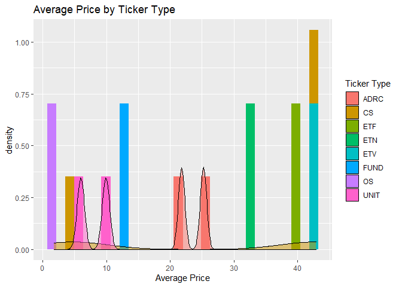<!-- -->

### Plots for modified Data - part 1

``` r
# quantitative vs market & type
# group by type and market and average
df_price = df %>% 
  group_by(market, type) %>%
  summarise(avg_price = mean(c), price_range = (h - l))

h = ggplot(df_price, aes(x = avg_price))

# histograms by market type
h + geom_density(adjust = 0.5, alpha = 0.5, aes(fill = market))
```

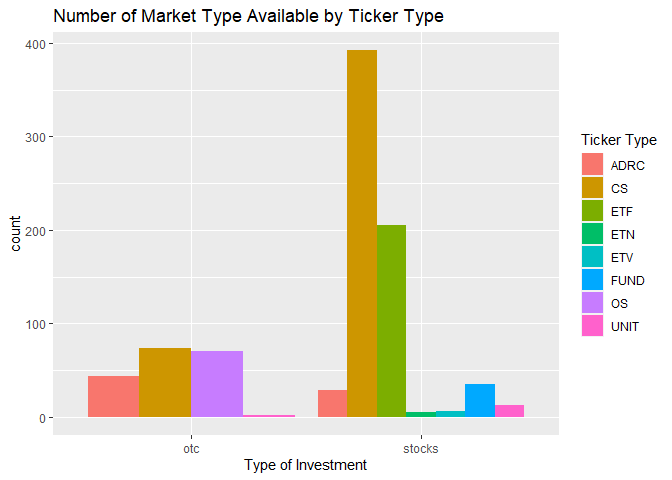<!-- -->

``` r
h + geom_density(adjust = 0.5, alpha = 0.5, aes(fill = type))
```

<!-- -->

``` r
# histogram + density plot for closed price by market type
h + geom_histogram(aes(fill = market, y = ..density..), position = "dodge") + 
  geom_density(adjust = 0.5, alpha = 0.5, aes(fill = market))
```

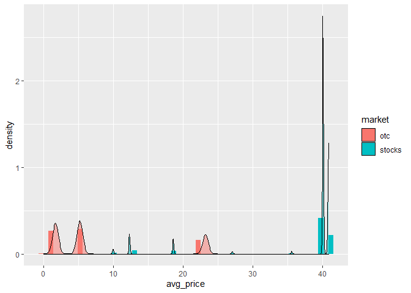<!-- -->

``` r
h + geom_histogram(aes(fill = type, y = ..density..), position = "dodge") + 
  geom_density(adjust = 0.5, alpha = 0.5, aes(fill = type))
```

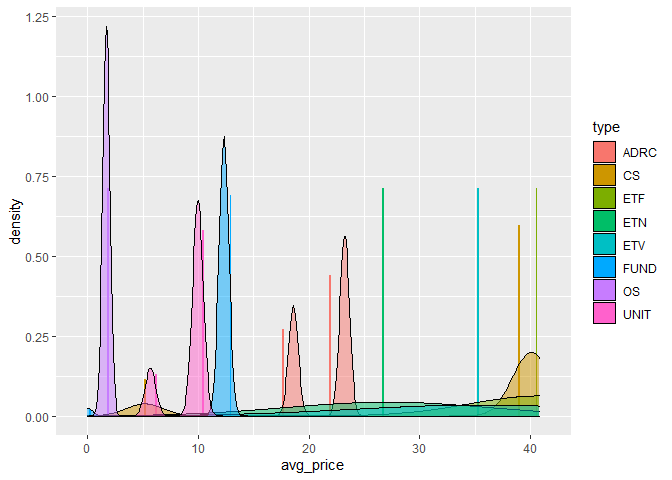<!-- -->

``` r
# boxplot by market and typer for avg price
h + geom_boxplot(aes(y = market)) + coord_flip()
```

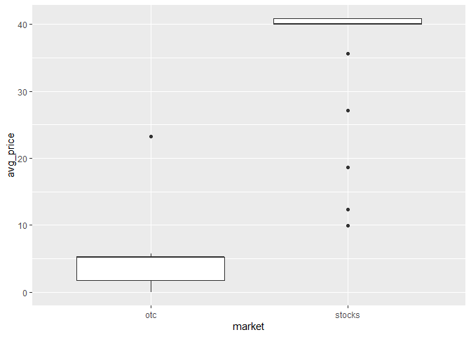<!-- -->

``` r
h + geom_boxplot(aes(y = type)) + coord_flip()
```

<!-- -->

### Plots for modified Data - part 2

``` r
# Empirical CDF by market type - price 50% above price avg up to max price
df_filter_price = df %>%
  filter(c > 1.5*mean(df$c) & c < max(c))

h1 = ggplot(df_filter_price, aes(x = c))
h1 + stat_ecdf(geom = "step", aes(color = market)) + ylab("ECDF")
```

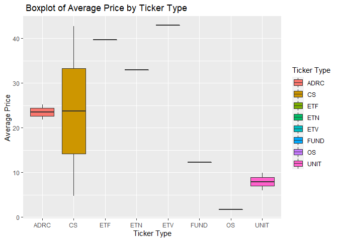<!-- -->

``` r
h1 + stat_ecdf(geom = "step", aes(color = type)) + ylab("ECDF")
```

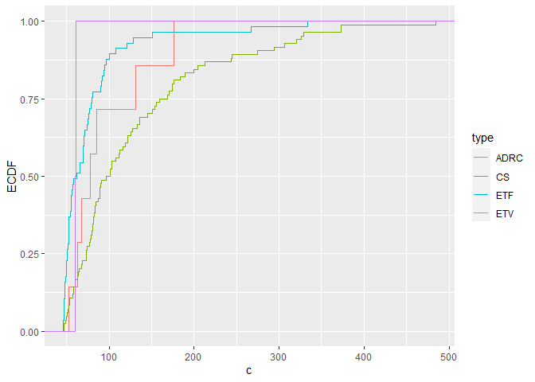<!-- -->

``` r
# histograms by market type
h1 + geom_density(adjust = 0.5, alpha = 0.5, aes(fill = market))
```

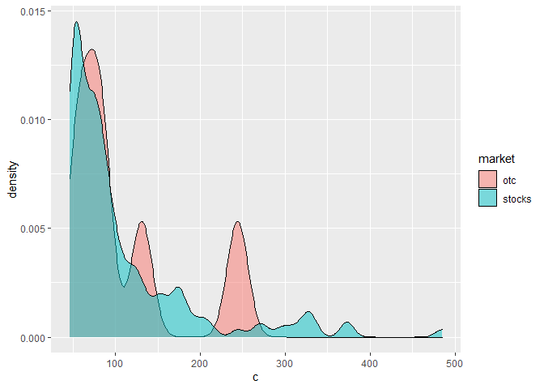<!-- -->

``` r
h1 + geom_density(adjust = 0.5, alpha = 0.5, aes(fill = type))
```

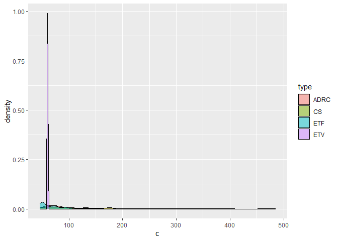<!-- -->

``` r
# histogram + density plot for closed price by market type
h1 + geom_histogram(aes(fill = market, y = ..density..), position = "dodge") + 
  geom_density(adjust = 0.5, alpha = 0.5, aes(fill = market))
```

<!-- -->

``` r
h1 + geom_histogram(aes(fill = type, y = ..density..), position = "dodge") + 
  geom_density(adjust = 0.5, alpha = 0.5, aes(fill = type))
```

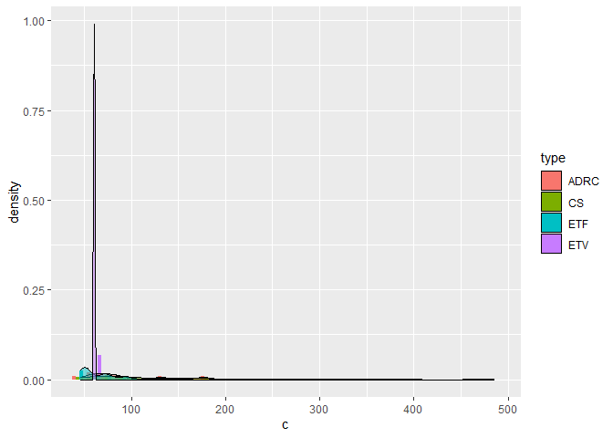<!-- -->

``` r
# scatter plot
h1 + geom_point(aes(y = h)) + facet_wrap(~market)
```

<!-- -->

``` r
h1 + geom_point(aes(y = h)) + facet_wrap(~type)
```

<!-- -->

## For time data

``` r
# for either categorical, numerical, and timely EDa
g <- ggplot(time_df, aes(y = c, color = tckr))
g + geom_line(aes(x = d, color = tckr),lwd = 1.5)
```

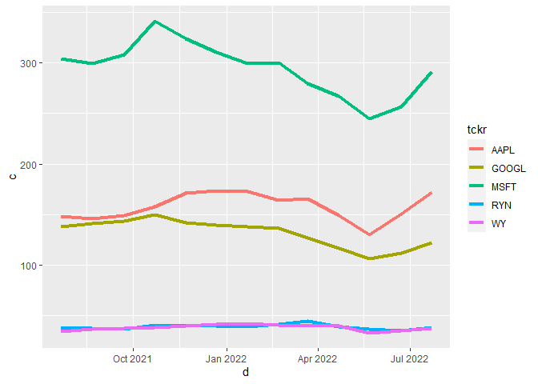<!-- -->

``` r
# scatter plot + curve
g + geom_point(aes(x = d)) + geom_smooth(method = "gam", aes(x = d))
```

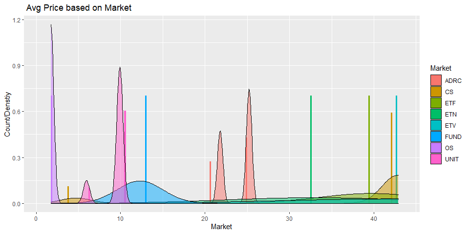<!-- -->

\###EXPLORATORY DATA ANALYSIS.

#### Data Visibility

Before proceeding to the detailed EDA of the data sets taken from the
APIs, some minor changes have been made to the data frame df. The
columns have been renamed as

c - Closing_price h - Highest_price l - Lowest_price n - Transactions
o - Open_price t - Unix_time v- Trading_volume vW- Volume_wt_avg_price

Also,the unix time format has been changed to date format.

Typical price is used to determine volume weighted price. Typical price
has been derived as sum of the closing price , highest price and lower
price.

``` r
df<-df %>% 
  rename(
    Closing_price=c,
    Highest_price=h,
    Lowest_price=l, 
    Transactions=n,
    Open_price=o, 
    Unix_time=t,
    Trading_volume=v,
    Volume_wt_avg_price=vw
   )

df<- df %>% mutate(Date= as.POSIXct(df$Unix_time/1000,origin = "1970-01-01"))
df$Date<-as.Date(df$Date)

df<- df %>% mutate(Sum_Typical_price= (Closing_price+Highest_price+Lowest_price)/3)
df
```

| ticker | name                                                                                                                                     | market | type | composite_figi | share_class_figi | Trading_volume | Volume_wt_avg_price |  Open_price | Closing_price | Highest_price | Lowest_price |    Unix_time | Transactions | Date       | Sum_Typical_price |
|:-------|:-----------------------------------------------------------------------------------------------------------------------------------------|:-------|:-----|:---------------|:-----------------|---------------:|--------------------:|------------:|--------------:|--------------:|-------------:|-------------:|-------------:|:-----------|------------------:|
| FBMCF  | BUFFALO COAL CORP.                                                                                                                       | otc    | OS   | BBG000QMJD58   | BBG001SSCS82     |   1.859000e+03 |           0.0095000 |    0.009500 |      0.009500 |      0.009500 |     0.009500 | 1.657829e+12 |            2 | 2022-07-14 |         0.0095000 |
| CNTMF  | CANSORTIUM INC                                                                                                                           | otc    | OS   | BBG00NB00924   | BBG00NB00933     |   7.879700e+04 |           0.1949200 |    0.200000 |      0.190000 |      0.205000 |     0.190000 | 1.657829e+12 |           27 | 2022-07-14 |         0.1950000 |
| BCMRF  | BCM RES CORP                                                                                                                             | otc    | OS   | BBG000PTYV02   | BBG001SRFK88     |   8.025000e+04 |           0.1284500 |    0.122200 |      0.127650 |      0.130000 |     0.122200 | 1.657829e+12 |           13 | 2022-07-14 |         0.1266167 |
| CRMK   | CERMETEK MICROELECTRONICS                                                                                                                | otc    | CS   | BBG000BGB507   | BBG001S5Q532     |   2.000000e+03 |           0.0200000 |    0.020000 |      0.020000 |      0.020000 |     0.020000 | 1.657829e+12 |            1 | 2022-07-14 |         0.0200000 |
| HEOFF  | H2O INNOVATION INC                                                                                                                       | otc    | OS   | BBG000N5WFY6   | BBG001SGQYB6     |   4.115000e+03 |           1.5102000 |    1.450000 |      1.540000 |      1.540000 |     1.450000 | 1.657829e+12 |           16 | 2022-07-14 |         1.5100000 |
| BDWBY  | BUDWEISER BRWNG UNSP/ADR                                                                                                                 | otc    | ADRC | BBG00QYWH6Z4   | BBG00QYWH7Q2     |   7.358000e+03 |          11.3239000 |   11.375000 |     11.212500 |     11.375000 |    11.071000 | 1.657829e+12 |           10 | 2022-07-14 |        11.2195000 |
| HKMPY  | HIKMA PHARMS PLC S/ADR                                                                                                                   | otc    | ADRC | BBG000W5N809   | BBG001T6D0K5     |   1.578000e+03 |          39.9492000 |   39.370000 |     39.725000 |     40.530000 |    39.370000 | 1.657829e+12 |           15 | 2022-07-14 |        39.8750000 |
| MKRYF  | MANITOK ENERGY INC ORD                                                                                                                   | otc    | OS   | BBG001MHXT87   | BBG001T5Q6F6     |   5.100000e+02 |           0.0000100 |    0.000010 |      0.000010 |      0.000010 |     0.000010 | 1.657829e+12 |            1 | 2022-07-14 |         0.0000100 |
| ECAOF  | ECO ATLANTIC OIL&GAS ORD                                                                                                                 | otc    | OS   | BBG000TS5QH5   | BBG001T0GKK1     |   2.700000e+03 |           0.3646300 |    0.361000 |      0.375000 |      0.375000 |     0.361000 | 1.657829e+12 |            2 | 2022-07-14 |         0.3703333 |
| NHMD   | NATE’S FOOD CO                                                                                                                           | otc    | CS   | BBG000R0M2T9   | BBG001SSXL11     |   1.889247e+07 |           0.0014579 |    0.001600 |      0.001400 |      0.001700 |     0.001250 | 1.657829e+12 |           62 | 2022-07-14 |         0.0014500 |
| HSNGY  | HANG SENG BANK LTD S/ADR                                                                                                                 | otc    | ADRC | BBG000BCR233   | BBG001S6BYB4     |   5.647100e+04 |          16.4351000 |   16.800000 |     16.460000 |     16.800000 |    16.110000 | 1.657829e+12 |           95 | 2022-07-14 |        16.4566667 |
| PDER   | PARDEE RESOURCES CO INC                                                                                                                  | otc    | CS   | BBG000BDGHL0   | BBG001S6XND2     |   2.250000e+02 |         242.9352000 |  250.000000 |    244.010000 |    250.000000 |   244.010000 | 1.657829e+12 |            6 | 2022-07-14 |       246.0066667 |
| YAMHY  | YAMAHA MOTOR CO UNSP/ADR                                                                                                                 | otc    | ADRC | BBG000NVZ9N2   | BBG001T3P109     |   7.737000e+03 |           8.8235000 |    8.670000 |      8.805000 |      8.930000 |     8.660000 | 1.657829e+12 |           16 | 2022-07-14 |         8.7983333 |
| ABIT   | ATHENA BITCOIN GLOBAL                                                                                                                    | otc    | CS   | BBG000CKBF87   | BBG001S6Y023     |   4.045000e+03 |           0.3029400 |    0.300000 |      0.300000 |      0.340000 |     0.300000 | 1.657829e+12 |            8 | 2022-07-14 |         0.3133333 |
| EDTXF  | SPECTRAL MEDICAL INC ORD                                                                                                                 | otc    | OS   | BBG000BZX3J6   | BBG001S609G6     |   1.100000e+04 |           0.2951800 |    0.310000 |      0.288200 |      0.310000 |     0.288100 | 1.657829e+12 |            5 | 2022-07-14 |         0.2954333 |
| LNVGY  | LENOVO GROUP LTD S/ADR                                                                                                                   | otc    | ADRC | BBG000BLWMN1   | BBG001S966T6     |   3.498500e+04 |          18.0954000 |   18.100100 |     18.120000 |     18.400000 |    17.990000 | 1.657829e+12 |          144 | 2022-07-14 |        18.1700000 |
| CJEWY  | CHOW TAI FOOK JEWELRY ADR                                                                                                                | otc    | ADRC | BBG0038SP112   | BBG0038SP1T2     |   2.210000e+02 |          18.8060000 |   18.805000 |     18.805000 |     18.805000 |    18.805000 | 1.657829e+12 |            4 | 2022-07-14 |        18.8050000 |
| PTOAF  | PIERIDAE ENERGY LIMITED                                                                                                                  | otc    | OS   | BBG000LHKG28   | BBG001SK0MJ3     |   1.216000e+03 |           0.6120400 |    0.612130 |      0.612130 |      0.612130 |     0.612130 | 1.657829e+12 |            3 | 2022-07-14 |         0.6121300 |
| IPIX   | INNOVATION PHARMACEUTICAL                                                                                                                | otc    | CS   | BBG000BF2Q94   | BBG001S8STW0     |   3.120020e+05 |           0.0454080 |    0.047000 |      0.046000 |      0.047000 |     0.043000 | 1.657829e+12 |           33 | 2022-07-14 |         0.0453333 |
| MWSNF  | MAWSON GOLD LTD                                                                                                                          | otc    | OS   | BBG000P1CSJ4   | BBG001SL2CQ3     |   5.434000e+04 |           0.0828040 |    0.080000 |      0.081500 |      0.085000 |     0.080000 | 1.657829e+12 |           33 | 2022-07-14 |         0.0821667 |
| FSCR   | FEDERAL SCREW WORKS                                                                                                                      | otc    | CS   | BBG000BJX213   | BBG001S5RCQ1     |   1.000000e+02 |           7.1400000 |    7.140000 |      7.140000 |      7.140000 |     7.140000 | 1.657829e+12 |            1 | 2022-07-14 |         7.1400000 |
| ESALY  | EISAI CO S/ADR                                                                                                                           | otc    | ADRC | BBG000BXH728   | BBG001S98X88     |   2.047400e+04 |          44.8220000 |   45.390000 |     44.900000 |     45.390000 |    44.600000 | 1.657829e+12 |           93 | 2022-07-14 |        44.9633333 |
| GUYGF  | G2 GOLDFIELDS INC                                                                                                                        | otc    | CS   | BBG001730W02   | BBG001SR4TD5     |   1.000000e+04 |           0.4283300 |    0.439150 |      0.418900 |      0.439150 |     0.418900 | 1.657829e+12 |            6 | 2022-07-14 |         0.4256500 |
| FDVXF  | FENIXORO GOLD CORP                                                                                                                       | otc    | OS   | BBG00LMYXCG4   | BBG00LMYXDG2     |   5.700000e+03 |           0.1236900 |    0.120000 |      0.130900 |      0.134450 |     0.120000 | 1.657829e+12 |            4 | 2022-07-14 |         0.1284500 |
| ICNB   | ICONIC BRANDS INC                                                                                                                        | otc    | CS   | BBG000THC4F2   | BBG001T05T15     |   1.073000e+04 |           0.3736700 |    0.370600 |      0.366000 |      0.382400 |     0.366000 | 1.657829e+12 |           11 | 2022-07-14 |         0.3714667 |
| ICCT   | ICORECONNECT INC                                                                                                                         | otc    | CS   | BBG006TM0XQ5   | BBG006TM0XX7     |   1.010000e+04 |           0.0697000 |    0.069700 |      0.069700 |      0.069700 |     0.069700 | 1.657829e+12 |            2 | 2022-07-14 |         0.0697000 |
| MNDJF  | MANDALAY RES CORP                                                                                                                        | otc    | OS   | BBG000DBGJQ3   | BBG001SHZ3L1     |   2.200500e+04 |           1.8033000 |    1.910000 |      1.705000 |      1.915000 |     1.690000 | 1.657829e+12 |           30 | 2022-07-14 |         1.7700000 |
| NUVM   | NUVIM INC                                                                                                                                | otc    | CS   | BBG000BTNJV2   | BBG001SHR3F7     |   5.020000e+04 |           0.0100000 |    0.010000 |      0.010000 |      0.010000 |     0.010000 | 1.657829e+12 |            2 | 2022-07-14 |         0.0100000 |
| JUVAF  | JUVA LIFE INC                                                                                                                            | otc    | OS   | BBG00XYJ9YF8   | BBG00XYJ9Z83     |   7.532900e+04 |           0.1450800 |    0.147100 |      0.148800 |      0.148800 |     0.140020 | 1.657829e+12 |           10 | 2022-07-14 |         0.1458733 |
| ATRWF  | ALTIUS RENEWABLE ROYALTIS                                                                                                                | otc    | OS   | BBG00Y0B1HZ3   | BBG00Y0B1J07     |   3.991000e+03 |           6.4506000 |    6.395000 |      6.519000 |      6.519000 |     6.274000 | 1.657829e+12 |           23 | 2022-07-14 |         6.4373333 |
| MXROF  | MAX RESOURCE CRP                                                                                                                         | otc    | OS   | BBG000BS2XT9   | BBG001S6Z246     |   3.185100e+04 |           0.2832400 |    0.290000 |      0.271750 |      0.295000 |     0.270100 | 1.657829e+12 |           12 | 2022-07-14 |         0.2789500 |
| ALNPY  | ANA HOLDINGS INC S/ADR                                                                                                                   | otc    | ADRC | BBG000BV8G31   | BBG001S7QNR3     |   1.495800e+04 |           3.4572000 |    3.500000 |      3.460000 |      3.560000 |     3.430000 | 1.657829e+12 |           41 | 2022-07-14 |         3.4833333 |
| SITKF  | SITKA GOLD CORP                                                                                                                          | otc    | OS   | BBG00GXJ53M0   | BBG00GXJ53N9     |   3.000000e+03 |           0.1040000 |    0.104000 |      0.104000 |      0.104000 |     0.104000 | 1.657829e+12 |            1 | 2022-07-14 |         0.1040000 |
| QBAN   | TELCO CUBA INC                                                                                                                           | otc    | CS   | BBG000BLZC96   | BBG001SP8TQ1     |   1.130100e+08 |           0.0004084 |    0.000500 |      0.000500 |      0.000500 |     0.000300 | 1.657829e+12 |           91 | 2022-07-14 |         0.0004333 |
| AIQUY  | L’AIR LIQUIDE SA UNSP/ADR                                                                                                                | otc    | ADRC | BBG000BKTQ12   | BBG001S8R1D3     |   3.530500e+05 |          24.8726000 |   24.760000 |     24.985000 |     25.060000 |    24.555000 | 1.657829e+12 |          703 | 2022-07-14 |        24.8666667 |
| MGLDF  | MEDGOLD RESOURCES CRP ORD                                                                                                                | otc    | OS   | BBG000BXKM49   | BBG001S5XTV1     |   3.846100e+04 |           0.0130000 |    0.013000 |      0.013000 |      0.013000 |     0.013000 | 1.657829e+12 |            1 | 2022-07-14 |         0.0130000 |
| PSFT   | POWERSAFE TECH CORP                                                                                                                      | otc    | CS   | BBG000TGJ573   | BBG001T03YY0     |   1.000000e+04 |           0.0010000 |    0.001000 |      0.001000 |      0.001000 |     0.001000 | 1.657829e+12 |            1 | 2022-07-14 |         0.0010000 |
| GBTC   | GRAYSCALE BITCOIN TRUST                                                                                                                  | otc    | CS   | BBG008748J88   | BBG008748J97     |   3.358071e+06 |          12.8864000 |   12.350000 |     13.130000 |     13.300000 |    12.320000 | 1.657829e+12 |         9972 | 2022-07-14 |        12.9166667 |
| BERI   | BLUE EARTH RES INC                                                                                                                       | otc    | CS   | BBG000DPD8B5   | BBG001SDWCT5     |   4.844360e+05 |           0.1279200 |    0.191500 |      0.120000 |      0.191500 |     0.119000 | 1.657829e+12 |           45 | 2022-07-14 |         0.1435000 |
| MSBN   | MESSABEN CORP                                                                                                                            | otc    | CS   | BBG000JKSNW8   | BBG001T3NLH9     |   2.490000e+04 |           0.2909400 |    0.300300 |      0.280000 |      0.303000 |     0.280000 | 1.657829e+12 |            7 | 2022-07-14 |         0.2876667 |
| JMIH   | JUPITER MARINE INTL HLDGS                                                                                                                | otc    | CS   | BBG000C0MN82   | BBG001SD3M06     |   1.000000e+04 |           0.0010000 |    0.001000 |      0.001000 |      0.001000 |     0.001000 | 1.657829e+12 |            1 | 2022-07-14 |         0.0010000 |
| WYPH   | WAYPOINT BIOMED HLDGS INC                                                                                                                | otc    | CS   | BBG000P36FP8   | BBG001SL3GQ3     |   1.600000e+04 |           0.0403130 |    0.045000 |      0.038000 |      0.045000 |     0.038000 | 1.657829e+12 |            3 | 2022-07-14 |         0.0403333 |
| HANNF  | HANNAN METALS LTD ORD                                                                                                                    | otc    | OS   | BBG000BBFJH6   | BBG001S5Y4W4     |   6.928000e+04 |           0.1564800 |    0.175300 |      0.161700 |      0.175300 |     0.144060 | 1.657829e+12 |           19 | 2022-07-14 |         0.1603533 |
| GLEC   | GLOBAL ECOLOGY CORP                                                                                                                      | otc    | CS   | BBG000BRY3J3   | BBG001S9TFR3     |   6.890000e+04 |           0.0002000 |    0.000200 |      0.000200 |      0.000200 |     0.000200 | 1.657829e+12 |            1 | 2022-07-14 |         0.0002000 |
| WHGOF  | WHITE GOLD CORP ORD                                                                                                                      | otc    | OS   | BBG000BZ3586   | BBG001SBL687     |   2.861200e+04 |           0.2951200 |    0.298300 |      0.287200 |      0.298300 |     0.280500 | 1.657829e+12 |            7 | 2022-07-14 |         0.2886667 |
| ADHI   | ARSENAL DIGITAL HLDGS INC                                                                                                                | otc    | CS   | BBG000Q1F5K8   | BBG001SM23F3     |   6.000000e+02 |           0.1380000 |    0.138000 |      0.138000 |      0.138000 |     0.138000 | 1.657829e+12 |            1 | 2022-07-14 |         0.1380000 |
| OSCI   | OSCEOLA GOLD INC                                                                                                                         | otc    | CS   | BBG000Q09Q58   | BBG001T66TW7     |   1.691350e+05 |           0.0482310 |    0.050000 |      0.050000 |      0.050000 |     0.043100 | 1.657829e+12 |           22 | 2022-07-14 |         0.0477000 |
| LTMCF  | LITHIUM CHILE INC                                                                                                                        | otc    | OS   | BBG0018NR8Y4   | BBG001TFBJY1     |   5.322500e+04 |           0.3498400 |    0.351480 |      0.360000 |      0.360000 |     0.337215 | 1.657829e+12 |           28 | 2022-07-14 |         0.3524050 |
| CANOF  | CALIFORNIA NANOTECHS CORP                                                                                                                | otc    | OS   | BBG000QMYCQ0   | BBG001SN7G49     |   3.090000e+04 |           0.0633820 |    0.063960 |      0.065000 |      0.065000 |     0.063000 | 1.657829e+12 |            5 | 2022-07-14 |         0.0643333 |
| MFON   | MOBIVITY HOLDINGS CORP                                                                                                                   | otc    | CS   | BBG000PZ4V38   | BBG001T657V7     |   1.000000e+02 |           1.1400000 |    1.140000 |      1.140000 |      1.140000 |     1.140000 | 1.657829e+12 |            1 | 2022-07-14 |         1.1400000 |
| JBAXY  | JULIUS BAER GRP UNSP/ADR                                                                                                                 | otc    | ADRC | BBG000PT2PG3   | BBG001T5ZDQ9     |   1.101040e+05 |           8.6186000 |    8.580000 |      8.640000 |      8.660000 |     8.535000 | 1.657829e+12 |          174 | 2022-07-14 |         8.6116667 |
| HQGE   | HQ GLOBAL EDUCATION INC                                                                                                                  | otc    | CS   | BBG000BBL491   | BBG001S7R9W7     |   4.802400e+04 |           0.0001000 |    0.000100 |      0.000100 |      0.000100 |     0.000100 | 1.657829e+12 |            4 | 2022-07-14 |         0.0001000 |
| MRNJ   | METATRON INC                                                                                                                             | otc    | CS   | BBG000BHNQY9   | BBG001SB3X33     |   6.583500e+06 |           0.0002000 |    0.000200 |      0.000100 |      0.000200 |     0.000100 | 1.657829e+12 |           12 | 2022-07-14 |         0.0001333 |
| MNTR   | MENTOR CAPITAL INC                                                                                                                       | otc    | CS   | BBG000C1KW64   | BBG001SC0BC2     |   4.820000e+02 |           0.0447000 |    0.044800 |      0.044800 |      0.044800 |     0.044800 | 1.657829e+12 |            2 | 2022-07-14 |         0.0448000 |
| FLOOF  | FLOWER ONE HOLDINGS INC                                                                                                                  | otc    | OS   | BBG000R2WB32   | BBG001ST12P0     |   1.155460e+05 |           0.0266400 |    0.023600 |      0.025000 |      0.027900 |     0.021600 | 1.657829e+12 |            5 | 2022-07-14 |         0.0248333 |
| HWNI   | HIGH WIRE NETWORKS INC.                                                                                                                  | otc    | CS   | BBG000BFMGM9   | BBG001S99Y12     |   6.820550e+05 |           0.0669420 |    0.056000 |      0.077500 |      0.085000 |     0.056000 | 1.657829e+12 |           44 | 2022-07-14 |         0.0728333 |
| REPO   | NATIONAL ASSET RECOVERY                                                                                                                  | otc    | CS   | BBG000BDRS43   | BBG001SDB559     |   1.137030e+05 |           0.0659910 |    0.066450 |      0.055000 |      0.075000 |     0.051000 | 1.657829e+12 |           29 | 2022-07-14 |         0.0603333 |
| DFIFF  | DIAMOND FIELDS RES INC                                                                                                                   | otc    | OS   | BBG000BCJS71   | BBG001S64NZ0     |   3.707000e+03 |           0.1762900 |    0.179400 |      0.170000 |      0.179400 |     0.170000 | 1.657829e+12 |            6 | 2022-07-14 |         0.1731333 |
| VGLS   | VG LIFE SCIENCES INC                                                                                                                     | otc    | CS   | BBG000CPS8S2   | BBG001SFC5F2     |   1.139334e+09 |           0.0002221 |    0.000300 |      0.000300 |      0.000300 |     0.000100 | 1.657829e+12 |          285 | 2022-07-14 |         0.0002333 |
| CNNEF  | CANACOL ENERGY ORD                                                                                                                       | otc    | OS   | BBG000C12RY4   | BBG001S65X32     |   4.836700e+04 |           1.7094000 |    1.720000 |      1.710000 |      1.730000 |     1.690000 | 1.657829e+12 |           31 | 2022-07-14 |         1.7100000 |
| TWMIF  | TIDEWATER MIDSTRM & INFRA                                                                                                                | otc    | OS   | BBG008871P56   | BBG008871P65     |   5.530000e+03 |           0.9349400 |    0.929750 |      0.939040 |      0.939040 |     0.929750 | 1.657829e+12 |            4 | 2022-07-14 |         0.9359433 |
| CNIKF  | CANADA NICKEL CO INC                                                                                                                     | otc    | OS   | BBG00QGG7B34   | BBG00QGG7B43     |   2.131000e+04 |           1.2410000 |    1.210000 |      1.220000 |      1.280000 |     1.180000 | 1.657829e+12 |           38 | 2022-07-14 |         1.2266667 |
| IDCBY  | INDUSTRIAL & COM UNSP/ADR                                                                                                                | otc    | ADRC | BBG000RLS431   | BBG001T3SGX7     |   1.424420e+05 |          10.2602000 |   10.480000 |     10.260000 |     10.520000 |     9.840000 | 1.657829e+12 |          140 | 2022-07-14 |        10.2066667 |
| UNCRY  | UNICREDITO SPA UNSP/ADR                                                                                                                  | otc    | ADRC | BBG00HNL0GJ4   | BBG00HNL0H75     |   5.240560e+05 |           4.1816000 |    4.240000 |      4.200000 |      4.380000 |     4.090000 | 1.657829e+12 |          300 | 2022-07-14 |         4.2233333 |
| PHBI   | PHARMAGREEN BIOTECH INC                                                                                                                  | otc    | CS   | BBG000H1B586   | BBG001T33Z26     |   3.460500e+04 |           0.0083198 |    0.008500 |      0.008100 |      0.008500 |     0.008100 | 1.657829e+12 |            4 | 2022-07-14 |         0.0082333 |
| EKTAY  | ELEKTA B SHS UNSP/ADR                                                                                                                    | otc    | ADRC | BBG000KK09J2   | BBG001T0K066     |   6.102500e+04 |           6.4527000 |    6.480000 |      6.470000 |      6.510000 |     6.390000 | 1.657829e+12 |           65 | 2022-07-14 |         6.4566667 |
| EXCOF  | EXCO TECHS LTD                                                                                                                           | otc    | OS   | BBG000C01N85   | BBG001S60YB6     |   8.980000e+02 |           5.9994000 |    5.997000 |      5.997000 |      5.997000 |     5.997000 | 1.657829e+12 |            5 | 2022-07-14 |         5.9970000 |
| ITOX   | IIOT-OXYS INC                                                                                                                            | otc    | CS   | BBG000BYF8X2   | BBG001SJR6S2     |   4.760000e+05 |           0.0059315 |    0.006100 |      0.006000 |      0.006100 |     0.006000 | 1.657829e+12 |            6 | 2022-07-14 |         0.0060333 |
| CGRW   | CANNAGROW HOLDINGS INC                                                                                                                   | otc    | CS   | BBG000CM3V23   | BBG001S82H27     |   1.600000e+03 |           0.0150500 |    0.015400 |      0.015400 |      0.015400 |     0.015000 | 1.657829e+12 |            3 | 2022-07-14 |         0.0152667 |
| EJPRY  | EAST JAPAN RWY UNSP/ADR                                                                                                                  | otc    | ADRC | BBG000FMZ899   | BBG001T2HYY1     |   9.411300e+04 |           7.9003000 |    7.880000 |      7.890000 |      7.950000 |     7.860000 | 1.657829e+12 |          146 | 2022-07-14 |         7.9000000 |
| LQWC   | LIFEQUEST WORLD CP                                                                                                                       | otc    | CS   | BBG000BXJH06   | BBG001SCWKB8     |   1.106800e+04 |           0.0333350 |    0.035000 |      0.032000 |      0.038000 |     0.032000 | 1.657829e+12 |            9 | 2022-07-14 |         0.0340000 |
| BUKS   | BUTLER NATL CORP                                                                                                                         | otc    | CS   | BBG000D96KF8   | BBG001S7R2V3     |   1.400000e+03 |           0.8923800 |    0.904450 |      0.880000 |      0.904450 |     0.880000 | 1.657829e+12 |            3 | 2022-07-14 |         0.8881500 |
| GRNF   | GRN HOLDING CORPORATION                                                                                                                  | otc    | CS   | BBG001CMFL48   | BBG001TYLPX6     |   2.181300e+04 |           0.0230530 |    0.020000 |      0.022900 |      0.024800 |     0.020000 | 1.657829e+12 |            4 | 2022-07-14 |         0.0225667 |
| THCBF  | THC BIOMED INTL LTD ORD                                                                                                                  | otc    | OS   | BBG000CG9T98   | BBG001S9F3N9     |   2.010000e+03 |           0.0376540 |    0.043000 |      0.044000 |      0.044000 |     0.031800 | 1.657829e+12 |            5 | 2022-07-14 |         0.0399333 |
| IDGC   | IDGLOBAL CORP                                                                                                                            | otc    | CS   | BBG000DQ70X3   | BBG001SJBJK9     |   2.576666e+06 |           0.0001500 |    0.000150 |      0.000150 |      0.000150 |     0.000150 | 1.657829e+12 |            1 | 2022-07-14 |         0.0001500 |
| MARUY  | MARUBENI CORP UNSP/ADR                                                                                                                   | otc    | ADRC | BBG000BWSLZ1   | BBG001S8ZNM6     |   9.610000e+03 |          85.0684000 |   84.140000 |     85.730000 |     85.740000 |    83.680000 | 1.657829e+12 |          130 | 2022-07-14 |        85.0500000 |
| IKTO   | ITOKK INC                                                                                                                                | otc    | CS   | BBG000PZ4KY8   | BBG001SRKB82     |   1.784634e+06 |           0.0012431 |    0.001400 |      0.001400 |      0.001400 |     0.001200 | 1.657829e+12 |            9 | 2022-07-14 |         0.0013333 |
| CHGI   | CHINA CARBON GRAPHITE GRP                                                                                                                | otc    | CS   | BBG000PTJZG3   | BBG001SRDV40     |   1.000000e+02 |           0.0450000 |    0.045000 |      0.045000 |      0.045000 |     0.045000 | 1.657829e+12 |            1 | 2022-07-14 |         0.0450000 |
| IDKOY  | IDEMITSU KOSAN CO LTD ADR                                                                                                                | otc    | ADRC | BBG000HVYGL6   | BBG001SPQJW6     |   4.040000e+02 |          11.0900000 |   11.090000 |     11.090000 |     11.090000 |    11.090000 | 1.657829e+12 |            1 | 2022-07-14 |        11.0900000 |
| FUJIY  | FUJIFILM HLDGS CORP ADR                                                                                                                  | otc    | ADRC | BBG000BB7D24   | BBG001S5RDY0     |   5.393600e+04 |          52.8700000 |   53.090000 |     52.640000 |     53.090000 |    52.592000 | 1.657829e+12 |          285 | 2022-07-14 |        52.7740000 |
| VFRM   | VERITAS FARMS INC                                                                                                                        | otc    | CS   | BBG00CGCW1H3   | BBG00CGCW1J1     |   8.190000e+04 |           0.0308960 |    0.031900 |      0.030000 |      0.031900 |     0.026000 | 1.657829e+12 |           15 | 2022-07-14 |         0.0293000 |
| CNGT   | CANNAGISTICS INC                                                                                                                         | otc    | CS   | BBG000JZ4T49   | BBG001SPMVV4     |   2.012000e+05 |           0.0032030 |    0.003200 |      0.003700 |      0.003700 |     0.003200 | 1.657829e+12 |            3 | 2022-07-14 |         0.0035333 |
| EQMEF  | EQUITY METALS CORPORATION                                                                                                                | otc    | OS   | BBG000BZR4T0   | BBG001S5ZSH7     |   8.949000e+04 |           0.0440680 |    0.046000 |      0.044000 |      0.046000 |     0.042500 | 1.657829e+12 |           14 | 2022-07-14 |         0.0441667 |
| SHERF  | SHERRITT INTL CORP                                                                                                                       | otc    | OS   | BBG000GXW4R6   | BBG001S925B1     |   8.750000e+03 |           0.2502900 |    0.260000 |      0.250000 |      0.260000 |     0.250000 | 1.657829e+12 |            4 | 2022-07-14 |         0.2533333 |
| CPWR   | OCEAN THERMAL ENERGY CORP                                                                                                                | otc    | CS   | BBG000Q7WSQ0   | BBG001SRWJJ0     |   6.941100e+04 |           0.0132800 |    0.014000 |      0.014000 |      0.014000 |     0.013000 | 1.657829e+12 |            6 | 2022-07-14 |         0.0136667 |
| SNWR   | SANWIRE CORPORATION                                                                                                                      | otc    | CS   | BBG000GNQGW2   | BBG001SKRCV2     |   7.360000e+04 |           0.0070963 |    0.008000 |      0.008000 |      0.008000 |     0.006700 | 1.657829e+12 |            8 | 2022-07-14 |         0.0075667 |
| OBTX   | OBITX INC                                                                                                                                | otc    | CS   | BBG00J03L8K8   | BBG00J03L980     |   2.799000e+03 |           3.6492000 |    3.900000 |      3.510000 |      3.980000 |     3.300000 | 1.657829e+12 |           20 | 2022-07-14 |         3.5966667 |
| HXLTF  | HELIOSX LITHIUM & TECH                                                                                                                   | otc    | OS   | BBG000GLTDG8   | BBG001SD33H0     |   1.212000e+04 |           0.4023600 |    0.437780 |      0.400000 |      0.437780 |     0.391480 | 1.657829e+12 |            9 | 2022-07-14 |         0.4097533 |
| COWI   | CARBONMETA TECHS INC                                                                                                                     | otc    | CS   | BBG000DNX294   | BBG001SJRVH9     |   2.755362e+08 |           0.0006426 |    0.000700 |      0.000700 |      0.000800 |     0.000600 | 1.657829e+12 |          279 | 2022-07-14 |         0.0007000 |
| VWFB   | VWF BANCORP INC                                                                                                                          | otc    | CS   | BBG0160DXJ08   | BBG0160DXJ17     |   2.419500e+05 |          12.1628000 |   11.600000 |     12.900000 |     13.050000 |    11.250000 | 1.657829e+12 |          154 | 2022-07-14 |        12.4000000 |
| SOUHY  | SOUTH32 LTD SPNS/ADR                                                                                                                     | otc    | ADRC | BBG008MWGWS9   | BBG008MWGWT8     |   2.438740e+05 |          11.8333000 |   11.610000 |     11.730000 |     11.820000 |    11.580000 | 1.657829e+12 |          528 | 2022-07-14 |        11.7100000 |
| AIMLF  | AI / ML INNOVATIONS INC                                                                                                                  | otc    | OS   | BBG000CNRFH4   | BBG001S706N2     |   2.357900e+04 |           0.1295600 |    0.131100 |      0.129565 |      0.140300 |     0.110000 | 1.657829e+12 |           11 | 2022-07-14 |         0.1266217 |
| NCLTY  | NITORI HOLDINGS CO U/ADR                                                                                                                 | otc    | ADRC | BBG00RN65MJ7   | BBG00RN65N87     |   1.094010e+05 |           9.6868000 |    9.370000 |      9.720000 |      9.780000 |     9.370000 | 1.657829e+12 |          229 | 2022-07-14 |         9.6233333 |
| VWAGY  | VOLKSWAGEN AG UNSP/ADR                                                                                                                   | otc    | ADRC | BBG00LPF36F9   | BBG00LPF3758     |   2.968700e+05 |          17.7099000 |   17.679400 |     17.830000 |     18.010000 |    17.450000 | 1.657829e+12 |         1506 | 2022-07-14 |        17.7633333 |
| ELRFF  | EASTERN PLATINUM LTD NEW                                                                                                                 | otc    | OS   | BBG000BPPY90   | BBG001SFXK75     |   2.300000e+04 |           0.1294000 |    0.127180 |      0.130000 |      0.130000 |     0.127180 | 1.657829e+12 |            6 | 2022-07-14 |         0.1290600 |
| AHKSY  | ASAHI KAISEI CRP UNSP/ADR                                                                                                                | otc    | ADRC | BBG000CKGF37   | BBG001SHFMK2     |   1.090220e+05 |          14.8632000 |   15.180000 |     14.860000 |     15.180000 |    14.460000 | 1.657829e+12 |          283 | 2022-07-14 |        14.8333333 |
| VMHG   | VICTORY MARINE HLDGS CORP                                                                                                                | otc    | CS   | BBG000BDJHH2   | BBG001S6XS32     |   1.000000e+02 |           0.0177000 |    0.017700 |      0.017700 |      0.017700 |     0.017700 | 1.657829e+12 |            1 | 2022-07-14 |         0.0177000 |
| TRCY   | TRI CITY BANKSHARES CORP                                                                                                                 | otc    | CS   | BBG000BLR6W2   | BBG001S9BS67     |   2.520000e+02 |          18.3859000 |   18.315100 |     18.490000 |     18.490000 |    18.315100 | 1.657829e+12 |            3 | 2022-07-14 |        18.4317000 |
| CCYY   | CCCB BANCORP INC                                                                                                                         | otc    | CS   | BBG00WLLG859   | BBG00WLLG877     |   1.000000e+02 |           7.8000000 |    7.800000 |      7.800000 |      7.800000 |     7.800000 | 1.657829e+12 |            1 | 2022-07-14 |         7.8000000 |
| EGTYF  | EGUANA TECHS INC ORD                                                                                                                     | otc    | OS   | BBG000DKK276   | BBG001SDLQH9     |   2.478300e+04 |           0.1683700 |    0.165000 |      0.171480 |      0.172260 |     0.165000 | 1.657829e+12 |            8 | 2022-07-14 |         0.1695800 |
| APRU   | APPLE RUSH COMP INC                                                                                                                      | otc    | CS   | BBG000TKJLW1   | BBG001T0B360     |   1.743247e+06 |           0.0017881 |    0.001800 |      0.001700 |      0.001900 |     0.001700 | 1.657829e+12 |           26 | 2022-07-14 |         0.0017667 |
| ENDTF  | CANOE EIT INCOME FD                                                                                                                      | otc    | UNIT | BBG000BSYXJ5   | BBG001SB5N24     |   1.533000e+03 |           9.2982000 |    8.960000 |      9.360000 |      9.400000 |     8.960000 | 1.657829e+12 |            6 | 2022-07-14 |         9.2400000 |
| LTGHY  | LIFE HLTHCRE GRP USP/ADR                                                                                                                 | otc    | ADRC | BBG004BJ4QL2   | BBG004BJ4RB1     |   5.261000e+03 |           4.3144000 |    4.150100 |      4.345000 |      4.345000 |     4.150100 | 1.657829e+12 |           15 | 2022-07-14 |         4.2800333 |
| HDII   | HYPERTENSION DIAGNSTCS                                                                                                                   | otc    | CS   | BBG000C4T1L0   | BBG001SBZ8N1     |   1.000000e+03 |           0.0055000 |    0.005500 |      0.005500 |      0.005500 |     0.005500 | 1.657829e+12 |            1 | 2022-07-14 |         0.0055000 |
| ARRPY  | AEROPORTS DE PARIS SA                                                                                                                    | otc    | ADRC | BBG00K1K3DF1   | BBG00K1K3F48     |   8.712000e+03 |          11.8594000 |   11.850000 |     11.860100 |     11.860100 |    11.850000 | 1.657829e+12 |           13 | 2022-07-14 |        11.8567333 |
| MURGY  | MUENCHENER RE GP UNSP/ADR                                                                                                                | otc    | ADRC | BBG000GCM2Q8   | BBG001T3P010     |   1.170250e+05 |          21.5579000 |   21.610000 |     21.625000 |     21.670000 |    21.210000 | 1.657829e+12 |          309 | 2022-07-14 |        21.5016667 |
| KMTUY  | KOMATSU LTD S/ADR                                                                                                                        | otc    | ADRC | BBG000BYKR00   | BBG001S9Z160     |   7.836600e+04 |          20.5878000 |   21.360000 |     20.730000 |     21.360000 |    20.100000 | 1.657829e+12 |          376 | 2022-07-14 |        20.7300000 |
| GCXXF  | GRANITE CREEK COPPER LTD                                                                                                                 | otc    | OS   | BBG001V59KB5   | BBG001V59KY0     |   3.290000e+04 |           0.0609750 |    0.055300 |      0.061700 |      0.062400 |     0.055300 | 1.657829e+12 |            5 | 2022-07-14 |         0.0598000 |
| RUPRF  | RUPERT RESOURCES LTD                                                                                                                     | otc    | OS   | BBG000DP83K2   | BBG001S89XP0     |   1.398000e+03 |           3.0655000 |    3.110000 |      3.060000 |      3.110000 |     3.000000 | 1.657829e+12 |            9 | 2022-07-14 |         3.0566667 |
| OLCLY  | ORIENTAL LAND CO LTD ADR                                                                                                                 | otc    | ADRC | BBG002S9ZGP4   | BBG002S9ZHF3     |   6.309000e+03 |          25.9608000 |   25.540000 |     25.720000 |     26.720000 |    25.540000 | 1.657829e+12 |           31 | 2022-07-14 |        25.9933333 |
| MTLLF  | METALLUM RES INC                                                                                                                         | otc    | OS   | BBG000P2ZW35   | BBG001SD8W72     |   1.850000e+02 |           0.0200000 |    0.020000 |      0.020000 |      0.020000 |     0.020000 | 1.657829e+12 |            1 | 2022-07-14 |         0.0200000 |
| CMWAY  | CMNWLTH BK AUSTRLA S/ADR                                                                                                                 | otc    | ADRC | BBG000C70884   | BBG001SFSZT4     |   4.350100e+04 |          62.4700000 |   62.675000 |     62.640000 |     63.810000 |    61.490000 | 1.657829e+12 |          232 | 2022-07-14 |        62.6466667 |
| ANRGF  | ANAERGIA INC SUB VTG SHS                                                                                                                 | otc    | OS   | BBG002GMD9X9   | BBG002GMD9Y8     |   1.402500e+04 |           4.7415000 |    5.000000 |      4.600000 |      5.000000 |     4.600000 | 1.657829e+12 |           23 | 2022-07-14 |         4.7333333 |
| MEDT   | MEDIATECHNICS CORP                                                                                                                       | otc    | CS   | BBG000C4JD17   | BBG001S6LVT0     |   2.600000e+02 |           0.0000010 |    0.000001 |      0.000001 |      0.000001 |     0.000001 | 1.657829e+12 |            1 | 2022-07-14 |         0.0000010 |
| COPRF  | MEDIVOLVE INC                                                                                                                            | otc    | OS   | BBG000Q84K68   | BBG001SRWZJ4     |   5.400000e+04 |           0.0232260 |    0.023200 |      0.023300 |      0.023300 |     0.023200 | 1.657829e+12 |            2 | 2022-07-14 |         0.0232667 |
| CODYY  | COMPAGNIE ST GBN UNSP/ADR                                                                                                                | otc    | ADRC | BBG000C2K6K3   | BBG001SM7N73     |   2.456210e+05 |           8.1112000 |    8.080000 |      8.160000 |      8.170000 |     8.020000 | 1.657829e+12 |          362 | 2022-07-14 |         8.1166667 |
| PHPPY  | SIGNIFY NV UNSP/ADR                                                                                                                      | otc    | ADRC | BBG00HLJ8Y04   | BBG00HLJ8YQ6     |   7.120000e+02 |          16.3483000 |   16.250000 |     16.250000 |     16.250000 |    16.250000 | 1.657829e+12 |            2 | 2022-07-14 |        16.2500000 |
| BKTPF  | CRUZ BATTERY METALS CORP                                                                                                                 | otc    | OS   | BBG000RMF3F2   | BBG001STX5B3     |   1.047400e+05 |           0.0823820 |    0.093000 |      0.094000 |      0.096700 |     0.078000 | 1.657829e+12 |           17 | 2022-07-14 |         0.0895667 |
| SWYDF  | STORNOWAY DIAMOND CORP                                                                                                                   | otc    | OS   | BBG000K5Y392   | BBG001SCQN56     |   1.110000e+04 |           0.0017901 |    0.001800 |      0.001700 |      0.001800 |     0.001700 | 1.657829e+12 |            3 | 2022-07-14 |         0.0017333 |
| BRYGF  | BAROYECA GOLD&SILVER INC                                                                                                                 | otc    | OS   | BBG000QPD3K2   | BBG001T88NS9     |   2.750000e+04 |           0.1065900 |    0.105062 |      0.106000 |      0.110000 |     0.105000 | 1.657829e+12 |           24 | 2022-07-14 |         0.1070000 |
| MAGE   | MAGELLAN GOLD CORP                                                                                                                       | otc    | CS   | BBG001CK2LB8   | BBG001TXNPK0     |   2.000000e+03 |           0.2994700 |    0.299000 |      0.299500 |      0.299500 |     0.299000 | 1.657829e+12 |            2 | 2022-07-14 |         0.2993333 |
| SDVKY  | SANDVIK AB S/ADR                                                                                                                         | otc    | ADRC | BBG000BN3280   | BBG001SC9KM2     |   1.029050e+05 |          15.8737000 |   15.760100 |     15.976400 |     16.026000 |    15.570000 | 1.657829e+12 |          403 | 2022-07-14 |        15.8574667 |
| CANSF  | WILLOW BIOSCIENCES INC                                                                                                                   | otc    | OS   | BBG000BXWNR9   | BBG001S5Y4J9     |   1.009400e+05 |           0.1220300 |    0.119740 |      0.117500 |      0.124000 |     0.117500 | 1.657829e+12 |            9 | 2022-07-14 |         0.1196667 |
| ESKYF  | ESKAY MINING CORP                                                                                                                        | otc    | OS   | BBG000H8C1H9   | BBG001SDQP59     |   4.769700e+04 |           1.4078000 |    1.470000 |      1.370000 |      1.470000 |     1.365000 | 1.657829e+12 |           42 | 2022-07-14 |         1.4016667 |
| GELEF  | GRAPHANO ENERGY LTD                                                                                                                      | otc    | OS   | BBG0127R5RR3   | BBG0127R5RS2     |   4.270000e+02 |           0.1435300 |    0.144049 |      0.142500 |      0.144049 |     0.142500 | 1.657829e+12 |            3 | 2022-07-14 |         0.1430163 |
| TISDZ  | TREASURE ISLND RTY TR UTS                                                                                                                | otc    | FUND | BBG000LRL850   | BBG001SK4G66     |   1.000000e+03 |           0.0001000 |    0.000100 |      0.000100 |      0.000100 |     0.000100 | 1.657829e+12 |            1 | 2022-07-14 |         0.0001000 |
| SVNLY  | SVENSKA HANDELSBK UNS/ADR                                                                                                                | otc    | ADRC | BBG000P2S4W3   | BBG001T3RTK4     |   6.595370e+05 |           4.1162000 |    4.120000 |      4.110000 |      4.160000 |     4.070100 | 1.657829e+12 |          241 | 2022-07-14 |         4.1133667 |
| CPPMF  | COPPER MTN MNG CORP                                                                                                                      | otc    | OS   | BBG000QQ07K5   | BBG001SSG953     |   1.184080e+05 |           1.0608000 |    1.120000 |      1.060000 |      1.120000 |     1.040000 | 1.657829e+12 |          125 | 2022-07-14 |         1.0733333 |
| CKHUY  | CK HUTCH HLD LTD UNSP/ADR                                                                                                                | otc    | ADRC | BBG008D4TY21   | BBG008D4TYW8     |   1.182320e+05 |           6.5921000 |    6.610000 |      6.590000 |      6.610000 |     6.570000 | 1.657829e+12 |          175 | 2022-07-14 |         6.5900000 |
| NBMFF  | NEO BATTERY MATLS LTD                                                                                                                    | otc    | OS   | BBG000GPLSR2   | BBG001SNZTD0     |   3.052800e+04 |           0.1308500 |    0.132160 |      0.130000 |      0.132200 |     0.130000 | 1.657829e+12 |           12 | 2022-07-14 |         0.1307333 |
| ORKLY  | ORKLA AS A S/ADR                                                                                                                         | otc    | ADRC | BBG000BN2RR5   | BBG001SBVXF9     |   5.810700e+04 |           7.9849000 |    7.870000 |      8.010000 |      8.010000 |     7.850000 | 1.657829e+12 |          108 | 2022-07-14 |         7.9566667 |
| NXGPY  | NEXT GROUP PLC UNSP/ADR                                                                                                                  | otc    | ADRC | BBG000JT32F1   | BBG001T3NZZ8     |   1.952000e+03 |          36.5867000 |   36.810000 |     36.300000 |     37.050000 |    36.300000 | 1.657829e+12 |            9 | 2022-07-14 |        36.5500000 |
| TAKOF  | DRONE DELIVRY CDA COM&VAR                                                                                                                | otc    | OS   | BBG001PG5LL9   | BBG001V187W1     |   9.539000e+03 |           0.3964600 |    0.405510 |      0.395000 |      0.480000 |     0.360000 | 1.657829e+12 |           17 | 2022-07-14 |         0.4116667 |
| SNWV   | SANUWAVE HEALTH INC                                                                                                                      | otc    | CS   | BBG000C33X21   | BBG001SV44J5     |   1.119600e+05 |           0.0587580 |    0.062000 |      0.070000 |      0.070000 |     0.050000 | 1.657829e+12 |           10 | 2022-07-14 |         0.0633333 |
| TCRI   | TECHCOM INC                                                                                                                              | otc    | CS   | BBG000F08YN4   | BBG001SKKK23     |   4.750570e+05 |           0.1294800 |    0.224000 |      0.140000 |      0.247000 |     0.090000 | 1.657829e+12 |           97 | 2022-07-14 |         0.1590000 |
| ZNOG   | ZION OIL & GAS INC                                                                                                                       | otc    | CS   | BBG000RFZLM7   | BBG001SSCT99     |   1.063887e+06 |           0.2565500 |    0.259350 |      0.256400 |      0.262500 |     0.252200 | 1.657829e+12 |          212 | 2022-07-14 |         0.2570333 |
| ASCK   | AUSCRETE CORP                                                                                                                            | otc    | CS   | BBG001QCG512   | BBG001V1FTM6     |   1.000000e+02 |           0.0340000 |    0.034000 |      0.034000 |      0.034000 |     0.034000 | 1.657829e+12 |            1 | 2022-07-14 |         0.0340000 |
| BRLXF  | BORALEX INC A                                                                                                                            | otc    | OS   | BBG000BXSFH2   | BBG001S5Y1Q7     |   9.100000e+02 |          32.2050000 |   31.700000 |     32.480000 |     32.480000 |    31.700000 | 1.657829e+12 |           10 | 2022-07-14 |        32.2200000 |
| RIII   | RENAVOTIO INC                                                                                                                            | otc    | CS   | BBG004JLQY47   | BBG004JLQYX5     |   6.990000e+04 |           0.0127000 |    0.012700 |      0.012700 |      0.012700 |     0.012700 | 1.657829e+12 |            2 | 2022-07-14 |         0.0127000 |
| AKTAF  | AKITA DRILLING LTD A                                                                                                                     | otc    | OS   | BBG000BW5PV1   | BBG001S76HG0     |   1.200000e+03 |           1.2575000 |    1.250000 |      1.340000 |      1.340000 |     1.250000 | 1.657829e+12 |            3 | 2022-07-14 |         1.3100000 |
| JENGQ  | JUST ENERGY GROUP INC                                                                                                                    | otc    | OS   | BBG000D8RJ97   | BBG001SHTXC2     |   6.265600e+04 |           0.2952700 |    0.300000 |      0.290000 |      0.305000 |     0.280000 | 1.657829e+12 |           20 | 2022-07-14 |         0.2916667 |
| LEAS   | STRATEGIC ASSET LEASING                                                                                                                  | otc    | CS   | BBG000D1JK07   | BBG001SJQSW0     |   4.145778e+06 |           0.0010856 |    0.001070 |      0.001200 |      0.001200 |     0.001000 | 1.657829e+12 |           30 | 2022-07-14 |         0.0011333 |
| DSNY   | DESTINY MEDIA TECHS INC                                                                                                                  | otc    | OS   | BBG000BNMTH0   | BBG001SDPPH7     |   3.795000e+04 |           0.6212200 |    0.581200 |      0.580500 |      0.630000 |     0.580500 | 1.657829e+12 |           24 | 2022-07-14 |         0.5970000 |
| CQRLF  | CONQUEST RESOURCES LTD                                                                                                                   | otc    | OS   | BBG000LMLCR8   | BBG001S5YDG2     |   2.000000e+03 |           0.0200000 |    0.020000 |      0.020000 |      0.020000 |     0.020000 | 1.657829e+12 |            1 | 2022-07-14 |         0.0200000 |
| VDMCY  | VODACOM GROUP LTD S/ADR                                                                                                                  | otc    | ADRC | BBG004SHX9T6   | BBG004SHXHH1     |   2.172300e+04 |           7.7710000 |    7.690000 |      7.760000 |      7.810000 |     7.590100 | 1.657829e+12 |           33 | 2022-07-14 |         7.7200333 |
| SRUTF  | SPROUTLY CDA INC                                                                                                                         | otc    | OS   | BBG009S509J8   | BBG009S509K6     |   5.000000e+03 |           0.0116000 |    0.011600 |      0.011600 |      0.011600 |     0.011600 | 1.657829e+12 |            1 | 2022-07-14 |         0.0116000 |
| TIAIY  | TELECOM ITALIA SVG ADR                                                                                                                   | otc    | ADRC | BBG000C0R1S3   | BBG001SLX1D7     |   1.160000e+03 |           2.2495000 |    2.231800 |      2.260000 |      2.260000 |     2.231800 | 1.657829e+12 |            5 | 2022-07-14 |         2.2506000 |
| NXTTF  | LIFEIST WELLNESS INC                                                                                                                     | otc    | OS   | BBG000C7ZY25   | BBG001SLP413     |   1.881930e+05 |           0.0308380 |    0.033200 |      0.030500 |      0.035100 |     0.030500 | 1.657829e+12 |           25 | 2022-07-14 |         0.0320333 |
| TCNB   | TOWN CENTER BANK (IL)                                                                                                                    | otc    | CS   | BBG000DRG301   | BBG001SN4T80     |   1.200000e+03 |           4.0000000 |    4.000000 |      4.000000 |      4.000000 |     4.000000 | 1.657829e+12 |            3 | 2022-07-14 |         4.0000000 |
| MYCOF  | MYDECINE INNOVATNS GP INC                                                                                                                | otc    | OS   | BBG0069PSQH5   | BBG0069PSQJ3     |   1.064000e+04 |           0.6144000 |    0.601000 |      0.670000 |      0.670000 |     0.544100 | 1.657829e+12 |           42 | 2022-07-14 |         0.6280333 |
| STHFF  | STELMINE CDA LTD ORD                                                                                                                     | otc    | OS   | BBG000QLLRJ1   | BBG001SSBLS6     |   2.201600e+04 |           0.1277200 |    0.131300 |      0.125800 |      0.131300 |     0.125560 | 1.657829e+12 |            9 | 2022-07-14 |         0.1275533 |
| USAQ   | QHSLAB, INC                                                                                                                              | otc    | CS   | BBG000F73RG7   | BBG001S9NBG0     |   1.517000e+03 |           0.4000000 |    0.400000 |      0.400000 |      0.400000 |     0.400000 | 1.657829e+12 |            2 | 2022-07-14 |         0.4000000 |
| ATZAF  | ARITZIA INC ORD                                                                                                                          | otc    | OS   | BBG00DR7R5K3   | BBG00DR7R5L2     |   1.764000e+03 |          26.1999000 |   25.835980 |     26.200600 |     26.500000 |    25.810000 | 1.657829e+12 |           19 | 2022-07-14 |        26.1702000 |
| VACNY  | VAT GROUP AG UNSP/ADR                                                                                                                    | otc    | ADRC | BBG00K17Z0H1   | BBG00K17Z161     |   1.276000e+03 |          24.2970000 |   23.720000 |     23.830000 |     26.349000 |    23.720000 | 1.657829e+12 |           19 | 2022-07-14 |        24.6330000 |
| WAYN   | WAYNE SAVINGS BNCSHS INC                                                                                                                 | otc    | CS   | BBG000BHRMK9   | BBG001S7D881     |   1.500000e+02 |          26.0100000 |   26.010000 |     26.010000 |     26.010000 |    26.010000 | 1.657829e+12 |            1 | 2022-07-14 |        26.0100000 |
| APLIF  | APPILI THERAPEUTICS INC                                                                                                                  | otc    | OS   | BBG00CZT89F7   | BBG00CZT89G6     |   5.420000e+04 |           0.0490210 |    0.045400 |      0.045400 |      0.067920 |     0.045400 | 1.657829e+12 |            7 | 2022-07-14 |         0.0529067 |
| CMGR   | CLUBHOUSE MEDIA GROUP INC                                                                                                                | otc    | CS   | BBG000TJHBF7   | BBG001T07JD2     |   8.606733e+07 |           0.0028095 |    0.003700 |      0.002800 |      0.003700 |     0.002500 | 1.657829e+12 |          281 | 2022-07-14 |         0.0030000 |
| ITMZF  | REACT GAMING GROUP INC                                                                                                                   | otc    | OS   | BBG000BBR7G0   | BBG001S65819     |   9.812000e+03 |           0.1720200 |    0.172000 |      0.172000 |      0.172000 |     0.172000 | 1.657829e+12 |           13 | 2022-07-14 |         0.1720000 |
| PCLB   | PINNACLE BANCSHARES INC                                                                                                                  | otc    | CS   | BBG000DDMV58   | BBG001S7YS93     |   1.000000e+02 |          34.0000000 |   34.000000 |     34.000000 |     34.000000 |    34.000000 | 1.657829e+12 |            1 | 2022-07-14 |        34.0000000 |
| RAMPF  | POLARIS RENEWABLE ENERGY                                                                                                                 | otc    | OS   | BBG000CC0V00   | BBG001S6SR67     |   1.264000e+03 |          15.9678000 |   15.981000 |     15.990000 |     15.990000 |    15.981000 | 1.657829e+12 |            5 | 2022-07-14 |        15.9870000 |
| LUDG   | LUDWIG ENTERPRISES                                                                                                                       | otc    | CS   | BBG000R8VRF2   | BBG001STBDG5     |   1.790000e+04 |           0.0239020 |    0.023500 |      0.025000 |      0.025000 |     0.023500 | 1.657829e+12 |            3 | 2022-07-14 |         0.0245000 |
| VBHI   | VERDE BIO HLDGS INC                                                                                                                      | otc    | CS   | BBG0025YXBD0   | BBG0025YXC48     |   4.630130e+06 |           0.0039171 |    0.003900 |      0.003800 |      0.004300 |     0.003600 | 1.657829e+12 |           47 | 2022-07-14 |         0.0039000 |
| BDRFY  | BEIERDORF AG UNSP/ADR                                                                                                                    | otc    | ADRC | BBG000PK4PR8   | BBG001T41KY4     |   9.996600e+04 |          19.4747000 |   19.460000 |     19.640000 |     19.650000 |    19.350000 | 1.657829e+12 |          216 | 2022-07-14 |        19.5466667 |
| SMFKY  | SMURFIT KAPPA GROUP ADR                                                                                                                  | otc    | ADRC | BBG002CHFW52   | BBG002CHFXG8     |   4.656000e+04 |          31.7092000 |   31.720000 |     31.960000 |     32.210000 |    31.310000 | 1.657829e+12 |          253 | 2022-07-14 |        31.8266667 |
| KELTF  | KELT EXPLORATION LTD                                                                                                                     | otc    | OS   | BBG003NPPZK5   | BBG003NPPZL4     |   6.480000e+03 |           3.8140000 |    3.900000 |      3.850000 |      3.900000 |     3.790000 | 1.657829e+12 |           12 | 2022-07-14 |         3.8466667 |
| KSRYY  | KOSE CORP UNSP/ADR                                                                                                                       | otc    | ADRC | BBG00CDNB951   | BBG00CDNB9W1     |   1.951400e+04 |          17.2335000 |   16.750100 |     17.382000 |     17.840000 |    16.750100 | 1.657829e+12 |           90 | 2022-07-14 |        17.3240333 |
| CSCCF  | CAPSTONE COPPER CORP                                                                                                                     | otc    | OS   | BBG00CTTHYR6   | BBG017Z2HGQ8     |   9.161200e+04 |           1.7805000 |    1.830620 |      1.810000 |      1.850000 |     1.725000 | 1.657829e+12 |           46 | 2022-07-14 |         1.7950000 |
| SAENF  | SOLAR ALLIANCE ENERGY NEW                                                                                                                | otc    | OS   | BBG00JGBJJW9   | BBG00JGBJJX8     |   1.231100e+04 |           0.0496390 |    0.048250 |      0.047900 |      0.050000 |     0.047900 | 1.657829e+12 |            4 | 2022-07-14 |         0.0486000 |
| ETOLF  | ENTERPRISE GROUP INC                                                                                                                     | otc    | OS   | BBG000CDMFT8   | BBG001SF9H97     |   3.000000e+03 |           0.2800000 |    0.280000 |      0.280000 |      0.280000 |     0.280000 | 1.657829e+12 |            1 | 2022-07-14 |         0.2800000 |
| ARTM   | AMER NORTEL COMMUN INC                                                                                                                   | otc    | CS   | BBG000D3WZK3   | BBG001S7F9Q7     |   1.100000e+04 |           0.0328180 |    0.033000 |      0.031000 |      0.033000 |     0.031000 | 1.657829e+12 |            2 | 2022-07-14 |         0.0316667 |
| ELRA   | ELRAY RESOURCES INC                                                                                                                      | otc    | CS   | BBG000DC6181   | BBG001SMJ7S2     |   1.041879e+07 |           0.0008681 |    0.000800 |      0.000800 |      0.000900 |     0.000800 | 1.657829e+12 |           16 | 2022-07-14 |         0.0008333 |
| FTEG   | FOR THE EARTH CORP                                                                                                                       | otc    | CS   | BBG000HPQBH4   | BBG001S9BL53     |   7.424349e+07 |           0.0000966 |    0.000100 |      0.000001 |      0.000100 |     0.000001 | 1.657829e+12 |           82 | 2022-07-14 |         0.0000340 |
| SCIE   | SPECTRASCIENCE INC                                                                                                                       | otc    | CS   | BBG000BMK0Q7   | BBG001S9HVW5     |   1.500000e+03 |           0.0000010 |    0.000001 |      0.000001 |      0.000001 |     0.000001 | 1.657829e+12 |            1 | 2022-07-14 |         0.0000010 |
| BIOF   | BLUE BIOFUELS INC                                                                                                                        | otc    | CS   | BBG0032F1309   | BBG0032F13S9     |   7.378000e+04 |           0.1506100 |    0.147400 |      0.154900 |      0.155000 |     0.147400 | 1.657829e+12 |           15 | 2022-07-14 |         0.1524333 |
| GBRCF  | GOLD BULL RESOURCES CORP                                                                                                                 | otc    | OS   | BBG000N8RCD6   | BBG001SGXVD2     |   2.000000e+03 |           0.0660000 |    0.066000 |      0.066000 |      0.066000 |     0.066000 | 1.657829e+12 |            1 | 2022-07-14 |         0.0660000 |
| AMYZF  | RECYCLICO BATTERY MATLS                                                                                                                  | otc    | OS   | BBG000FVBD30   | BBG001SBYCZ0     |   3.174800e+04 |           0.3642300 |    0.368110 |      0.370000 |      0.372000 |     0.359950 | 1.657829e+12 |           33 | 2022-07-14 |         0.3673167 |
| GLUC   | GLUCOSE HEALTH INC                                                                                                                       | otc    | CS   | BBG000GCNJS8   | BBG001SNWTM3     |   1.152000e+04 |           0.4772800 |    0.555000 |      0.588900 |      0.588900 |     0.470000 | 1.657829e+12 |            9 | 2022-07-14 |         0.5492667 |
| ECTM   | ECA MARCELLUS TRUST I                                                                                                                    | otc    | UNIT | BBG000QM53N5   | BBG001T7V1Z5     |   2.057300e+04 |           2.0229000 |    2.120000 |      2.000000 |      2.120000 |     1.970000 | 1.657829e+12 |           34 | 2022-07-14 |         2.0300000 |
| MEDIF  | MEDIPHARM LABS CORP                                                                                                                      | otc    | OS   | BBG00HZZLFW4   | BBG00HZZLFX3     |   2.525500e+04 |           0.0511750 |    0.053100 |      0.050000 |      0.053100 |     0.048800 | 1.657829e+12 |           15 | 2022-07-14 |         0.0506333 |
| GRCAF  | GOLD SPRNGS RESOURCE CORP                                                                                                                | otc    | OS   | BBG000BPF3M4   | BBG001SFRL43     |   5.500000e+03 |           0.1100000 |    0.110000 |      0.110000 |      0.110000 |     0.110000 | 1.657829e+12 |            3 | 2022-07-14 |         0.1100000 |
| SLGWF  | SLANG WORLDWIDE INC                                                                                                                      | otc    | OS   | BBG00N5QF0L6   | BBG00N5QF1M3     |   3.596000e+03 |           0.0604520 |    0.048880 |      0.061120 |      0.068600 |     0.048880 | 1.657829e+12 |            7 | 2022-07-14 |         0.0595333 |
| CYSM   | COMMUTY BANCORP SAN MAR                                                                                                                  | otc    | CS   | BBG00H609N14   | BBG00H609NR6     |   1.100000e+03 |          10.4991000 |   10.490000 |     10.500000 |     10.500000 |    10.490000 | 1.657829e+12 |            2 | 2022-07-14 |        10.4966667 |
| HMPQ   | HEMPAMERICANA INC                                                                                                                        | otc    | CS   | BBG0069JCST9   | BBG0069JCTK6     |   2.094015e+06 |           0.0007026 |    0.000700 |      0.000700 |      0.000900 |     0.000700 | 1.657829e+12 |           12 | 2022-07-14 |         0.0007667 |
| ETST   | EARTH SCIENCE TECH INC                                                                                                                   | otc    | CS   | BBG002GP6T11   | BBG002GP6TW7     |   7.428500e+04 |           0.0341920 |    0.032000 |      0.035000 |      0.035000 |     0.032000 | 1.657829e+12 |            8 | 2022-07-14 |         0.0340000 |
| VLEEY  | VALEO SE S/ADR                                                                                                                           | otc    | ADRC | BBG000BK7549   | BBG001S87289     |   6.322100e+04 |           8.8684000 |    8.780000 |      8.880000 |      8.900000 |     8.709500 | 1.657829e+12 |          172 | 2022-07-14 |         8.8298333 |
| XISHY  | XINYI SOLAR HLDG UNSP/ADR                                                                                                                | otc    | ADRC | BBG00QXRHG84   | BBG00QXRHH00     |   2.825000e+03 |          30.7842000 |   30.750000 |     30.880000 |     30.880000 |    30.715000 | 1.657829e+12 |           22 | 2022-07-14 |        30.8250000 |
| ADDYY  | ADIDAS AG S/ADR                                                                                                                          | otc    | ADRC | BBG000PX9P13   | BBG001SNFNL6     |   2.645760e+05 |          77.8928000 |   78.745000 |     78.250000 |     79.010000 |    76.705000 | 1.657829e+12 |         1383 | 2022-07-14 |        77.9883333 |
| CURR   | CURE PHARMA HLDG CORP                                                                                                                    | otc    | CS   | BBG009CXG2M8   | BBG009CXG2N7     |   1.877400e+05 |           0.3162600 |    0.305000 |      0.301400 |      0.359400 |     0.301400 | 1.657829e+12 |           35 | 2022-07-14 |         0.3207333 |
| GRPS   | GOLD RIVER PRODS INC                                                                                                                     | otc    | CS   | BBG000J403M9   | BBG001S64K40     |   2.955818e+06 |           0.0025618 |    0.002615 |      0.002200 |      0.002900 |     0.002200 | 1.657829e+12 |           20 | 2022-07-14 |         0.0024333 |
| SOTGY  | SUNNY OPTICAL TECH ADR                                                                                                                   | otc    | ADRC | BBG0064SSWJ9   | BBG0064SSX89     |   6.470000e+02 |         136.4002000 |  136.110000 |    131.130000 |    139.560000 |   131.130000 | 1.657829e+12 |           20 | 2022-07-14 |       133.9400000 |
| CBULF  | GRATOMIC INC                                                                                                                             | otc    | OS   | BBG000TQZ9B0   | BBG001T0D135     |   2.825500e+04 |           0.1991300 |    0.201100 |      0.200000 |      0.201100 |     0.194300 | 1.657829e+12 |           15 | 2022-07-14 |         0.1984667 |
| RMHB   | ROCKY MTN HIGH BRAND INC                                                                                                                 | otc    | CS   | BBG000CM3WP6   | BBG001SGB561     |   7.218900e+04 |           0.0286340 |    0.027000 |      0.028750 |      0.029000 |     0.027000 | 1.657829e+12 |           14 | 2022-07-14 |         0.0282500 |
| ZAIRF  | ZINC8 ENERGY SOLUTINS INC                                                                                                                | otc    | OS   | BBG00KT8NYW1   | BBG00KT8NYX0     |   7.280700e+04 |           0.1541800 |    0.157300 |      0.152000 |      0.158000 |     0.150000 | 1.657829e+12 |           26 | 2022-07-14 |         0.1533333 |
| SPTM   | SPDR Portfolio S&P 1500 Composite Stock Market ETF                                                                                       | stocks | ETF  | BBG000CFPXT1   | BBG001SG6843     |   3.776170e+05 |          46.2296000 |   46.050000 |     46.540000 |     46.580000 |    45.700000 | 1.657829e+12 |         2245 | 2022-07-14 |        46.2733333 |
| WCBR   | WisdomTree Cybersecurity Fund                                                                                                            | stocks | ETF  | BBG00YZ669B5   | BBG00YZ66B57     |   4.605000e+03 |          17.8202000 |   17.830000 |     17.810000 |     17.832000 |    17.731000 | 1.657829e+12 |           59 | 2022-07-14 |        17.7910000 |
| PALC   | Pacer Lunt Large Cap Multi-Factor Alternator ETF                                                                                         | stocks | ETF  | BBG00VP235V0   | BBG00VP236R3     |   7.179000e+04 |          34.1880000 |   34.010000 |     34.210000 |     34.299900 |    33.870000 | 1.657829e+12 |          172 | 2022-07-14 |        34.1266333 |
| JBSS   | John B. Sanfilippo & SON                                                                                                                 | stocks | CS   | BBG000CHPMY5   | BBG001S6WMC6     |   4.124100e+04 |          74.0612000 |   73.770000 |     74.460000 |     75.111300 |    73.445000 | 1.657829e+12 |          931 | 2022-07-14 |        74.3387667 |
| IR     | Ingersoll Rand Inc. Common Stock                                                                                                         | stocks | CS   | BBG002R1CW27   | BBG002R1CW36     |   4.739481e+06 |          39.7507000 |   39.930000 |     39.850000 |     40.110000 |    39.285000 | 1.657829e+12 |        32484 | 2022-07-14 |        39.7483333 |
| ICVT   | iShares Convertible Bond ETF                                                                                                             | stocks | ETF  | BBG009BKDML7   | BBG009BKDMM6     |   3.161900e+05 |          69.3965000 |   69.500000 |     69.620000 |     69.759800 |    69.260100 | 1.657829e+12 |         1582 | 2022-07-14 |        69.5466333 |
| SATS   | EchoStar Corporation                                                                                                                     | stocks | CS   | BBG000TGLV00   | BBG001T048Z5     |   2.198120e+05 |          18.3629000 |   18.270000 |     18.500000 |     18.530000 |    18.100000 | 1.657829e+12 |         3680 | 2022-07-14 |        18.3766667 |
| KPRX   | Kiora Pharmaceuticals, Inc. Common Stock                                                                                                 | stocks | CS   | BBG0083Y1PH9   | BBG0083Y1Q78     |   2.392605e+04 |          12.3708000 |   16.000000 |     10.824000 |     16.020000 |    10.804000 | 1.657829e+12 |         2008 | 2022-07-14 |        12.5493333 |
| PETV   | PetVivo Holdings, Inc. Common Stock                                                                                                      | stocks | CS   | BBG00363ZK61   | BBG00363ZKY0     |   1.020800e+04 |           1.7274000 |    1.790100 |      1.820000 |      1.820000 |     1.680000 | 1.657829e+12 |           61 | 2022-07-14 |         1.7733333 |
| IBTJ   | iShares iBonds Dec 2029 Term Treasury ETF                                                                                                | stocks | ETF  | BBG00RYR4QK9   | BBG00RYR4R90     |   1.284000e+03 |          22.7338000 |   22.680000 |     22.740000 |     22.770000 |    22.680000 | 1.657829e+12 |           63 | 2022-07-14 |        22.7300000 |
| CORP   | PIMCO Investment Grade Corporate Bond Index Exchange-Traded Fund                                                                         | stocks | ETF  | BBG001660LJ0   | BBG001TCGQY7     |   3.435400e+04 |          96.6852000 |   96.350000 |     96.840000 |     96.940000 |    96.130000 | 1.657829e+12 |          493 | 2022-07-14 |        96.6366667 |
| SFET   | Safe-T Group Ltd. American Depositary Share                                                                                              | stocks | ADRC | BBG00GVM3KM9   | BBG00GVM3LB9     |   1.048440e+05 |           0.5224500 |    0.532200 |      0.521900 |      0.542900 |     0.510000 | 1.657829e+12 |          188 | 2022-07-14 |         0.5249333 |
| LD     | iPath Bloomberg Lead Subindex Total Return ETN due June 24, 2038                                                                         | stocks | ETN  | BBG000GKPP40   | BBG001T2YDC2     |   9.400000e+02 |          39.3056000 |   38.700000 |     39.845500 |     40.670000 |    38.700000 | 1.657829e+12 |           24 | 2022-07-14 |        39.7385000 |
| AFL    | Aflac Inc.                                                                                                                               | stocks | CS   | BBG000BBBNC6   | BBG001S5NGJ4     |   2.175812e+06 |          53.4509000 |   53.270000 |     53.450000 |     53.895000 |    53.040000 | 1.657829e+12 |        27207 | 2022-07-14 |        53.4616667 |
| ASAN   | Asana, Inc. Class A Common Stock                                                                                                         | stocks | CS   | BBG00WYHL732   | BBG00WYHL741     |   3.372661e+06 |          16.7963000 |   17.790000 |     16.800000 |     17.800000 |    16.460000 | 1.657829e+12 |        33055 | 2022-07-14 |        17.0200000 |
| NRC    | National Research Corporation Common Stock (Delaware)                                                                                    | stocks | CS   | BBG004K1F8W7   | BBG004K1F9R1     |   1.917900e+04 |          35.9269000 |   35.960000 |     36.120000 |     36.170000 |    35.450000 | 1.657829e+12 |          817 | 2022-07-14 |        35.9133333 |
| VINO   | Gaucho Group Holdings, Inc. Common Stock                                                                                                 | stocks | CS   | BBG000J23D93   | BBG001T3H1B6     |   1.605972e+06 |           0.4526300 |    0.466400 |      0.438900 |      0.479500 |     0.430000 | 1.657829e+12 |         2686 | 2022-07-14 |         0.4494667 |
| TLIS   | Talis Biomedical Corporation Common Stock                                                                                                | stocks | CS   | BBG00Y9D99K6   | BBG00Y9D99L5     |   4.438500e+04 |           0.8273500 |    0.821500 |      0.844600 |      0.850000 |     0.811000 | 1.657829e+12 |          293 | 2022-07-14 |         0.8352000 |
| NXP    | NUVEEN SELECT TAX-FREE INC                                                                                                               | stocks | FUND | BBG000CPMYC8   | BBG001S70MD8     |   7.296800e+04 |          14.0979000 |   14.080000 |     14.150000 |     14.269900 |    14.000000 | 1.657829e+12 |          191 | 2022-07-14 |        14.1399667 |
| HCICU  | Hennessy Capital Investment Corp. V Units                                                                                                | stocks | UNIT | BBG00YN8HR22   | BBG00YN8HS02     |   4.250000e+02 |           9.8700000 |    9.870000 |      9.870000 |      9.870000 |     9.870000 | 1.657829e+12 |            6 | 2022-07-14 |         9.8700000 |
| LBRDK  | Liberty Broadband Corporation Class C                                                                                                    | stocks | CS   | BBG006GNSZW5   | BBG006GNSZX4     |   5.015700e+05 |         115.8199000 |  115.630000 |    116.200000 |    116.540000 |   114.140000 | 1.657829e+12 |        12637 | 2022-07-14 |       115.6266667 |
| BCX    | BLACKROCK RESOURCES & COMMODITIES STRATEGY TRUST                                                                                         | stocks | FUND | BBG0019VQB06   | BBG001TG5XN7     |   4.002570e+05 |           8.0845000 |    8.180000 |      8.150000 |      8.180000 |     8.000000 | 1.657829e+12 |         1830 | 2022-07-14 |         8.1100000 |
| PLAG   | Planet Green Holdings Corp.                                                                                                              | stocks | CS   | BBG000GL6QR2   | BBG001SPJN46     |   2.106000e+03 |           0.8070700 |    0.750000 |      0.830000 |      0.830000 |     0.750000 | 1.657829e+12 |           32 | 2022-07-14 |         0.8033333 |
| FAS    | Direxion Daily Financial Bull 3x Shares                                                                                                  | stocks | ETF  | BBG000JLJV85   | BBG001T32293     |   2.105822e+06 |          57.6097000 |   58.110000 |     58.270000 |     58.830000 |    56.320000 | 1.657829e+12 |        20529 | 2022-07-14 |        57.8066667 |
| RM     | REGIONAL MANAGEMENT CORP                                                                                                                 | stocks | CS   | BBG001PJFM76   | BBG001V1C4G1     |   2.024600e+04 |          38.0947000 |   37.470000 |     38.260000 |     38.490000 |    37.470000 | 1.657829e+12 |          597 | 2022-07-14 |        38.0733333 |
| UGA    | United States Gasoline Fund, LP                                                                                                          | stocks | ETV  | BBG000R22FF3   | BBG001SSZR43     |   1.139540e+05 |          60.6511000 |   60.220000 |     60.888400 |     61.305000 |    59.430000 | 1.657829e+12 |         1056 | 2022-07-14 |        60.5411333 |
| RCS    | PIMCO STRATEGIC INCOME FUND, INC.                                                                                                        | stocks | FUND | BBG000B9ZPB1   | BBG001S5QG01     |   9.307600e+04 |           5.1227000 |    5.140000 |      5.130000 |      5.190000 |     5.090000 | 1.657829e+12 |          248 | 2022-07-14 |         5.1366667 |
| FXZ    | First Trust Materials AlphaDEX Fund                                                                                                      | stocks | ETF  | BBG000R6B0D9   | BBG001ST68N4     |   4.629550e+05 |          54.2535000 |   54.530000 |     54.590000 |     54.620000 |    53.760000 | 1.657829e+12 |         2472 | 2022-07-14 |        54.3233333 |
| TSVT   | 2seventy bio, Inc. Common Stock                                                                                                          | stocks | CS   | BBG00YV1J622   | BBG00YV1J631     |   2.460070e+05 |          14.0230000 |   14.420000 |     13.910000 |     14.420000 |    13.840000 | 1.657829e+12 |         4586 | 2022-07-14 |        14.0566667 |
| NPCE   | Neuropace, Inc. Common Stock                                                                                                             | stocks | CS   | BBG001KWZD52   | BBG001V0SVB1     |   2.004400e+04 |           5.7265000 |    5.600000 |      5.730000 |      5.915000 |     5.580000 | 1.657829e+12 |          328 | 2022-07-14 |         5.7416667 |
| NUVB   | Nuvation Bio Inc.                                                                                                                        | stocks | CS   | BBG00VHJ0CC1   | BBG00VHJ0CD0     |   5.586310e+05 |           3.5077000 |    3.500000 |      3.550000 |      3.570000 |     3.430000 | 1.657829e+12 |         4275 | 2022-07-14 |         3.5166667 |
| ABOS   | Acumen Pharmaceuticals, Inc. Common Stock                                                                                                | stocks | CS   | BBG0058YJ317   | BBG0058YJ326     |   6.074800e+04 |           6.1759000 |    5.850000 |      6.260000 |      6.370000 |     5.850000 | 1.657829e+12 |         1150 | 2022-07-14 |         6.1600000 |
| LEXX   | Lexaria Bioscience Corp. Common Stock                                                                                                    | stocks | CS   | BBG000JQHT18   | BBG001SBJ1Q1     |   3.328900e+04 |           2.8454000 |    2.860000 |      2.790000 |      2.860000 |     2.750000 | 1.657829e+12 |          192 | 2022-07-14 |         2.8000000 |
| TRMK   | Trustmark Corp                                                                                                                           | stocks | CS   | BBG000C3SB31   | BBG001S6JGT6     |   1.816210e+05 |          28.9945000 |   29.040000 |     29.070000 |     29.240000 |    28.690000 | 1.657829e+12 |         3631 | 2022-07-14 |        29.0000000 |
| ILTB   | iShares Core 10+ Year USD Bond ETFof iShares Trust                                                                                       | stocks | ETF  | BBG000PGL182   | BBG001T5MKJ5     |   1.941800e+04 |          55.6892000 |   55.550000 |     55.844900 |     55.910000 |    55.430000 | 1.657829e+12 |          181 | 2022-07-14 |        55.7283000 |
| ESOA   | Energy Services of America Corporation Common Stock                                                                                      | stocks | CS   | BBG000FSY520   | BBG001SNQ748     |   1.192260e+05 |           1.8717000 |    1.870000 |      1.870000 |      1.940000 |     1.800000 | 1.657829e+12 |          841 | 2022-07-14 |         1.8700000 |
| FRDM   | Freedom 100 Emerging Markets ETF                                                                                                         | stocks | ETF  | BBG00P7KKM01   | BBG00P7KKMR2     |   7.461300e+04 |          26.2750000 |   26.370000 |     26.258800 |     26.400000 |    25.935000 | 1.657829e+12 |          339 | 2022-07-14 |        26.1979333 |
| UBT    | ProShares Ultra 20+ Year Treasury                                                                                                        | stocks | ETF  | BBG000Q6X402   | BBG001T6MKQ5     |   3.073300e+04 |          32.9376000 |   32.770000 |     33.000000 |     33.320000 |    32.419200 | 1.657829e+12 |          258 | 2022-07-14 |        32.9130667 |
| FAZ    | Direxion Daily Financial Bear 3x Shares                                                                                                  | stocks | ETF  | BBG000JLM3X5   | BBG001T3NVH7     |   3.850880e+06 |          31.3497000 |   31.150000 |     31.080000 |     31.980000 |    30.780000 | 1.657829e+12 |        26354 | 2022-07-14 |        31.2800000 |
| COUR   | Coursera, Inc.                                                                                                                           | stocks | CS   | BBG002WLDMW5   | BBG002WLDMY3     |   6.543960e+05 |          15.1174000 |   15.050000 |     15.260000 |     15.420000 |    14.530000 | 1.657829e+12 |         8120 | 2022-07-14 |        15.0700000 |
| HESM   | Hess Midstream LP Class A Share representing a limited partner Interest                                                                  | stocks | CS   | BBG00R02H8D5   | BBG00R02H8F3     |   2.815390e+05 |          27.3507000 |   27.250000 |     27.750000 |     27.770000 |    26.810000 | 1.657829e+12 |         4698 | 2022-07-14 |        27.4433333 |
| NMR    | Nomura Holdings, Inc                                                                                                                     | stocks | ADRC | BBG000BZPXB7   | BBG001S6HZT6     |   9.446290e+05 |           3.6329000 |    3.640000 |      3.660000 |      3.660000 |     3.605000 | 1.657829e+12 |         3186 | 2022-07-14 |         3.6416667 |
| JPMB   | JPMorgan USD Emerging Markets Sovereign Bond ETF                                                                                         | stocks | ETF  | BBG00JWVJXF5   | BBG00JWVJY45     |   2.700000e+03 |          37.0081000 |   37.070000 |     36.900000 |     37.110600 |    36.900000 | 1.657829e+12 |           17 | 2022-07-14 |        36.9702000 |
| EVH    | Evolent Health, Inc Class A Common Stock                                                                                                 | stocks | CS   | BBG005CHLM96   | BBG005CHLMB3     |   1.089505e+06 |          31.0496000 |   30.000000 |     31.600000 |     32.085000 |    29.779300 | 1.657829e+12 |        11579 | 2022-07-14 |        31.1547667 |
| PLTM   | GraniteShares Platinum Shares                                                                                                            | stocks | ETV  | BBG00JRYLN55   | BBG00JRYLNX4     |   4.936900e+04 |           8.2419000 |    8.200000 |      8.300000 |      8.300000 |     8.127900 | 1.657829e+12 |          214 | 2022-07-14 |         8.2426333 |
| SWTX   | SpringWorks Therapeutics, Inc. Common Stock                                                                                              | stocks | CS   | BBG00Q011TW9   | BBG00Q011TX8     |   4.289850e+05 |          28.9759000 |   28.600000 |     28.930000 |     29.810000 |    28.425000 | 1.657829e+12 |         7265 | 2022-07-14 |        29.0550000 |
| WSTG   | Wayside Technology Group, Inc.                                                                                                           | stocks | CS   | BBG000BCJVD7   | BBG001S5T4D1     |   6.988000e+03 |          30.8676000 |   30.800000 |     30.550000 |     31.460000 |    30.360000 | 1.657829e+12 |          144 | 2022-07-14 |        30.7900000 |
| BITF   | Bitfarms Ltd. Common Stock                                                                                                               | stocks | CS   | BBG00PZTS4J3   | BBG00PGMZVM7     |   2.536427e+06 |           1.1500000 |    1.130000 |      1.150000 |      1.190000 |     1.090000 | 1.657829e+12 |         3361 | 2022-07-14 |         1.1433333 |
| VTWG   | Vanguard Russell 2000 Growth ETF                                                                                                         | stocks | ETF  | BBG0016LDNH1   | BBG001TCH7Y8     |   1.790300e+04 |         150.1600000 |  150.130000 |    151.110000 |    151.160000 |   148.470000 | 1.657829e+12 |          261 | 2022-07-14 |       150.2466667 |
| CIG.C  | Companhia Energetica De Minas Gerais-CEMIG                                                                                               | stocks | ADRC | BBG000GN0XD4   | BBG001STLY96     |   4.578500e+04 |           3.0171000 |    3.010000 |      3.050000 |      3.060000 |     2.970000 | 1.657829e+12 |          310 | 2022-07-14 |         3.0266667 |
| NEOG   | Neogen Corp                                                                                                                              | stocks | CS   | BBG000C1BCK2   | BBG001S67B47     |   6.903720e+05 |          21.4921000 |   21.580000 |     21.610000 |     21.840000 |    21.130000 | 1.657829e+12 |        12496 | 2022-07-14 |        21.5266667 |
| BLBX   | Blackboxstocks Inc. Common Stock                                                                                                         | stocks | CS   | BBG007GGHNQ4   | BBG007GGHNR3     |   2.136100e+04 |           1.3680000 |    1.390000 |      1.400000 |      1.400000 |     1.350000 | 1.657829e+12 |          160 | 2022-07-14 |         1.3833333 |
| IVRA   | Invesco Real Assets ESG ETF                                                                                                              | stocks | ETF  | BBG00YJV0GW5   | BBG00YJV0HQ0     |   1.770000e+02 |          13.1218000 |   13.313400 |     13.313400 |     13.313400 |    13.313400 | 1.657829e+12 |           13 | 2022-07-14 |        13.3134000 |
| RFDI   | First Trust RiverFront Dynamic Developed International ETF                                                                               | stocks | ETF  | BBG00CNPNL73   | BBG00CNPNL82     |   9.436000e+03 |          52.2788000 |   52.230000 |     52.550000 |     52.550000 |    51.910000 | 1.657829e+12 |           78 | 2022-07-14 |        52.3366667 |
| MHD    | Blackrock Muniholdings Fund, Inc.                                                                                                        | stocks | FUND | BBG000BBX3V5   | BBG001S66J14     |   5.319600e+04 |          13.1556000 |   13.130000 |     13.140000 |     13.210000 |    13.080000 | 1.657829e+12 |          179 | 2022-07-14 |        13.1433333 |
| JBLU   | JetBlue Airways Corp                                                                                                                     | stocks | CS   | BBG000BRQ6L2   | BBG001S9YPC1     |   8.904594e+06 |           7.9661000 |    8.050000 |      7.910000 |      8.175000 |     7.890000 | 1.657829e+12 |        30415 | 2022-07-14 |         7.9916667 |
| REK    | ProShares Short Real Estate                                                                                                              | stocks | ETF  | BBG000QJ4C08   | BBG001T7CNH8     |   7.334800e+04 |          19.4984000 |   19.670000 |     19.490000 |     19.720000 |    19.390000 | 1.657829e+12 |          477 | 2022-07-14 |        19.5333333 |
| DIVS   | SmartETFs Dividend Builder ETF                                                                                                           | stocks | ETF  | BBG00ZV186P6   | BBG00ZV187J1     |   1.050000e+02 |          22.9607000 |   22.813200 |     22.813200 |     22.813200 |    22.813200 | 1.657829e+12 |            4 | 2022-07-14 |        22.8132000 |
| FMN    | Federated Hermes Premier Municipal Income Fund                                                                                           | stocks | FUND | BBG000CTZS48   | BBG001SFSHM1     |   3.344800e+04 |          11.3754000 |   11.390000 |     11.360000 |     11.400000 |    11.300600 | 1.657829e+12 |          145 | 2022-07-14 |        11.3535333 |
| HYZN   | Hyzon Motors Inc. Class A Common Stock                                                                                                   | stocks | CS   | BBG00Y2JHBG1   | BBG00Y2JHBH0     |   1.112499e+06 |           3.0414000 |    3.000000 |      3.050000 |      3.090000 |     2.990000 | 1.657829e+12 |         6680 | 2022-07-14 |         3.0433333 |
| NOCT   | Innovator Growth-100 Power Buffer ETF- October                                                                                           | stocks | ETF  | BBG00QFP0615   | BBG00QFP06T5     |   7.030000e+03 |          35.6032000 |   35.436300 |     35.790000 |     35.870000 |    35.436300 | 1.657829e+12 |           51 | 2022-07-14 |        35.6987667 |
| KLR    | Kaleyra, Inc.                                                                                                                            | stocks | CS   | BBG00J7STCT0   | BBG00J7STCX5     |   8.662750e+05 |           1.9178000 |    2.110000 |      1.880000 |      2.110000 |     1.811100 | 1.657829e+12 |         5127 | 2022-07-14 |         1.9337000 |
| ES     | Eversource Energy                                                                                                                        | stocks | CS   | BBG000BQ87N0   | BBG001S5TRL1     |   1.172488e+06 |          83.0785000 |   81.570000 |     83.480000 |     83.710000 |    80.666000 | 1.657829e+12 |        17023 | 2022-07-14 |        82.6186667 |
| ETW    | Eaton Vance Tax-Managed Global Buy-Write Opportunities Fund                                                                              | stocks | FUND | BBG000BQJ0Y1   | BBG001SGGKG2     |   1.858510e+05 |           8.4055000 |    8.430000 |      8.490000 |      8.490000 |     8.330000 | 1.657829e+12 |          602 | 2022-07-14 |         8.4366667 |
| HNVR   | Hanover Bancorp, Inc. Common Stock                                                                                                       | stocks | CS   | BBG00PZ0QM53   | BBG00PZ0QMG1     |   5.079000e+03 |          19.5159000 |   19.560000 |     19.110000 |     19.560000 |    19.070000 | 1.657829e+12 |           72 | 2022-07-14 |        19.2466667 |
| IDAT   | iShares Cloud 5G and Tech ETF                                                                                                            | stocks | ETF  | BBG00ZHZJFG5   | BBG00ZHZJG91     |   7.330000e+02 |          20.2744000 |   20.260000 |     20.460000 |     20.460000 |    20.149000 | 1.657829e+12 |           24 | 2022-07-14 |        20.3563333 |
| EIRL   | iShares MSCI Ireland ETF                                                                                                                 | stocks | ETF  | BBG000QVLXY9   | BBG001S56P85     |   4.482000e+03 |          38.4120000 |   38.640000 |     38.508100 |     38.640000 |    37.980000 | 1.657829e+12 |           74 | 2022-07-14 |        38.3760333 |
| MFGP   | Micro Focus International plc. American Depositary Shares, each representing One Ordinary Share                                          | stocks | CS   | BBG00HFWVGN0   | BBG00HFWVHC0     |   4.076220e+05 |           3.1202000 |    3.150000 |      3.170000 |      3.170000 |     3.070000 | 1.657829e+12 |         1581 | 2022-07-14 |         3.1366667 |
| SEA    | U.S. Global Sea to Sky Cargo ETF                                                                                                         | stocks | ETF  | BBG013Y2V4Z9   | BBG013Y2V5W9     |   2.450000e+02 |          17.5119000 |   17.530000 |     17.641700 |     17.641700 |    17.530000 | 1.657829e+12 |            7 | 2022-07-14 |        17.6044667 |
| BHR    | Braemar Hotels & Resorts Inc. Common Stock                                                                                               | stocks | CS   | BBG004PW84G9   | BBG004PW8567     |   2.678230e+05 |           4.5790000 |    4.570000 |      4.600000 |      4.640000 |     4.530000 | 1.657829e+12 |         2233 | 2022-07-14 |         4.5900000 |
| PBUG   | Pacer iPath Gold Trendpilot Exchange-Traded Notes                                                                                        | stocks | ETN  | BBG011F5ZCT2   | BBG011F5ZDP4     |   1.020000e+02 |          25.1775000 |   25.190000 |     25.190000 |     25.190000 |    25.190000 | 1.657829e+12 |            3 | 2022-07-14 |        25.1900000 |
| RVPH   | Reviva Pharmaceuticals Holdings, Inc. Common Stock                                                                                       | stocks | CS   | BBG00LJZ8FW8   | BBG00LJZ8FX7     |   6.043100e+04 |           1.0584000 |    1.060000 |      1.040000 |      1.100000 |     1.040000 | 1.657829e+12 |          239 | 2022-07-14 |         1.0600000 |
| VICE   | AdvisorShares Vice ETF                                                                                                                   | stocks | ETF  | BBG00JGGJ4N1   | BBG00JGGJ5C0     |   7.670000e+02 |          24.7900000 |   24.805000 |     24.929900 |     24.929900 |    24.710000 | 1.657829e+12 |           24 | 2022-07-14 |        24.8566000 |
| DRIV   | Global X Autonomous & Electric Vehicles ETF                                                                                              | stocks | ETF  | BBG00KLHY7D7   | BBG00KLHY836     |   1.084870e+05 |          21.2101000 |   21.240000 |     21.470000 |     21.470000 |    20.960000 | 1.657829e+12 |         1501 | 2022-07-14 |        21.3000000 |
| NTCO   | Natura &Co Holding S.A. American Depositary Shares (each representing two Common Shares)                                                 | stocks | ADRC | BBG00R4ZKPN5   | BBG00R4ZKQD4     |   1.016152e+06 |           5.5425000 |    5.560000 |      5.610000 |      5.625000 |     5.410000 | 1.657829e+12 |         5457 | 2022-07-14 |         5.5483333 |
| PJP    | Invesco Dynamic Pharmaceuticals ETF                                                                                                      | stocks | ETF  | BBG000DVJ728   | BBG001SN6GP7     |   1.447300e+04 |          75.3256000 |   75.240000 |     75.570000 |     75.770000 |    74.830000 | 1.657829e+12 |          194 | 2022-07-14 |        75.3900000 |
| MLPX   | Global X MLP & Energy Infrastructure ETF                                                                                                 | stocks | ETF  | BBG004Y67XL7   | BBG004Y67XK8     |   1.428540e+05 |          36.9218000 |   37.060000 |     37.580000 |     37.589100 |    36.310000 | 1.657829e+12 |         1187 | 2022-07-14 |        37.1597000 |
| ECOR   | electroCore, Inc. Common Stock                                                                                                           | stocks | CS   | BBG006R93N12   | BBG006R93QQ8     |   7.775100e+04 |           0.5958200 |    0.609500 |      0.603800 |      0.612500 |     0.571000 | 1.657829e+12 |          267 | 2022-07-14 |         0.5957667 |
| SFBC   | Sound Financial Bancorp, Inc.                                                                                                            | stocks | CS   | BBG000BD3F92   | BBG001S7WQB6     |   5.300000e+02 |          38.0603000 |   38.047800 |     37.760000 |     38.047800 |    37.760000 | 1.657829e+12 |            6 | 2022-07-14 |        37.8559333 |
| BYM    | BLACKROCK MUNICIPAL INCOME QUALITY TRUST                                                                                                 | stocks | FUND | BBG000BLWDZ8   | BBG001S99KD9     |   6.919900e+04 |          12.8959000 |   12.820000 |     13.170000 |     13.170000 |    12.670000 | 1.657829e+12 |          340 | 2022-07-14 |        13.0033333 |
| JAGX   | Jaguar Health, Inc.                                                                                                                      | stocks | CS   | BBG005Z20406   | BBG005Z205T2     |   1.428126e+06 |           0.3173000 |    0.325000 |      0.318900 |      0.329800 |     0.310500 | 1.657829e+12 |         1998 | 2022-07-14 |         0.3197333 |
| SLAB   | Silicon Laboratories Inc                                                                                                                 | stocks | CS   | BBG000BB99S3   | BBG001S5W492     |   2.262400e+05 |         126.3448000 |  124.080000 |    127.900000 |    128.530000 |   123.190000 | 1.657829e+12 |         8235 | 2022-07-14 |       126.5400000 |
| CSM    | ProShares Large Cap Core Plus                                                                                                            | stocks | ETF  | BBG000NDJYJ0   | BBG001T551S6     |   1.019800e+04 |          44.3858000 |   44.340000 |     44.530000 |     44.680000 |    43.951000 | 1.657829e+12 |           62 | 2022-07-14 |        44.3870000 |
| VYMI   | Vanguard International High Dividend Yield ETF                                                                                           | stocks | ETF  | BBG00C868SC8   | BBG00C868SD7     |   1.089976e+06 |          55.4990000 |   55.570000 |     55.680000 |     55.710000 |    55.015000 | 1.657829e+12 |         4983 | 2022-07-14 |        55.4683333 |
| FBIO   | Fortress Biotech, Inc.                                                                                                                   | stocks | CS   | BBG001J2MFH6   | BBG001V0GB64     |   2.805500e+05 |           0.8662900 |    0.851000 |      0.877500 |      0.890000 |     0.851000 | 1.657829e+12 |         1361 | 2022-07-14 |         0.8728333 |
| ALE    | ALLETE, Inc.                                                                                                                             | stocks | CS   | BBG000CYW7N5   | BBG001S77110     |   2.068590e+05 |          57.9062000 |   57.580000 |     58.070000 |     58.140000 |    57.420000 | 1.657829e+12 |         5200 | 2022-07-14 |        57.8766667 |
| HTH    | HILLTOP HOLDINGS INC.                                                                                                                    | stocks | CS   | BBG000GM73Y2   | BBG001SH9HH4     |   3.961520e+05 |          25.8189000 |   25.930000 |     25.870000 |     26.000000 |    25.550000 | 1.657829e+12 |         5825 | 2022-07-14 |        25.8066667 |
| ADERU  | 26 Capital Acquisition Corp. Unit                                                                                                        | stocks | UNIT | BBG00YNKD509   | BBG00YNKD5V5     |   1.200000e+03 |           9.9604000 |    9.950000 |      9.950000 |     10.075000 |     9.950000 | 1.657829e+12 |            4 | 2022-07-14 |         9.9916667 |
| BSCR   | Invesco BulletShares 2027 Corporate Bond ETF                                                                                             | stocks | ETF  | BBG00KJR2KC5   | BBG00KJR2L24     |   6.312600e+04 |          19.3832000 |   19.330000 |     19.370000 |     19.430000 |    19.312100 | 1.657829e+12 |          243 | 2022-07-14 |        19.3707000 |
| XL     | XL Fleet Corp.                                                                                                                           | stocks | CS   | BBG00PP0KRL1   | BBG00PP0KRM0     |   4.931300e+05 |           1.1997000 |    1.200000 |      1.220000 |      1.230000 |     1.165000 | 1.657829e+12 |         2141 | 2022-07-14 |         1.2050000 |
| DMO    | Western Asset Mortgage Opportunity Fund Inc.                                                                                             | stocks | FUND | BBG000D912M5   | BBG001T0VQ03     |   3.138000e+04 |          11.8344000 |   11.870000 |     11.800000 |     12.180000 |    11.750000 | 1.657829e+12 |          316 | 2022-07-14 |        11.9100000 |
| QLGN   | Qualigen Therapeutics, Inc. Common Stock                                                                                                 | stocks | CS   | BBG008D03RS4   | BBG008D03RT3     |   1.566060e+05 |           0.4746000 |    0.475100 |      0.476800 |      0.491500 |     0.461500 | 1.657829e+12 |          589 | 2022-07-14 |         0.4766000 |
| WAB    | Wabtec Inc.                                                                                                                              | stocks | CS   | BBG000BDD940   | BBG001S5XBT3     |   1.379212e+06 |          80.2363000 |   79.050000 |     80.570000 |     80.880000 |    78.260000 | 1.657829e+12 |        16602 | 2022-07-14 |        79.9033333 |
| ADIL   | Adial Pharmaceuticals, Inc                                                                                                               | stocks | CS   | BBG00HNGDTR4   | BBG00HNGDTS3     |   1.552619e+06 |           1.7622000 |    1.800000 |      1.740000 |      1.920000 |     1.500000 | 1.657829e+12 |         3297 | 2022-07-14 |         1.7200000 |
| LXEH   | Lixiang Education Holding Co., Ltd. American Depositary Shares                                                                           | stocks | ADRC | BBG00X7L4LC9   | BBG00X7L4M64     |   2.040000e+02 |           2.1329000 |    2.050000 |      2.210000 |      2.210000 |     2.050000 | 1.657829e+12 |            4 | 2022-07-14 |         2.1566667 |
| BFAM   | BRIGHT HORIZONS FAMILY SOLUTIONS INC.                                                                                                    | stocks | CS   | BBG003LFWP05   | BBG003LFWPT4     |   6.840510e+05 |          83.0030000 |   83.550000 |     82.840000 |     84.250000 |    82.470000 | 1.657829e+12 |         8673 | 2022-07-14 |        83.1866667 |
| PTEU   | Pacer TrendpilotTM European Index ETF                                                                                                    | stocks | ETF  | BBG00BLVPY10   | BBG00BLVPY01     |   1.244000e+03 |          22.3583000 |   22.380000 |     22.350000 |     22.380000 |    22.350000 | 1.657829e+12 |           12 | 2022-07-14 |        22.3600000 |
| ING    | ING Groep N.V. American Depositary Shares                                                                                                | stocks | ADRC | BBG000BM0LB9   | BBG001SB1FR8     |   5.862685e+06 |           8.6674000 |    8.770000 |      8.670000 |      8.770000 |     8.570000 | 1.657829e+12 |        14532 | 2022-07-14 |         8.6700000 |
| FDTS   | First Trust Developed Markets ex-US Small Cap AlphaDEX Fund                                                                              | stocks | ETF  | BBG002NCPVF1   | BBG002NCPW50     |   1.530000e+03 |          34.3359000 |   34.230000 |     33.440000 |     34.680000 |    33.440000 | 1.657829e+12 |           10 | 2022-07-14 |        33.8533333 |
| PPI    | AXS Astoria Inflation Sensitive ETF                                                                                                      | stocks | ETF  | BBG0149PN8N7   | BBG0149PN9S0     |   1.970590e+05 |          22.0009000 |   22.090000 |     22.120000 |     22.133000 |    21.830100 | 1.657829e+12 |          196 | 2022-07-14 |        22.0277000 |
| MXI    | iShares Global Materials ETF                                                                                                             | stocks | ETF  | BBG000G81ZY8   | BBG001SNVXP2     |   9.545900e+04 |          68.7193000 |   69.120000 |     69.170000 |     69.265000 |    68.310000 | 1.657829e+12 |          769 | 2022-07-14 |        68.9150000 |
| TBLD   | Thornburg Income Builder Opportunities Trust Common Stock                                                                                | stocks | CS   | BBG011K2MTD7   | BBG011K2MTF5     |   7.798000e+04 |          14.2894000 |   14.460000 |     14.400000 |     14.810000 |    14.210000 | 1.657829e+12 |          327 | 2022-07-14 |        14.4733333 |
| NSPI   | Nationwide S&P 500 Risk Managed Income ETF                                                                                               | stocks | ETF  | BBG0145JDM28   | BBG0145JDMY3     |   3.284000e+03 |          21.7702000 |   21.740000 |     21.765200 |     21.800000 |    21.740000 | 1.657829e+12 |           62 | 2022-07-14 |        21.7684000 |
| IEV    | iShares Europe ETF                                                                                                                       | stocks | ETF  | BBG000BXV152   | BBG001SFGXD9     |   3.329530e+05 |          40.6126000 |   40.540000 |     40.870000 |     40.920000 |    40.250000 | 1.657829e+12 |         2085 | 2022-07-14 |        40.6800000 |
| QUOT   | Quotient Technology Inc                                                                                                                  | stocks | CS   | BBG001QYNR63   | BBG001V1S8S2     |   9.029840e+05 |           2.6586000 |    2.610000 |      2.680000 |      2.720000 |     2.575000 | 1.657829e+12 |         7058 | 2022-07-14 |         2.6583333 |
| SPWR   | SunPower Corporation Common Stock                                                                                                        | stocks | CS   | BBG000FVQ185   | BBG001SN52J6     |   1.901420e+06 |          16.3415000 |   16.220000 |     16.560000 |     16.670000 |    15.729900 | 1.657829e+12 |        21586 | 2022-07-14 |        16.3199667 |
| FAD    | First Trust Multi Cap Growth AlphaDEX Fund                                                                                               | stocks | ETF  | BBG000R6FJ99   | BBG001ST6952     |   1.550000e+03 |          90.6069000 |   90.350800 |     91.260000 |     91.300000 |    90.350800 | 1.657829e+12 |           29 | 2022-07-14 |        90.9702667 |
| TRV    | The Travelers Companies, Inc.                                                                                                            | stocks | CS   | BBG000BJ81C1   | BBG001S5R103     |   1.654529e+06 |         156.3906000 |  159.390000 |    155.680000 |    160.025000 |   155.310000 | 1.657829e+12 |        31312 | 2022-07-14 |       157.0050000 |
| ORC    | Orchid Island Capital, Inc.                                                                                                              | stocks | CS   | BBG001P2KSC8   | BBG001V18CW0     |   3.660434e+05 |          14.1820000 |   14.400000 |     14.150000 |     14.450000 |    14.000000 | 1.657829e+12 |         7432 | 2022-07-14 |        14.2000000 |
| EWA    | iShares MSCI Australia ETF                                                                                                               | stocks | ETF  | BBG000BDNJ29   | BBG001S6ZW40     |   5.148250e+06 |          20.4955000 |   20.500000 |     20.660000 |     20.690000 |    20.295000 | 1.657829e+12 |        11299 | 2022-07-14 |        20.5483333 |
| ETX    | EATON VANCE MUNICIPAL INCOME 2028 TERM TRUST                                                                                             | stocks | FUND | BBG003PQCQ52   | BBG003PQCQX1     |   1.153000e+04 |          20.1779000 |   20.220000 |     20.130000 |     20.315000 |    20.050000 | 1.657829e+12 |           92 | 2022-07-14 |        20.1650000 |
| CNXN   | PC Connection Inc                                                                                                                        | stocks | CS   | BBG000BX74M4   | BBG001S96MG5     |   6.907900e+04 |          43.0159000 |   42.740000 |     43.250000 |     43.340000 |    42.300000 | 1.657829e+12 |         1096 | 2022-07-14 |        42.9633333 |
| HEDJ   | WisdomTree Europe Hedged Equity Fund                                                                                                     | stocks | ETF  | BBG000Q3NW62   | BBG001T6DPF6     |   2.963230e+05 |          65.1060000 |   65.230000 |     65.560000 |     65.560000 |    64.790000 | 1.657829e+12 |          372 | 2022-07-14 |        65.3033333 |
| PTNR   | Partner Communications                                                                                                                   | stocks | ADRC | BBG000DGFK99   | BBG001SDF181     |   1.217000e+03 |           7.3665000 |    7.320000 |      7.280000 |      7.535000 |     7.280000 | 1.657829e+12 |           24 | 2022-07-14 |         7.3650000 |
| SUPV   | Grupo Supervielle S.A.                                                                                                                   | stocks | CS   | BBG00BTHHZ55   | BBG00BTHJ014     |   3.929440e+05 |           1.2593000 |    1.270000 |      1.260000 |      1.290000 |     1.230000 | 1.657829e+12 |         1411 | 2022-07-14 |         1.2600000 |
| DC     | Dakota Gold Corp.                                                                                                                        | stocks | CS   | BBG0120W17D2   | BBG0120W17F0     |   2.241390e+05 |           3.3955000 |    3.480000 |      3.370000 |      3.510000 |     3.230000 | 1.657829e+12 |         1803 | 2022-07-14 |         3.3700000 |
| KRMD   | KORU Medical Systems, Inc. Common Stock                                                                                                  | stocks | CS   | BBG000D94144   | BBG001S7QTX3     |   4.024000e+03 |           2.4770000 |    2.430000 |      2.490000 |      2.515000 |     2.430000 | 1.657829e+12 |           49 | 2022-07-14 |         2.4783333 |
| GDX    | VanEck Gold Miners ETF                                                                                                                   | stocks | ETF  | BBG000PLNQN7   | BBG001SR42Z0     |   4.539437e+07 |          25.5094000 |   25.750000 |     25.710000 |     25.890000 |    24.920000 | 1.657829e+12 |       197639 | 2022-07-14 |        25.5066667 |
| GIII   | G-Iii Apparel Group Ltd                                                                                                                  | stocks | CS   | BBG000C2YZ60   | BBG001S6F0Z8     |   3.835180e+05 |          19.6726000 |   19.690000 |     19.770000 |     19.840000 |    19.436000 | 1.657829e+12 |         7084 | 2022-07-14 |        19.6820000 |
| BIOC   | Biocept, Inc.                                                                                                                            | stocks | CS   | BBG000RRRD66   | BBG001T0B985     |   4.103500e+04 |           0.9907400 |    0.975100 |      0.985300 |      1.000000 |     0.975000 | 1.657829e+12 |          168 | 2022-07-14 |         0.9867667 |
| FRSH   | Freshworks Inc. Class A Common Stock                                                                                                     | stocks | CS   | BBG0029KYGL5   | BBG0029KYGM4     |   3.160215e+06 |          12.0803000 |   12.500000 |     11.990000 |     12.500000 |    11.945000 | 1.657829e+12 |        23524 | 2022-07-14 |        12.1450000 |
| AAWW   | Atlas Air Worldwide Holdings, Inc.                                                                                                       | stocks | CS   | BBG000Q57YP0   | BBG001SM7BG9     |   1.949690e+05 |          59.4423000 |   59.100000 |     60.120000 |     60.120000 |    58.700000 | 1.657829e+12 |         4575 | 2022-07-14 |        59.6466667 |
| CRNC   | Cerence Inc. Common Stock                                                                                                                | stocks | CS   | BBG00MMDJG84   | BBG00MMDJG93     |   2.737880e+05 |          24.0132000 |   24.390000 |     23.990000 |     24.670000 |    23.670000 | 1.657829e+12 |         6581 | 2022-07-14 |        24.1100000 |
| EVLV   | Evolv Technologies Holdings, Inc. Class A Common Stock                                                                                   | stocks | CS   | BBG00W1PPKX4   | BBG00W1PPKY3     |   1.669290e+05 |           2.5010000 |    2.530000 |      2.530000 |      2.540000 |     2.430000 | 1.657829e+12 |         1780 | 2022-07-14 |         2.5000000 |
| AIRT   | Air T Inc                                                                                                                                | stocks | CS   | BBG000BBH316   | BBG001S5NJZ0     |   2.095000e+03 |          14.4854000 |   14.500000 |     14.390000 |     14.500000 |    14.210000 | 1.657829e+12 |           46 | 2022-07-14 |        14.3666667 |
| KFYP   | KraneShares CICC China Leaders 100 Index ETF                                                                                             | stocks | ETF  | BBG004VDL3G1   | BBG004VDL3H0     |   1.786000e+03 |          25.5217000 |   25.500000 |     25.542400 |     25.562500 |    25.500000 | 1.657829e+12 |           18 | 2022-07-14 |        25.5349667 |
| GQRE   | FlexShares Global Quality Real Estate Index Fund                                                                                         | stocks | ETF  | BBG005JYLGR5   | BBG005JYLGS4     |   2.987500e+04 |          55.9814000 |   55.900000 |     56.085000 |     56.249900 |    55.790000 | 1.657829e+12 |          111 | 2022-07-14 |        56.0416333 |
| SNN    | Smith & Nephew plc                                                                                                                       | stocks | ADRC | BBG000C2W4K5   | BBG001SDCF10     |   7.046160e+05 |          26.7247000 |   26.640000 |     26.820000 |     26.890000 |    26.560000 | 1.657829e+12 |         6256 | 2022-07-14 |        26.7566667 |
| KGHG   | KraneShares Global Carbon Transformation ETF                                                                                             | stocks | ETF  | BBG015WR9FB7   | BBG015WR9G52     |   8.280000e+02 |          21.3733000 |   21.370000 |     21.331700 |     21.380000 |    21.331700 | 1.657829e+12 |           15 | 2022-07-14 |        21.3478000 |
| CRSR   | Corsair Gaming, Inc. Common Stock                                                                                                        | stocks | CS   | BBG00HMSHL83   | BBG00HMSHL92     |   6.586170e+05 |          12.4836000 |   12.780000 |     12.430000 |     12.890000 |    12.230000 | 1.657829e+12 |         9280 | 2022-07-14 |        12.5166667 |
| LARK   | Landmark Bancorp Inc                                                                                                                     | stocks | CS   | BBG000BJYZD6   | BBG001S742Q4     |   1.355000e+03 |          24.6700000 |   24.590000 |     24.600000 |     24.600000 |    24.560000 | 1.657829e+12 |           44 | 2022-07-14 |        24.5866667 |
| BB     | BlackBerry Limited                                                                                                                       | stocks | CS   | BBG000CR90K4   | BBG001S60618     |   7.137377e+06 |           5.6308000 |    5.670000 |      5.620000 |      5.725000 |     5.550000 | 1.657829e+12 |        15869 | 2022-07-14 |         5.6316667 |
| ZTEK   | Zentek Ltd. Common Stock                                                                                                                 | stocks | CS   | BBG002V3D8N7   | BBG001TFBYY8     |   9.654000e+03 |           2.2717000 |    2.310000 |      2.320000 |      2.360000 |     2.150000 | 1.657829e+12 |          128 | 2022-07-14 |         2.2766667 |
| SPUU   | Direxion Daily S&P 500 Bull 2X Shares                                                                                                    | stocks | ETF  | BBG006K8XS17   | BBG006K8XS08     |   4.731900e+04 |          70.1172000 |   70.120000 |     71.660000 |     71.741400 |    69.160000 | 1.657829e+12 |          288 | 2022-07-14 |        70.8538000 |
| FTAG   | First Trust Exchange-Traded Fund II First Trust Indxx Global Agriculture ETF                                                             | stocks | ETF  | BBG000QH5HZ2   | BBG001T71BT3     |   3.622600e+04 |          25.9534000 |   25.750100 |     25.980000 |     26.030000 |    25.724300 | 1.657829e+12 |          105 | 2022-07-14 |        25.9114333 |
| HAIN   | Hain Celestial Group Inc                                                                                                                 | stocks | CS   | BBG000BQW085   | BBG001SBCKV0     |   6.941400e+05 |          21.5102000 |   21.770000 |     21.570000 |     21.980000 |    21.195000 | 1.657829e+12 |        10053 | 2022-07-14 |        21.5816667 |
| EWX    | SPDR S&P Emerging Markets Small Cap ETF                                                                                                  | stocks | ETF  | BBG000FT16M0   | BBG001T2PHC3     |   6.799000e+04 |          46.5447000 |   46.630000 |     46.820000 |     46.870000 |    46.320000 | 1.657829e+12 |          425 | 2022-07-14 |        46.6700000 |
| MEAR   | BlackRock Short Maturity Municipal Bond ETF                                                                                              | stocks | ETF  | BBG0087DRND2   | BBG0087DRNC3     |   6.139300e+04 |          49.7676000 |   49.800000 |     49.790000 |     49.800000 |    49.730000 | 1.657829e+12 |          183 | 2022-07-14 |        49.7733333 |
| UEIC   | Universal Electronics Inc                                                                                                                | stocks | CS   | BBG000CZ07G5   | BBG001S77GV4     |   3.767300e+04 |          23.6485000 |   24.230000 |     23.780000 |     24.320000 |    23.290000 | 1.657829e+12 |         1018 | 2022-07-14 |        23.7966667 |
| INAQ.U | Insight Acquisition Corp. Units, each consisting of one share of Class A common stock and one-half of one redeemable warrant             | stocks | UNIT | BBG0123NSPY7   | BBG0123NSQS2     |   1.000000e+02 |           9.9400000 |    9.940000 |      9.940000 |      9.940000 |     9.940000 | 1.657829e+12 |            1 | 2022-07-14 |         9.9400000 |
| REMX   | VanEck Rare Earth/Strategic Metals ETF                                                                                                   | stocks | ETF  | BBG0018555F4   | BBG001TCVD33     |   6.303800e+04 |          79.5632000 |   79.380000 |     80.250000 |     80.330000 |    78.450000 | 1.657829e+12 |         1279 | 2022-07-14 |        79.6766667 |
| ALTL   | Pacer Lunt Large Cap Alternator ETF                                                                                                      | stocks | ETF  | BBG00VP22TF7   | BBG00VP22V71     |   1.928330e+05 |          40.1986000 |   40.060000 |     40.380000 |     40.437500 |    39.980000 | 1.657829e+12 |          539 | 2022-07-14 |        40.2658333 |
| VBNK   | VersaBank Common Shares                                                                                                                  | stocks | CS   | BBG00FZBRHK4   | BBG00FWZQ4P9     |   2.030000e+04 |           7.0034000 |    7.000000 |      7.000000 |      7.010000 |     6.980000 | 1.657829e+12 |          250 | 2022-07-14 |         6.9966667 |
| CBZ    | CBIZ, Inc.                                                                                                                               | stocks | CS   | BBG000FQD1Z0   | BBG001S8MB55     |   9.767900e+04 |          39.7627000 |   39.520000 |     39.890000 |     40.020000 |    39.330000 | 1.657829e+12 |         2306 | 2022-07-14 |        39.7466667 |
| SSB    | SouthState Corporation Common Stock                                                                                                      | stocks | CS   | BBG000BNPYN9   | BBG001S9J7Z3     |   2.489560e+05 |          73.0823000 |   72.700000 |     73.300000 |     73.550000 |    72.255000 | 1.657829e+12 |         6152 | 2022-07-14 |        73.0350000 |
| PG     | Procter & Gamble Company                                                                                                                 | stocks | CS   | BBG000BR2TH3   | BBG001S5V4L9     |   4.867147e+06 |         144.6735000 |  143.760000 |    145.270000 |    145.530000 |   143.466300 | 1.657829e+12 |        67915 | 2022-07-14 |       144.7554333 |
| TCOM   | Trip.com Group Limited American Depositary Shares                                                                                        | stocks | ADRC | BBG000CWKYS8   | BBG001S6VL20     |   3.428234e+06 |          25.5329000 |   25.830000 |     25.500000 |     26.120000 |    25.170000 | 1.657829e+12 |        34049 | 2022-07-14 |        25.5966667 |
| PMCB   | PharmaCyte Biotech, Inc. Common Stock                                                                                                    | stocks | CS   | BBG000BBVY94   | BBG001S69496     |   2.971560e+05 |           2.4145000 |    2.500000 |      2.420000 |      2.500000 |     2.370000 | 1.657829e+12 |         1108 | 2022-07-14 |         2.4300000 |
| THCX   | The Cannabis ETF                                                                                                                         | stocks | ETF  | BBG00PNSG6L3   | BBG00PNSG7B2     |   6.623200e+04 |           3.6765000 |    3.690000 |      3.740000 |      4.000000 |     3.540100 | 1.657829e+12 |          468 | 2022-07-14 |         3.7600333 |
| DCT    | Duck Creek Technologies, Inc. Common Stock                                                                                               | stocks | CS   | BBG00PPWYWJ8   | BBG00PPWYWK6     |   5.548940e+05 |          13.9541000 |   14.260000 |     13.940000 |     14.260000 |    13.730000 | 1.657829e+12 |         7111 | 2022-07-14 |        13.9766667 |
| IMGN   | Immunogen Inc                                                                                                                            | stocks | CS   | BBG000C2JTB5   | BBG001S6CTN1     |   2.460981e+06 |           5.3018000 |    5.300000 |      5.300000 |      5.395000 |     5.210000 | 1.657829e+12 |        16085 | 2022-07-14 |         5.3016667 |
| HAS    | Hasbro, Inc.                                                                                                                             | stocks | CS   | BBG000BKVJK4   | BBG001S5RSQ6     |   1.117852e+06 |          79.2739000 |   79.950000 |     79.390000 |     80.170000 |    78.670000 | 1.657829e+12 |        17988 | 2022-07-14 |        79.4100000 |
| SMN    | ProShares UltraShort Basic Materials                                                                                                     | stocks | ETF  | BBG000QXJD09   | BBG001SSTD23     |   3.021800e+04 |          15.6124000 |   15.400000 |     15.480000 |     15.809900 |    15.400000 | 1.657829e+12 |          206 | 2022-07-14 |        15.5633000 |
| ROCI   | ROC ETF                                                                                                                                  | stocks | ETF  | BBG014JCX337   | BBG014JCX408     |   7.000000e+00 |          21.9774000 |   21.515400 |     21.515400 |     21.515400 |    21.515400 | 1.657829e+12 |            5 | 2022-07-14 |        21.5154000 |
| MPV    | Barings Participation Investors                                                                                                          | stocks | FUND | BBG000BBNTQ5   | BBG001S63V47     |   2.814000e+03 |          12.2381000 |   12.580000 |     12.480000 |     12.580000 |    12.480000 | 1.657829e+12 |            9 | 2022-07-14 |        12.5133333 |
| GENE   | Genetic Technologies Ltd.                                                                                                                | stocks | ADRC | BBG000P9PKY3   | BBG001SK4X23     |   3.066950e+05 |           1.4361000 |    1.330000 |      1.420000 |      1.520000 |     1.298100 | 1.657829e+12 |          781 | 2022-07-14 |         1.4127000 |
| MVRL   | ETRACS Monthly Pay 1.5X Leveraged Mortgage REIT ETN                                                                                      | stocks | ETN  | BBG00V775QQ7   | BBG00V775RH5     |   2.487600e+05 |          27.2103000 |   27.350000 |     27.190000 |     27.510000 |    26.790000 | 1.657829e+12 |          446 | 2022-07-14 |        27.1633333 |
| IIIN   | Insteel Industries, Inc.                                                                                                                 | stocks | CS   | BBG000KFLDK9   | BBG001SK9GV3     |   5.541700e+04 |          35.5952000 |   35.170000 |     35.890000 |     36.035000 |    34.800000 | 1.657829e+12 |         1378 | 2022-07-14 |        35.5750000 |
| APPS   | Digital Turbine, Inc.                                                                                                                    | stocks | CS   | BBG000HZ3562   | BBG001SPBG12     |   2.136969e+06 |          16.2493000 |   16.580000 |     16.420000 |     16.770000 |    15.820000 | 1.657829e+12 |        19568 | 2022-07-14 |        16.3366667 |
| GOOG   | Alphabet Inc. Class C Capital Stock                                                                                                      | stocks | CS   | BBG009S3NB30   | BBG009S3NB21     |   3.236554e+07 |         111.0178000 |  110.826000 |    111.440000 |    111.987500 |   109.325500 | 1.657829e+12 |        78620 | 2022-07-14 |       110.9176667 |
| EXD    | Eaton Vance TaxManaged Buy-Write Strategy Fund                                                                                           | stocks | FUND | BBG000QYNPP8   | BBG001T8RYH6     |   1.748300e+04 |          10.6403000 |   10.570000 |     10.580000 |     10.650000 |    10.570000 | 1.657829e+12 |           40 | 2022-07-14 |        10.6000000 |
| GERM   | ETFMG Treatments Testing and Advancements ETF                                                                                            | stocks | ETF  | BBG00VCZBR80   | BBG00VCZBS15     |   5.149000e+03 |          24.2826000 |   24.890000 |     24.362100 |     24.890000 |    24.220000 | 1.657829e+12 |           70 | 2022-07-14 |        24.4907000 |
| PSA    | Public Storage                                                                                                                           | stocks | CS   | BBG000BPPN67   | BBG001S5TH79     |   4.458950e+05 |         305.5731000 |  299.790000 |    306.430000 |    307.660000 |   299.790000 | 1.657829e+12 |        12904 | 2022-07-14 |       304.6266667 |
| RAYS   | Global X Solar ETF                                                                                                                       | stocks | ETF  | BBG012DVX111   | BBG012DVX1X6     |   1.163600e+04 |          22.4249000 |   22.310000 |     22.460000 |     22.499900 |    21.999900 | 1.657829e+12 |           72 | 2022-07-14 |        22.3199333 |
| REMG   | SPDR Bloomberg SASB Emerging Markets ESG Select ETF                                                                                      | stocks | ETF  | BBG014H7H8C7   | BBG014H7H962     |   5.000000e+05 |          23.6490000 |   23.640600 |     23.640600 |     23.640600 |    23.640600 | 1.657829e+12 |            1 | 2022-07-14 |        23.6406000 |
| PWS    | Pacer WealthShield ETF                                                                                                                   | stocks | ETF  | BBG00JGBRQ18   | BBG00JGBRQR0     |   8.120000e+02 |          30.7214000 |   30.729900 |     30.730000 |     30.730000 |    30.710000 | 1.657829e+12 |           14 | 2022-07-14 |        30.7233333 |
| ICLK   | iClick Interactive Asia Group Limited                                                                                                    | stocks | ADRC | BBG00J0BKBX0   | BBG00J0BKBY9     |   6.599200e+04 |           0.5918700 |    0.588000 |      0.588000 |      0.621500 |     0.588000 | 1.657829e+12 |          148 | 2022-07-14 |         0.5991667 |
| KRP    | Kimbell Royalty Partners, LP Common Units representing Limited Partner Interests                                                         | stocks | CS   | BBG00FQH6MJ5   | BBG00FQH6N85     |   2.579650e+05 |          15.2010000 |   15.250000 |     15.610000 |     15.660000 |    14.790000 | 1.657829e+12 |         2067 | 2022-07-14 |        15.3533333 |
| NHTC   | Natural Health Trends Corp.                                                                                                              | stocks | CS   | BBG000FCF697   | BBG001S8JTM1     |   4.264000e+03 |           5.1220000 |    5.240000 |      5.056500 |      5.240000 |     5.000100 | 1.657829e+12 |          112 | 2022-07-14 |         5.0988667 |
| NMI    | Nuveen Municipal Income                                                                                                                  | stocks | FUND | BBG000BQ0Q01   | BBG001S5TNH5     |   2.204300e+04 |           9.4137000 |    9.420000 |      9.430000 |      9.480000 |     9.330000 | 1.657829e+12 |           51 | 2022-07-14 |         9.4133333 |
| CWS    | AdvisorShares Focused Equity ETF                                                                                                         | stocks | ETF  | BBG00DVZRVF5   | BBG00DVZRVH3     |   1.670000e+02 |          42.0178000 |   42.350700 |     42.350700 |     42.350700 |    42.350700 | 1.657829e+12 |           45 | 2022-07-14 |        42.3507000 |
| IMV    | IMV Inc. Common Shares                                                                                                                   | stocks | CS   | BBG000W29615   | BBG001T08Q81     |   7.519000e+04 |           0.5615700 |    0.583300 |      0.561650 |      0.583300 |     0.555901 | 1.657829e+12 |          166 | 2022-07-14 |         0.5669503 |
| JSMD   | Janus Detroit Street Trust Janus Henderson Small/Mid Cap Growth Alpha ETF                                                                | stocks | ETF  | BBG00C9Y3BC8   | BBG00C9Y3BD7     |   2.719400e+04 |          51.1766000 |   51.220000 |     51.530000 |     51.640000 |    50.730000 | 1.657829e+12 |          222 | 2022-07-14 |        51.3000000 |
| LBPH   | Longboard Pharmaceuticals, Inc. Common Stock                                                                                             | stocks | CS   | BBG00Y0BJ9N5   | BBG00Y0BJ9Q2     |   1.143200e+04 |           2.9861000 |    3.090000 |      3.090000 |      3.120000 |     2.870000 | 1.657829e+12 |           94 | 2022-07-14 |         3.0266667 |
| CONX   | CONX Corp. Class A Common Stock                                                                                                          | stocks | CS   | BBG00XS14F06   | BBG00XS14F15     |   7.912370e+05 |           9.9007000 |    9.910000 |      9.910000 |      9.920000 |     9.900000 | 1.657829e+12 |          114 | 2022-07-14 |         9.9100000 |
| STK    | Columbia Seligman Premium Technology Growth Fund, Inc.                                                                                   | stocks | FUND | BBG000PNVDY1   | BBG001T5SVR6     |   2.847300e+04 |          26.2088000 |   26.090000 |     26.420000 |     26.790000 |    25.770000 | 1.657829e+12 |          228 | 2022-07-14 |        26.3266667 |
| MTGP   | WisdomTree Mortgage Plus Bond Fund                                                                                                       | stocks | ETF  | BBG00QTQ1895   | BBG00QTQ1911     |   2.608000e+03 |          45.9264000 |   46.050000 |     46.039300 |     46.050000 |    45.890000 | 1.657829e+12 |           17 | 2022-07-14 |        45.9931000 |
| WRBY   | Warby Parker Inc.                                                                                                                        | stocks | CS   | BBG005DWN8K8   | BBG005DWN8L7     |   9.739290e+05 |          11.6588000 |   11.540000 |     11.780000 |     11.840000 |    11.380000 | 1.657829e+12 |         9658 | 2022-07-14 |        11.6666667 |
| BRK.B  | BERKSHIRE HATHAWAY Class B                                                                                                               | stocks | CS   | BBG000DWG505   | BBG001S90346     |   3.889463e+06 |         273.3869000 |  273.000000 |    274.410000 |    275.345000 |   271.200000 | 1.657829e+12 |        74133 | 2022-07-14 |       273.6516667 |
| GTPA   | Gores Technology Partners, Inc. Class A Common Stock                                                                                     | stocks | CS   | BBG00Z4KS3S6   | BBG00Z4KS4M0     |   1.140800e+04 |           9.7915000 |    9.800000 |      9.790000 |      9.810000 |     9.790000 | 1.657829e+12 |           79 | 2022-07-14 |         9.7966667 |
| WPP    | WPP PLC                                                                                                                                  | stocks | ADRC | BBG000BBVP39   | BBG001S5XJ89     |   1.668230e+05 |          45.8368000 |   46.220000 |     46.140000 |     46.220000 |    45.400000 | 1.657829e+12 |         2728 | 2022-07-14 |        45.9200000 |
| ADSK   | Autodesk Inc                                                                                                                             | stocks | CS   | BBG000BM7HL0   | BBG001S5SCD4     |   1.292532e+06 |         169.8127000 |  170.760000 |    170.960000 |    171.900000 |   167.210000 | 1.657829e+12 |        32577 | 2022-07-14 |       170.0233333 |
| WINC   | Western Asset Short Duration Income ETF                                                                                                  | stocks | ETF  | BBG00N8V1KX0   | BBG00N8V1LN9     |   1.202000e+03 |          23.6328000 |   23.595000 |     23.660000 |     23.675000 |    23.595000 | 1.657829e+12 |           62 | 2022-07-14 |        23.6433333 |
| HTUS   | Hull Tactical US ETF                                                                                                                     | stocks | ETF  | BBG009H5D6N7   | BBG009H5D6P5     |   2.455000e+03 |          28.1425000 |   28.070000 |     28.327400 |     28.350000 |    28.010000 | 1.657829e+12 |           30 | 2022-07-14 |        28.2291333 |
| EMGD   | Simplify Emerging Markets Equity PLUS Downside Convexity ETF                                                                             | stocks | ETF  | BBG014FNK4X6   | BBG014FNK5R0     |   1.332000e+03 |          19.1364000 |   19.070000 |     19.124200 |     19.179900 |    19.070000 | 1.657829e+12 |            9 | 2022-07-14 |        19.1247000 |
| BUFB   | Innovator Laddered Allocation Buffer ETF                                                                                                 | stocks | ETF  | BBG0154NXWC2   | BBG0154NXX67     |   1.259000e+03 |          22.3420000 |   22.320000 |     22.406600 |     22.406600 |    22.320000 | 1.657829e+12 |           14 | 2022-07-14 |        22.3777333 |
| PYN    | PIMCO New York Municipal Income Fund III                                                                                                 | stocks | FUND | BBG000BM28W3   | BBG001S9C5C9     |   4.751000e+03 |           8.1550000 |    8.090000 |      8.090000 |      8.340000 |     8.060000 | 1.657829e+12 |          109 | 2022-07-14 |         8.1633333 |
| GOVX   | GeoVax Labs, Inc. New                                                                                                                    | stocks | CS   | BBG000BGGJD8   | BBG001S6ZC26     |   7.301130e+05 |           0.7000600 |    0.730000 |      0.685000 |      0.730100 |     0.670200 | 1.657829e+12 |         1785 | 2022-07-14 |         0.6951000 |
| DYNT   | Dynatronics Corp                                                                                                                         | stocks | CS   | BBG000BHJCZ4   | BBG001S5QPV7     |   1.907000e+03 |           0.6384200 |    0.630300 |      0.699600 |      0.699600 |     0.630300 | 1.657829e+12 |           26 | 2022-07-14 |         0.6765000 |
| PTA    | Cohen & Steers Tax-Advantaged Preferred Securities and Income Fund                                                                       | stocks | FUND | BBG00RP7J328   | BBG00RP7J3T9     |   1.622420e+05 |          18.6641000 |   18.750000 |     18.760000 |     19.040000 |    18.500000 | 1.657829e+12 |          857 | 2022-07-14 |        18.7666667 |
| TLH    | iShares 10-20 Year Treasury Bond ETF                                                                                                     | stocks | ETF  | BBG000QN16D1   | BBG001SSD830     |   4.035980e+05 |         120.9062000 |  120.440000 |    120.860000 |    121.300000 |   119.970000 | 1.657829e+12 |         2382 | 2022-07-14 |       120.7100000 |
| VIRI   | Virios Therapeutics, Inc. Common Stock                                                                                                   | stocks | CS   | BBG00X0SZKJ2   | BBG00X0SZLB8     |   1.624000e+04 |           5.2097000 |    5.180000 |      5.070000 |      5.285000 |     5.070000 | 1.657829e+12 |          129 | 2022-07-14 |         5.1416667 |
| NCPL   | Netcapital Inc. Common Stock                                                                                                             | stocks | CS   | BBG000BYGJV9   | BBG001SJRK47     |   3.960990e+05 |           2.6801000 |    2.400000 |      2.849900 |      2.950000 |     2.400000 | 1.657829e+12 |         1819 | 2022-07-14 |         2.7333000 |
| LMNR   | Limoneira Co                                                                                                                             | stocks | CS   | BBG000BDPC13   | BBG001S775Q4     |   5.560300e+04 |          12.9254000 |   12.970000 |     12.980000 |     13.125000 |    12.830000 | 1.657829e+12 |          823 | 2022-07-14 |        12.9783333 |
| GLYC   | GlycoMimetics, Inc.                                                                                                                      | stocks | CS   | BBG001J1BQN9   | BBG001V0FSK2     |   9.056500e+04 |           0.6493400 |    0.640000 |      0.641700 |      0.669800 |     0.630800 | 1.657829e+12 |          200 | 2022-07-14 |         0.6474333 |
| CRKN   | Crown Electrokinetics Corp. Common Stock                                                                                                 | stocks | CS   | BBG00PNBLK15   | BBG00PNBLKC3     |   5.800000e+03 |           1.0164000 |    1.060000 |      1.050000 |      1.100000 |     0.940000 | 1.657829e+12 |           63 | 2022-07-14 |         1.0300000 |
| JJC    | iPath Series B Bloomberg Copper Subindex Total ReturnSM ETN                                                                              | stocks | ETN  | BBG00JRY3VR3   | BBG00JRY3WH2     |   1.885000e+04 |          16.1037000 |   16.210000 |     16.110000 |     16.370000 |    15.910000 | 1.657829e+12 |          211 | 2022-07-14 |        16.1300000 |
| BJUN   | Innovator U.S. Equity Buffer ETF - June                                                                                                  | stocks | ETF  | BBG00PBD5ZW5   | BBG00PBD60M2     |   1.458600e+04 |          29.7760000 |   29.650000 |     29.850000 |     29.930000 |    29.620000 | 1.657829e+12 |           92 | 2022-07-14 |        29.8000000 |
| VTEB   | Vanguard Tax-Exempt Bond Index Fund                                                                                                      | stocks | ETF  | BBG009THVRW2   | BBG009THVRX1     |   6.162956e+06 |          50.3819000 |   50.330000 |     50.420000 |     50.441200 |    50.230000 | 1.657829e+12 |        41553 | 2022-07-14 |        50.3637333 |
| MODV   | ModivCare Inc. Common Stock                                                                                                              | stocks | CS   | BBG000P1B7C8   | BBG001SL2C10     |   7.388700e+04 |          87.9165000 |   85.050000 |     89.520000 |     89.780000 |    84.490000 | 1.657829e+12 |         2106 | 2022-07-14 |        87.9300000 |
| DEMZ   | The Advisors’ Inner Circle Fund III Democratic Large Cap Core ETF                                                                        | stocks | ETF  | BBG00Y29K750   | BBG00Y29K803     |   4.076000e+03 |          22.8916000 |   22.990000 |     23.040000 |     23.040000 |    22.855000 | 1.657829e+12 |           48 | 2022-07-14 |        22.9783333 |
| LOOP   | Loop Industries, Inc. Common Stock                                                                                                       | stocks | CS   | BBG003FMFRS2   | BBG003FMFSJ0     |   2.612500e+04 |           4.6881000 |    4.750000 |      4.800000 |      4.837400 |     4.545300 | 1.657829e+12 |          287 | 2022-07-14 |         4.7275667 |
| BCE    | BCE, Inc.                                                                                                                                | stocks | CS   | BBG000BCXNS3   | BBG001S5P2C0     |   1.403312e+06 |          48.7233000 |   48.640000 |     48.840000 |     49.100000 |    48.240000 | 1.657829e+12 |        15135 | 2022-07-14 |        48.7266667 |
| TTMI   | TTM Technologies Inc                                                                                                                     | stocks | CS   | BBG000BYQ0B1   | BBG001SFJKF2     |   3.885350e+05 |          11.7286000 |   11.710000 |     11.820000 |     11.840000 |    11.550000 | 1.657829e+12 |         4734 | 2022-07-14 |        11.7366667 |
| CHMG   | Chemung Financial Corp                                                                                                                   | stocks | CS   | BBG000BHQ7B3   | BBG001S7RT53     |   2.466000e+03 |          44.6746000 |   44.480600 |     44.400000 |     45.360300 |    44.400000 | 1.657829e+12 |           91 | 2022-07-14 |        44.7201000 |
| INBK   | First Internet Bancorp                                                                                                                   | stocks | CS   | BBG000LF59X1   | BBG001SJZH45     |   1.229700e+04 |          35.1057000 |   34.810000 |     35.300000 |     35.450000 |    34.620000 | 1.657829e+12 |          464 | 2022-07-14 |        35.1233333 |
| YYY    | Amplify High Income ETF                                                                                                                  | stocks | ETF  | BBG0033KWW36   | BBG0033KWWV5     |   8.965000e+04 |          12.5098000 |   12.520000 |     12.560000 |     12.560000 |    12.450000 | 1.657829e+12 |          490 | 2022-07-14 |        12.5233333 |
| RNAZ   | TransCode Therapeutics, Inc. Common Stock                                                                                                | stocks | CS   | BBG00ZGYHV03   | BBG00ZGYHVW8     |   8.240000e+03 |           1.3497000 |    1.330000 |      1.360000 |      1.389900 |     1.330000 | 1.657829e+12 |           77 | 2022-07-14 |         1.3599667 |
| SYPR   | Sypris Solutions Inc                                                                                                                     | stocks | CS   | BBG000BBQZV2   | BBG001S6BZF7     |   3.168800e+04 |           2.1397000 |    2.150000 |      2.090000 |      2.258900 |     2.090000 | 1.657829e+12 |          181 | 2022-07-14 |         2.1463000 |
| EVX    | VanEck Environmental Services ETF                                                                                                        | stocks | ETF  | BBG000Q55682   | BBG001SRRWS7     |   1.026000e+03 |         127.4616000 |  127.110000 |    128.501900 |    128.501900 |   127.110000 | 1.657829e+12 |           75 | 2022-07-14 |       128.0379333 |
| TELL   | Tellurian Inc.                                                                                                                           | stocks | CS   | BBG000CS2ZS4   | BBG001S5TB09     |   1.332944e+07 |           3.0028000 |    3.020000 |      3.070000 |      3.090000 |     2.890000 | 1.657829e+12 |        31709 | 2022-07-14 |         3.0166667 |
| FCO    | abrdn Global Income Fund, Inc.                                                                                                           | stocks | FUND | BBG000BB41S5   | BBG001S5R2X5     |   5.209100e+04 |           5.2976000 |    5.350000 |      5.330000 |      5.399900 |     5.180000 | 1.657829e+12 |          198 | 2022-07-14 |         5.3033000 |
| SPXN   | ProShares S&P 500 Ex-Financials ETF                                                                                                      | stocks | ETF  | BBG00B2VZX94   | BBG00B2VZXB1     |   7.950000e+02 |          79.4015000 |   79.010000 |     80.566700 |     80.566700 |    79.010000 | 1.657829e+12 |           10 | 2022-07-14 |        80.0478000 |
| FTS    | Fortis Inc. Common Shares                                                                                                                | stocks | CS   | BBG000K9SSS5   | BBG001S5YVM5     |   5.500920e+05 |          46.7966000 |   46.470000 |     47.110000 |     47.140000 |    46.340000 | 1.657829e+12 |         7052 | 2022-07-14 |        46.8633333 |
| GSIG   | Goldman Sachs Access Investment Grade Corporate 1-5 Year Bond ETF                                                                        | stocks | ETF  | BBG00VY18832   | BBG00VY188X9     |   1.555000e+03 |          46.3952000 |   46.375000 |     46.526600 |     46.526600 |    46.375000 | 1.657829e+12 |           22 | 2022-07-14 |        46.4760667 |
| PKI    | PerkinElmer, Inc.                                                                                                                        | stocks | CS   | BBG000FXW512   | BBG001SBKS35     |   8.966900e+05 |         132.7959000 |  133.500000 |    133.680000 |    135.020000 |   130.650000 | 1.657829e+12 |        17327 | 2022-07-14 |       133.1166667 |
| IDEX   | Ideanomics, Inc. Common Stock                                                                                                            | stocks | CS   | BBG000BM2S95   | BBG001S9D128     |   2.981433e+06 |           0.6990800 |    0.690000 |      0.702000 |      0.709500 |     0.684700 | 1.657829e+12 |         8576 | 2022-07-14 |         0.6987333 |
| DHIL   | Diamond Hill Investment Group                                                                                                            | stocks | CS   | BBG000K7DJG8   | BBG001SCH7V2     |   8.261000e+03 |         173.1899000 |  173.889200 |    174.280000 |    174.450000 |   170.980000 | 1.657829e+12 |          464 | 2022-07-14 |       173.2366667 |
| AAN    | The Aaron’s Company, Inc.                                                                                                                | stocks | CS   | BBG00WCNDCZ6   | BBG00WCNDDH4     |   5.499000e+05 |          14.1067000 |   14.350000 |     14.100000 |     14.500000 |    13.860000 | 1.657829e+12 |         5085 | 2022-07-14 |        14.1533333 |
| FLAU   | Franklin FTSE Australia ETF                                                                                                              | stocks | ETF  | BBG00J3M8WZ9   | BBG00J3M8XP8     |   1.815000e+03 |          24.1915000 |   24.100000 |     24.392100 |     24.410000 |    24.005000 | 1.657829e+12 |           29 | 2022-07-14 |        24.2690333 |
| SNDR   | Schneider National, Inc.                                                                                                                 | stocks | CS   | BBG000DR87M7   | BBG001SF1R75     |   3.951540e+05 |          22.4607000 |   22.500000 |     22.550000 |     22.620000 |    22.160000 | 1.657829e+12 |         4922 | 2022-07-14 |        22.4433333 |
| LNKB   | LINKBANCORP, Inc. Common Stock                                                                                                           | stocks | CS   | BBG00M69LH40   | BBG00M69LH59     |   7.779000e+03 |           9.0334000 |    9.020000 |      9.050000 |      9.100000 |     9.000000 | 1.657829e+12 |           11 | 2022-07-14 |         9.0500000 |
| CME    | CME Group Inc.                                                                                                                           | stocks | CS   | BBG000BHLYP4   | BBG001S86547     |   1.560025e+06 |         199.4054000 |  200.790000 |    199.530000 |    201.670000 |   198.010000 | 1.657829e+12 |        29048 | 2022-07-14 |       199.7366667 |
| GIWWU  | GigInternational1, Inc. Units                                                                                                            | stocks | UNIT | BBG0103VWMX6   | BBG0103VWNR1     |   1.252000e+03 |          10.0785000 |   10.080000 |     10.070000 |     10.080000 |    10.070000 | 1.657829e+12 |           13 | 2022-07-14 |        10.0733333 |
| MIST   | Milestone Pharmaceuticals Inc. Common Shares                                                                                             | stocks | CS   | BBG009DR4MN8   | BBG009DR4MP6     |   8.044000e+03 |           6.1804000 |    6.020000 |      6.170000 |      6.281100 |     6.020000 | 1.657829e+12 |           70 | 2022-07-14 |         6.1570333 |
| JRS    | Nuveen Real Estate Income Fund                                                                                                           | stocks | FUND | BBG000DQ3HW1   | BBG001SJX6L2     |   4.378800e+04 |           9.1996000 |    9.130000 |      9.200000 |      9.270000 |     9.110000 | 1.657829e+12 |          189 | 2022-07-14 |         9.1933333 |
| SAA    | ProShares Ulta SmallCap600                                                                                                               | stocks | ETF  | BBG000BB6SX8   | BBG001S5VV75     |   1.031500e+04 |          19.7620000 |   19.610000 |     20.060000 |     20.060000 |    19.580100 | 1.657829e+12 |           97 | 2022-07-14 |        19.9000333 |
| TCX    | Tucows, Inc                                                                                                                              | stocks | CS   | BBG000L69KL5   | BBG001S978L9     |   1.904200e+04 |          42.3173000 |   43.270000 |     42.210000 |     43.270000 |    41.980000 | 1.657829e+12 |          646 | 2022-07-14 |        42.4866667 |
| CIA    | Citizens, Inc.                                                                                                                           | stocks | CS   | BBG000DJ3D29   | BBG001S81V90     |   7.168600e+04 |           3.9981000 |    3.950000 |      3.990000 |      4.100000 |     3.900000 | 1.657829e+12 |         1134 | 2022-07-14 |         3.9966667 |
| WNC    | Wabash National Corp.                                                                                                                    | stocks | CS   | BBG000CGM9H8   | BBG001S6W2K1     |   1.350820e+05 |          14.1449000 |   14.020000 |     14.320000 |     14.330000 |    13.880000 | 1.657829e+12 |         3379 | 2022-07-14 |        14.1766667 |
| SBFM   | Sunshine Biopharma Inc.                                                                                                                  | stocks | CS   | BBG000RVLVB7   | BBG001SVBT66     |   2.811450e+05 |           1.1061000 |    1.150000 |      1.130000 |      1.150000 |     1.060000 | 1.657829e+12 |          900 | 2022-07-14 |         1.1133333 |
| AMPH   | Amphastar Pharmaceuticals, Inc.                                                                                                          | stocks | CS   | BBG000BW90S6   | BBG001SCM4W2     |   2.203990e+05 |          35.3172000 |   35.160000 |     35.560000 |     35.680000 |    34.680000 | 1.657829e+12 |         5179 | 2022-07-14 |        35.3066667 |
| O      | Realty Income Corporation                                                                                                                | stocks | CS   | BBG000DHPN63   | BBG001S884K0     |   3.970001e+06 |          68.2383000 |   67.030000 |     68.450000 |     68.660000 |    66.860000 | 1.657829e+12 |        45688 | 2022-07-14 |        67.9900000 |
| CGC    | Canopy Growth Corporation Common Shares                                                                                                  | stocks | CS   | BBG0069FB082   | BBG001T6MH82     |   2.382681e+07 |           2.3374000 |    2.200000 |      2.440000 |      2.460000 |     2.130000 | 1.657829e+12 |        44624 | 2022-07-14 |         2.3433333 |
| TBK    | Triumph Bancorp, Inc.                                                                                                                    | stocks | CS   | BBG000QS6MN9   | BBG001SNKPZ0     |   8.526900e+04 |          62.3533000 |   61.560000 |     62.900000 |     63.160000 |    60.620000 | 1.657829e+12 |         2958 | 2022-07-14 |        62.2266667 |
| AMWD   | American Woodmark Corp                                                                                                                   | stocks | CS   | BBG000BBX657   | BBG001S5NQ57     |   4.647100e+04 |          45.0394000 |   44.810000 |     45.330000 |     45.420000 |    44.210000 | 1.657829e+12 |         1237 | 2022-07-14 |        44.9866667 |
| PRVB   | Provention Bio, Inc. Common Stock                                                                                                        | stocks | CS   | BBG00H1L1L88   | BBG00H1L1L97     |   1.630580e+05 |           4.4575000 |    4.480000 |      4.460000 |      4.520000 |     4.380000 | 1.657829e+12 |         2441 | 2022-07-14 |         4.4533333 |
| VCNX   | Vaccinex, Inc. Common Stock                                                                                                              | stocks | CS   | BBG00469NFK4   | BBG00469NFM2     |   4.299500e+04 |           1.1504000 |    1.190000 |      1.170000 |      1.190000 |     1.120000 | 1.657829e+12 |          231 | 2022-07-14 |         1.1600000 |
| DFAS   | Dimensional U.S. Small Cap ETF                                                                                                           | stocks | ETF  | BBG011DXXTS9   | BBG011DXXVM0     |   6.018150e+05 |          47.2226000 |   47.310000 |     47.630000 |     47.670000 |    46.899600 | 1.657829e+12 |         1380 | 2022-07-14 |        47.3998667 |
| FNWD   | Finward Bancorp Common Stock                                                                                                             | stocks | CS   | BBG000BRR418   | BBG001S9SXD0     |   5.110000e+02 |          36.8531000 |   36.610000 |     36.700000 |     36.700000 |    36.610000 | 1.657829e+12 |           29 | 2022-07-14 |        36.6700000 |
| LETB   | AdvisorShares Let Bob AI Powered Momentum ETF                                                                                            | stocks | ETF  | BBG015780X81   | BBG015780YW2     |   4.000000e+02 |          23.1725000 |   23.210000 |     23.170000 |     23.210000 |    23.160000 | 1.657829e+12 |            4 | 2022-07-14 |        23.1800000 |
| RRR    | Red Rock Resorts, Inc. Class A Common Stock                                                                                              | stocks | CS   | BBG00B6G8077   | BBG00B6G8068     |   3.615250e+05 |          32.6078000 |   32.450000 |     32.840000 |     33.060000 |    31.890700 | 1.657829e+12 |         6754 | 2022-07-14 |        32.5969000 |
| LEA    | Lear Corporation                                                                                                                         | stocks | CS   | BBG000PTLGZ1   | BBG001T60092     |   9.464690e+05 |         124.2266000 |  125.090000 |    125.410000 |    126.040000 |   121.300000 | 1.657829e+12 |        16963 | 2022-07-14 |       124.2500000 |
| QCLN   | First Trust NASDAQ Clean Edge Green Energy Index Fund                                                                                    | stocks | ETF  | BBG000QX2HH0   | BBG001SSSWQ6     |   1.376290e+05 |          51.5595000 |   51.430000 |     52.270000 |     52.345000 |    50.610000 | 1.657829e+12 |         1402 | 2022-07-14 |        51.7416667 |
| AXSM   | Axsome Therapeutics, Inc                                                                                                                 | stocks | CS   | BBG00B6G7GL7   | BBG00B6G7GM6     |   6.900920e+05 |          43.9563000 |   44.510000 |     44.110000 |     44.540000 |    43.270000 | 1.657829e+12 |        10511 | 2022-07-14 |        43.9733333 |
| MTD    | Mettler-Toledo International                                                                                                             | stocks | CS   | BBG000BZCKH3   | BBG001SB87G1     |   1.346970e+05 |        1131.2147000 | 1152.770000 |   1138.220000 |   1157.240000 |  1111.000000 | 1.657829e+12 |         8719 | 2022-07-14 |      1135.4866667 |
| KRNY   | Kearny Financial Corporation                                                                                                             | stocks | CS   | BBG008N1HXP6   | BBG008N1HXQ5     |   2.230070e+05 |          10.6546000 |   10.660000 |     10.680000 |     10.710000 |    10.585000 | 1.657829e+12 |         3395 | 2022-07-14 |        10.6583333 |
| PBI    | Pitney Bowes Inc.                                                                                                                        | stocks | CS   | BBG000BQTMJ9   | BBG001S5V171     |   1.296063e+06 |           3.5243000 |    3.530000 |      3.540000 |      3.565000 |     3.470000 | 1.657829e+12 |         6745 | 2022-07-14 |         3.5250000 |
| PHI    | PLDT Inc.                                                                                                                                | stocks | ADRC | BBG000BB8KT8   | BBG001S5V5J9     |   9.128000e+04 |          29.4140000 |   29.800000 |     29.450000 |     29.850000 |    29.080000 | 1.657829e+12 |         1104 | 2022-07-14 |        29.4600000 |
| EDOC   | Global X Telemedicine & Digital Health ETF                                                                                               | stocks | ETF  | BBG00WCNXFP8   | BBG00WCNXGG6     |   2.288900e+04 |          11.7601000 |   11.810000 |     11.860000 |     11.892600 |    11.615000 | 1.657829e+12 |          128 | 2022-07-14 |        11.7892000 |
| JT     | Jianpu Technology Inc. American Depositary Shares, each representing twenty Class A Ordinary Shares                                      | stocks | ADRC | BBG00J0BKGB3   | BBG00J0BKGC2     |   1.053750e+05 |           1.5562000 |    1.630000 |      1.545000 |      1.630000 |     1.510000 | 1.657829e+12 |          270 | 2022-07-14 |         1.5616667 |
| XSHQ   | Invesco S&P SmallCap Quality ETF                                                                                                         | stocks | ETF  | BBG00GBGV9L9   | BBG00GBGVB98     |   2.538000e+03 |          30.7402000 |   30.520000 |     30.971400 |     30.971400 |    30.500000 | 1.657829e+12 |           22 | 2022-07-14 |        30.8142667 |
| GMTX   | Gemini Therapeutics, Inc. Common Stock                                                                                                   | stocks | CS   | BBG00W9MJK79   | BBG00W9MJL04     |   1.772220e+05 |           1.6420000 |    1.720000 |      1.640000 |      1.720000 |     1.600000 | 1.657829e+12 |         1217 | 2022-07-14 |         1.6533333 |
| RNEM   | First Trust Emerging Markets Equity Select ETF                                                                                           | stocks | ETF  | BBG00GY1HY38   | BBG00GY1HYT0     |   3.700000e+01 |          41.3881000 |   41.634700 |     41.634700 |     41.634700 |    41.634700 | 1.657829e+12 |            3 | 2022-07-14 |        41.6347000 |
| WFCF   | Where Food Comes From, Inc. Common Stock                                                                                                 | stocks | CS   | BBG000Q889B3   | BBG001SRX4Z4     |   3.215000e+03 |          10.6862000 |   10.380000 |     10.830000 |     10.945000 |    10.101900 | 1.657829e+12 |           85 | 2022-07-14 |        10.6256333 |
| TRKA   | Troika Media Group, Inc. Common Stock                                                                                                    | stocks | CS   | BBG00LLKH1Z6   | BBG00LLKH202     |   1.831140e+05 |           0.6031700 |    0.630000 |      0.587000 |      0.653950 |     0.559000 | 1.657829e+12 |          413 | 2022-07-14 |         0.5999833 |
| VRME   | VerifyMe, Inc. Common Stock                                                                                                              | stocks | CS   | BBG000BL5RQ7   | BBG001SD4YY2     |   8.662700e+04 |           1.7664000 |    1.820000 |      1.660000 |      1.960000 |     1.660000 | 1.657829e+12 |          475 | 2022-07-14 |         1.7600000 |
| BYD    | Boyd Gaming Corporation                                                                                                                  | stocks | CS   | BBG000BHX9P6   | BBG001S7DMW3     |   1.257199e+06 |          49.6377000 |   49.500000 |     49.690000 |     50.280000 |    48.960000 | 1.657829e+12 |        15316 | 2022-07-14 |        49.6433333 |
| FLMI   | Franklin Dynamic Municipal Bond ETF                                                                                                      | stocks | ETF  | BBG00HLJ4L24   | BBG00HLJ4LS6     |   2.517000e+03 |          23.8966000 |   23.910000 |     23.980000 |     23.980000 |    23.640000 | 1.657829e+12 |           30 | 2022-07-14 |        23.8666667 |
| NDLS   | Noodles & Company Class A                                                                                                                | stocks | CS   | BBG001CN6Q81   | BBG001TYMSZ7     |   1.457030e+05 |           4.6579000 |    4.600000 |      4.670000 |      4.730000 |     4.560000 | 1.657829e+12 |         1894 | 2022-07-14 |         4.6533333 |
| NBCT   | Neuberger Berman Carbon Transition & Infrastructure ETF                                                                                  | stocks | ETF  | BBG016KF7SS0   | BBG016KF7TM4     |   1.000000e+00 |          21.4627000 |   21.624600 |     21.624600 |     21.624600 |    21.624600 | 1.657829e+12 |            1 | 2022-07-14 |        21.6246000 |
| SUSB   | iShares Trust iShares ESG Aware 1-5 Year USD Corporate Bond ETF                                                                          | stocks | ETF  | BBG00H4BFKY5   | BBG00H4BFM35     |   1.122820e+05 |          24.0393000 |   23.980000 |     24.060000 |     24.070000 |    23.976700 | 1.657829e+12 |          330 | 2022-07-14 |        24.0355667 |
| CVR    | Chicago Rivet & Machine Co.                                                                                                              | stocks | CS   | BBG000BGRMB1   | BBG001S5QBC9     |   1.206000e+03 |          27.7128000 |   27.720000 |     28.179900 |     28.179900 |    27.720000 | 1.657829e+12 |           38 | 2022-07-14 |        28.0266000 |
| CCU    | Compania Cervecerias Unidas S.A.                                                                                                         | stocks | ADRC | BBG000BBCT50   | BBG001S5VY42     |   4.653770e+05 |          11.0262000 |   11.460000 |     10.990000 |     11.650000 |    10.900000 | 1.657829e+12 |         3854 | 2022-07-14 |        11.1800000 |
| BOND   | PIMCO Active Bond Exchange-Traded Fund                                                                                                   | stocks | ETF  | BBG002N12B91   | BBG002N12C17     |   1.301000e+05 |          94.9375000 |   94.750000 |     94.920000 |     95.070000 |    94.540000 | 1.657829e+12 |          998 | 2022-07-14 |        94.8433333 |
| VINC   | Vincerx Pharma, Inc. Common Stock                                                                                                        | stocks | CS   | BBG00RRQXMX2   | BBG00RRQXMY1     |   6.173800e+04 |           1.4909000 |    1.490000 |      1.490000 |      1.530000 |     1.480000 | 1.657829e+12 |          376 | 2022-07-14 |         1.5000000 |
| DJIA   | Global X Dow 30 Covered Call ETF                                                                                                         | stocks | ETF  | BBG015GTQ3H3   | BBG015GTQ4F3     |   5.723000e+04 |          22.8921000 |   22.800000 |     22.930000 |     22.979900 |    22.793500 | 1.657829e+12 |          338 | 2022-07-14 |        22.9011333 |
| KMX    | CarMax Inc.                                                                                                                              | stocks | CS   | BBG000BLMZK6   | BBG001SD9561     |   1.252867e+06 |          88.5292000 |   88.720000 |     89.110000 |     89.365000 |    86.600000 | 1.657829e+12 |        21933 | 2022-07-14 |        88.3583333 |
| VERX   | Vertex, Inc. Class A Common Stock                                                                                                        | stocks | CS   | BBG00VVT2F25   | BBG00VVT2FV3     |   1.362890e+05 |           9.9072000 |   10.120000 |      9.860000 |     10.120000 |     9.715000 | 1.657829e+12 |         1668 | 2022-07-14 |         9.8983333 |
| IXSE   | WisdomTree India Ex-State-Owned Enterprises Fund                                                                                         | stocks | ETF  | BBG00NSBVNF3   | BBG00NSBVP59     |   5.890000e+02 |          30.2199000 |   30.220000 |     30.299600 |     30.299600 |    30.220000 | 1.657829e+12 |            8 | 2022-07-14 |        30.2730667 |
| FCFS   | FirstCash Holdings, Inc. Common Stock                                                                                                    | stocks | CS   | BBG0145KL747   | BBG0145KL756     |   2.172260e+05 |          64.3738000 |   65.910000 |     64.240000 |     65.910000 |    63.590000 | 1.657829e+12 |         4777 | 2022-07-14 |        64.5800000 |
| FRXB   | Forest Road Acquisition Corp. II                                                                                                         | stocks | CS   | BBG0108B3FX2   | BBG0108B3GR7     |   2.580000e+02 |           9.7931000 |    9.780000 |      9.800000 |      9.800000 |     9.780000 | 1.657829e+12 |            5 | 2022-07-14 |         9.7933333 |
| RISR   | FolioBeyond Rising Rate ETF                                                                                                              | stocks | ETF  | BBG012S2TSG9   | BBG012S2TTB2     |   2.705700e+04 |          32.4515000 |   32.360000 |     32.330000 |     32.649900 |    31.910000 | 1.657829e+12 |          136 | 2022-07-14 |        32.2966333 |
| GLTO   | Galecto, Inc. Common Stock                                                                                                               | stocks | CS   | BBG00XMLGWC5   | BBG00XMLGWD4     |   3.135900e+04 |           1.7876000 |    1.800000 |      1.790000 |      1.810000 |     1.755000 | 1.657829e+12 |          120 | 2022-07-14 |         1.7850000 |
| MCK    | McKesson Corporation                                                                                                                     | stocks | CS   | BBG000DYGNW7   | BBG001S8F8P8     |   9.301320e+05 |         322.9173000 |  319.030000 |    326.490000 |    327.320000 |   315.780000 | 1.657829e+12 |        24086 | 2022-07-14 |       323.1966667 |
| XOM    | Exxon Mobil Corporation                                                                                                                  | stocks | CS   | BBG000GZQ728   | BBG001S69V32     |   2.634303e+07 |          82.0274000 |   81.850000 |     83.140000 |     83.310000 |    80.690000 | 1.657829e+12 |       206255 | 2022-07-14 |        82.3800000 |
| URE    | ProShares Ultra Real Estate                                                                                                              | stocks | ETF  | BBG000QXLPJ9   | BBG001SSTDC2     |   2.367000e+03 |          69.3897000 |   69.670000 |     69.610000 |     69.670000 |    69.120000 | 1.657829e+12 |           62 | 2022-07-14 |        69.4666667 |
| BAD    | B.A.D. ETF                                                                                                                               | stocks | ETF  | BBG0147BLY91   | BBG0147BLZ43     |   9.330000e+02 |          11.8279000 |   11.650000 |     11.856000 |     11.870000 |    11.650000 | 1.657829e+12 |           25 | 2022-07-14 |        11.7920000 |
| GP     | GreenPower Motor Company Inc. Common Shares                                                                                              | stocks | CS   | BBG008366HR2   | BBG001TC2Y20     |   5.812900e+04 |           3.2200000 |    3.370000 |      3.190000 |      3.370000 |     3.160000 | 1.657829e+12 |          411 | 2022-07-14 |         3.2400000 |
| BERY   | Berry Global Group, Inc.                                                                                                                 | stocks | CS   | BBG000Q1R1Y9   | BBG001T6B4W6     |   5.597060e+05 |          52.3420000 |   51.990000 |     52.670000 |     52.755000 |    51.530100 | 1.657829e+12 |         8996 | 2022-07-14 |        52.3183667 |
| BSJT   | Invesco BulletShares 2029 High Yield Corporate Bond ETF                                                                                  | stocks | ETF  | BBG012JBJ2Y7   | BBG012JBJ3V8     |   7.751000e+03 |          20.3168000 |   20.270000 |     20.315000 |     20.330000 |    20.105000 | 1.657829e+12 |           13 | 2022-07-14 |        20.2500000 |
| CIK    | Credit Suisse Asset Management Income Fund Inc.                                                                                          | stocks | FUND | BBG000G894K4   | BBG001SCVJQ6     |   1.867440e+05 |           2.7217000 |    2.720000 |      2.750000 |      2.760000 |     2.700000 | 1.657829e+12 |          697 | 2022-07-14 |         2.7366667 |
| GOLD   | Barrick Gold Corp.                                                                                                                       | stocks | CS   | BBG000BB07P9   | BBG001S5N9P3     |   3.896080e+07 |          15.6288000 |   15.900000 |     15.770000 |     15.950000 |    15.270000 | 1.657829e+12 |       144791 | 2022-07-14 |        15.6633333 |
| RFL    | Rafael Holdings, Inc. Class B Common Stock                                                                                               | stocks | CS   | BBG00J3YYS92   | BBG00J3YYSB9     |   8.651800e+04 |           2.0974000 |    2.150000 |      2.130000 |      2.150000 |     2.060000 | 1.657829e+12 |          548 | 2022-07-14 |         2.1133333 |
| SLV    | iShares Silver Trust                                                                                                                     | stocks | ETV  | BBG000NDCRW7   | BBG001SQLN69     |   3.359595e+07 |          16.9177000 |   16.910000 |     17.000000 |     17.058900 |    16.730000 | 1.657829e+12 |        39374 | 2022-07-14 |        16.9296333 |
| STRR   | Star Equity Holdings, Inc. Common Stock                                                                                                  | stocks | CS   | BBG000BVZVL8   | BBG001SFBBM2     |   1.373960e+05 |           0.9047400 |    0.910000 |      0.926999 |      0.949899 |     0.854951 | 1.657829e+12 |          182 | 2022-07-14 |         0.9106163 |
| DNZ    | D and Z Media Acquisition Corp.                                                                                                          | stocks | CS   | BBG00YZ2MYC0   | BBG00YZ2MZ73     |   1.010100e+04 |           9.8100000 |    9.810000 |      9.810000 |      9.810000 |     9.810000 | 1.657829e+12 |           91 | 2022-07-14 |         9.8100000 |
| WM     | Waste Management, Inc.                                                                                                                   | stocks | CS   | BBG000BWVSR1   | BBG001S5XH47     |   1.286388e+06 |         150.3838000 |  149.020000 |    151.070000 |    151.280000 |   148.710000 | 1.657829e+12 |        26124 | 2022-07-14 |       150.3533333 |
| IGR    | CBRE Global Real Estate Income Fund                                                                                                      | stocks | FUND | BBG000JSF386   | BBG001SJ9SR5     |   3.259990e+05 |           6.9314000 |    6.900000 |      7.000000 |      7.000000 |     6.850000 | 1.657829e+12 |         1797 | 2022-07-14 |         6.9500000 |
| HACK   | ETFMG Prime Cyber Security ETF                                                                                                           | stocks | ETF  | BBG007HXLJS8   | BBG007HXLJT7     |   1.300060e+05 |          45.3630000 |   45.610000 |     45.610000 |     45.860000 |    44.900000 | 1.657829e+12 |         1738 | 2022-07-14 |        45.4566667 |
| METC   | Ramaco Resources, Inc. Common Stock                                                                                                      | stocks | CS   | BBG00BCQJ2X3   | BBG00BCQJ2W4     |   7.744770e+05 |          10.7713000 |   10.850000 |     10.860000 |     11.160000 |    10.560000 | 1.657829e+12 |        10571 | 2022-07-14 |        10.8600000 |
| NAZ    | Nuveen Arizona Quality Municipal Income Fund                                                                                             | stocks | FUND | BBG000BGNXH5   | BBG001S75CC6     |   1.019400e+04 |          13.0160000 |   12.990000 |     12.940000 |     13.030000 |    12.940000 | 1.657829e+12 |           38 | 2022-07-14 |        12.9700000 |
| RAVI   | FlexShares Ready Access Variable Income Fund                                                                                             | stocks | ETF  | BBG003GP3VC5   | BBG003GP3W33     |   1.268340e+05 |          74.3193000 |   74.300000 |     74.365000 |     74.380000 |    74.290000 | 1.657829e+12 |           98 | 2022-07-14 |        74.3450000 |
| PATH   | UiPath, Inc.                                                                                                                             | stocks | CS   | BBG00GKS1G03   | BBG00GKS1G12     |   3.054824e+06 |          18.3893000 |   18.690000 |     18.300000 |     18.900000 |    18.150000 | 1.657829e+12 |        32412 | 2022-07-14 |        18.4500000 |
| DWM    | WisdomTree International Equity Fund                                                                                                     | stocks | ETF  | BBG000BSYGZ4   | BBG001SHKSW0     |   3.275600e+04 |          43.3319000 |   43.170000 |     43.460000 |     43.520000 |    42.880100 | 1.657829e+12 |          200 | 2022-07-14 |        43.2867000 |
| FLSW   | Franklin FTSE Switzerland ETF                                                                                                            | stocks | ETF  | BBG00JYXTYC9   | BBG00JYXTZ27     |   3.487000e+03 |          27.9299000 |   27.900000 |     28.073200 |     28.073200 |    27.799600 | 1.657829e+12 |           44 | 2022-07-14 |        27.9820000 |
| URBN   | Urban Outfitters Inc                                                                                                                     | stocks | CS   | BBG000BL79J3   | BBG001S7H9K1     |   1.564820e+06 |          19.1719000 |   18.960000 |     19.230000 |     19.375000 |    18.880000 | 1.657829e+12 |        17983 | 2022-07-14 |        19.1616667 |
| JNPR   | Juniper Networks Inc                                                                                                                     | stocks | CS   | BBG000BY33P5   | BBG001SCTT05     |   3.089432e+06 |          27.8273000 |   27.890000 |     28.030000 |     28.185000 |    27.355000 | 1.657829e+12 |        31779 | 2022-07-14 |        27.8566667 |
| CASI   | CASI Pharmaceuticals, Inc.                                                                                                               | stocks | CS   | BBG000GW8ML1   | BBG001S91RM2     |   1.674400e+04 |           2.7008000 |    2.660000 |      2.710000 |      2.750000 |     2.620000 | 1.657829e+12 |          173 | 2022-07-14 |         2.6933333 |
| ESHY   | Xtrackers J.P. Morgan ESG USD High Yield Corporate Bond ETF                                                                              | stocks | ETF  | BBG0086BG290   | BBG0086BG2B7     |   3.206000e+03 |          17.8811000 |   17.840000 |     17.929700 |     17.929700 |    17.840000 | 1.657829e+12 |           11 | 2022-07-14 |        17.8998000 |
| ADBE   | Adobe Inc.                                                                                                                               | stocks | CS   | BBG000BB5006   | BBG001S5NCQ5     |   2.098363e+06 |         369.2325000 |  368.830000 |    372.960000 |    374.194000 |   361.460000 | 1.657829e+12 |        55801 | 2022-07-14 |       369.5380000 |
| PDLB   | Ponce Financial Group, Inc. Common Stock                                                                                                 | stocks | CS   | BBG014XDMDV8   | BBG014XDMDW7     |   1.498000e+04 |           9.1458000 |    9.160000 |      9.130000 |      9.200000 |     9.130000 | 1.657829e+12 |          184 | 2022-07-14 |         9.1533333 |
| ICVX   | Icosavax, Inc. Common Stock                                                                                                              | stocks | CS   | BBG00QHK2J87   | BBG00QHK2J96     |   8.174800e+04 |           8.3550000 |    8.440000 |      8.230000 |      9.030000 |     8.190000 | 1.657829e+12 |         1761 | 2022-07-14 |         8.4833333 |
| PFFD   | Global X U.S. Preferred ETF                                                                                                              | stocks | ETF  | BBG00HPF2L66   | BBG00HPF2LX6     |   4.159400e+05 |          21.3555000 |   21.270000 |     21.410000 |     21.420000 |    21.230000 | 1.657829e+12 |         1853 | 2022-07-14 |        21.3533333 |
| REVB   | Revelation Biosciences, Inc. Common Stock                                                                                                | stocks | CS   | BBG00WH4GBZ2   | BBG00WH4GC08     |   1.824549e+06 |           1.3579000 |    1.200000 |      1.370000 |      1.440000 |     1.200000 | 1.657829e+12 |         3841 | 2022-07-14 |         1.3366667 |
| IAG    | IAMGold Corporation                                                                                                                      | stocks | CS   | BBG000LL9LQ5   | BBG001S8SMV6     |   5.742699e+06 |           1.3589000 |    1.410000 |      1.380000 |      1.410000 |     1.310000 | 1.657829e+12 |         9975 | 2022-07-14 |         1.3666667 |
| XFIN   | ExcelFin Acquisition Corp Class A Common Stock                                                                                           | stocks | CS   | BBG012TVXSN1   | BBG012TVXTM0     |   1.008070e+05 |           9.9500000 |    9.950000 |      9.950000 |      9.965000 |     9.950000 | 1.657829e+12 |            9 | 2022-07-14 |         9.9550000 |
| TPHS   | Trinity Place Holdings Inc.com                                                                                                           | stocks | CS   | BBG003D482W2   | BBG003D482X1     |   2.722000e+03 |           1.0342000 |    1.045200 |      1.040000 |      1.045200 |     1.020000 | 1.657829e+12 |          126 | 2022-07-14 |         1.0350667 |
| MED    | Medifast, Inc.                                                                                                                           | stocks | CS   | BBG000BWBW76   | BBG001SD45H4     |   1.209790e+05 |         169.4838000 |  171.730000 |    168.450000 |    171.830000 |   168.020000 | 1.657829e+12 |         5004 | 2022-07-14 |       169.4333333 |
| DFND   | Siren DIVCON Dividend Defender ETF                                                                                                       | stocks | ETF  | BBG00BT79C75   | BBG00BT79C84     |   3.021000e+03 |          34.0532000 |   34.030000 |     34.235200 |     34.265000 |    34.030000 | 1.657829e+12 |           30 | 2022-07-14 |        34.1767333 |
| GSY    | Invesco Ultra Short Duration ETF                                                                                                         | stocks | ETF  | BBG00KJR1SL9   | BBG00KJR1T91     |   5.013920e+05 |          49.5303000 |   49.510000 |     49.530000 |     49.540000 |    49.510000 | 1.657829e+12 |         1712 | 2022-07-14 |        49.5266667 |
| FQAL   | Fidelity Quality Factor ETF                                                                                                              | stocks | ETF  | BBG00DRGLM68   | BBG00DRGLM86     |   3.109900e+04 |          44.3603000 |   44.210000 |     44.620000 |     44.684400 |    43.850000 | 1.657829e+12 |          156 | 2022-07-14 |        44.3848000 |
| WKLY   | SoFi Weekly Dividend ETF                                                                                                                 | stocks | ETF  | BBG010Z8G059   | BBG010Z8G102     |   1.842000e+03 |          42.5331000 |   42.510000 |     42.776400 |     42.776400 |    42.300000 | 1.657829e+12 |          203 | 2022-07-14 |        42.6176000 |
| GLIF   | AGFiQ Global Infrastructure ETF                                                                                                          | stocks | ETF  | BBG00P83CJ22   | BBG00P83CJV0     |   2.520000e+02 |          25.9004000 |   25.950000 |     25.950000 |     25.950000 |    25.950000 | 1.657829e+12 |            6 | 2022-07-14 |        25.9500000 |
| EWRE   | Invesco S&P 500 Equal Weight Real Estate ETF                                                                                             | stocks | ETF  | BBG00KJR2SL8   | BBG00KJR2T90     |   9.024000e+03 |          32.9420000 |   32.770000 |     32.970000 |     33.076800 |    32.613300 | 1.657829e+12 |          163 | 2022-07-14 |        32.8867000 |
| DOMA   | Doma Holdings, Inc.                                                                                                                      | stocks | CS   | BBG00YVJXDT3   | BBG00YVJXFN4     |   9.850980e+05 |           0.8827600 |    0.905600 |      0.856900 |      0.909900 |     0.850100 | 1.657829e+12 |         3415 | 2022-07-14 |         0.8723000 |
| EMR    | Emerson Electric Co.                                                                                                                     | stocks | CS   | BBG000BHX7N2   | BBG001S5QVT7     |   2.513200e+06 |          77.0647000 |   76.770000 |     77.670000 |     77.750000 |    76.156800 | 1.657829e+12 |        39596 | 2022-07-14 |        77.1922667 |
| XSLV   | Invesco S&P SmallCap Low Volatility ETF                                                                                                  | stocks | ETF  | BBG00449DVG7   | BBG00449DVH6     |   3.822200e+04 |          43.5523000 |   43.570000 |     43.700000 |     43.760000 |    43.235600 | 1.657829e+12 |          215 | 2022-07-14 |        43.5652000 |
| RCEL   | Avita Medical, Inc. Common Stock                                                                                                         | stocks | ADRC | BBG00TD18T43   | BBG00TD18TF1     |   5.678200e+04 |           5.6061000 |    5.570000 |      5.630000 |      5.680000 |     5.490000 | 1.657829e+12 |         1316 | 2022-07-14 |         5.6000000 |
| WAT    | Waters Corp                                                                                                                              | stocks | CS   | BBG000FQRVM3   | BBG001S8MDG9     |   3.910410e+05 |         326.4051000 |  331.330000 |    328.550000 |    332.040000 |   318.820000 | 1.657829e+12 |        13713 | 2022-07-14 |       326.4700000 |
| ONCT   | Oncternal Therapeutics, Inc. Common Stock                                                                                                | stocks | CS   | BBG000BX50F2   | BBG001SCTS61     |   6.366550e+05 |           1.1759000 |    1.110000 |      1.120000 |      1.170000 |     1.110000 | 1.657829e+12 |         1931 | 2022-07-14 |         1.1333333 |
| ASTC   | Astrotech Corporation (DE) Common Stock                                                                                                  | stocks | CS   | BBG000FNC0Z0   | BBG001S8LVC4     |   5.333400e+04 |           0.4448600 |    0.443800 |      0.443100 |      0.449000 |     0.440000 | 1.657829e+12 |          180 | 2022-07-14 |         0.4440333 |
| AUGX   | Augmedix, Inc. Common Stock                                                                                                              | stocks | CS   | BBG006674MJ1   | BBG006674MM7     |   1.060000e+03 |           1.5949000 |    1.560000 |      1.620000 |      1.620000 |     1.560000 | 1.657829e+12 |           17 | 2022-07-14 |         1.6000000 |
| BOLT   | Bolt Biotherapeutics, Inc. Common Stock                                                                                                  | stocks | CS   | BBG00N8MY5V9   | BBG00N8MY5W8     |   5.863200e+05 |           2.4043000 |    2.440000 |      2.530000 |      2.580000 |     2.340000 | 1.657829e+12 |         1091 | 2022-07-14 |         2.4833333 |
| PSAG   | Property Solutions Acquisition Corporation II Class A Common Stock                                                                       | stocks | CS   | BBG00ZSKXF25   | BBG00ZSKXFZ9     |   7.030000e+02 |           9.7821000 |    9.780000 |      9.790000 |      9.790000 |     9.780000 | 1.657829e+12 |           11 | 2022-07-14 |         9.7866667 |
| GGZ    | The Gabelli Global Small and Mid Cap Value Trust                                                                                         | stocks | FUND | BBG00562K7K7   | BBG00562K7L6     |   1.396900e+04 |          10.7967000 |   10.880000 |     10.835000 |     10.880000 |    10.680000 | 1.657829e+12 |           63 | 2022-07-14 |        10.7983333 |
| ENZ    | Enzo Biochem, Inc.                                                                                                                       | stocks | CS   | BBG000BHY9Q4   | BBG001S5QWQ8     |   2.786700e+04 |           2.3651000 |    2.385000 |      2.390000 |      2.390000 |     2.300000 | 1.657829e+12 |          142 | 2022-07-14 |         2.3600000 |
| ARCK   | Arbor Rapha Capital Bioholdings Corp. I Class A Common Stock                                                                             | stocks | CS   | BBG012LSNLP0   | BBG012LSNMQ7     |   2.830000e+02 |          10.0559000 |   10.065000 |     10.065000 |     10.065000 |    10.065000 | 1.657829e+12 |            8 | 2022-07-14 |        10.0650000 |
| PXH    | Invesco FTSE RAFI Emerging Markets ETF                                                                                                   | stocks | ETF  | BBG000QSJX15   | BBG001SSJYS0     |   3.687234e+06 |          17.1815000 |   17.230000 |     17.190000 |     17.230000 |    17.070000 | 1.657829e+12 |         1880 | 2022-07-14 |        17.1633333 |
| PAA    | Plains All American Pipeline, L.P. Common Units representing Limited Partner Interests                                                   | stocks | CS   | BBG000BP63C5   | BBG001S985K5     |   4.114017e+06 |           9.6818000 |    9.880000 |      9.850000 |      9.900000 |     9.480000 | 1.657829e+12 |        17154 | 2022-07-14 |         9.7433333 |
| ERTH   | Invesco MSCI Sustainable Future ETF                                                                                                      | stocks | ETF  | BBG000Q4YTD7   | BBG001SRRFG7     |   3.157600e+04 |          53.0355000 |   52.760000 |     53.080000 |     53.150000 |    52.250000 | 1.657829e+12 |          122 | 2022-07-14 |        52.8266667 |
| ABEO   | Abeona Therapeutics Inc. Common Stock                                                                                                    | stocks | CS   | BBG000DT5D52   | BBG001S8T7K0     |   1.054330e+05 |           4.8794000 |    5.000000 |      4.760000 |      5.001800 |     4.750000 | 1.657829e+12 |          825 | 2022-07-14 |         4.8372667 |
| CLXT   | Calyxt, Inc. Common Stock                                                                                                                | stocks | CS   | BBG00H1CJS11   | BBG00H1CJSR3     |   1.164929e+06 |           0.2177600 |    0.221300 |      0.218000 |      0.236200 |     0.200200 | 1.657829e+12 |         1584 | 2022-07-14 |         0.2181333 |
| PRTY   | Party City Holdco Inc.                                                                                                                   | stocks | CS   | BBG005WX31L1   | BBG005WX31M0     |   2.060616e+06 |           1.2671000 |    1.290000 |      1.260000 |      1.300000 |     1.240000 | 1.657829e+12 |         6149 | 2022-07-14 |         1.2666667 |
| INST   | Instructure Holdings, Inc.                                                                                                               | stocks | CS   | BBG011MGVB34   | BBG011MGVC50     |   7.545100e+04 |          22.6774000 |   22.200000 |     22.940000 |     23.060000 |    21.740000 | 1.657829e+12 |         1388 | 2022-07-14 |        22.5800000 |
| OSIS   | OSI Systems Inc                                                                                                                          | stocks | CS   | BBG000BWPR54   | BBG001SB1J54     |   5.097200e+04 |          87.0712000 |   87.110000 |     87.740000 |     87.740000 |    86.010000 | 1.657829e+12 |         1757 | 2022-07-14 |        87.1633333 |
| GLAD   | Gladstone Capital Corp                                                                                                                   | stocks | CS   | BBG000DJYTQ4   | BBG001SJH738     |   8.063500e+04 |          10.2720000 |   10.270000 |     10.320000 |     10.350000 |    10.170000 | 1.657829e+12 |         1841 | 2022-07-14 |        10.2800000 |
| CHNA   | Loncar China BioPharma ETF                                                                                                               | stocks | ETF  | BBG00LPXSYJ8   | BBG00LPXSZ96     |   2.600000e+01 |          19.9738000 |   20.085400 |     20.085400 |     20.085400 |    20.085400 | 1.657829e+12 |            2 | 2022-07-14 |        20.0854000 |
| OPOF   | Old Point Financial Corp                                                                                                                 | stocks | CS   | BBG000BSBQ78   | BBG001SB1L31     |   5.684700e+04 |          24.6961000 |   24.700000 |     24.020000 |     24.750000 |    24.020000 | 1.657829e+12 |           17 | 2022-07-14 |        24.2633333 |
| TME    | Tencent Music Entertainment Group American Depositary Shares, each representing two Class A Ordinary Shares                              | stocks | ADRC | BBG00LDC5RK5   | BBG00M5B6BG3     |   1.209783e+07 |           4.3245000 |    4.380000 |      4.260000 |      4.520000 |     4.210000 | 1.657829e+12 |        26340 | 2022-07-14 |         4.3300000 |
| ZUO    | Zuora, Inc.                                                                                                                              | stocks | CS   | BBG000BT3HG5   | BBG001SS0FH3     |   8.154890e+05 |           8.5727000 |    8.760000 |      8.600000 |      8.760000 |     8.400000 | 1.657829e+12 |         7918 | 2022-07-14 |         8.5866667 |
| AKTX   | Akari Therapeutics plc ADR (0.01 USD)                                                                                                    | stocks | ADRC | BBG003PMV495   | BBG003PMV510     |   7.437100e+04 |           0.8486900 |    0.870000 |      0.825000 |      0.900000 |     0.750000 | 1.657829e+12 |          218 | 2022-07-14 |         0.8250000 |
| DE     | Deere & Company                                                                                                                          | stocks | CS   | BBG000BH1NH9   | BBG001S5QFF7     |   1.366893e+06 |         292.1891000 |  290.050000 |    294.330000 |    294.860000 |   288.340000 | 1.657829e+12 |        31859 | 2022-07-14 |       292.5100000 |
| UTMD   | Utah Medical Products Inc                                                                                                                | stocks | CS   | BBG000HFDNW7   | BBG001S6PWD1     |   6.696000e+03 |          81.6823000 |   83.657800 |     81.980000 |     83.657800 |    80.100000 | 1.657829e+12 |          758 | 2022-07-14 |        81.9126000 |
| B      | Barnes Group Inc.                                                                                                                        | stocks | CS   | BBG000BCSCB1   | BBG001S5P0S7     |   1.268620e+05 |          30.1432000 |   30.100000 |     30.320000 |     30.430000 |    29.760000 | 1.657829e+12 |         2363 | 2022-07-14 |        30.1700000 |
| TBI    | Trueblue, Inc.                                                                                                                           | stocks | CS   | BBG000BP69N0   | BBG001SC5XD8     |   2.547730e+05 |          17.7878000 |   17.690000 |     17.740000 |     18.080000 |    17.606000 | 1.657829e+12 |         3616 | 2022-07-14 |        17.8086667 |
| POAI   | Predictive Oncology Inc. Common Stock                                                                                                    | stocks | CS   | BBG000PVXTF7   | BBG001T619N6     |   2.168500e+05 |           0.4233400 |    0.436800 |      0.427500 |      0.439899 |     0.411500 | 1.657829e+12 |          624 | 2022-07-14 |         0.4262997 |
| CCD    | Calamos Dynamic Convertible & Income Fund                                                                                                | stocks | CS   | BBG0065XMFL7   | BBG0065XMFM6     |   6.162000e+04 |          21.5611000 |   22.010000 |     21.580000 |     22.130000 |    21.320000 | 1.657829e+12 |          611 | 2022-07-14 |        21.6766667 |
| UFEB   | Innovator U.S. Equity Ultra Buffer ETF - February                                                                                        | stocks | ETF  | BBG00RHZ8M98   | BBG00RHZ8N23     |   2.819000e+03 |          26.0701000 |   25.959000 |     26.083900 |     26.120000 |    25.959000 | 1.657829e+12 |           11 | 2022-07-14 |        26.0543000 |
| QTT    | Qutoutiao Inc. American Depositary Shares                                                                                                | stocks | ADRC | BBG00LQM8ZT9   | BBG00LQM90K4     |   1.092610e+05 |           1.1450000 |    1.060000 |      1.150000 |      1.170000 |     1.060000 | 1.657829e+12 |          387 | 2022-07-14 |         1.1266667 |
| NXJ    | Nuveen New Jersey Quality Municipal Income Fund                                                                                          | stocks | FUND | BBG000D61W81   | BBG001SHM0F8     |   5.176000e+04 |          12.7311000 |   12.720000 |     12.690000 |     12.790000 |    12.660000 | 1.657829e+12 |          214 | 2022-07-14 |        12.7133333 |
| EXAS   | Exact Sciences Corp                                                                                                                      | stocks | CS   | BBG000CWL0F5   | BBG001SGCLB9     |   1.792823e+06 |          46.2493000 |   46.740000 |     46.020000 |     47.111800 |    45.400000 | 1.657829e+12 |        24070 | 2022-07-14 |        46.1772667 |
| SZK    | ProShares UltraShort Consumer Goods                                                                                                      | stocks | ETF  | BBG000QXG9R2   | BBG001SSTCR8     |   6.439800e+04 |          15.6659000 |   15.665000 |     15.244000 |     15.740000 |    15.244000 | 1.657829e+12 |           76 | 2022-07-14 |        15.4093333 |
| SIXH   | ETC 6 Meridian Hedged Equity Index Option ETF                                                                                            | stocks | ETF  | BBG00TQWHCD8   | BBG00TQWHD55     |   7.914000e+03 |          28.7882000 |   28.630000 |     28.952700 |     28.952700 |    28.630000 | 1.657829e+12 |            5 | 2022-07-14 |        28.8451333 |
| RCMT   | RCM Technologies Inc                                                                                                                     | stocks | CS   | BBG000BRYSR9   | BBG001S5VLS4     |   1.390860e+05 |          17.7319000 |   18.250000 |     17.830000 |     18.250000 |    17.390000 | 1.657829e+12 |         2685 | 2022-07-14 |        17.8233333 |
| ASPY   | ASYMshares ASYMmetric S&P 500 ETF                                                                                                        | stocks | ETF  | BBG00ZL7QQ07   | BBG00ZL7QQV3     |   1.729100e+04 |          27.0662000 |   27.070000 |     27.040000 |     27.099900 |    27.035000 | 1.657829e+12 |           61 | 2022-07-14 |        27.0583000 |
| IZEA   | IZEA Worldwide, Inc. Common Stock                                                                                                        | stocks | CS   | BBG0018XMPL3   | BBG001STRP71     |   7.289300e+04 |           0.9402100 |    0.927700 |      0.957700 |      0.968700 |     0.915000 | 1.657829e+12 |          295 | 2022-07-14 |         0.9471333 |
| CDNS   | Cadence Design Systems                                                                                                                   | stocks | CS   | BBG000C13CD9   | BBG001S65YK1     |   1.281371e+06 |         152.9907000 |  152.210000 |    154.020000 |    155.360000 |   148.850000 | 1.657829e+12 |        26246 | 2022-07-14 |       152.7433333 |
| CURV   | Torrid Holdings Inc.                                                                                                                     | stocks | CS   | BBG011C0PCJ8   | BBG011C0PDC3     |   2.536190e+05 |           4.1935000 |    4.170000 |      4.210000 |      4.270000 |     4.110000 | 1.657829e+12 |         2652 | 2022-07-14 |         4.1966667 |
| SYBX   | Synlogic, Inc. Common Stock                                                                                                              | stocks | CS   | BBG000R33JD4   | BBG001T92245     |   1.096870e+05 |           1.0214000 |    1.030000 |      1.060000 |      1.070000 |     1.000000 | 1.657829e+12 |          353 | 2022-07-14 |         1.0433333 |
| CURI   | CuriosityStream Inc. Class A Common Stock                                                                                                | stocks | CS   | BBG00QS5N3V4   | BBG00QS5N3W3     |   6.656300e+04 |           1.7086000 |    1.690000 |      1.710000 |      1.740000 |     1.680000 | 1.657829e+12 |          632 | 2022-07-14 |         1.7100000 |
| YCL    | ProShares Ultra Yen                                                                                                                      | stocks | ETV  | BBG000CT88J6   | BBG001T0D5T8     |   4.232200e+04 |          31.8815000 |   31.830000 |     31.956000 |     32.020000 |    31.760000 | 1.657829e+12 |          221 | 2022-07-14 |        31.9120000 |
| AEMD   | AETHLON MEDICAL INC                                                                                                                      | stocks | CS   | BBG000L78XT8   | BBG001SDDHJ6     |   4.339200e+04 |           1.0140000 |    1.010000 |      1.020000 |      1.020000 |     1.000100 | 1.657829e+12 |          133 | 2022-07-14 |         1.0133667 |
| FATE   | Fate Therapeutics, Inc.                                                                                                                  | stocks | CS   | BBG000QP35H2   | BBG001T888S2     |   9.727010e+05 |          31.3213000 |   31.100000 |     31.510000 |     32.030000 |    30.240000 | 1.657829e+12 |        14978 | 2022-07-14 |        31.2600000 |
| RGNX   | REGENXBIO Inc.                                                                                                                           | stocks | CS   | BBG007Z9V591   | BBG007Z9V5C7     |   5.510370e+05 |          29.9226000 |   29.760000 |     30.410000 |     30.430000 |    28.570000 | 1.657829e+12 |         8911 | 2022-07-14 |        29.8033333 |
| PW     | Power REIT                                                                                                                               | stocks | CS   | BBG000BRS4P1   | BBG001S5VH49     |   2.413500e+04 |          11.4434000 |   11.470000 |     11.800000 |     12.040000 |    11.040000 | 1.657829e+12 |          403 | 2022-07-14 |        11.6266667 |
| OLP    | One Liberty Properties, Inc.                                                                                                             | stocks | CS   | BBG000BQJHF5   | BBG001S5TWY6     |   3.721100e+04 |          25.3416000 |   25.350000 |     25.330000 |     25.619900 |    25.180000 | 1.657829e+12 |          835 | 2022-07-14 |        25.3766333 |
| NRO    | Neuberger Berman Real Estate Sec. Income Fund Inc.                                                                                       | stocks | FUND | BBG000C2VH63   | BBG001SDQJG1     |   1.131900e+05 |           3.9980000 |    4.040000 |      3.980000 |      4.080000 |     3.960000 | 1.657829e+12 |          414 | 2022-07-14 |         4.0066667 |
| DFAX   | Dimensional World ex U.S. Core Equity 2 ETF                                                                                              | stocks | ETF  | BBG012G2PC71   | BBG012G2PD33     |   1.456116e+06 |          20.5080000 |   20.470000 |     20.590000 |     20.600000 |    20.300000 | 1.657829e+12 |         2226 | 2022-07-14 |        20.4966667 |
| FLJH   | Franklin FTSE Japan Hedged ETF                                                                                                           | stocks | ETF  | BBG00J3MMYR8   | BBG00J3MMZG7     |   1.276000e+03 |          29.3555000 |   29.315000 |     29.376800 |     29.390100 |    29.315000 | 1.657829e+12 |           11 | 2022-07-14 |        29.3606333 |
| CBFV   | CB Financial Services, Inc. (PA)                                                                                                         | stocks | CS   | BBG000BKT8B1   | BBG001S825Y8     |   1.264600e+04 |          23.1565000 |   22.819200 |     23.090000 |     23.840000 |    22.420000 | 1.657829e+12 |          165 | 2022-07-14 |        23.1166667 |
| HYPR   | Hyperfine, Inc. Class A Common Stock                                                                                                     | stocks | CS   | BBG00YVTN9J2   | BBG00YVTN9K0     |   1.081200e+05 |           1.5001000 |    1.600000 |      1.500000 |      1.600000 |     1.460000 | 1.657829e+12 |          732 | 2022-07-14 |         1.5200000 |
| KINS   | Kingstone Companies, Inc.                                                                                                                | stocks | CS   | BBG000G21FS2   | BBG001SCHWG4     |   1.989200e+04 |           3.7439000 |    3.510000 |      3.770000 |      3.859900 |     3.480000 | 1.657829e+12 |          138 | 2022-07-14 |         3.7033000 |
| INTC   | Intel Corp                                                                                                                               | stocks | CS   | BBG000C0G1D1   | BBG001S5SF65     |   3.669067e+07 |          37.2820000 |   36.990000 |     37.710000 |     38.155000 |    36.290000 | 1.657829e+12 |       213885 | 2022-07-14 |        37.3850000 |
| BSCQ   | Invesco BulletShares 2026 Corporate Bond ETF                                                                                             | stocks | ETF  | BBG00KJR2JD7   | BBG00KJR2K35     |   6.350870e+05 |          19.2716000 |   19.230000 |     19.320000 |     19.330000 |    19.225000 | 1.657829e+12 |          516 | 2022-07-14 |        19.2916667 |
| ZD     | Ziff Davis, Inc. Common Stock                                                                                                            | stocks | CS   | BBG000F3CWW7   | BBG001SD21P6     |   5.835050e+05 |          76.5423000 |   76.860000 |     76.830000 |     77.660000 |    75.450000 | 1.657829e+12 |        13629 | 2022-07-14 |        76.6466667 |
| SSTK   | SHUTTERSTOCK, INC.                                                                                                                       | stocks | CS   | BBG002ZCK2V9   | BBG002ZCK3M7     |   1.520950e+05 |          57.0026000 |   57.450000 |     56.970000 |     57.490000 |    56.480000 | 1.657829e+12 |         4428 | 2022-07-14 |        56.9800000 |
| MZZ    | ProShares UltraShort MidCap400                                                                                                           | stocks | ETF  | BBG000PTHM74   | BBG001SRDT90     |   4.276000e+03 |          21.6572000 |   21.840000 |     21.299200 |     21.840000 |    21.299200 | 1.657829e+12 |           44 | 2022-07-14 |        21.4794667 |
| NVVE   | Nuvve Holding Corp. Common Stock                                                                                                         | stocks | CS   | BBG00Z49PKM2   | BBG00Z49PKN1     |   8.372400e+04 |           3.9789000 |    4.090000 |      4.000000 |      4.103900 |     3.900000 | 1.657829e+12 |         1007 | 2022-07-14 |         4.0013000 |
| DFAE   | Dimensional Emerging Core Equity Market ETF                                                                                              | stocks | ETF  | BBG00Y2PHV55   | BBG00Y2PHW26     |   1.065506e+06 |          22.0739000 |   22.110000 |     22.160000 |     22.170000 |    21.900100 | 1.657829e+12 |         2094 | 2022-07-14 |        22.0767000 |
| NRXP   | NRX Pharmaceuticals, Inc. Common Stock                                                                                                   | stocks | CS   | BBG00JCWDN63   | BBG00JCWDNX3     |   3.922600e+05 |           0.5419900 |    0.580000 |      0.527400 |      0.589900 |     0.520000 | 1.657829e+12 |          852 | 2022-07-14 |         0.5457667 |
| AVB    | AvalonBay Communities, Inc.                                                                                                              | stocks | CS   | BBG000BLPBL5   | BBG001S7J2H8     |   5.598500e+05 |         189.2651000 |  187.110000 |    189.140000 |    190.315000 |   187.110000 | 1.657829e+12 |        12952 | 2022-07-14 |       188.8550000 |
| JPEM   | JPMorgan Diversified Return Emerging Markets Equity ETF                                                                                  | stocks | ETF  | BBG007VDWC18   | BBG007VDWC09     |   2.132700e+04 |          47.5059000 |   47.510000 |     47.655500 |     47.683200 |    47.145000 | 1.657829e+12 |          123 | 2022-07-14 |        47.4945667 |
| TIPX   | SPDR Bloomberg 1-10 Year TIPS ETF                                                                                                        | stocks | ETF  | BBG004MKB3B1   | BBG004MKB438     |   3.489250e+05 |          19.4115000 |   19.370000 |     19.410000 |     19.450000 |    19.345000 | 1.657829e+12 |          870 | 2022-07-14 |        19.4016667 |
| MHO    | M/I Homes, Inc.                                                                                                                          | stocks | CS   | BBG000BL9MZ4   | BBG001S7HGC4     |   1.359240e+05 |          43.3087000 |   43.720000 |     43.420000 |     43.720000 |    42.810000 | 1.657829e+12 |         4234 | 2022-07-14 |        43.3166667 |
| LFVN   | Lifevantage Corporation Common Stock (Delaware)                                                                                          | stocks | CS   | BBG000CDJHR0   | BBG001S6TDX7     |   5.288100e+04 |           4.1060000 |    4.030000 |      4.040000 |      4.200000 |     4.030000 | 1.657829e+12 |          458 | 2022-07-14 |         4.0900000 |
| CARG   | CarGurus, Inc. Class A Common Stock                                                                                                      | stocks | CS   | BBG00HQ77DS2   | BBG00HQ77DT1     |   3.642840e+05 |          21.6982000 |   22.050000 |     21.700000 |     22.140000 |    21.470000 | 1.657829e+12 |         6797 | 2022-07-14 |        21.7700000 |
| ROM    | ProShares Ultra Technology                                                                                                               | stocks | ETF  | BBG000QXKPR1   | BBG001SSTD78     |   8.500200e+04 |          29.1702000 |   28.920000 |     29.680000 |     29.930000 |    28.090100 | 1.657829e+12 |          833 | 2022-07-14 |        29.2333667 |
| HTY    | JOHN HANCOCK TAX-ADVANTAGED GLOBAL SHAREHOLDER YIELD FUND                                                                                | stocks | FUND | BBG000RRMJ04   | BBG001SV51C7     |   2.478600e+04 |           5.1927000 |    5.200000 |      5.210000 |      5.220000 |     5.150000 | 1.657829e+12 |           90 | 2022-07-14 |         5.1933333 |
| SCHP   | Schwab U.S. TIPS ETF                                                                                                                     | stocks | ETF  | BBG000BGN6P5   | BBG001T9F777     |   3.132807e+06 |          55.6845000 |   55.610000 |     55.770000 |     55.840000 |    55.510000 | 1.657829e+12 |        12426 | 2022-07-14 |        55.7066667 |
| FVD    | First Trust Value Line Dividend Fund                                                                                                     | stocks | ETF  | BBG000PX7V21   | BBG001SLWD88     |   1.332898e+06 |          37.9847000 |   37.970000 |     38.190000 |     38.239700 |    37.780000 | 1.657829e+12 |         5317 | 2022-07-14 |        38.0699000 |
| ORGO   | Organogenesis Holdings Inc. Class A Common Stock                                                                                         | stocks | CS   | BBG00FGGD295   | BBG00FGGD311     |   7.107840e+05 |           5.2075000 |    5.290000 |      5.170000 |      5.410000 |     5.010000 | 1.657829e+12 |         6145 | 2022-07-14 |         5.1966667 |
| NUE    | Nucor Corporation                                                                                                                        | stocks | CS   | BBG000BQ8KV2   | BBG001S5TRV0     |   2.247792e+06 |         107.8434000 |  106.500000 |    108.370000 |    109.170000 |   105.760000 | 1.657829e+12 |        39730 | 2022-07-14 |       107.7666667 |
| PECO   | Phillips Edison & Company, Inc. Common Stock                                                                                             | stocks | CS   | BBG011RJSSB1   | BBG011RJST56     |   7.380470e+05 |          34.2285000 |   32.840000 |     34.090000 |     34.640000 |    32.835000 | 1.657829e+12 |        11368 | 2022-07-14 |        33.8550000 |
| EVTC   | EVERTEC, INC.                                                                                                                            | stocks | CS   | BBG000J187K0   | BBG001SX2XR0     |   1.240330e+05 |          35.2741000 |   35.020000 |     35.480000 |     35.520000 |    34.790000 | 1.657829e+12 |         2287 | 2022-07-14 |        35.2633333 |
| VHC    | VirnetX Holding Corporation                                                                                                              | stocks | CS   | BBG000BP25X1   | BBG001S7FPB7     |   1.202950e+05 |           1.2086000 |    1.200000 |      1.200000 |      1.250000 |     1.170000 | 1.657829e+12 |          986 | 2022-07-14 |         1.2066667 |
| ESML   | iShares ESG Aware MSCI USA Small-Cap ETF                                                                                                 | stocks | ETF  | BBG00KK876G7   | BBG00KK87757     |   1.946610e+05 |          31.2393000 |   31.310000 |     31.440000 |     31.525900 |    31.040000 | 1.657829e+12 |          813 | 2022-07-14 |        31.3353000 |
| IUSV   | iShares Core S&P U.S. Value ETF                                                                                                          | stocks | ETF  | BBG000C183Y1   | BBG001SFQL80     |   2.342307e+06 |          65.7565000 |   65.650000 |     66.080000 |     66.170000 |    65.209400 | 1.657829e+12 |         2341 | 2022-07-14 |        65.8198000 |
| MRKR   | Marker Therapeutics, Inc. Common Stock                                                                                                   | stocks | CS   | BBG000GMZP09   | BBG001SKLLN7     |   1.601270e+05 |           0.3385900 |    0.335000 |      0.330000 |      0.365900 |     0.322200 | 1.657829e+12 |          325 | 2022-07-14 |         0.3393667 |
| NUWE   | Nuwellis, Inc. Common Stock                                                                                                              | stocks | CS   | BBG000QVFRH8   | BBG001SNT6T0     |   1.480620e+05 |           0.5685900 |    0.580200 |      0.570000 |      0.580200 |     0.552200 | 1.657829e+12 |          257 | 2022-07-14 |         0.5674667 |
| IBHE   | iShares iBonds 2025 Term High Yield and Income ETF                                                                                       | stocks | ETF  | BBG00P3CSJR3   | BBG00P3CSKH1     |   1.559200e+04 |          22.3876000 |   22.400000 |     22.520000 |     22.520000 |    22.310000 | 1.657829e+12 |          108 | 2022-07-14 |        22.4500000 |
| IE     | Ivanhoe Electric Inc.                                                                                                                    | stocks | CS   | BBG012WFRMG0   | BBG012WFRMH9     |   3.065300e+04 |           7.9564000 |    8.070000 |      7.940000 |      8.110000 |     7.710000 | 1.657829e+12 |          496 | 2022-07-14 |         7.9200000 |
| SONN   | Sonnet BioTherapeutics Holdings, Inc. Common Stock                                                                                       | stocks | CS   | BBG000BVZ4N6   | BBG001SJ3JN5     |   1.467114e+04 |           4.1170000 |    4.060000 |      4.099200 |      4.198600 |     3.991400 | 1.657829e+12 |          473 | 2022-07-14 |         4.0964000 |
| BGNE   | BeiGene, Ltd. American Depositary Shares                                                                                                 | stocks | ADRC | BBG00B6WF7T5   | BBG00B6WF7V2     |   2.364210e+05 |         175.0193000 |  179.380000 |    175.930000 |    179.995000 |   170.863500 | 1.657829e+12 |         5754 | 2022-07-14 |       175.5961667 |
| DTH    | WisdomTree International High Dividend Fund                                                                                              | stocks | ETF  | BBG000BT6K66   | BBG001SHLHN3     |   4.573700e+04 |          32.5808000 |   32.570000 |     32.740000 |     32.742900 |    32.350000 | 1.657829e+12 |          202 | 2022-07-14 |        32.6109667 |
| CMCSA  | Comcast Corp                                                                                                                             | stocks | CS   | BBG000BFT2L4   | BBG001S5PXL2     |   1.646251e+07 |          39.4299000 |   39.270000 |     39.580000 |     39.645000 |    39.045000 | 1.657829e+12 |        96747 | 2022-07-14 |        39.4233333 |
| DFE    | WisdomTree Europe SmallCap Dividend Fund                                                                                                 | stocks | ETF  | BBG000BT0PS7   | BBG001SHL425     |   4.081100e+04 |          52.1732000 |   51.940000 |     52.250000 |     52.300000 |    51.670000 | 1.657829e+12 |          108 | 2022-07-14 |        52.0733333 |
| WSC    | WillScot Mobile Mini Holdings Corp. Class A Common Stock                                                                                 | stocks | CS   | BBG00B0FS947   | BBG00B0FS9V7     |   1.277036e+06 |          32.0168000 |   31.960000 |     32.200000 |     32.300000 |    31.630000 | 1.657829e+12 |        16793 | 2022-07-14 |        32.0433333 |
| CDL    | VictoryShares US Large Cap High Div Volatility Wtd ETF                                                                                   | stocks | ETF  | BBG009K7JNC8   | BBG009K7JND7     |   8.216000e+03 |          56.8011000 |   56.760000 |     57.125500 |     57.125500 |    56.500000 | 1.657829e+12 |          152 | 2022-07-14 |        56.9170000 |
| EBTC   | Enterprise Bancorp Inc.                                                                                                                  | stocks | CS   | BBG000BLT2T3   | BBG001SB6470     |   3.061000e+03 |          31.4334000 |   32.272300 |     31.270000 |     32.272300 |    30.910000 | 1.657829e+12 |          102 | 2022-07-14 |        31.4841000 |
| XMTR   | Xometry, Inc. Class A Common Stock                                                                                                       | stocks | CS   | BBG00BDCCV93   | BBG00BDCCVB0     |   1.222190e+05 |          33.5154000 |   33.650000 |     33.510000 |     33.900000 |    33.010000 | 1.657829e+12 |         3460 | 2022-07-14 |        33.4733333 |
| WFG    | West Fraser Timber Co. Ltd                                                                                                               | stocks | CS   | BBG000D6PCT6   | BBG001S60WD8     |   2.792330e+05 |          81.5460000 |   81.020000 |     81.730000 |     82.190000 |    79.680000 | 1.657829e+12 |         4618 | 2022-07-14 |        81.2000000 |
| PGR    | Progressive Corporation                                                                                                                  | stocks | CS   | BBG000BR37X2   | BBG001S5V509     |   4.881129e+06 |         112.7310000 |  114.830000 |    112.330000 |    115.370000 |   111.130000 | 1.657829e+12 |        65623 | 2022-07-14 |       112.9433333 |
| PAG    | Penske Automotive Group, Inc.                                                                                                            | stocks | CS   | BBG000H6K1B0   | BBG001S96493     |   4.360180e+05 |         102.6028000 |  104.210000 |    103.330000 |    104.960000 |   101.150000 | 1.657829e+12 |        11672 | 2022-07-14 |       103.1466667 |
| VGK    | Vanguard FTSE Europe ETF                                                                                                                 | stocks | ETF  | BBG000HT8SM3   | BBG001SHTV18     |   5.077095e+06 |          50.2264000 |   50.120000 |     50.580000 |     50.620000 |    49.750000 | 1.657829e+12 |        25789 | 2022-07-14 |        50.3166667 |
| HITI   | High Tide Inc. Common Shares                                                                                                             | stocks | CS   | BBG00N6WFFQ4   | BBG00MF4XPP7     |   9.787100e+04 |           2.1436000 |    2.050000 |      2.200000 |      2.200000 |     2.030000 | 1.657829e+12 |          661 | 2022-07-14 |         2.1433333 |
| GRES   | IQ ARB Global Resources                                                                                                                  | stocks | ETF  | BBG000PR0MS3   | BBG001T5WCN7     |   8.684000e+03 |          28.8429000 |   29.000000 |     29.050000 |     29.050000 |    28.581700 | 1.657829e+12 |           90 | 2022-07-14 |        28.8939000 |
| CPRX   | Catalyst Pharmaceutical Inc.                                                                                                             | stocks | CS   | BBG000GZDC67   | BBG001SRHS16     |   2.038427e+06 |           8.4387000 |    8.440000 |      8.430000 |      8.580000 |     8.165000 | 1.657829e+12 |        16540 | 2022-07-14 |         8.3916667 |
| ACRX   | AcelRx Pharmaceuticals, Inc                                                                                                              | stocks | CS   | BBG0018YYFX7   | BBG001TFZCK5     |   1.965039e+06 |           0.2407300 |    0.250000 |      0.242400 |      0.252501 |     0.226600 | 1.657829e+12 |         2036 | 2022-07-14 |         0.2405003 |
| PACB   | Pacific Biosciences of California, Inc.                                                                                                  | stocks | CS   | BBG000QKXH20   | BBG001SS9G64     |   4.280676e+06 |           4.6641000 |    5.030000 |      4.625000 |      5.060000 |     4.530000 | 1.657829e+12 |        20764 | 2022-07-14 |         4.7383333 |
| ACHR   | Archer Aviation Inc.                                                                                                                     | stocks | CS   | BBG00XRTC910   | BBG00XRTC929     |   8.025810e+05 |           2.9473000 |    2.920000 |      2.970000 |      3.020000 |     2.870000 | 1.657829e+12 |         4807 | 2022-07-14 |         2.9533333 |
| IOT    | Samsara Inc.                                                                                                                             | stocks | CS   | BBG0099PW5P1   | BBG0099PW5Q0     |   1.005402e+06 |          13.9011000 |   14.210000 |     13.910000 |     14.390000 |    13.710000 | 1.657829e+12 |         9123 | 2022-07-14 |        14.0033333 |
| DSTX   | Distillate International Fundamental Stability & Value ETF                                                                               | stocks | ETF  | BBG00YJ721V0   | BBG00YJ722P5     |   2.111900e+04 |          20.1382000 |   20.089900 |     20.222400 |     20.222400 |    20.089900 | 1.657829e+12 |           50 | 2022-07-14 |        20.1782333 |
| HAWX   | iShares Currency Hedged MSCI ACWI ex U.S. ETF                                                                                            | stocks | ETF  | BBG009HYW4B1   | BBG009HYW4C0     |   1.939700e+04 |          28.0253000 |   27.885000 |     28.100000 |     28.110000 |    27.885000 | 1.657829e+12 |           76 | 2022-07-14 |        28.0316667 |
| LEVI   | Levi Strauss & Co. Class A Common Stock                                                                                                  | stocks | CS   | BBG000BQDF10   | BBG001S9NVN8     |   2.470560e+06 |          16.9010000 |   16.640000 |     17.060000 |     17.090000 |    16.534000 | 1.657829e+12 |        20392 | 2022-07-14 |        16.8946667 |
| CNXT   | VanEck ChiNext ETF                                                                                                                       | stocks | ETF  | BBG006W461W8   | BBG006W461V9     |   1.194500e+04 |          38.3247000 |   38.400000 |     38.718300 |     38.718300 |    38.300000 | 1.657829e+12 |           99 | 2022-07-14 |        38.5788667 |
| POWL   | Powell Industries Inc                                                                                                                    | stocks | CS   | BBG000BRGWN4   | BBG001S5VBT5     |   1.804400e+04 |          22.0141000 |   21.950000 |     22.090000 |     22.400000 |    21.490000 | 1.657829e+12 |          559 | 2022-07-14 |        21.9933333 |
| TRFM   | AAM Transformers ETF                                                                                                                     | stocks | ETF  | BBG018QSQ1S0   | BBG018QSQ2M4     |   6.400000e+01 |          23.3534000 |   23.361700 |     23.361700 |     23.361700 |    23.361700 | 1.657829e+12 |            3 | 2022-07-14 |        23.3617000 |
| ATXI   | Avenue Therapeutics, Inc. Common Stock                                                                                                   | stocks | CS   | BBG00GLTS4V4   | BBG00GLTS5K3     |   2.430133e+03 |           3.9738000 |    3.903000 |      3.985500 |      4.170000 |     3.900000 | 1.657829e+12 |          166 | 2022-07-14 |         4.0185000 |
| QIPT   | Quipt Home Medical Corp. Ordinary Shares                                                                                                 | stocks | CS   | BBG000HV7H25   | BBG001SHK710     |   2.394400e+04 |           5.1677000 |    5.250000 |      5.120000 |      5.250000 |     5.090000 | 1.657829e+12 |          164 | 2022-07-14 |         5.1533333 |
| FACA   | Figure Acquisition Corp. I                                                                                                               | stocks | CS   | BBG00Z6BFKL7   | BBG00Z6BFKP3     |   7.000000e+02 |           9.8129000 |    9.810000 |      9.820000 |      9.820000 |     9.810000 | 1.657829e+12 |            8 | 2022-07-14 |         9.8166667 |
| MPC    | MARATHON PETROLEUM CORPORATION                                                                                                           | stocks | CS   | BBG001DCCGR8   | BBG001S169P1     |   4.935756e+06 |          79.5153000 |   79.390000 |     80.680000 |     80.760000 |    77.920000 | 1.657829e+12 |        72734 | 2022-07-14 |        79.7866667 |
| ATNF   | 180 Life Sciences Corp. Common Stock                                                                                                     | stocks | CS   | BBG00H1CP0B4   | BBG00H1CP113     |   1.144830e+05 |           1.0576000 |    1.050000 |      1.070000 |      1.080000 |     1.042800 | 1.657829e+12 |          301 | 2022-07-14 |         1.0642667 |
| CPS    | Cooper-Standard Automotive Inc.                                                                                                          | stocks | CS   | BBG000PSXT64   | BBG001SRCY63     |   1.480740e+05 |           4.4954000 |    4.500000 |      4.520000 |      4.560000 |     4.340000 | 1.657829e+12 |         2062 | 2022-07-14 |         4.4733333 |
| GBCI   | Glacier Bancorp Inc                                                                                                                      | stocks | CS   | BBG000C3KB84   | BBG001S6HGM5     |   2.491220e+05 |          46.9438000 |   46.290000 |     47.060000 |     47.340000 |    46.080000 | 1.657829e+12 |         5316 | 2022-07-14 |        46.8266667 |
| LVS    | Las Vegas Sands Corp.                                                                                                                    | stocks | CS   | BBG000JWD753   | BBG001SJCGP9     |   7.293443e+06 |          33.9079000 |   32.690000 |     34.250000 |     34.460000 |    32.570000 | 1.657829e+12 |        51603 | 2022-07-14 |        33.7600000 |
| RCI    | Rogers Communications, Inc.                                                                                                              | stocks | CS   | BBG000BSZ3J0   | BBG001S604S4     |   2.035220e+05 |          45.2237000 |   45.230000 |     45.300000 |     45.650000 |    44.750000 | 1.657829e+12 |         3809 | 2022-07-14 |        45.2333333 |
| EVEN   | Direxion Daily S&P 500 Equal Weight Bull 2X Shares                                                                                       | stocks | ETF  | BBG014L04T62   | BBG014L04VD9     |   1.002000e+03 |          17.5413000 |   17.285000 |     17.629400 |     17.629400 |    17.285000 | 1.657829e+12 |           29 | 2022-07-14 |        17.5146000 |
| IBKR   | Interactive Brokers Group, Inc. Class A Common Stock                                                                                     | stocks | CS   | BBG000LV0836   | BBG001SQ4YC7     |   1.077896e+06 |          53.1055000 |   53.470000 |     53.390000 |     53.545000 |    52.425200 | 1.657829e+12 |        16174 | 2022-07-14 |        53.1200667 |
| EZPW   | Ezcorp Inc                                                                                                                               | stocks | CS   | BBG000C93HM1   | BBG001S6RN67     |   4.373660e+05 |           7.2345000 |    7.240000 |      7.240000 |      7.340000 |     7.100000 | 1.657829e+12 |         4473 | 2022-07-14 |         7.2266667 |
| LAC    | Lithium Americas Corp. Common Shares                                                                                                     | stocks | CS   | BBG000BGM5P8   | BBG001SJCRY5     |   1.719627e+06 |          20.0826000 |   20.100000 |     20.570000 |     20.580000 |    19.550000 | 1.657829e+12 |        16646 | 2022-07-14 |        20.2333333 |
| WEYS   | Weyco Group Inc                                                                                                                          | stocks | CS   | BBG000BWQ4C6   | BBG001S5XF05     |   3.593500e+04 |          24.6855000 |   24.730000 |     24.550000 |     25.330000 |    24.280500 | 1.657829e+12 |         1161 | 2022-07-14 |        24.7201667 |
| OPHC   | OptimumBank Holdings, Inc.                                                                                                               | stocks | CS   | BBG000PQV9V6   | BBG001SLNQD3     |   1.396800e+04 |           3.9197000 |    3.950000 |      4.000000 |      4.000000 |     3.820000 | 1.657829e+12 |          116 | 2022-07-14 |         3.9400000 |
| FHS    | First High-School Education Group Co., Ltd. American Depositary Shares (each representing three (3) Class A Ordinary Shares)             | stocks | ADRC | BBG00YVW9Z67   | BBG00YVWB016     |   2.264000e+03 |           0.8380100 |    0.818600 |      0.860000 |      0.870000 |     0.818600 | 1.657829e+12 |           14 | 2022-07-14 |         0.8495333 |
| INMB   | INmune Bio Inc. Common stock                                                                                                             | stocks | CS   | BBG00LW94L98   | BBG00LW94M14     |   1.575470e+05 |          10.1375000 |   10.500000 |      9.860000 |     10.500000 |     9.790000 | 1.657829e+12 |         1696 | 2022-07-14 |        10.0500000 |
| ISDR   | Issuer Direct Corporation                                                                                                                | stocks | CS   | BBG000C1CK87   | BBG001S67C09     |   1.632400e+04 |          23.8726000 |   23.430000 |     24.000000 |     24.580000 |    23.220000 | 1.657829e+12 |          357 | 2022-07-14 |        23.9333333 |
| CPII   | Ionic Inflation Protection ETF                                                                                                           | stocks | ETF  | BBG018CNTGT9   | BBG018CNTHQ0     |   1.643000e+03 |          19.9011000 |   19.870000 |     19.925400 |     19.930000 |    19.860000 | 1.657829e+12 |           20 | 2022-07-14 |        19.9051333 |
| NET    | Cloudflare, Inc. Class A common stock, par value \$0.001 per share                                                                       | stocks | CS   | BBG001WMKHH5   | BBG001WMKHJ3     |   5.479723e+06 |          44.7983000 |   46.110000 |     44.610000 |     46.330000 |    43.670000 | 1.657829e+12 |        60895 | 2022-07-14 |        44.8700000 |
| BCOV   | Brightcove, Inc.                                                                                                                         | stocks | CS   | BBG000GZH540   | BBG001SP29R0     |   1.297360e+05 |           5.9163000 |    5.890000 |      5.920000 |      6.010000 |     5.840000 | 1.657829e+12 |         2013 | 2022-07-14 |         5.9233333 |
| CUBE   | CubeSmart                                                                                                                                | stocks | CS   | BBG000HF28Q9   | BBG001SHP0D7     |   1.107097e+06 |          41.1779000 |   40.530000 |     41.340000 |     41.420000 |    40.470000 | 1.657829e+12 |        13655 | 2022-07-14 |        41.0766667 |
| FDRR   | Fidelity Dividend ETF for Rising Rates                                                                                                   | stocks | ETF  | BBG00DR7RKW7   | BBG00DR7RKX6     |   6.664000e+04 |          38.2687000 |   38.230000 |     38.600000 |     38.651900 |    38.010500 | 1.657829e+12 |          528 | 2022-07-14 |        38.4208000 |
| DXD    | ProShares UltraShort Dow 30                                                                                                              | stocks | ETF  | BBG000PTJ1T4   | BBG001SRDTJ9     |   8.458020e+05 |          53.3953000 |   54.020000 |     52.770000 |     54.430000 |    52.620000 | 1.657829e+12 |         6330 | 2022-07-14 |        53.2733333 |
| EXPO   | Exponent Inc                                                                                                                             | stocks | CS   | BBG000F31Z34   | BBG001S9CG99     |   1.123050e+05 |          89.1802000 |   89.250000 |     90.110000 |     90.240000 |    87.990000 | 1.657829e+12 |         3621 | 2022-07-14 |        89.4466667 |
| SFE    | Safeguard Scientifics, Inc.                                                                                                              | stocks | CS   | BBG000BSSN13   | BBG001S5W0J9     |   4.268000e+03 |           3.7948000 |    3.730000 |      3.820000 |      3.820000 |     3.730000 | 1.657829e+12 |           25 | 2022-07-14 |         3.7900000 |
| MXF    | MEXICO FUND                                                                                                                              | stocks | FUND | BBG000BPN8R9   | BBG001S5TGW3     |   4.552000e+03 |          13.8231000 |   13.850000 |     13.840000 |     13.865000 |    13.750000 | 1.657829e+12 |           48 | 2022-07-14 |        13.8183333 |
| ORA    | Ormat Technologies, Inc.                                                                                                                 | stocks | CS   | BBG000Q5BQ63   | BBG001S9LPW3     |   5.350130e+05 |          78.3222000 |   76.760000 |     78.870000 |     79.400000 |    76.210000 | 1.657829e+12 |        10273 | 2022-07-14 |        78.1600000 |
| ZBH    | Zimmer Biomet Holdings, Inc.                                                                                                             | stocks | CS   | BBG000BKPL53   | BBG001S7DQJ9     |   1.175030e+06 |         101.3728000 |  101.010000 |    101.650000 |    101.920000 |   100.390000 | 1.657829e+12 |        19964 | 2022-07-14 |       101.3200000 |
| FWBI   | First Wave BioPharma, Inc. Common Stock                                                                                                  | stocks | CS   | BBG00DBBJ4T4   | BBG00DBBJ4V1     |   2.408882e+05 |           5.9466000 |    6.300000 |      5.991000 |      6.390000 |     5.628000 | 1.657829e+12 |         5006 | 2022-07-14 |         6.0030000 |
| PSCF   | Invesco S&P SmallCap Financials ETF                                                                                                      | stocks | ETF  | BBG000QM6ZZ0   | BBG001T7V3D5     |   2.502000e+03 |          47.1735000 |   47.240000 |     47.525700 |     47.525700 |    47.100000 | 1.657829e+12 |            9 | 2022-07-14 |        47.3838000 |
| FGM    | First Trust Germany AlphaDEX Fund                                                                                                        | stocks | ETF  | BBG002N8WN24   | BBG002N8WNT5     |   2.688400e+04 |          31.3034000 |   31.490000 |     32.190000 |     32.190000 |    31.130000 | 1.657829e+12 |           62 | 2022-07-14 |        31.8366667 |
| SCRD   | Janus Henderson Sustainable Corporate Bond ETF                                                                                           | stocks | ETF  | BBG012FDKHT8   | BBG012FDKJP8     |   1.000000e+05 |          42.0100000 |   42.103000 |     42.103000 |     42.103000 |    42.103000 | 1.657829e+12 |            1 | 2022-07-14 |        42.1030000 |
| THY    | Toews Agility Shares Dynamic Tactical Income ETF                                                                                         | stocks | ETF  | BBG00S7P3N01   | BBG00S7P3NR2     |   3.380000e+02 |          23.1205000 |   23.130000 |     23.095000 |     23.130000 |    23.095000 | 1.657829e+12 |            8 | 2022-07-14 |        23.1066667 |
| SEEL   | Seelos Therapeutics, Inc. Common Stock                                                                                                   | stocks | CS   | BBG000BZ9N90   | BBG001S7J019     |   4.418890e+05 |           0.9286800 |    0.910000 |      0.935000 |      0.949900 |     0.890100 | 1.657829e+12 |         1643 | 2022-07-14 |         0.9250000 |
| VPL    | Vanguard FTSE Pacific ETF                                                                                                                | stocks | ETF  | BBG000HTCFY3   | BBG001SHTV36     |   9.600580e+05 |          61.9501000 |   61.830000 |     62.190000 |     62.270000 |    61.390000 | 1.657829e+12 |         6502 | 2022-07-14 |        61.9500000 |
| UPV    | ProShares Ultra FTSE Europe                                                                                                              | stocks | ETF  | BBG000QTLVQ7   | BBG001T8LKD6     |   1.566600e+04 |          38.2131000 |   38.350000 |     38.751900 |     38.751900 |    38.090000 | 1.657829e+12 |          462 | 2022-07-14 |        38.5312667 |
| NKE    | Nike, Inc.                                                                                                                               | stocks | CS   | BBG000C5HS04   | BBG001S6NTK2     |   6.951305e+06 |         102.9642000 |  103.110000 |    103.220000 |    103.800000 |   101.850000 | 1.657829e+12 |        88291 | 2022-07-14 |       102.9566667 |
| EQC    | Equity Commonwealth                                                                                                                      | stocks | CS   | BBG000BLG1L7   | BBG001S5S0L1     |   4.919690e+05 |          27.4808000 |   27.130000 |     27.500000 |     27.625000 |    27.070000 | 1.657829e+12 |         4716 | 2022-07-14 |        27.3983333 |
| SBNY   | Signature Bank                                                                                                                           | stocks | CS   | BBG000M6TR37   | BBG001SGW2S1     |   9.102630e+05 |         182.1821000 |  183.110000 |    183.340000 |    184.620000 |   178.200000 | 1.657829e+12 |        22720 | 2022-07-14 |       182.0533333 |
| HL     | Hecla Mining Company                                                                                                                     | stocks | CS   | BBG000BL5W86   | BBG001S5RXF7     |   1.004856e+07 |           3.6231000 |    3.630000 |      3.690000 |      3.720000 |     3.470000 | 1.657829e+12 |        29830 | 2022-07-14 |         3.6266667 |
| HCAR   | Healthcare Services Acquisition Corporation Class A Common Stock                                                                         | stocks | CS   | BBG00XTHMVV1   | BBG00XTHMVW0     |   7.020000e+02 |           9.8528000 |    9.860000 |      9.860000 |      9.860000 |     9.860000 | 1.657829e+12 |            6 | 2022-07-14 |         9.8600000 |
| MGTA   | Magenta Therapeutics, Inc. Common Stock                                                                                                  | stocks | CS   | BBG00FB2NPZ0   | BBG00FB2NQ15     |   8.318500e+04 |           1.6978000 |    1.680000 |      1.690000 |      1.730000 |     1.650000 | 1.657829e+12 |         1091 | 2022-07-14 |         1.6900000 |
| DFNM   | Dimensional National Municipal Bond ETF                                                                                                  | stocks | ETF  | BBG012558M00   | BBG012558MV6     |   1.008040e+05 |          48.5052000 |   48.480000 |     48.540000 |     48.550000 |    48.445000 | 1.657829e+12 |          309 | 2022-07-14 |        48.5116667 |
| CLRM   | Clarim Acquisition Corp. Class A Common Stock                                                                                            | stocks | CS   | BBG00YXVCM99   | BBG00YXVCN42     |   2.716000e+03 |           9.8129000 |    9.815500 |      9.825000 |      9.825000 |     9.810100 | 1.657829e+12 |           12 | 2022-07-14 |         9.8200333 |
| RISN   | Inspire Tactical Balanced ETF                                                                                                            | stocks | ETF  | BBG00W2RDDW9   | BBG00W2RDFN4     |   2.542000e+03 |          23.8769000 |   23.900000 |     23.850000 |     23.900000 |    23.850000 | 1.657829e+12 |           51 | 2022-07-14 |        23.8666667 |
| ISVL   | iShares International Developed Small Cap Value Factor ETF                                                                               | stocks | ETF  | BBG00ZMZ2T04   | BBG00ZMZ2TV0     |   1.119000e+03 |          27.4814000 |   27.449900 |     27.775300 |     27.775300 |    27.449900 | 1.657829e+12 |           12 | 2022-07-14 |        27.6668333 |
| FTAI   | Fortress Transportation and Infrastructure Investors LLC Class A Common Stock                                                            | stocks | CS   | BBG005T0KPY1   | BBG005T0KQ06     |   4.696630e+05 |          19.0945000 |   19.340000 |     19.070000 |     19.480000 |    18.860000 | 1.657829e+12 |         5430 | 2022-07-14 |        19.1366667 |
| VALQ   | American Century STOXX U.S. Quality Value ETF                                                                                            | stocks | ETF  | BBG00JQ0D7T8   | BBG00JQ0D8W2     |   7.535000e+03 |          45.6574000 |   45.730000 |     45.635000 |     45.730000 |    45.140000 | 1.657829e+12 |           35 | 2022-07-14 |        45.5016667 |
| SCVL   | Shoe Carnival Inc                                                                                                                        | stocks | CS   | BBG000BF4DG3   | BBG001S6V927     |   3.408460e+05 |          20.2486000 |   20.880000 |     20.250000 |     21.150000 |    20.030000 | 1.657829e+12 |         6526 | 2022-07-14 |        20.4766667 |
| HARP   | Harpoon Therapeutics, Inc. Common Stock                                                                                                  | stocks | CS   | BBG00GTGL021   | BBG00GTGL030     |   8.702900e+04 |           2.5159000 |    2.530000 |      2.510000 |      2.580000 |     2.439600 | 1.657829e+12 |          840 | 2022-07-14 |         2.5098667 |
| NDP    | TORTOISE ENERGY INDEPENDENCE FUND, INC.                                                                                                  | stocks | FUND | BBG002W90ZY5   | BBG002W910P1     |   1.212300e+04 |          25.3321000 |   25.260000 |     25.560000 |     25.600000 |    24.790000 | 1.657829e+12 |          123 | 2022-07-14 |        25.3166667 |
| PLX    | Protalix BioTherapeutics, Inc. Common Stock                                                                                              | stocks | CS   | BBG000JW08N5   | BBG001SBVMW4     |   3.062900e+04 |           1.0742000 |    1.070000 |      1.080000 |      1.090000 |     1.070000 | 1.657829e+12 |          145 | 2022-07-14 |         1.0800000 |
| INQQ   | India Internet & Ecommerce ETF                                                                                                           | stocks | ETF  | BBG016CBT4T6   | BBG016CBT5P7     |   1.070000e+02 |          11.9428000 |   11.950000 |     11.905200 |     11.950000 |    11.905200 | 1.657829e+12 |            3 | 2022-07-14 |        11.9201333 |
| UDMY   | Udemy, Inc. Common Stock                                                                                                                 | stocks | CS   | BBG0025DTRN5   | BBG0025DTRP3     |   2.607370e+05 |          10.5974000 |   10.790000 |     10.570000 |     10.790000 |    10.430000 | 1.657829e+12 |         5368 | 2022-07-14 |        10.5966667 |
| NARI   | Inari Medical, Inc. Common Stock                                                                                                         | stocks | CS   | BBG009J8K7M0   | BBG009J8K7N9     |   5.781130e+05 |          71.1065000 |   70.040000 |     73.160000 |     73.390000 |    68.220000 | 1.657829e+12 |        10041 | 2022-07-14 |        71.5900000 |
| TYG    | Tortoise Energy Infrastructure Corp.                                                                                                     | stocks | FUND | BBG000L1GR60   | BBG001SJTT37     |   5.206300e+04 |          28.5628000 |   28.560000 |     28.830000 |     28.880000 |    28.100000 | 1.657829e+12 |          554 | 2022-07-14 |        28.6033333 |
| DSKE   | Daseke, Inc. Common Stock                                                                                                                | stocks | CS   | BBG009NWXKB1   | BBG009NWXKC0     |   2.131640e+05 |           6.0809000 |    5.960000 |      6.140000 |      6.150000 |     5.950000 | 1.657829e+12 |         2582 | 2022-07-14 |         6.0800000 |
| NTST   | NetSTREIT Corp.                                                                                                                          | stocks | CS   | BBG00W5FQPV2   | BBG00W5FQQM0     |   4.737540e+05 |          20.4292000 |   19.880000 |     20.470000 |     20.570000 |    19.850000 | 1.657829e+12 |         5258 | 2022-07-14 |        20.2966667 |
| NPFD   | Nuveen Variable Rate Preferred & Income Fund                                                                                             | stocks | FUND | BBG011B9SXD7   | BBG011B9SY72     |   6.471400e+04 |          18.3660000 |   18.630000 |     18.270000 |     18.676000 |    18.230000 | 1.657829e+12 |          284 | 2022-07-14 |        18.3920000 |
| ATHM   | Autohome Inc. American Depositary Shares, each representing four Class A Ordinary Shares                                                 | stocks | ADRC | BBG005JYTDQ5   | BBG005JYTDP6     |   4.134920e+05 |          33.9010000 |   34.860000 |     33.980000 |     35.310000 |    32.970000 | 1.657829e+12 |         7439 | 2022-07-14 |        34.0866667 |
| PMT    | PennyMac Mortgage Investment Trust                                                                                                       | stocks | CS   | BBG000DKDWS5   | BBG001T1MJR8     |   9.590910e+05 |          13.6921000 |   13.960000 |     13.620000 |     13.990000 |    13.490000 | 1.657829e+12 |         8209 | 2022-07-14 |        13.7000000 |
| CGCP   | Capital Group Core Plus Income ETF                                                                                                       | stocks | ETF  | BBG014YZRQW3   | BBG014YZRRT5     |   2.463210e+05 |          23.2011000 |   23.190000 |     23.218400 |     23.260000 |    23.150000 | 1.657829e+12 |          517 | 2022-07-14 |        23.2094667 |
| ITW    | Illinois Tool Works Inc.                                                                                                                 | stocks | CS   | BBG000BMBL90   | BBG001S5SDX0     |   1.271346e+06 |         175.0986000 |  175.370000 |    175.970000 |    176.240000 |   173.520000 | 1.657829e+12 |        24113 | 2022-07-14 |       175.2433333 |
| MDH    | MDH Acquisition Corp.                                                                                                                    | stocks | CS   | BBG00YZ58ST4   | BBG00YZ58SW0     |   2.550000e+02 |           9.8222000 |    9.830000 |      9.820000 |      9.830000 |     9.820000 | 1.657829e+12 |            4 | 2022-07-14 |         9.8233333 |
| CTO    | CTO Realty Growth, Inc.                                                                                                                  | stocks | CS   | BBG00Y3M1H59   | BBG00Y3M1H68     |   6.443900e+04 |          20.0985000 |   20.150000 |     20.100000 |     20.270000 |    19.990000 | 1.657829e+12 |         1145 | 2022-07-14 |        20.1200000 |
| NKSH   | National Bankshares Inc/VA                                                                                                               | stocks | CS   | BBG000BJ9FN7   | BBG001S7T312     |   8.482000e+03 |          31.2459000 |   31.200000 |     30.722500 |     31.901100 |    30.520000 | 1.657829e+12 |          123 | 2022-07-14 |        31.0478667 |
| BKHY   | BNY Mellon High Yield Beta ETF                                                                                                           | stocks | ETF  | BBG00RYR5TG7   | BBG00RYR5V63     |   1.090900e+04 |          46.3853000 |   46.450000 |     46.750000 |     46.750000 |    46.200000 | 1.657829e+12 |          140 | 2022-07-14 |        46.5666667 |
| DEEP   | Roundhill Acquirers Deep Value ETF                                                                                                       | stocks | ETF  | BBG0074VLYQ5   | BBG0074VLYR4     |   4.887000e+03 |          29.4781000 |   29.710000 |     29.673500 |     29.710000 |    29.310000 | 1.657829e+12 |           56 | 2022-07-14 |        29.5645000 |
| NIQ    | NUVEEN INTERMEDIATE DURATION QUALITY MUNICIPAL TERM FUND                                                                                 | stocks | FUND | BBG003WMJZR2   | BBG003WMJZS1     |   2.904700e+04 |          12.8443000 |   12.910000 |     12.830000 |     12.920000 |    12.820000 | 1.657829e+12 |           72 | 2022-07-14 |        12.8566667 |
| PNAC   | Prime Number Acquisition I Corp. Class A Common Stock                                                                                    | stocks | CS   | BBG015BCFZ22   | BBG015BCFZC1     |   1.398520e+05 |           9.9114000 |    9.934100 |      9.900000 |      9.934100 |     9.900000 | 1.657829e+12 |          115 | 2022-07-14 |         9.9113667 |
| XLB    | Materials Select Sector SPDR Fund                                                                                                        | stocks | ETF  | BBG000BHNNF7   | BBG001S7R733     |   7.506167e+06 |          70.5228000 |   70.910000 |     70.930000 |     70.985000 |    69.980000 | 1.657829e+12 |        83259 | 2022-07-14 |        70.6316667 |
| CTRN   | Citi Trends, Inc.                                                                                                                        | stocks | CS   | BBG000BRLWY6   | BBG001SH4JL0     |   2.773440e+05 |          21.0834000 |   22.170000 |     20.510000 |     22.330000 |    20.415000 | 1.657829e+12 |         6129 | 2022-07-14 |        21.0850000 |
| DNN    | Denison Mines Corp                                                                                                                       | stocks | CS   | BBG000CX6DQ0   | BBG001S9ZPX7     |   6.312980e+06 |           1.0035000 |    0.953500 |      1.050000 |      1.050000 |     0.941300 | 1.657829e+12 |         6985 | 2022-07-14 |         1.0137667 |
| TUGN   | STF Tactical Growth & Income ETF                                                                                                         | stocks | ETF  | BBG017J189N7   | BBG017J18BH9     |   3.281600e+04 |          22.4720000 |   22.440000 |     22.515000 |     22.530000 |    22.400000 | 1.657829e+12 |          190 | 2022-07-14 |        22.4816667 |
| RTL    | The Necessity Retail REIT, Inc. Class A Common Stock                                                                                     | stocks | CS   | BBG004Z1PW11   | BBG004Z1PW39     |   4.569310e+05 |           7.2590000 |    7.190000 |      7.270000 |      7.320000 |     7.190000 | 1.657829e+12 |         4037 | 2022-07-14 |         7.2600000 |
| APH    | Amphenol Corporation                                                                                                                     | stocks | CS   | BBG000B9YJ35   | BBG001S5NSK6     |   1.701582e+06 |          64.2510000 |   64.240000 |     64.740000 |     64.830000 |    63.165000 | 1.657829e+12 |        20087 | 2022-07-14 |        64.2450000 |
| JUN    | Juniper II Corp.                                                                                                                         | stocks | CS   | BBG00ZXZ1JV1   | BBG00ZXZ1KQ4     |   4.499000e+03 |           9.9597000 |    9.950000 |      9.959900 |      9.960000 |     9.950000 | 1.657829e+12 |           13 | 2022-07-14 |         9.9566333 |
| CWBR   | CohBar, Inc. Common Stock                                                                                                                | stocks | CS   | BBG0080L6PG6   | BBG007HW6MT9     |   6.558033e+03 |           5.6961000 |    6.000000 |      5.640000 |      6.000000 |     5.550000 | 1.657829e+12 |          557 | 2022-07-14 |         5.7300000 |
| SDIG   | Stronghold Digital Mining, Inc. Class A Common Stock                                                                                     | stocks | CS   | BBG011YPF0K4   | BBG011YPF0R7     |   3.180380e+05 |           1.7763000 |    1.790000 |      1.820000 |      1.870000 |     1.700000 | 1.657829e+12 |         2600 | 2022-07-14 |         1.7966667 |
| LLAP   | Terran Orbital Corporation                                                                                                               | stocks | CS   | BBG00ZDR71C5   | BBG00ZDR71D4     |   1.545720e+05 |           4.5179000 |    4.640000 |      4.470000 |      4.685000 |     4.400000 | 1.657829e+12 |         2161 | 2022-07-14 |         4.5183333 |
| BOC    | Boston Omaha Corporation                                                                                                                 | stocks | CS   | BBG0021J73K6   | BBG0021J74C3     |   4.290400e+04 |          21.4047000 |   21.510000 |     21.360000 |     21.660000 |    21.208700 | 1.657829e+12 |         1019 | 2022-07-14 |        21.4095667 |
| QED    | IQ Hedge Event-Driven Tracker ETF                                                                                                        | stocks | ETF  | BBG008B8R583   | BBG008B8R592     |   2.480000e+02 |          20.6569000 |   20.655000 |     20.707400 |     20.707400 |    20.655000 | 1.657829e+12 |            6 | 2022-07-14 |        20.6899333 |
| INZY   | Inozyme Pharma, Inc. Common Stock                                                                                                        | stocks | CS   | BBG00J7QJMC1   | BBG00J7QJMD0     |   5.956200e+04 |           5.0389000 |    5.060000 |      4.950000 |      5.190000 |     4.920000 | 1.657829e+12 |          937 | 2022-07-14 |         5.0200000 |
| FYX    | First Trust Small Cap Core AlphaDEX Fund                                                                                                 | stocks | ETF  | BBG000R6CSK9   | BBG001ST68W4     |   4.328500e+04 |          75.4521000 |   75.400000 |     75.730000 |     75.830000 |    74.762900 | 1.657829e+12 |          377 | 2022-07-14 |        75.4409667 |
| EQT    | EQT CORP                                                                                                                                 | stocks | CS   | BBG000BHZ5J9   | BBG001S5QXJ4     |   9.928405e+06 |          35.7613000 |   35.360000 |     36.120000 |     36.555000 |    34.650000 | 1.657829e+12 |        99132 | 2022-07-14 |        35.7750000 |
| VRT    | Vertiv Holdings Co Class A Common Stock                                                                                                  | stocks | CS   | BBG00L2B8KW8   | BBG00L2B8LM7     |   2.942845e+06 |           8.3896000 |    8.170000 |      8.430000 |      8.510000 |     8.120000 | 1.657829e+12 |        23469 | 2022-07-14 |         8.3533333 |
| REW    | Proshares UltraShort Technology                                                                                                          | stocks | ETF  | BBG000QXJ052   | BBG001SSTD14     |   1.744800e+04 |          21.6592000 |   21.870000 |     21.220000 |     22.300000 |    20.980000 | 1.657829e+12 |          202 | 2022-07-14 |        21.5000000 |
| TA     | TravelCenters of America LLC                                                                                                             | stocks | CS   | BBG000F71CC6   | BBG001SHR063     |   6.344600e+04 |          35.7628000 |   34.910000 |     35.980000 |     36.100000 |    34.830000 | 1.657829e+12 |         1816 | 2022-07-14 |        35.6366667 |
| AAOI   | Applied Optoelectronics, Inc.                                                                                                            | stocks | CS   | BBG000D6VW15   | BBG001SG47G4     |   2.674200e+04 |           1.5775000 |    1.610000 |      1.560000 |      1.610000 |     1.560000 | 1.657829e+12 |          275 | 2022-07-14 |         1.5766667 |
| VTYX   | Ventyx Biosciences, Inc. Common Stock                                                                                                    | stocks | CS   | BBG00VC84K29   | BBG00VC84K47     |   7.723300e+04 |          15.8614000 |   15.700000 |     15.710000 |     16.150000 |    15.200000 | 1.657829e+12 |         2675 | 2022-07-14 |        15.6866667 |
| WEA    | Western Asset Premier Bond Fund                                                                                                          | stocks | FUND | BBG000BPYDK3   | BBG001SB94R5     |   1.773200e+04 |          10.4982000 |   10.400000 |     10.600000 |     10.610000 |    10.400000 | 1.657829e+12 |          108 | 2022-07-14 |        10.5366667 |
| HIMX   | Himax Technologies, Inc.                                                                                                                 | stocks | ADRC | BBG000R01RJ8   | BBG001SPKXV2     |   5.704460e+06 |           6.4228000 |    6.610000 |      6.570000 |      6.720000 |     6.183600 | 1.657829e+12 |        27113 | 2022-07-14 |         6.4912000 |
| HCKT   | Hackett Group Inc (The).                                                                                                                 | stocks | CS   | BBG000BBLQV7   | BBG001S5VLP7     |   7.619900e+04 |          19.1886000 |   19.130000 |     19.330000 |     19.370000 |    18.950000 | 1.657829e+12 |         1934 | 2022-07-14 |        19.2166667 |
| ALRN   | Aileron Therapeutics, Inc. Common Stock                                                                                                  | stocks | CS   | BBG002454KR1   | BBG002454KS0     |   6.102000e+05 |           0.2334400 |    0.245000 |      0.226300 |      0.250900 |     0.225000 | 1.657829e+12 |         1234 | 2022-07-14 |         0.2340667 |
| GUNR   | FlexShares Global Upstream Natural Resources Index Fund                                                                                  | stocks | ETF  | BBG00243P818   | BBG00243P8S9     |   1.120047e+07 |          36.3825000 |   36.700000 |     36.620000 |     36.700000 |    36.040000 | 1.657829e+12 |        39004 | 2022-07-14 |        36.4533333 |
| DO     | Diamond Offshore Drilling, Inc.                                                                                                          | stocks | CS   | BBG010JCFCD4   | BBG010JCFCF2     |   1.140325e+06 |           5.3025000 |    5.490000 |      5.350000 |      5.530000 |     5.170000 | 1.657829e+12 |         6841 | 2022-07-14 |         5.3500000 |
| ZUMZ   | Zumiez Inc.                                                                                                                              | stocks | CS   | BBG000PYX812   | BBG001SGPKJ9     |   2.969030e+05 |          25.0193000 |   25.280000 |     25.140000 |     25.990000 |    24.670000 | 1.657829e+12 |         6782 | 2022-07-14 |        25.2666667 |
| SPTS   | SPDR Portfolio Short Term Treasury ETF                                                                                                   | stocks | ETF  | BBG0029J2JP3   | BBG0029J2KF1     |   2.916375e+06 |          29.3496000 |   29.310000 |     29.370000 |     29.390000 |    29.304900 | 1.657829e+12 |         2562 | 2022-07-14 |        29.3549667 |
| IPWR   | Ideal Power Inc.                                                                                                                         | stocks | CS   | BBG004YSSTM4   | BBG004YSSTN3     |   1.819100e+04 |          10.7903000 |   11.020000 |     10.740000 |     11.160000 |    10.524200 | 1.657829e+12 |          326 | 2022-07-14 |        10.8080667 |
| ACWV   | iShares MSCI Global Min Vol Factor ETF                                                                                                   | stocks | ETF  | BBG0025X38X0   | BBG0025X39Q6     |   1.101670e+05 |          93.8008000 |   93.470000 |     94.010000 |     94.120000 |    93.070000 | 1.657829e+12 |          954 | 2022-07-14 |        93.7333333 |
| ANZU   | Anzu Special Acquisition Corp I Class A Common Stock                                                                                     | stocks | CS   | BBG00Z6RQKY6   | BBG00Z6RQKZ5     |   9.496000e+03 |           9.7999000 |    9.800000 |      9.790000 |      9.810000 |     9.790000 | 1.657829e+12 |          127 | 2022-07-14 |         9.7966667 |
| PEAK   | Healthpeak Properties, Inc.                                                                                                              | stocks | CS   | BBG000BKYDP9   | BBG001S5RTS2     |   2.916488e+06 |          25.7984000 |   25.420000 |     25.830000 |     26.060000 |    25.070000 | 1.657829e+12 |        23001 | 2022-07-14 |        25.6533333 |
| BUI    | BlackRock Utilities, Infrastructure & Power Opportunities Trust                                                                          | stocks | FUND | BBG0021RGFM9   | BBG0021RGFN8     |   5.210400e+04 |          20.8674000 |   20.720000 |     20.910000 |     21.000000 |    20.690000 | 1.657829e+12 |          291 | 2022-07-14 |        20.8666667 |
| GFI    | Gold Fields Ltd ADR                                                                                                                      | stocks | ADRC | BBG000KHT4K7   | BBG001S93ZM2     |   9.560444e+06 |           8.7410000 |    8.910000 |      8.790000 |      9.000000 |     8.600000 | 1.657829e+12 |        46267 | 2022-07-14 |         8.7966667 |
| LYFE   | 2ndVote Life Neutral Plus ETF                                                                                                            | stocks | ETF  | BBG00Y6T3KL4   | BBG00Y6T3LF9     |   2.052000e+03 |          27.5335000 |   27.540000 |     27.550000 |     27.550000 |    27.540000 | 1.657829e+12 |           10 | 2022-07-14 |        27.5466667 |
| MUA    | Blackrock Muni Assets Fund, Inc.                                                                                                         | stocks | FUND | BBG000BHYBF1   | BBG001S7DTL0     |   3.153700e+04 |          12.4110000 |   12.430000 |     12.350000 |     12.641800 |    12.096600 | 1.657829e+12 |          129 | 2022-07-14 |        12.3628000 |
| QQMG   | Invesco ESG NASDAQ 100 ETF                                                                                                               | stocks | ETF  | BBG0136JTF54   | BBG0136JTG07     |   2.909000e+03 |          19.0450000 |   18.668800 |     19.120000 |     19.120000 |    18.668800 | 1.657829e+12 |           35 | 2022-07-14 |        18.9696000 |
| KRBN   | KraneShares Global Carbon Strategy ETF                                                                                                   | stocks | ETF  | BBG00WC708F6   | BBG00WC70964     |   1.987370e+05 |          45.4147000 |   45.540000 |     45.390000 |     45.670000 |    45.030000 | 1.657829e+12 |         2350 | 2022-07-14 |        45.3633333 |
| POWW   | AMMO, Inc. Common Stock                                                                                                                  | stocks | CS   | BBG000BYZD23   | BBG001SB6XN8     |   8.899490e+05 |           4.3375000 |    4.270000 |      4.400000 |      4.435000 |     4.230000 | 1.657829e+12 |         6165 | 2022-07-14 |         4.3550000 |
| BDSX   | Biodesix, Inc. Common Stock                                                                                                              | stocks | CS   | BBG001J2LMV6   | BBG001V0G914     |   4.665500e+04 |           1.8489000 |    1.810000 |      1.880000 |      1.950000 |     1.750000 | 1.657829e+12 |          474 | 2022-07-14 |         1.8600000 |
| FUTY   | Fidelity MSCI Utilities Index ETF                                                                                                        | stocks | ETF  | BBG005FHVX98   | BBG005FHVXB5     |   1.478990e+05 |          44.4828000 |   44.190000 |     44.840000 |     44.870000 |    44.060000 | 1.657829e+12 |         1031 | 2022-07-14 |        44.5900000 |
| IOVA   | Iovance Biotherapeutics, Inc. Common Stock                                                                                               | stocks | CS   | BBG000FTLBV7   | BBG001T2PM32     |   2.381508e+06 |          12.6537000 |   12.400000 |     12.700000 |     12.865000 |    12.280000 | 1.657829e+12 |        22154 | 2022-07-14 |        12.6150000 |
| UNF    | Unifirst Corp                                                                                                                            | stocks | CS   | BBG000BW29L1   | BBG001S5X2B2     |   1.086390e+05 |         175.3675000 |  179.100000 |    174.830000 |    181.540000 |   172.400000 | 1.657829e+12 |         3421 | 2022-07-14 |       176.2566667 |
| PHX    | PHX Minerals Inc.                                                                                                                        | stocks | CS   | BBG000C38CT3   | BBG001S6G023     |   2.004090e+05 |           2.7263000 |    2.770000 |      2.810000 |      2.810000 |     2.620000 | 1.657829e+12 |         1399 | 2022-07-14 |         2.7466667 |
| SQL    | SeqLL Inc. Common stock                                                                                                                  | stocks | CS   | BBG0074P1FJ9   | BBG0074P1FK7     |   4.244000e+03 |           0.9011300 |    0.904000 |      0.920000 |      0.930000 |     0.900000 | 1.657829e+12 |           29 | 2022-07-14 |         0.9166667 |
| TGR.U  | Kimbell Tiger Acquisition Corporation Units, each consisting of one share of Class A common stock and one-half of one redeemable warrant | stocks | UNIT | BBG011ZVT383   | BBG011ZVT7B0     |   6.000000e+02 |          10.1916000 |   10.200000 |     10.149600 |     10.200000 |    10.149600 | 1.657829e+12 |            2 | 2022-07-14 |        10.1664000 |
| MFLX   | First Trust Exchange-Traded Fund VIII First Trust Flexible Municipal High Income ETF                                                     | stocks | ETF  | BBG00DX33JB1   | BBG00DX33JC0     |   8.120000e+02 |          16.9658000 |   16.940000 |     16.980000 |     16.980000 |    16.940000 | 1.657829e+12 |           11 | 2022-07-14 |        16.9666667 |
| SPOK   | Spok Holdings, Inc                                                                                                                       | stocks | CS   | BBG000N4KB80   | BBG001SF3J26     |   1.094600e+04 |           6.3877000 |    6.440800 |      6.390000 |      6.440800 |     6.350000 | 1.657829e+12 |          266 | 2022-07-14 |         6.3936000 |
| CONXU  | CONX Corp. Unit                                                                                                                          | stocks | UNIT | BBG00XR2Q9D1   | BBG00XR2QB73     |   1.076000e+03 |           9.9234000 |    9.940000 |      9.910000 |      9.940000 |     9.910000 | 1.657829e+12 |            8 | 2022-07-14 |         9.9200000 |
| ISR    | IsoRay, Inc.                                                                                                                             | stocks | CS   | BBG000BG5HT7   | BBG001S5Q300     |   1.342110e+05 |           0.3239900 |    0.326000 |      0.325500 |      0.332400 |     0.317600 | 1.657829e+12 |          331 | 2022-07-14 |         0.3251667 |
| SCHW   | The Charles Schwab Corporation                                                                                                           | stocks | CS   | BBG000BSLZY7   | BBG001S5VXD4     |   5.681220e+06 |          60.5354000 |   60.290000 |     60.570000 |     61.170000 |    59.590000 | 1.657829e+12 |        57449 | 2022-07-14 |        60.4433333 |
| AMRS   | Amyris Inc.                                                                                                                              | stocks | CS   | BBG000DW5XK4   | BBG001T20G05     |   4.167292e+06 |           1.9319000 |    1.990000 |      1.920000 |      2.006000 |     1.900000 | 1.657829e+12 |        16333 | 2022-07-14 |         1.9420000 |
| QUMU   | Qumu Corp.                                                                                                                               | stocks | CS   | BBG000BG3XJ5   | BBG001S6ZSB1     |   1.282400e+04 |           0.7702400 |    0.761000 |      0.791000 |      0.801500 |     0.760000 | 1.657829e+12 |           41 | 2022-07-14 |         0.7841667 |
| NIM    | Nuveen Select Maturities Municipal Fund                                                                                                  | stocks | FUND | BBG000CWVGL2   | BBG001S74480     |   2.084900e+04 |           9.2577000 |    9.290000 |      9.270000 |      9.290000 |     9.212200 | 1.657829e+12 |           63 | 2022-07-14 |         9.2574000 |
| XJR    | iShares ESG Screened S&P Small-Cap ETF                                                                                                   | stocks | ETF  | BBG00XDJFM42   | BBG00XDJFMZ8     |   7.450000e+02 |          31.7390000 |   31.730000 |     32.123900 |     32.123900 |    31.730000 | 1.657829e+12 |           10 | 2022-07-14 |        31.9926000 |
| PGC    | Peapack-Gladstone Financial Corp                                                                                                         | stocks | CS   | BBG000MMCGW2   | BBG001SG3CC8     |   2.638500e+04 |          28.0585000 |   28.450000 |     28.000000 |     28.630000 |    27.710000 | 1.657829e+12 |          742 | 2022-07-14 |        28.1133333 |
| INDP   | Indaptus Therapeutics, Inc. Common Stock                                                                                                 | stocks | CS   | BBG00ZNLVBC8   | BBG00ZNLVBD7     |   1.384000e+04 |           3.0789000 |    3.090000 |      3.080000 |      3.110000 |     3.030000 | 1.657829e+12 |          136 | 2022-07-14 |         3.0733333 |
| CURE   | Direxion Daily Healthcare Bull 3X Shares                                                                                                 | stocks | ETF  | BBG001R07BN0   | BBG001V1Y084     |   6.727600e+04 |          98.2775000 |   97.790000 |    100.470000 |    100.680000 |    95.751000 | 1.657829e+12 |         1241 | 2022-07-14 |        98.9670000 |
| DATS   | DatChat, Inc. Common Stock                                                                                                               | stocks | CS   | BBG00K9VQDD6   | BBG00K9VQDF4     |   4.470200e+04 |           1.1004000 |    1.102000 |      1.105000 |      1.130000 |     1.090000 | 1.657829e+12 |          261 | 2022-07-14 |         1.1083333 |
| OOMA   | Ooma, Inc. Common Stock                                                                                                                  | stocks | CS   | BBG001QB7V26   | BBG001V1FP08     |   5.651700e+04 |          11.6135000 |   11.460000 |     11.720000 |     11.740000 |    11.380000 | 1.657829e+12 |         1091 | 2022-07-14 |        11.6133333 |
| DDWM   | WisdomTree Dynamic Currency Hedged International Equity Fund                                                                             | stocks | ETF  | BBG00BSZ29K3   | BBG00BSZ29J5     |   5.324400e+04 |          27.2635000 |   27.400000 |     27.320000 |     27.400000 |    27.140000 | 1.657829e+12 |          226 | 2022-07-14 |        27.2866667 |
| BUFT   | FT Cboe Vest Buffered Allocation Defensive ETF                                                                                           | stocks | ETF  | BBG0133TT3L4   | BBG0133TT4G8     |   3.281700e+04 |          18.5332000 |   18.468200 |     18.570000 |     18.580000 |    18.465000 | 1.657829e+12 |          138 | 2022-07-14 |        18.5383333 |
| CWI    | SPDR MSCI ACWI ex-US ETF                                                                                                                 | stocks | ETF  | BBG000Q8TXD5   | BBG001SRXRN6     |   4.529200e+05 |          22.7422000 |   22.790000 |     22.880000 |     22.910000 |    22.595000 | 1.657829e+12 |         1716 | 2022-07-14 |        22.7950000 |
| PMGMU  | Priveterra Acquisition Corp. Units                                                                                                       | stocks | UNIT | BBG00Z0HV651   | BBG00Z0HV704     |   1.010000e+04 |           9.8289000 |    9.820000 |      9.830000 |      9.830000 |     9.820000 | 1.657829e+12 |          101 | 2022-07-14 |         9.8266667 |
| YCS    | ProShares UltraShort Yen                                                                                                                 | stocks | ETV  | BBG000CTBTW1   | BBG001T0D5W4     |   9.639700e+04 |          59.9806000 |   60.100000 |     59.820000 |     60.259900 |    59.760000 | 1.657829e+12 |          702 | 2022-07-14 |        59.9466333 |
| SHW    | The Sherwin-Williams Company                                                                                                             | stocks | CS   | BBG000BSXQV7   | BBG001S5W2F9     |   1.098265e+06 |         243.7127000 |  242.270000 |    244.440000 |    245.160000 |   240.580000 | 1.657829e+12 |        21312 | 2022-07-14 |       243.3933333 |
| CEV    | Eaton Vance California Municipal Income Trust                                                                                            | stocks | FUND | BBG000BQ1B85   | BBG001SCBLC8     |   1.239800e+04 |          10.6822000 |   10.680000 |     10.690000 |     10.710000 |    10.619200 | 1.657829e+12 |          104 | 2022-07-14 |        10.6730667 |
| EVBG   | Everbridge, Inc. Common Stock                                                                                                            | stocks | CS   | BBG0022FMPD5   | BBG0022FMPG2     |   4.790070e+05 |          25.1064000 |   26.000000 |     24.810000 |     26.320000 |    24.780000 | 1.657829e+12 |         9752 | 2022-07-14 |        25.3033333 |
| PESI   | Perma-Fix Environmental Services, Inc.                                                                                                   | stocks | CS   | BBG000BGRMX7   | BBG001S75KJ1     |   6.063000e+03 |           5.5410000 |    5.590400 |      5.580000 |      5.590400 |     5.500000 | 1.657829e+12 |           53 | 2022-07-14 |         5.5568000 |
| DAUG   | FT Cboe Vest U.S. Equity Deep Buffer ETF - August                                                                                        | stocks | ETF  | BBG00QQFDYF5   | BBG00QQFDZ53     |   4.749700e+04 |          32.3594000 |   32.320000 |     32.345000 |     32.400000 |    32.300000 | 1.657829e+12 |          274 | 2022-07-14 |        32.3483333 |
| OCGN   | Ocugen, Inc. Common Stock                                                                                                                | stocks | CS   | BBG00194VJB1   | BBG001TG1LS2     |   4.482472e+06 |           2.6642000 |    2.860000 |      2.630000 |      2.870000 |     2.610000 | 1.657829e+12 |        14491 | 2022-07-14 |         2.7033333 |
| AXTI   | AXT Inc                                                                                                                                  | stocks | CS   | BBG000BHZ0N5   | BBG001S7SPZ7     |   9.106600e+04 |           6.1645000 |    6.180000 |      6.290000 |      6.300000 |     6.000200 | 1.657829e+12 |         1401 | 2022-07-14 |         6.1967333 |
| LTC    | LTC Properties, Inc.                                                                                                                     | stocks | CS   | BBG000BGCCC8   | BBG001S73DC6     |   2.114870e+05 |          39.3610000 |   38.600000 |     39.540000 |     39.630000 |    38.570000 | 1.657829e+12 |         3606 | 2022-07-14 |        39.2466667 |
| LTH    | Life Time Group Holdings, Inc.                                                                                                           | stocks | CS   | BBG012J3H017   | BBG012J3H0X2     |   2.824760e+05 |          12.4738000 |   12.430000 |     12.510000 |     12.710000 |    12.150000 | 1.657829e+12 |         3732 | 2022-07-14 |        12.4566667 |
| CXAC   | C5 Acquisition Corporation                                                                                                               | stocks | CS   | BBG0156KRYM8   | BBG0156KRYN7     |   4.914000e+03 |           9.9691000 |    9.970000 |      9.970000 |      9.970000 |     9.966000 | 1.657829e+12 |           13 | 2022-07-14 |         9.9686667 |
| VOTE   | Engine No. 1 Transform 500 ETF                                                                                                           | stocks | ETF  | BBG011KFPLZ8   | BBG011KFPMT3     |   2.936500e+04 |          43.5696000 |   43.540000 |     43.856000 |     43.870000 |    43.110000 | 1.657829e+12 |          251 | 2022-07-14 |        43.6120000 |
| SPHY   | SPDR Portfolio High Yield Bond ETF                                                                                                       | stocks | ETF  | BBG0034VNB73   | BBG0034VNBZ2     |   3.332340e+05 |          22.5735000 |   22.480000 |     22.650000 |     22.650000 |    22.370000 | 1.657829e+12 |          973 | 2022-07-14 |        22.5566667 |
| SITE   | SiteOne Landscape Supply, Inc.                                                                                                           | stocks | CS   | BBG009T22D49   | BBG009T22D67     |   2.346470e+05 |         118.2145000 |  116.500000 |    119.540000 |    119.930000 |   115.870000 | 1.657829e+12 |         7134 | 2022-07-14 |       118.4466667 |
| WSBC   | WesBanco Inc                                                                                                                             | stocks | CS   | BBG000BX0BJ9   | BBG001S5XJR8     |   1.698200e+05 |          29.9508000 |   29.940000 |     30.080000 |     30.495000 |    29.500000 | 1.657829e+12 |         3177 | 2022-07-14 |        30.0250000 |
| TRMR   | Tremor International Ltd. American Depository Shares                                                                                     | stocks | ADRC | BBG0116Y22N3   | BBG0116Y23M2     |   1.344810e+05 |           8.9387000 |    8.920000 |      9.040000 |      9.080000 |     8.680000 | 1.657829e+12 |         1479 | 2022-07-14 |         8.9333333 |
| LII    | Lennox International Inc.                                                                                                                | stocks | CS   | BBG000BB5B84   | BBG001S5SST2     |   2.345100e+05 |         212.4329000 |  213.920000 |    213.230000 |    214.527200 |   209.700000 | 1.657829e+12 |         8772 | 2022-07-14 |       212.4857333 |
| FAPR   | FT Cboe Vest U.S. Equity Buffer ETF - April                                                                                              | stocks | ETF  | BBG0101Q5YW4   | BBG0101Q5ZQ8     |   5.004000e+03 |          28.2939000 |   28.060000 |     28.430000 |     28.430000 |    28.025000 | 1.657829e+12 |           41 | 2022-07-14 |        28.2950000 |
| ONTO   | Onto Innovation Inc.                                                                                                                     | stocks | CS   | BBG000BPRN29   | BBG001S5THX0     |   3.307120e+05 |          67.0745000 |   66.370000 |     67.870000 |     68.280000 |    64.680000 | 1.657829e+12 |         6164 | 2022-07-14 |        66.9433333 |
| BSAC   | Banco Santander-Chile                                                                                                                    | stocks | ADRC | BBG000BCZQ13   | BBG001S5VVS2     |   5.314350e+05 |          13.9119000 |   14.210000 |     13.970000 |     14.210000 |    13.770000 | 1.657829e+12 |         4669 | 2022-07-14 |        13.9833333 |
| XLRE   | Real Estate Select Sector SPDR Fund                                                                                                      | stocks | ETF  | BBG00B597128   | BBG00B597137     |   4.305807e+06 |          40.3165000 |   40.040000 |     40.350000 |     40.530000 |    39.990000 | 1.657829e+12 |        29898 | 2022-07-14 |        40.2900000 |
| LPRO   | Open Lending Corporation Class A Common Stock                                                                                            | stocks | CS   | BBG00VDHLSQ6   | BBG00VDHLTH4     |   8.769880e+05 |           9.5554000 |    9.620000 |      9.620000 |      9.700000 |     9.335000 | 1.657829e+12 |         7636 | 2022-07-14 |         9.5516667 |
| MIRM   | Mirum Pharmaceuticals, Inc. Common Stock                                                                                                 | stocks | CS   | BBG00MH7T2M7   | BBG00MH7T2N6     |   6.700900e+04 |          24.1051000 |   24.600000 |     23.740000 |     24.930000 |    23.690000 | 1.657829e+12 |         2303 | 2022-07-14 |        24.1200000 |
| AXP    | American Express Company                                                                                                                 | stocks | CS   | BBG000BCQZS4   | BBG001S5P034     |   4.600268e+06 |         136.1340000 |  135.700000 |    136.480000 |    137.240000 |   134.120000 | 1.657829e+12 |        64261 | 2022-07-14 |       135.9466667 |
| WTS    | Watts Water Technologies, Inc. Class A                                                                                                   | stocks | CS   | BBG000C4Z6C2   | BBG001S6N6Y7     |   9.288200e+04 |         120.6542000 |  119.520000 |    121.820000 |    121.960000 |   118.480000 | 1.657829e+12 |         3471 | 2022-07-14 |       120.7533333 |
| RDFN   | Redfin Corporation Common Stock                                                                                                          | stocks | CS   | BBG001Q7HP63   | BBG001V1F423     |   1.435547e+06 |           8.4179000 |    8.370000 |      8.430000 |      8.580000 |     8.190000 | 1.657829e+12 |        16100 | 2022-07-14 |         8.4000000 |
| DWLD   | Davis Select Worldwide ETF                                                                                                               | stocks | ETF  | BBG00FNFQTK3   | BBG00FNFQV91     |   2.301500e+04 |          23.3431000 |   23.500000 |     23.460700 |     23.500000 |    23.220000 | 1.657829e+12 |           71 | 2022-07-14 |        23.3935667 |
| BNDW   | Vanguard Total World Bond ETF                                                                                                            | stocks | ETF  | BBG00LWSF7T3   | BBG00LWSF8K0     |   2.732300e+04 |          70.3660000 |   70.300000 |     70.510000 |     70.560000 |    70.190000 | 1.657829e+12 |          322 | 2022-07-14 |        70.4200000 |
| CYA    | Simplify Tail Risk Strategy ETF                                                                                                          | stocks | ETF  | BBG012J36HJ3   | BBG012J36JD5     |   2.653500e+04 |          19.3391000 |   19.690000 |     18.950000 |     19.760000 |    18.950000 | 1.657829e+12 |          201 | 2022-07-14 |        19.2200000 |
| RYAAY  | Ryanair Holdings plc American Depositary Shares                                                                                          | stocks | ADRC | BBG000J9CBT0   | BBG001SB07J6     |   5.048180e+05 |          68.1190000 |   68.260000 |     67.490000 |     69.145000 |    67.230000 | 1.657829e+12 |         9025 | 2022-07-14 |        67.9550000 |
| SCHQ   | Schwab Long-Term U.S. Treasury ETF                                                                                                       | stocks | ETF  | BBG00PZFJPC3   | BBG00PZFJQM0     |   1.042300e+04 |          40.3336000 |   40.240000 |     40.390000 |     40.560000 |    40.070000 | 1.657829e+12 |          112 | 2022-07-14 |        40.3400000 |
| BSV    | Vanguard Short-Term Bond ETF                                                                                                             | stocks | ETF  | BBG000R44H09   | BBG001ST39Q2     |   2.359797e+06 |          76.5817000 |   76.450000 |     76.620000 |     76.669900 |    76.385000 | 1.657829e+12 |         6938 | 2022-07-14 |        76.5583000 |
| WORX   | SC WORX Corp                                                                                                                             | stocks | CS   | BBG00DLMHF89   | BBG00DLMHF70     |   1.971750e+05 |           0.7282600 |    0.740000 |      0.727800 |      0.755000 |     0.713100 | 1.657829e+12 |          470 | 2022-07-14 |         0.7319667 |
| GGT    | THE GABELLI MULTIMEDIA TRUST INC.                                                                                                        | stocks | FUND | BBG000BZNBL6   | BBG001S7K7J3     |   2.102100e+04 |           7.0740000 |    7.020000 |      7.130000 |      7.258100 |     7.000000 | 1.657829e+12 |          120 | 2022-07-14 |         7.1293667 |
| ABNB   | Airbnb, Inc. Class A Common Stock                                                                                                        | stocks | CS   | BBG001Y2XS07   | BBG001Y2XS16     |   8.334633e+06 |          91.4974000 |   94.280000 |     91.050000 |     94.580000 |    90.170000 | 1.657829e+12 |       119941 | 2022-07-14 |        91.9333333 |
| FMAO   | Farmers & Merchants Bancorp, Inc.                                                                                                        | stocks | CS   | BBG000BLPL88   | BBG001S8HL40     |   3.989700e+04 |          30.1945000 |   30.730000 |     30.270000 |     30.880000 |    29.810000 | 1.657829e+12 |         1907 | 2022-07-14 |        30.3200000 |
| CNBS   | Amplify Seymour Cannabis ETF                                                                                                             | stocks | ETF  | BBG00PSSPB28   | BBG00PSSPBT9     |   2.454900e+04 |           6.9080000 |    6.790000 |      7.020000 |      7.139900 |     6.590000 | 1.657829e+12 |          251 | 2022-07-14 |         6.9166333 |
| IYH    | iShares U.S. Healthcare ETF                                                                                                              | stocks | ETF  | BBG000BXX310   | BBG001SFGXR4     |   3.383500e+04 |         265.9368000 |  265.280000 |    267.100000 |    267.386000 |   263.467500 | 1.657829e+12 |          582 | 2022-07-14 |       265.9845000 |
| UBCP   | United Bancorp Inc/OH                                                                                                                    | stocks | CS   | BBG000BGS5H1   | BBG001S78244     |   4.506000e+03 |          15.0514000 |   15.060000 |     14.985000 |     15.175000 |    14.910000 | 1.657829e+12 |           72 | 2022-07-14 |        15.0233333 |
| SHYD   | VanEck Short High Yield Muni ETF                                                                                                         | stocks | ETF  | BBG005T08329   | BBG005T08310     |   8.744600e+04 |          22.6920000 |   22.630000 |     22.740000 |     22.750000 |    22.585000 | 1.657829e+12 |          285 | 2022-07-14 |        22.6916667 |
| AMCX   | AMC Networks Inc. Class A                                                                                                                | stocks | CS   | BBG000H01H92   | BBG001SLR8S3     |   1.632220e+05 |          28.6044000 |   29.000000 |     28.760000 |     29.045000 |    28.225000 | 1.657829e+12 |         4225 | 2022-07-14 |        28.6766667 |
| VGT    | Vanguard Information Technology ETF                                                                                                      | stocks | ETF  | BBG000HSZQ76   | BBG001SHTTR5     |   5.282180e+05 |         330.2989000 |  328.540000 |    333.900000 |    335.180000 |   324.420000 | 1.657829e+12 |        17532 | 2022-07-14 |       331.1666667 |
| CCXI   | ChemoCentryx, Inc.                                                                                                                       | stocks | CS   | BBG000PTSB12   | BBG001SRF9K9     |   7.443850e+05 |          22.7181000 |   22.970000 |     22.680000 |     23.140000 |    22.400000 | 1.657829e+12 |         9250 | 2022-07-14 |        22.7400000 |
| ISRG   | Intuitive Surgical Inc.                                                                                                                  | stocks | CS   | BBG000BJPDZ1   | BBG001S7XR78     |   1.553657e+06 |         202.1370000 |  200.410000 |    204.310000 |    204.510000 |   197.300100 | 1.657829e+12 |        33899 | 2022-07-14 |       202.0400333 |
| IPG    | The Interpublic Group of Companies, Inc.                                                                                                 | stocks | CS   | BBG000C90DH9   | BBG001S6RLK5     |   2.737754e+06 |          27.4390000 |   27.340000 |     27.500000 |     27.650000 |    27.020000 | 1.657829e+12 |        26549 | 2022-07-14 |        27.3900000 |
| QYLG   | Global X Nasdaq 100 Covered Call & Growth ETF                                                                                            | stocks | ETF  | BBG00XH4S633   | BBG00XH4S6Z8     |   1.070100e+04 |          24.1103000 |   24.040000 |     24.210000 |     24.280000 |    23.940000 | 1.657829e+12 |          288 | 2022-07-14 |        24.1433333 |
| SPWH   | Sportsman’s Warehouse Holdings, Inc.                                                                                                     | stocks | CS   | BBG002G8Q1H1   | BBG002G8Q1J9     |   5.079580e+05 |           9.8250000 |    9.770000 |      9.860000 |      9.910000 |     9.660000 | 1.657829e+12 |         5664 | 2022-07-14 |         9.8100000 |
| GEO    | The GEO Group, Inc.                                                                                                                      | stocks | CS   | BBG000GC0TZ3   | BBG001S6VYZ6     |   8.443850e+05 |           6.2544000 |    6.250000 |      6.250000 |      6.360000 |     6.190000 | 1.657829e+12 |         5252 | 2022-07-14 |         6.2666667 |
| DMS    | Digital Media Solutions, Inc.                                                                                                            | stocks | CS   | BBG00KHHFX00   | BBG00KHHFXQ2     |   4.349200e+04 |           1.2218000 |    1.270000 |      1.140000 |      1.340000 |     1.140000 | 1.657829e+12 |          286 | 2022-07-14 |         1.2066667 |
| CATO   | CATO CORP                                                                                                                                | stocks | CS   | BBG000JX7SX1   | BBG001SD32N5     |   7.516700e+04 |          11.5436000 |   11.410000 |     11.600000 |     11.660000 |    11.400000 | 1.657829e+12 |         1119 | 2022-07-14 |        11.5533333 |
| SKOR   | FlexShares Credit-Scored US Corporate Bond Index Fund                                                                                    | stocks | ETF  | BBG007J2RFB4   | BBG007J2RFC3     |   3.262300e+04 |          47.3612000 |   47.260000 |     47.490000 |     47.530000 |    47.260000 | 1.657829e+12 |          120 | 2022-07-14 |        47.4266667 |
| SHEN   | Shenandoah Telecom Co                                                                                                                    | stocks | CS   | BBG000BTC2N0   | BBG001SG37M8     |   1.392500e+05 |          20.8461000 |   20.760000 |     20.950000 |     21.080000 |    20.510000 | 1.657829e+12 |         2970 | 2022-07-14 |        20.8466667 |
| DEN    | Denbury Inc.                                                                                                                             | stocks | CS   | BBG00XJDVWJ3   | BBG00XJDVXC8     |   5.015010e+05 |          57.9928000 |   58.410000 |     58.630000 |     59.449900 |    56.590000 | 1.657829e+12 |         9577 | 2022-07-14 |        58.2233000 |
| NFJ    | Virtus Dividend, Interest & Premium Strategy Fund                                                                                        | stocks | FUND | BBG000QSY038   | BBG001SNN4Q4     |   1.509410e+05 |          11.7971000 |   11.700000 |     11.830000 |     11.920000 |    11.620000 | 1.657829e+12 |          737 | 2022-07-14 |        11.7900000 |
| CCAIU  | Cascadia Acquisition Corp. Unit                                                                                                          | stocks | UNIT | BBG01227QNF1   | BBG01227QP84     |   2.000000e+02 |           9.8930000 |    9.870000 |      9.916000 |      9.916000 |     9.870000 | 1.657829e+12 |            2 | 2022-07-14 |         9.9006667 |
| VOR    | Vor Biopharma Inc. Common Stock                                                                                                          | stocks | CS   | BBG00NBJRDT6   | BBG00NBJRDV3     |   7.410700e+04 |           5.3828000 |    5.320000 |      5.180000 |      5.650000 |     5.159900 | 1.657829e+12 |          889 | 2022-07-14 |         5.3299667 |
| CCV    | Churchill Capital Corp V                                                                                                                 | stocks | CS   | BBG00YRX3C21   | BBG00YRX3C30     |   6.136000e+03 |           9.8337000 |    9.830000 |      9.830000 |      9.840000 |     9.830000 | 1.657829e+12 |           60 | 2022-07-14 |         9.8333333 |
| PM     | Philip Morris International Inc.                                                                                                         | stocks | CS   | BBG000J2XL74   | BBG001STP9N1     |   5.867449e+06 |          89.1686000 |   89.250000 |     89.620000 |     89.880000 |    88.270000 | 1.657829e+12 |        48044 | 2022-07-14 |        89.2566667 |
| WIRE   | Encore Wire Corp                                                                                                                         | stocks | CS   | BBG000CQCCK6   | BBG001S70TC4     |   1.322300e+05 |          99.8306000 |  101.800000 |    101.530000 |    101.800000 |    96.960000 | 1.657829e+12 |         4766 | 2022-07-14 |       100.0966667 |
| EW     | Edwards Lifesciences Corp                                                                                                                | stocks | CS   | BBG000BRXP69   | BBG001SF2288     |   2.096787e+06 |          96.0159000 |   94.430000 |     96.910000 |     97.150000 |    94.100000 | 1.657829e+12 |        30561 | 2022-07-14 |        96.0533333 |
| APRE   | Aprea Therapeutics, Inc. Common stock                                                                                                    | stocks | CS   | BBG00Q6Q3K37   | BBG00Q6Q3KV6     |   6.536920e+05 |           1.0248000 |    0.998500 |      1.040000 |      1.060000 |     0.950500 | 1.657829e+12 |         1643 | 2022-07-14 |         1.0168333 |
| ACIO   | Aptus Collared Income Opportunity ETF                                                                                                    | stocks | ETF  | BBG00PNSDFF3   | BBG00PNSDG52     |   3.602900e+04 |          28.6572000 |   28.412100 |     28.750000 |     28.750000 |    28.412100 | 1.657829e+12 |           85 | 2022-07-14 |        28.6373667 |
| CWST   | Casella Waste Systems Inc                                                                                                                | stocks | CS   | BBG000BT0J38   | BBG001SB5S05     |   2.632550e+05 |          72.5293000 |   72.960000 |     73.420000 |     73.610000 |    71.280000 | 1.657829e+12 |         6296 | 2022-07-14 |        72.7700000 |
| HOFT   | Hooker Furnishings Corporation Common Stock                                                                                              | stocks | CS   | BBG000BNSKG4   | BBG001S9JGQ3     |   1.385860e+05 |          16.0360000 |   16.140000 |     16.000000 |     16.180000 |    15.800000 | 1.657829e+12 |         2621 | 2022-07-14 |        15.9933333 |
| IIGD   | Invesco Investment Grade Defensive ETF                                                                                                   | stocks | ETF  | BBG00LG2GR86   | BBG00LG2GS02     |   2.190000e+03 |          24.3827000 |   24.380000 |     24.391300 |     24.391600 |    24.370000 | 1.657829e+12 |           43 | 2022-07-14 |        24.3843000 |
| NGM    | NGM Biopharmaceuticals, Inc. Common Stock                                                                                                | stocks | CS   | BBG001J1BNT0   | BBG001V0FS86     |   2.808290e+05 |          15.4299000 |   15.370000 |     15.510000 |     15.720000 |    15.100000 | 1.657829e+12 |         4136 | 2022-07-14 |        15.4433333 |
| LEMB   | iShares J.P. Morgan EM Local Currency Bond ETF                                                                                           | stocks | ETF  | BBG0025X4HC2   | BBG0025X4J38     |   4.714100e+04 |          32.6712000 |   32.620000 |     32.680000 |     32.744800 |    32.520000 | 1.657829e+12 |          427 | 2022-07-14 |        32.6482667 |
| AVGO   | Broadcom Inc. Common Stock                                                                                                               | stocks | CS   | BBG00KHY5S69   | BBG00KHY5SY8     |   1.995682e+06 |         482.1209000 |  482.450000 |    484.640000 |    486.680000 |   473.425400 | 1.657829e+12 |        49634 | 2022-07-14 |       481.5818000 |
| WBIY   | WBI Power FactorTM High Dividend ETF                                                                                                     | stocks | ETF  | BBG00FFG9CJ8   | BBG00FFG9D88     |   1.860000e+03 |          25.3973000 |   25.290100 |     25.548400 |     25.548400 |    25.290100 | 1.657829e+12 |           30 | 2022-07-14 |        25.4623000 |
| SGRP   | SPAR Group Inc                                                                                                                           | stocks | CS   | BBG000KGQHC2   | BBG001SCV2B9     |   1.209000e+04 |           1.1655000 |    1.150000 |      1.160000 |      1.170000 |     1.150000 | 1.657829e+12 |           50 | 2022-07-14 |         1.1600000 |
| DBJP   | Xtrackers MSCI Japan Hedged Equity ETF                                                                                                   | stocks | ETF  | BBG001QVXFK8   | BBG001V1QP15     |   2.147000e+03 |          47.9046000 |   47.700000 |     47.887700 |     47.965000 |    47.700000 | 1.657829e+12 |           20 | 2022-07-14 |        47.8509000 |
| CBLS   | Changebridge Capital Long/Short Equity ETF                                                                                               | stocks | ETF  | BBG00Y49JXG1   | BBG00Y49JYC3     |   1.000000e+01 |          19.0300000 |   19.268400 |     19.268400 |     19.268400 |    19.268400 | 1.657829e+12 |            1 | 2022-07-14 |        19.2684000 |
| BFEB   | Innovator U.S. Equity Buffer ETF - February                                                                                              | stocks | ETF  | BBG00RHZ11C7   | BBG00RHZ1235     |   4.151200e+04 |          28.7436000 |   28.480000 |     28.782000 |     28.782000 |    28.455000 | 1.657829e+12 |           73 | 2022-07-14 |        28.6730000 |
| RUFF   | Alpha Dog ETF                                                                                                                            | stocks | ETF  | BBG01315RMG4   | BBG01315RN90     |   9.200000e+02 |          18.2409000 |   18.250000 |     18.200300 |     18.250000 |    18.200300 | 1.657829e+12 |           10 | 2022-07-14 |        18.2168667 |
| SAM    | Boston Beer Company                                                                                                                      | stocks | CS   | BBG000BCZBF1   | BBG001S5VVQ4     |   1.101240e+05 |         317.2413000 |  315.750000 |    320.180000 |    320.900000 |   309.810000 | 1.657829e+12 |         5301 | 2022-07-14 |       316.9633333 |
| TBF    | ProShares Short 20+ Year Treasury ETF                                                                                                    | stocks | ETF  | BBG000NZZW25   | BBG001T5DR19     |   2.843521e+06 |          19.8865000 |   19.950000 |     19.890000 |     20.070000 |    19.790000 | 1.657829e+12 |         3057 | 2022-07-14 |        19.9166667 |
| ANGO   | AngioDynamics, Inc.                                                                                                                      | stocks | CS   | BBG000BB5621   | BBG001S5RPY3     |   2.435010e+05 |          20.5065000 |   20.750000 |     20.720000 |     20.750000 |    20.120000 | 1.657829e+12 |         3884 | 2022-07-14 |        20.5300000 |
| TFFP   | TFF Pharmaceuticals, Inc. Common Stock                                                                                                   | stocks | CS   | BBG00KHKGQ98   | BBG00KHKGQB5     |   8.521400e+04 |           5.6159000 |    5.690000 |      5.710000 |      5.750000 |     5.490100 | 1.657829e+12 |          775 | 2022-07-14 |         5.6500333 |
| NDAQ   | Nasdaq, Inc. Common Stock                                                                                                                | stocks | CS   | BBG000F5VVB6   | BBG001SKTBJ6     |   1.887519e+06 |          51.0247000 |   50.773300 |     51.173300 |     51.336700 |    50.513300 | 1.657829e+12 |        14369 | 2022-07-14 |        51.0077667 |
| EFOI   | Energy Focus, Inc.                                                                                                                       | stocks | CS   | BBG000BTLBB3   | BBG001S72R36     |   2.885760e+05 |           0.8755000 |    0.963300 |      0.858400 |      0.963300 |     0.833300 | 1.657829e+12 |          672 | 2022-07-14 |         0.8850000 |
| BRT    | BRT Apartments Corp                                                                                                                      | stocks | CS   | BBG000BDR7W8   | BBG001S5PCX5     |   2.776700e+04 |          21.9717000 |   21.700000 |     22.110000 |     22.240000 |    21.700000 | 1.657829e+12 |          644 | 2022-07-14 |        22.0166667 |
| LHCG   | LHC Group LLC                                                                                                                            | stocks | CS   | BBG000G7W420   | BBG001SH4TR2     |   2.577920e+05 |         158.7845000 |  157.110000 |    159.900000 |    160.060000 |   157.000000 | 1.657829e+12 |         4434 | 2022-07-14 |       158.9866667 |
| PFIS   | Peoples Financial Services Corp.                                                                                                         | stocks | CS   | BBG000BPBR63   | BBG001S9KST2     |   4.656000e+03 |          52.2355000 |   52.200000 |     51.950000 |     52.690000 |    51.710000 | 1.657829e+12 |          295 | 2022-07-14 |        52.1166667 |
| QUS    | SPDR MSCI USA StrategicFactors ETF                                                                                                       | stocks | ETF  | BBG008HB6486   | BBG008HB6477     |   3.718000e+04 |         107.7294000 |  107.180000 |    108.070000 |    108.244600 |   106.410000 | 1.657829e+12 |          249 | 2022-07-14 |       107.5748667 |
| IVDA   | Iveda Solutions, Inc. Common Stock                                                                                                       | stocks | CS   | BBG000QWBG75   | BBG001SSRFZ4     |   3.820300e+04 |           1.2031000 |    1.210000 |      1.240000 |      1.250000 |     1.170000 | 1.657829e+12 |           91 | 2022-07-14 |         1.2200000 |
| AQUA   | Evoqua Water Technologies Corp. Common Stock                                                                                             | stocks | CS   | BBG00DPDYDN4   | BBG00DPDYDP2     |   4.324360e+05 |          32.7505000 |   32.330000 |     32.940000 |     33.070000 |    32.175000 | 1.657829e+12 |         6021 | 2022-07-14 |        32.7283333 |
| PINC   | Premier, Inc. Class A                                                                                                                    | stocks | CS   | BBG000G7QX50   | BBG001SJLD58     |   6.569200e+05 |          36.5463000 |   36.310000 |     36.870000 |     36.910000 |    36.210000 | 1.657829e+12 |         9327 | 2022-07-14 |        36.6633333 |
| NOVT   | Novanta Inc. Common Stock                                                                                                                | stocks | CS   | BBG000JB24Q5   | BBG001S6MRJ9     |   9.211300e+04 |         121.2091000 |  119.760000 |    122.100000 |    122.500000 |   118.220000 | 1.657829e+12 |         2397 | 2022-07-14 |       120.9400000 |
| CVX    | Chevron Corporation                                                                                                                      | stocks | CS   | BBG000K4ND22   | BBG001S67ZC5     |   1.015020e+07 |         134.5558000 |  134.310000 |    135.940000 |    136.160000 |   132.540000 | 1.657829e+12 |       128390 | 2022-07-14 |       134.8800000 |
| NSIT   | Insight Enterprises Inc                                                                                                                  | stocks | CS   | BBG000DY3K39   | BBG001S7LHJ0     |   2.161080e+05 |          84.5412000 |   84.380000 |     84.550000 |     85.200000 |    83.350000 | 1.657829e+12 |         4677 | 2022-07-14 |        84.3666667 |
| PWSC   | PowerSchool Holdings, Inc.                                                                                                               | stocks | CS   | BBG00ZXQB522   | BBG00ZXQB5X8     |   2.520960e+05 |          13.0857000 |   13.030000 |     13.240000 |     13.260000 |    12.700000 | 1.657829e+12 |         5797 | 2022-07-14 |        13.0666667 |
| GDOT   | Green Dot Corporation                                                                                                                    | stocks | CS   | BBG000QDJT53   | BBG001T6W7V7     |   4.264800e+05 |          24.2068000 |   24.340000 |     24.320000 |     24.650000 |    23.800000 | 1.657829e+12 |         5246 | 2022-07-14 |        24.2566667 |
| TURN   | 180 Degree Capital Corp.                                                                                                                 | stocks | CS   | BBG000KG4T49   | BBG001SD3FG4     |   4.039000e+03 |           5.9407000 |    5.930100 |      5.940000 |      5.945100 |     5.930100 | 1.657829e+12 |           26 | 2022-07-14 |         5.9384000 |
| FLFR   | Franklin FTSE France ETF                                                                                                                 | stocks | ETF  | BBG00J3MMXJ9   | BBG00J3MMY70     |   2.540000e+02 |          23.3595000 |   23.445100 |     23.445100 |     23.445100 |    23.445100 | 1.657829e+12 |           10 | 2022-07-14 |        23.4451000 |
| JNK    | SPDR Bloomberg High Yield Bond ETF                                                                                                       | stocks | ETF  | BBG000NXDKM8   | BBG001SQS7X7     |   9.635680e+06 |          91.2673000 |   91.270000 |     91.660000 |     91.790000 |    90.600000 | 1.657829e+12 |        48514 | 2022-07-14 |        91.3500000 |
| BGCP   | BGC Partners, Inc.                                                                                                                       | stocks | CS   | BBG000C4MWH4   | BBG001SDL7L6     |   9.568570e+05 |           3.5165000 |    3.570000 |      3.520000 |      3.570000 |     3.480000 | 1.657829e+12 |         5628 | 2022-07-14 |         3.5233333 |
| FHLTU  | Future Health ESG Corp. Unit                                                                                                             | stocks | UNIT | BBG0127JTBC6   | BBG0127JTC70     |   3.040000e+02 |          10.0500000 |   10.050000 |     10.050000 |     10.050000 |    10.050000 | 1.657829e+12 |            6 | 2022-07-14 |        10.0500000 |
| BHAC   | Crixus BH3 Acquisition Company Class A Common Stock                                                                                      | stocks | CS   | BBG012F020W9   | BBG012F020X8     |   4.051900e+04 |           9.8799000 |    9.870000 |      9.870000 |      9.880000 |     9.870000 | 1.657829e+12 |           10 | 2022-07-14 |         9.8733333 |
| TDIV   | First Trust Exchange-Traded Fund VI First Trust NASDAQ Technology Dividend Index Fund                                                    | stocks | ETF  | BBG00393GQX6   | BBG00393GRN5     |   1.280470e+05 |          50.0125000 |   49.550000 |     50.340000 |     50.489400 |    49.139000 | 1.657829e+12 |          713 | 2022-07-14 |        49.9894667 |
| XDAP   | Innovator U.S. Equity Accelerated ETF - April                                                                                            | stocks | ETF  | BBG00ZNB6GF4   | BBG00ZNB6H80     |   3.207000e+03 |          24.2418000 |   24.369900 |     24.481600 |     24.481600 |    24.230100 | 1.657829e+12 |            3 | 2022-07-14 |        24.3977667 |
| SDG    | iShares Trust iShares MSCI Global Sustainable Development Goals ETF                                                                      | stocks | ETF  | BBG00CRHS620   | BBG00CRHS639     |   3.909100e+04 |          78.5239000 |   78.830000 |     78.820000 |     79.000000 |    78.126100 | 1.657829e+12 |          351 | 2022-07-14 |        78.6487000 |
| JOFF   | JOFF Fintech Acquisition Corp. Class A Common Stock                                                                                      | stocks | CS   | BBG00YZDSND3   | BBG00YZDSNF1     |   6.541950e+05 |           9.8197000 |    9.810000 |      9.810000 |      9.830000 |     9.810000 | 1.657829e+12 |          202 | 2022-07-14 |         9.8166667 |
| SNTI   | Senti Biosciences, Inc. Common Stock                                                                                                     | stocks | CS   | BBG010WX7ZB3   | BBG010WX8056     |   2.036590e+05 |           1.7492000 |    1.750000 |      1.790000 |      1.820000 |     1.680000 | 1.657829e+12 |          684 | 2022-07-14 |         1.7633333 |
| RESP   | WisdomTree U.S. ESG Fund                                                                                                                 | stocks | ETF  | BBG000R1RNG0   | BBG001SSZBH4     |   4.710000e+02 |          41.0152000 |   41.030000 |     41.007700 |     41.030000 |    41.007700 | 1.657829e+12 |            7 | 2022-07-14 |        41.0151333 |
| MEIP   | MEI Pharma, Inc.                                                                                                                         | stocks | CS   | BBG000BSGT68   | BBG001SBWG10     |   9.183360e+05 |           0.5924900 |    0.610000 |      0.587900 |      0.610000 |     0.582050 | 1.657829e+12 |         3020 | 2022-07-14 |         0.5933167 |
| RHRX   | RH Tactical Rotation ETF                                                                                                                 | stocks | ETF  | BBG0134N9CY4   | BBG0134N9FC1     |   1.587000e+03 |          11.3787000 |   11.370000 |     11.526500 |     11.526500 |    11.350000 | 1.657829e+12 |            9 | 2022-07-14 |        11.4676667 |
| VFVA   | Vanguard U.S. Value Factor ETF                                                                                                           | stocks | ETF  | BBG00K26B596   | BBG00K26B603     |   1.848600e+04 |          89.1369000 |   89.420000 |     89.790000 |     89.840000 |    88.650000 | 1.657829e+12 |          236 | 2022-07-14 |        89.4266667 |
| BSCT   | Invesco BulletShares 2029 Corporate Bond ETF                                                                                             | stocks | ETF  | BBG00Q5D6Z22   | BBG00Q5D6ZV0     |   1.846800e+04 |          18.2672000 |   18.240000 |     18.290000 |     18.320000 |    18.230000 | 1.657829e+12 |          168 | 2022-07-14 |        18.2800000 |
| SDC    | SmileDirectClub, Inc. Class A Common Stock                                                                                               | stocks | CS   | BBG00PZZ94F4   | BBG00PZZ96M1     |   2.373391e+06 |           1.0081000 |    1.000000 |      1.010000 |      1.030000 |     0.999100 | 1.657829e+12 |         9277 | 2022-07-14 |         1.0130333 |
| HOG    | Harley-Davidson, Inc.                                                                                                                    | stocks | CS   | BBG000BKZTP3   | BBG001S5RTY5     |   1.104636e+06 |          31.2869000 |   31.410000 |     31.410000 |     31.660000 |    30.750000 | 1.657829e+12 |        15439 | 2022-07-14 |        31.2733333 |
| ARRW   | Arrowroot Acquisition Corp. Class A common stock                                                                                         | stocks | CS   | BBG00Z9114K8   | BBG00Z9115H9     |   2.220000e+03 |           9.8077000 |    9.830000 |      9.800000 |      9.830000 |     9.800000 | 1.657829e+12 |           13 | 2022-07-14 |         9.8100000 |
| FMIL   | Fidelity New Millennium ETF                                                                                                              | stocks | ETF  | BBG00V6QF9V7   | BBG00V6QFBM2     |   3.329000e+03 |          26.3099000 |   26.150000 |     26.530000 |     26.530000 |    26.080000 | 1.657829e+12 |           52 | 2022-07-14 |        26.3800000 |
| CVT    | Cvent Holding Corp. Common Stock                                                                                                         | stocks | CS   | BBG00Y1TJTT5   | BBG00Y1TJTV2     |   2.284120e+05 |           5.3248000 |    5.220000 |      5.430000 |      5.450000 |     5.090000 | 1.657829e+12 |         3462 | 2022-07-14 |         5.3233333 |
| LVO    | LiveOne, Inc. Common Stock                                                                                                               | stocks | CS   | BBG00HNJXM64   | BBG00HNJXM73     |   2.707870e+05 |           1.1720000 |    1.120000 |      1.210000 |      1.240000 |     1.120000 | 1.657829e+12 |         1429 | 2022-07-14 |         1.1900000 |
| TDY    | Teledyne Technologies Incorporated                                                                                                       | stocks | CS   | BBG000BMT9T6   | BBG001SDK336     |   1.524160e+05 |         371.0121000 |  371.260000 |    372.620000 |    374.030000 |   367.130000 | 1.657829e+12 |         6746 | 2022-07-14 |       371.2600000 |

##### Contingency table - I with Bar plots.

The First contingency table states count of pooled investment based on
the market for the given ticker data set. And also graphs it in a bar
plot. This shows that there were maximum tickers for the stock market
for CS and maximum for OTC for OS. It was noted that tickers/companies
with ADRC, CS,OS and UNIT investments had both OTC markets. Rest of
tickers had just stock market based investments.

``` r
tab_cate1<-table(df$type,df$market)
tab_cate1
```

    ##       
    ##        otc stocks
    ##   ADRC  44     27
    ##   CS    75    395
    ##   ETF    0    202
    ##   ETN    0      4
    ##   ETV    0      5
    ##   FUND   1     36
    ##   OS    71      0
    ##   UNIT   2      9

``` r
g <- ggplot(data = df, aes(fill=as.factor(market),x=type))
g + geom_bar( stat = "count",position="dodge")+ labs(x = "Type of Investment", y = "Count",title=" Count of Investments based on Market")+scale_fill_discrete(name = "Market ")
```

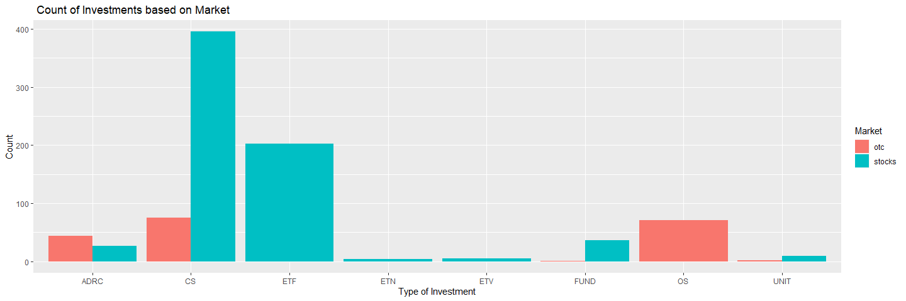<!-- -->

##### Contingency table - II

The other contingency table calculates mean of all the quantitative
parameters based on two groups- market and type . This uses group_by to
group categorical variables and mean of all the quantitative variables
are calculated for the subsequent groups.

The Trading volume was maximum for OTC/CS type tickers followed by
Stocks/ETV. The mean volume weighted price is maximum for tickers with
maximum price for the given price variables.

``` r
df_summary<-df%>% select(- c("ticker","name","composite_figi","share_class_figi","Date"))
tab_cate2<-df_summary%>% group_by(market,type) %>%  summarise_all(mean)
tab_cate2
```

| market | type | Trading_volume | Volume_wt_avg_price | Open_price | Closing_price | Highest_price | Lowest_price |    Unix_time | Transactions | Sum_Typical_price |
|:-------|:-----|---------------:|--------------------:|-----------:|--------------:|--------------:|-------------:|-------------:|-------------:|------------------:|
| otc    | ADRC |      95895.386 |           23.321904 |  23.300718 |     23.223205 |     23.683866 |    22.925220 | 1.657829e+12 |    213.56818 |         23.277430 |
| otc    | CS   |   23370644.800 |            5.147434 |   5.232589 |      5.175331 |      5.271305 |     5.133860 | 1.657829e+12 |    161.58667 |          5.193498 |
| otc    | FUND |       1000.000 |            0.000100 |   0.000100 |      0.000100 |      0.000100 |     0.000100 | 1.657829e+12 |      1.00000 |          0.000100 |
| otc    | OS   |      31123.761 |            1.691547 |   1.687446 |      1.695148 |      1.718794 |     1.662885 | 1.657829e+12 |     14.39437 |          1.692276 |
| otc    | UNIT |      11053.000 |            5.660550 |   5.540000 |      5.680000 |      5.760000 |     5.465000 | 1.657829e+12 |     20.00000 |          5.635000 |
| stocks | ADRC |    1582813.481 |           18.548760 |  18.823289 |     18.590737 |     18.981644 |    18.204696 | 1.657829e+12 |   7515.25926 |         18.592359 |
| stocks | CS   |    1294452.769 |           39.893788 |  39.934548 |     40.081624 |     40.464988 |    39.209669 | 1.657829e+12 |  10513.96456 |         39.918760 |
| stocks | ETF  |     674362.520 |           40.679535 |  40.646590 |     40.854747 |     40.952282 |    40.378737 | 1.657829e+12 |   3236.46535 |         40.728588 |
| stocks | ETN  |      67163.000 |           26.949275 |  26.862500 |     27.083875 |     27.435000 |    26.647500 | 1.657829e+12 |    171.00000 |         27.055458 |
| stocks | ETV  |    6779598.600 |           35.534560 |  35.452000 |     35.592880 |     35.788760 |    35.161580 | 1.657829e+12 |   8313.40000 |         35.514407 |
| stocks | FUND |      68897.583 |           12.274181 |  12.281667 |     12.314583 |     12.419047 |    12.153850 | 1.657829e+12 |    321.38889 |         12.295827 |
| stocks | UNIT |       1695.222 |            9.970644 |   9.968889 |      9.965067 |      9.989000 |     9.958844 | 1.657829e+12 |     15.88889 |          9.970970 |

##### Scatter Plot

The chart below shows the correlation between the open price and the
volume weighted average price. This chart chart simply establishes the
fact that vW or volume weighted price is derived from the closing price,
highest and lowest price. And this is bound to be linear relation for
every ticker. The correlation calculated was 0.999907.

``` r
correlation<-cor(df$Volume_wt_avg_price,df$Open_price)
correlation
```

    ## [1] 0.999907

``` r
g <- ggplot(data =df, aes(x=Volume_wt_avg_price,y=Closing_price))
g + geom_point(color="red") + geom_smooth(method=lm, fullrange=FALSE)+labs(x= "Closing Price", y= "Volume Weighted Price" ,title ="Closing Price  vs Weighted Average Price")
```

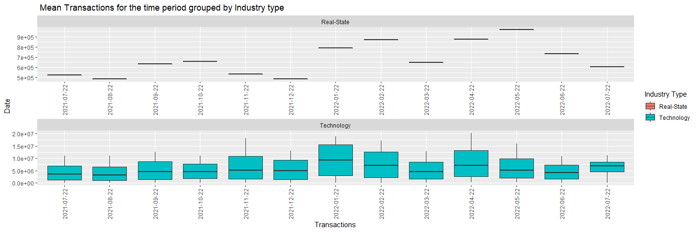<!-- -->

#### Box Plot for Highest Price based on Investment type

For the given day the Range of Highest price based on Investment type
are summarized through the bar graphs. The CS investment type shows an
outlier of \~\$1100 . The mean is maximum for ETV type.

``` r
g <- ggplot(data = df, aes(x=type,y=Highest_price,fill=type))
g + geom_boxplot()+ stat_summary(fun = mean,
lwd = 0.05,aes(group = type))+labs(x="Type" ,y= "Highest price",title ="Boxplot for Spred of Highest Price grouped by Investment Type ")
```

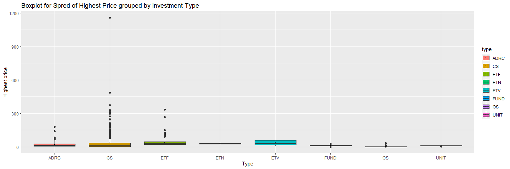<!-- -->

The histogram is for looking the frequency of the transactions for each
group of market for the given time period. The total count of count of
transactions less \< 1000 are maximum for both market types. And hence,
the plot is skewed to the left.

``` r
ggplot(df,aes(x=Transactions,fill=market)) + geom_histogram( position="dodge")+labs(x="Transactions" ,y= "Count ",title ="Histogram of Number of transactions grouped by Market ")
```

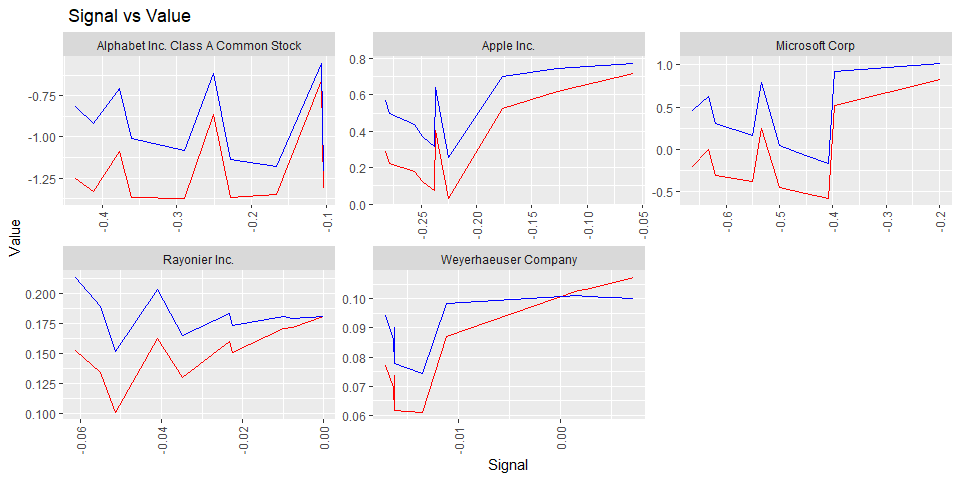<!-- -->

Similar , excercise has been implemented for this dataframe as well.
Where the columns have been renamed to easiliy identify the variables.

``` r
time_df<-time_df %>% 
  rename(
    Closing_price=c,
    Highest_price=h,
    Lowest_price=l, 
    Transactions=n,
    Open_price=o, 
    Unix_time=t,
    Trading_volume=v,
    Volume_wt_avg_price=vw,
    Date=d
   )

time_df
```

| Company_Name                       | tckr  | Date       | Trading_volume | Volume_wt_avg_price | Open_price | Closing_price | Highest_price | Lowest_price |    Unix_time | Transactions |
|:-----------------------------------|:------|:-----------|---------------:|--------------------:|-----------:|--------------:|--------------:|-------------:|-------------:|-------------:|
| Apple Inc.                         | AAPL  | 2021-07-22 |     1581194431 |            147.2252 |   145.9350 |      148.1900 |      151.6800 |     142.5400 | 1.626926e+12 |     11079500 |
| Apple Inc.                         | AAPL  | 2021-08-22 |     1512015704 |            150.8469 |   148.3100 |      146.0600 |      157.2600 |     145.7600 | 1.629518e+12 |     11071185 |
| Apple Inc.                         | AAPL  | 2021-09-22 |     1734706549 |            143.1875 |   143.8000 |      148.7600 |      149.1700 |     138.2700 | 1.632110e+12 |     12651059 |
| Apple Inc.                         | AAPL  | 2021-10-22 |     1521123082 |            150.6026 |   148.7000 |      157.8700 |      158.6700 |     146.4128 | 1.634702e+12 |     10988977 |
| Apple Inc.                         | AAPL  | 2021-11-22 |     2483951766 |            168.5081 |   157.6500 |      171.1400 |      182.1300 |     156.3600 | 1.637298e+12 |     18157924 |
| Apple Inc.                         | AAPL  | 2021-12-22 |     1603598297 |            175.4116 |   168.2800 |      173.0700 |      182.9400 |     167.4600 | 1.639890e+12 |     13061276 |
| Apple Inc.                         | AAPL  | 2022-01-22 |     2170273792 |            168.3012 |   171.5100 |      172.5500 |      176.6500 |     154.7000 | 1.642482e+12 |     18811323 |
| Apple Inc.                         | AAPL  | 2022-02-22 |     2008854845 |            161.0747 |   171.0300 |      163.9800 |      171.9100 |     150.1000 | 1.645074e+12 |     17139013 |
| Apple Inc.                         | AAPL  | 2022-03-22 |     1598875527 |            172.1755 |   163.5100 |      165.2900 |      179.6100 |     163.0150 | 1.647662e+12 |     12836787 |
| Apple Inc.                         | AAPL  | 2022-04-22 |     2335163426 |            156.4029 |   163.9200 |      149.2400 |      171.5300 |     138.8000 | 1.650254e+12 |     20196798 |
| Apple Inc.                         | AAPL  | 2022-05-22 |     1979093614 |            141.1148 |   146.8500 |      130.0600 |      151.7400 |     129.0400 | 1.652846e+12 |     16000452 |
| Apple Inc.                         | AAPL  | 2022-06-22 |     1468318592 |            140.7204 |   130.0650 |      150.1700 |      150.8600 |     129.8100 | 1.655438e+12 |     10928624 |
| Apple Inc.                         | AAPL  | 2022-07-22 |     1372510065 |            159.7003 |   150.7400 |      172.1000 |      172.1700 |     146.7000 | 1.658030e+12 |     11304305 |
| Alphabet Inc. Class A Common Stock | GOOGL | 2021-07-22 |      594599760 |            135.2892 |   127.8440 |      137.4295 |      138.3625 |     127.4988 | 1.626926e+12 |      1596943 |
| Alphabet Inc. Class A Common Stock | GOOGL | 2021-08-22 |      474783020 |            142.9251 |   137.9695 |      140.8000 |      146.2538 |     137.6075 | 1.629518e+12 |      1456662 |
| Alphabet Inc. Class A Common Stock | GOOGL | 2021-09-22 |      644962280 |            137.9608 |   138.1615 |      143.2370 |      143.6625 |     131.0500 | 1.632110e+12 |      1908559 |
| Alphabet Inc. Class A Common Stock | GOOGL | 2021-10-22 |      741744360 |            145.0314 |   143.3380 |      149.8385 |      150.6148 |     135.4240 | 1.634702e+12 |      2305499 |
| Alphabet Inc. Class A Common Stock | GOOGL | 2021-11-22 |      639204120 |            144.7138 |   149.9754 |      141.7250 |      150.9665 |     140.1500 | 1.637298e+12 |      2121760 |
| Alphabet Inc. Class A Common Stock | GOOGL | 2021-12-22 |      533654820 |            141.8085 |   140.0000 |      139.4805 |      148.3440 |     133.1645 | 1.639890e+12 |      1951440 |
| Alphabet Inc. Class A Common Stock | GOOGL | 2022-01-22 |     1063968780 |            137.6396 |   136.1750 |      137.7380 |      151.5466 |     124.5000 | 1.642482e+12 |      3953735 |
| Alphabet Inc. Class A Common Stock | GOOGL | 2022-02-22 |      753837380 |            131.3872 |   136.2430 |      136.1255 |      137.1135 |     124.9533 | 1.645074e+12 |      2966178 |
| Alphabet Inc. Class A Common Stock | GOOGL | 2022-03-22 |      549816780 |            137.0237 |   136.1635 |      126.7300 |      143.7935 |     126.6010 | 1.647662e+12 |      2172034 |
| Alphabet Inc. Class A Common Stock | GOOGL | 2022-04-22 |      926502060 |            117.8614 |   127.0000 |      116.4730 |      131.3990 |     109.8245 | 1.650254e+12 |      3504346 |
| Alphabet Inc. Class A Common Stock | GOOGL | 2022-05-22 |      829581120 |            110.7138 |   115.0000 |      106.0335 |      119.3470 |     101.8847 | 1.652846e+12 |      2659443 |
| Alphabet Inc. Class A Common Stock | GOOGL | 2022-06-22 |      719245340 |            112.6551 |   106.0335 |      111.7775 |      119.6850 |     105.0460 | 1.655438e+12 |      2110910 |
| Alphabet Inc. Class A Common Stock | GOOGL | 2022-07-22 |      637290733 |            113.5351 |   112.6400 |      121.6800 |      121.6800 |     104.0700 | 1.658030e+12 |      7543377 |
| Microsoft Corp                     | MSFT  | 2021-07-22 |      472721021 |            289.8730 |   283.8400 |      304.3600 |      305.8400 |     282.9500 | 1.626926e+12 |      5617373 |
| Microsoft Corp                     | MSFT  | 2021-08-22 |      401478949 |            301.1109 |   303.2450 |      299.8700 |      305.6500 |     294.0800 | 1.629518e+12 |      4936125 |
| Microsoft Corp                     | MSFT  | 2021-09-22 |      552612933 |            293.2810 |   296.3300 |      308.2300 |      309.3000 |     280.2500 | 1.632110e+12 |      7307952 |
| Microsoft Corp                     | MSFT  | 2021-10-22 |      518412228 |            327.9420 |   309.2100 |      341.2700 |      342.4500 |     306.1100 | 1.634702e+12 |      6657477 |
| Microsoft Corp                     | MSFT  | 2021-11-22 |      644157367 |            332.4192 |   342.6400 |      323.8000 |      349.6700 |     317.2500 | 1.637298e+12 |      8343759 |
| Microsoft Corp                     | MSFT  | 2021-12-22 |      549385946 |            322.0228 |   320.0500 |      310.2000 |      344.3000 |     303.7500 | 1.639890e+12 |      8094197 |
| Microsoft Corp                     | MSFT  | 2022-01-22 |     1007260429 |            301.2363 |   304.0700 |      299.5000 |      315.1200 |     276.0500 | 1.642482e+12 |     14555251 |
| Microsoft Corp                     | MSFT  | 2022-02-22 |      754206539 |            288.7100 |   296.3600 |      300.4300 |      303.1300 |     270.0000 | 1.645074e+12 |     11135200 |
| Microsoft Corp                     | MSFT  | 2022-03-22 |      536338767 |            301.2082 |   298.8900 |      279.8300 |      315.9500 |     279.3200 | 1.647662e+12 |      7102751 |
| Microsoft Corp                     | MSFT  | 2022-04-22 |      800288645 |            274.4439 |   278.9100 |      266.8200 |      293.3000 |     250.0200 | 1.650254e+12 |     10920872 |
| Microsoft Corp                     | MSFT  | 2022-05-22 |      642435254 |            259.9196 |   263.0000 |      244.9700 |      277.6900 |     241.5100 | 1.652846e+12 |      7859777 |
| Microsoft Corp                     | MSFT  | 2022-06-22 |      512373574 |            258.0435 |   244.7000 |      256.7200 |      269.0550 |     244.0300 | 1.655438e+12 |      6150427 |
| Microsoft Corp                     | MSFT  | 2022-07-22 |      497212452 |            271.9176 |   259.7500 |      291.9100 |      291.9100 |     249.5700 | 1.658030e+12 |      6160457 |
| Weyerhaeuser Company               | WY    | 2021-07-22 |       71143588 |             34.3965 |    34.0000 |       34.1600 |       35.8500 |      33.2813 | 1.626926e+12 |       524768 |
| Weyerhaeuser Company               | WY    | 2021-08-22 |       66124940 |             35.5595 |    34.4700 |       36.1700 |       36.7100 |      33.9700 | 1.629518e+12 |       483842 |
| Weyerhaeuser Company               | WY    | 2021-09-22 |       84702165 |             36.5796 |    35.4500 |       36.7700 |       38.2900 |      35.0300 | 1.632110e+12 |       633058 |
| Weyerhaeuser Company               | WY    | 2021-10-22 |       84212085 |             37.2660 |    36.8700 |       37.9400 |       38.8700 |      35.5200 | 1.634702e+12 |       655513 |
| Weyerhaeuser Company               | WY    | 2021-11-22 |       73639947 |             38.9839 |    37.9800 |       39.6400 |       40.3400 |      37.6100 | 1.637298e+12 |       535574 |
| Weyerhaeuser Company               | WY    | 2021-12-22 |       57984875 |             40.1362 |    39.1000 |       40.9800 |       41.8000 |      37.9100 | 1.639890e+12 |       487523 |
| Weyerhaeuser Company               | WY    | 2022-01-22 |       91484053 |             40.2322 |    40.6400 |       41.8600 |       43.0400 |      37.1306 | 1.642482e+12 |       788428 |
| Weyerhaeuser Company               | WY    | 2022-02-22 |      113173595 |             39.0399 |    39.9100 |       39.9900 |       40.5000 |      36.4600 | 1.645074e+12 |       870170 |
| Weyerhaeuser Company               | WY    | 2022-03-22 |       74688957 |             38.5465 |    40.0000 |       39.9000 |       40.5300 |      37.1000 | 1.647662e+12 |       645709 |
| Weyerhaeuser Company               | WY    | 2022-04-22 |       93504442 |             40.3864 |    39.4500 |       39.3800 |       42.8600 |      37.5250 | 1.650254e+12 |       873022 |
| Weyerhaeuser Company               | WY    | 2022-05-22 |      110931546 |             37.5082 |    39.0500 |       32.7700 |       40.3500 |      32.5800 | 1.652846e+12 |       970145 |
| Weyerhaeuser Company               | WY    | 2022-06-22 |       93757037 |             33.9967 |    33.0900 |       34.7800 |       35.2400 |      32.5000 | 1.655438e+12 |       733930 |
| Weyerhaeuser Company               | WY    | 2022-07-22 |       66569673 |             35.6040 |    34.9500 |       36.8900 |       37.2000 |      34.1500 | 1.658030e+12 |       603312 |
| Rayonier Inc.                      | RYN   | 2021-07-22 |       10319422 |             36.9909 |    36.4000 |       36.7400 |       38.3600 |      35.5100 | 1.626926e+12 |       131096 |
| Rayonier Inc.                      | RYN   | 2021-08-22 |       12349725 |             36.9763 |    37.0000 |       37.3100 |       38.4100 |      35.1300 | 1.629518e+12 |       130506 |
| Rayonier Inc.                      | RYN   | 2021-09-22 |       11624066 |             36.3528 |    36.7100 |       36.6300 |       37.9600 |      34.2700 | 1.632110e+12 |       128693 |
| Rayonier Inc.                      | RYN   | 2021-10-22 |       10144414 |             38.9148 |    36.5000 |       40.6100 |       41.0900 |      36.4800 | 1.634702e+12 |       122247 |
| Rayonier Inc.                      | RYN   | 2021-11-22 |       11695521 |             38.9214 |    40.6400 |       39.2100 |       40.9500 |      36.8600 | 1.637298e+12 |       132494 |
| Rayonier Inc.                      | RYN   | 2021-12-22 |        7892198 |             39.4806 |    38.8200 |       39.3000 |       40.9800 |      37.5800 | 1.639890e+12 |       100977 |
| Rayonier Inc.                      | RYN   | 2022-01-22 |       13968870 |             36.9260 |    38.8200 |       38.4700 |       39.0900 |      34.8000 | 1.642482e+12 |       166773 |
| Rayonier Inc.                      | RYN   | 2022-02-22 |       13278922 |             40.4555 |    38.2600 |       41.0800 |       43.4500 |      36.2800 | 1.645074e+12 |       162059 |
| Rayonier Inc.                      | RYN   | 2022-03-22 |       10095816 |             42.0481 |    41.0300 |       44.5900 |       44.6600 |      40.5000 | 1.647662e+12 |       122587 |
| Rayonier Inc.                      | RYN   | 2022-04-22 |       14626640 |             41.1727 |    44.4000 |       38.7200 |       45.8700 |      35.6700 | 1.650254e+12 |       190595 |
| Rayonier Inc.                      | RYN   | 2022-05-22 |       11813034 |             39.3871 |    38.5200 |       36.2200 |       42.0499 |      36.0800 | 1.652846e+12 |       181590 |
| Rayonier Inc.                      | RYN   | 2022-06-22 |       11576302 |             36.8384 |    36.2800 |       34.4500 |       38.6200 |      34.0700 | 1.655438e+12 |       147239 |
| Rayonier Inc.                      | RYN   | 2022-07-22 |       11999127 |             36.5129 |    34.7000 |       37.7700 |       38.4700 |      34.2400 | 1.658030e+12 |       141650 |

#### Summary Table

This table summarizes the means of the pricing, transactions and volume
for the select technology and timberland companies. There is no relation
b/w two industries but this data is pretty obvious that the Tech giants
price more and have bigger penetration in the trading business. Majority
of these companies have world-wide presence compare to timberland
companies. These tech giants have net worth approx in billions and
having a price in the range of \$ 100+ for given time period is not
surprising. Apple is the company having highest trading volume and
Microsoft had the highest average prices for the given time range.

``` r
time_df_summary<- select(time_df, -c( "tckr","Date"))
time_df_summary<-time_df_summary %>% group_by(Company_Name) %>% summarize_all(mean)
time_df_summary
```

| Company_Name                       | Trading_volume | Volume_wt_avg_price | Open_price | Closing_price | Highest_price | Lowest_price |   Unix_time | Transactions |
|:-----------------------------------|---------------:|--------------------:|-----------:|--------------:|--------------:|-------------:|------------:|-------------:|
| Alphabet Inc. Class A Common Stock |      700706966 |           131.42652 |  131.27257 |     131.46677 |     138.67452 |    123.21341 | 1.64248e+12 |    2788529.7 |
| Apple Inc.                         |     1797667668 |           156.55936 |  154.63846 |     157.57538 |     165.87077 |    146.84368 | 1.64248e+12 |   14171324.8 |
| Microsoft Corp                     |      606837239 |           294.00985 |  292.38423 |     294.45462 |     309.48962 |    276.53000 | 1.64248e+12 |    8064739.8 |
| Rayonier Inc.                      |       11644927 |            38.53673 |   38.31385 |      38.54615 |      40.76615 |     35.95923 | 1.64248e+12 |     142962.0 |
| Weyerhaeuser Company               |       83224377 |            37.55658 |   37.30462 |      37.78692 |      39.35231 |     35.44361 | 1.64248e+12 |     677307.2 |

##### Bar Plot with Facet Wrap.

The Mean of transactions grouped by Industry type has been shown below
as we have 3 technology companies and 2 timberland companies selected
for the subplots. This shows again transaction wise Technology companies
have a higher trend. In the month of Jan 2022 Technology companies had
maximum transactions with timberland showing higher numbers in the month
of April.

``` r
time_df2<-time_df%>% mutate(Industry='Technology')
time_df2$Industry <-ifelse(time_df2$tckr=="WY" | time_df2$tckr=="WY" , "Finance", "Technology")

ggplot(time_df2, aes(x=as.factor(Date), y=Transactions,fill=Industry))+ geom_bar( stat = "summary", fun.y = "mean")+ facet_wrap(~Industry,  nrow=2 )+guides(x = guide_axis(angle = 90))+ labs(x= "Transactions", y= "Date",title=" Mean Transactions for the time period grouped by Industry type")+scale_fill_discrete(name = "Industry Type ")
```

<!-- -->

#### Line Plots

The Volume weighted price trend has been captured in the below plot for
each company. Apple as expected showing highest trends line. It saw
lowest numbers in the Jul 2021 and again in Jul 2022. It is interesting
to note all technology companies saw peaks in the month of Nov 2021, Jan
2022 and Apr 2022

``` r
ggplot(time_df2, aes(x = Date, y = Transactions, colour =Company_Name, group = Company_Name)) +geom_line() + geom_point()+labs(x= "Date", y= "Volume Weighted Average Price",title=" Volume weighted price for the time range grouped by Companies")
```

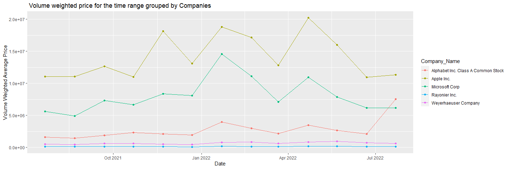<!-- -->

#### Scatter Plot.

The Volume of trades vs transactions can be looked into to find a
relation. We see that for every company the relation is closely linear.
So as the Transactions increase we also see growth in trading volume.

``` r
g <- ggplot(data =time_df2, aes(x=Transactions,y=Trading_volume,colour=Company_Name))
g + geom_point() +labs(x= "Trading Volume", y= "Transactions" ,title ="Trading Volume vs Transactions grouped by Companies")
```

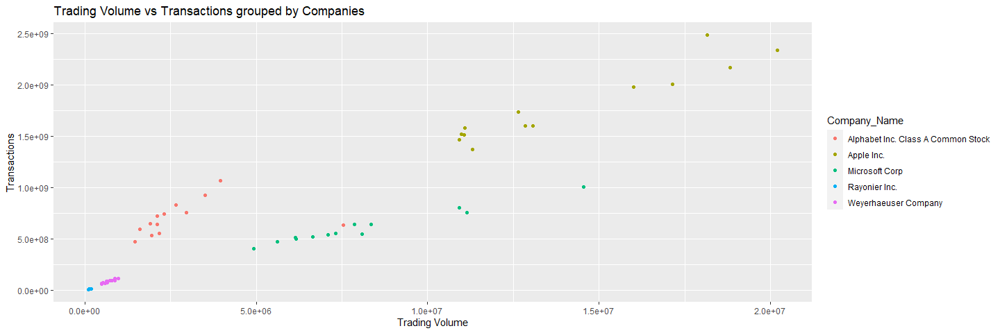<!-- -->

\####TEST API

A bullish crossover occurs when the MACD turns up and crosses above the
signal line. A bearish crossover occurs when the MACD turns down and
crosses below the signal line.

The relation between two helps determining if stock can be bought or
not.

``` r
macd_df
```

| Company_Name                       |    timestamp |      value |     signal |  histogram |
|:-----------------------------------|-------------:|-----------:|-----------:|-----------:|
| Apple Inc.                         | 1.658531e+12 |  0.0312818 |  0.2570881 | -0.2258062 |
| Apple Inc.                         | 1.658527e+12 |  0.0751516 |  0.3135396 | -0.2383880 |
| Apple Inc.                         | 1.658524e+12 |  0.1239431 |  0.3731366 | -0.2491935 |
| Apple Inc.                         | 1.658520e+12 |  0.1793252 |  0.4354350 | -0.2561099 |
| Apple Inc.                         | 1.658516e+12 |  0.2209317 |  0.4994625 | -0.2785308 |
| Apple Inc.                         | 1.658513e+12 |  0.2871141 |  0.5690952 | -0.2819811 |
| Apple Inc.                         | 1.658509e+12 |  0.4025380 |  0.6395905 | -0.2370525 |
| Apple Inc.                         | 1.658506e+12 |  0.5226239 |  0.6988536 | -0.1762296 |
| Apple Inc.                         | 1.658502e+12 |  0.6160322 |  0.7429110 | -0.1268788 |
| Apple Inc.                         | 1.658498e+12 |  0.7163979 |  0.7746307 | -0.0582328 |
| Alphabet Inc. Class A Common Stock | 1.658531e+12 | -1.3111350 | -1.2073334 | -0.1038015 |
| Alphabet Inc. Class A Common Stock | 1.658527e+12 | -1.3484506 | -1.1813831 | -0.1670675 |
| Alphabet Inc. Class A Common Stock | 1.658524e+12 | -1.3673014 | -1.1396162 | -0.2276853 |
| Alphabet Inc. Class A Common Stock | 1.658520e+12 | -1.3724921 | -1.0826949 | -0.2897972 |
| Alphabet Inc. Class A Common Stock | 1.658516e+12 | -1.3703538 | -1.0102456 | -0.3601082 |
| Alphabet Inc. Class A Common Stock | 1.658513e+12 | -1.3324193 | -0.9202185 | -0.4122008 |
| Alphabet Inc. Class A Common Stock | 1.658509e+12 | -1.2524023 | -0.8171683 | -0.4352340 |
| Alphabet Inc. Class A Common Stock | 1.658506e+12 | -1.0852185 | -0.7083598 | -0.3768587 |
| Alphabet Inc. Class A Common Stock | 1.658502e+12 | -0.8647006 | -0.6141451 | -0.2505555 |
| Alphabet Inc. Class A Common Stock | 1.658498e+12 | -0.6577167 | -0.5515062 | -0.1062104 |
| Microsoft Corp                     | 1.658531e+12 | -0.5768889 | -0.1695997 | -0.4072893 |
| Microsoft Corp                     | 1.658527e+12 | -0.5197995 | -0.0677774 | -0.4520222 |
| Microsoft Corp                     | 1.658524e+12 | -0.4546447 |  0.0452282 | -0.4998729 |
| Microsoft Corp                     | 1.658520e+12 | -0.3811613 |  0.1701964 | -0.5513577 |
| Microsoft Corp                     | 1.658516e+12 | -0.3123711 |  0.3080358 | -0.6204069 |
| Microsoft Corp                     | 1.658513e+12 | -0.1996626 |  0.4631375 | -0.6628001 |
| Microsoft Corp                     | 1.658509e+12 | -0.0055558 |  0.6288375 | -0.6343934 |
| Microsoft Corp                     | 1.658506e+12 |  0.2529565 |  0.7874359 | -0.5344794 |
| Microsoft Corp                     | 1.658502e+12 |  0.5242612 |  0.9210557 | -0.3967946 |
| Microsoft Corp                     | 1.658498e+12 |  0.8221918 |  1.0202544 | -0.1980626 |
| Weyerhaeuser Company               | 1.658531e+12 |  0.0609735 |  0.0744580 | -0.0134845 |
| Weyerhaeuser Company               | 1.658527e+12 |  0.0615730 |  0.0778291 | -0.0162561 |
| Weyerhaeuser Company               | 1.658524e+12 |  0.0655153 |  0.0818931 | -0.0163778 |
| Weyerhaeuser Company               | 1.658520e+12 |  0.0695942 |  0.0859876 | -0.0163934 |
| Weyerhaeuser Company               | 1.658516e+12 |  0.0737881 |  0.0900859 | -0.0162978 |
| Weyerhaeuser Company               | 1.658513e+12 |  0.0770495 |  0.0941604 | -0.0171108 |
| Weyerhaeuser Company               | 1.658509e+12 |  0.0872188 |  0.0984381 | -0.0112192 |
| Weyerhaeuser Company               | 1.658506e+12 |  0.1030027 |  0.1012429 |  0.0017598 |
| Weyerhaeuser Company               | 1.658502e+12 |  0.1033231 |  0.1008029 |  0.0025202 |
| Weyerhaeuser Company               | 1.658498e+12 |  0.1073201 |  0.1001729 |  0.0071473 |
| Rayonier Inc.                      | 1.658520e+12 |  0.1007150 |  0.1519496 | -0.0512345 |
| Rayonier Inc.                      | 1.658516e+12 |  0.1299322 |  0.1647582 | -0.0348260 |
| Rayonier Inc.                      | 1.658513e+12 |  0.1510795 |  0.1734647 | -0.0223852 |
| Rayonier Inc.                      | 1.658509e+12 |  0.1712917 |  0.1790610 | -0.0077693 |
| Rayonier Inc.                      | 1.658506e+12 |  0.1808529 |  0.1810033 | -0.0001504 |
| Rayonier Inc.                      | 1.658502e+12 |  0.1710805 |  0.1810409 | -0.0099604 |
| Rayonier Inc.                      | 1.658498e+12 |  0.1601916 |  0.1835310 | -0.0233394 |
| Rayonier Inc.                      | 1.658495e+12 |  0.1342906 |  0.1893659 | -0.0550753 |
| Rayonier Inc.                      | 1.658491e+12 |  0.1621509 |  0.2031347 | -0.0409838 |
| Rayonier Inc.                      | 1.658488e+12 |  0.1523340 |  0.2133807 | -0.0610467 |

``` r
g <- ggplot(data =macd_df, aes(x=signal,y=value))
g + geom_point(color="red") + facet_wrap(~Company_Name)+guides(x = guide_axis(angle = 90))+ labs(x= "Signal", y= "Value",title=" Signal vs Value")+scale_fill_discrete(name = "Company Name ")
```

<!-- -->
